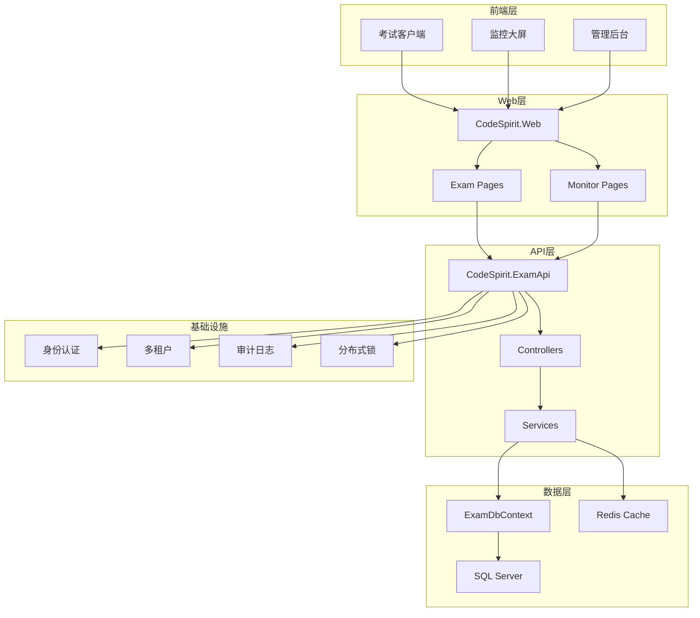
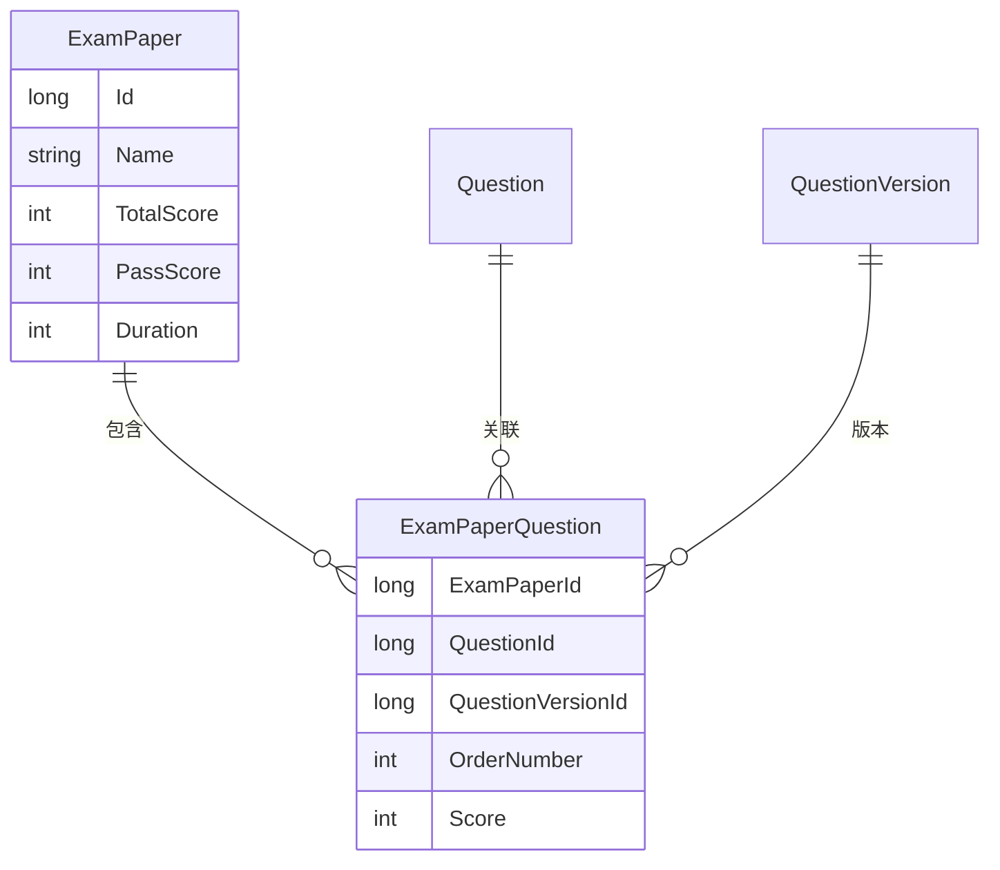
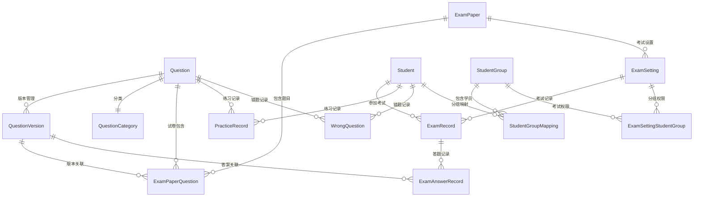

# 考试系统完整说明文档

## 1. 系统概述

考试系统是 CodeSpirit 平台的核心业务模块，提供完整的在线考试解决方案。系统采用前后端分离架构，支持多租户、具备完善的防作弊机制和实时监控功能。

### 1.1 系统特点

- **多租户支持**：完全支持多租户架构，数据隔离
- **安全可靠**：完善的防作弊机制和安全控制
- **实时监控**：支持考试过程实时监控
- **灵活配置**：支持多种题型和考试设置
- **高性能**：基于 .NET 10 和现代架构设计
- **AI 增强**：集成 AI 题目生成功能

### 1.2 技术栈

- **后端**：.NET 10 + ASP.NET Core + Entity Framework Core
- **前端**：Amis UI + TypeScript + React
- **数据库**：SQL Server + Redis
- **消息队列**：Redis + SignalR
- **容器化**：Docker + Kubernetes

## 2. 系统架构

### 2.1 整体架构



### 2.2 模块划分

#### 2.2.1 后端模块（CodeSpirit.ExamApi）

```
CodeSpirit.ExamApi/
├── Controllers/           # API控制器
│   ├── Client/           # 客户端接口
│   ├── Dashboard/        # 监控接口
│   └── *.cs             # 管理接口
├── Services/             # 业务服务
│   ├── Implementations/  # 服务实现
│   ├── Interfaces/      # 服务接口
│   └── TextParsers/     # 题目解析器
├── Data/                # 数据访问
│   ├── Models/          # 数据模型
│   ├── Seeds/           # 种子数据
│   └── Migrations/      # 数据库迁移
├── Dtos/                # 数据传输对象
└── Extensions/          # 扩展方法
```

#### 2.2.2 前端模块（Web Pages）

```
Pages/
├── Exam/                # 考试页面
│   ├── Login.cshtml     # 考试登录
│   ├── Exam.cshtml      # 在线考试
│   ├── Practice.cshtml  # 练习模式
│   └── Result.cshtml    # 考试结果
└── Monitor/             # 监控页面
    ├── Dashboard.cshtml # 监控大屏
    └── Student.cshtml   # 学员监控
```

## 3. 功能模块详解

### 3.1 用户认证与权限

#### 3.1.1 考试登录（Login.cshtml）

**功能特点：**
- 租户级别的用户认证
- 设备指纹识别
- 防暴力破解机制
- 多租户主题支持

**安全机制：**
- 禁用右键、复制粘贴
- 防止页面被嵌套
- 检测开发者工具
- IP 地址记录

**技术实现：**
```csharp
// 路由配置
@page "/{tenantId}/exam/login"

// 安全配置
window.CS_CONFIG = {
    security: {
        blockCopy: true,
        blockPaste: true,
        blockRightClick: true,
        blockPrint: true,
        enableScreenSwitchDetection: true
    }
};
```

### 3.2 题目管理

#### 3.2.1 题目实体设计

**Question（题目主表）**
- 支持单选、多选、判断等题型
- 版本控制机制
- 使用统计和正确率分析
- 分类管理

**QuestionVersion（题目版本）**
- 历史版本保存
- 版本追踪和回滚
- 确保答题记录数据一致性

**关键字段：**
```csharp
public class Question : LongKeyAuditableEntityBase, IMultiTenant
{
    public string Content { get; set; }              // 题目内容
    public QuestionType Type { get; set; }           // 题目类型
    public int Difficulty { get; set; }              // 难度级别
    public string Options { get; set; }              // 选项（JSON）
    public string CorrectAnswer { get; set; }        // 正确答案
    public long CategoryId { get; set; }             // 分类ID
    public int Version { get; set; }                 // 当前版本
    public int UsageCount { get; set; }              // 使用次数
    public decimal CorrectRate { get; set; }         // 正确率
}
```

#### 3.2.2 AI题目生成

**功能特点：**
- 基于AI的智能题目生成
- 支持批量生成
- 实时生成进度推送
- 题目质量评估

**服务接口：**
```csharp
public interface IAIQuestionGeneratorService
{
    Task<List<QuestionDto>> GenerateQuestionsAsync(GenerateQuestionsRequest request);
    Task<GenerationStatusDto> GetGenerationStatusAsync(string taskId);
}
```

### 3.3 试卷管理

#### 3.3.1 试卷构成

**ExamPaper（试卷）**
- 试卷基本信息
- 总分和及格分数
- 考试时长设置
- 难度级别配置

**ExamPaperQuestion（试卷题目关联）**
- 题目在试卷中的配置
- 关联具体题目版本
- 题目顺序和分值

**数据关系：**


### 3.4 考试管理

#### 3.4.1 考试设置（ExamSetting）

**核心功能：**
- 考试时间控制
- 参考人员管理
- 考试规则配置
- 反作弊设置

**关键配置：**
```csharp
public class ExamSetting : LongKeyAuditableEntityBase, IMultiTenant
{
    public long ExamPaperId { get; set; }           // 试卷ID
    public DateTime StartTime { get; set; }         // 开始时间
    public DateTime EndTime { get; set; }           // 结束时间
    public int AllowedTimes { get; set; }           // 允许考试次数
    public string AntiCheatingRules { get; set; }   // 反作弊规则
    public bool EnableScreenSwitchDetection { get; set; } // 切屏检测
    public bool DisableRightClick { get; set; }     // 禁用右键
}
```

#### 3.4.2 在线考试（Exam.cshtml）

**功能特点：**
- 全屏考试界面
- 实时答题保存
- 防作弊监控
- 自动提交机制

**安全控制：**
```javascript
// 防作弊代码示例
document.addEventListener('keydown', e => {
    // 禁用F12和Ctrl+Shift+I
    if (e.keyCode === 123 || (e.ctrlKey && e.shiftKey && e.keyCode === 73)) {
        e.preventDefault();
        console.warn('🚫 开发者工具已被禁用');
        return false;
    }
});

// 页面可见性检测
document.addEventListener('visibilitychange', () => {
    if (document.hidden) {
        console.warn('⚠️ 页面失去焦点，可能存在切屏行为');
        // 记录切屏行为
        recordCheatingBehavior('screen_switch');
    }
});
```

### 3.5 答题记录

#### 3.5.1 考试记录（ExamRecord）

**功能特点：**
- 完整的考试过程记录
- 作弊嫌疑等级评估
- 设备信息和IP记录
- 答题时间统计

**核心字段：**
```csharp
public class ExamRecord : LongKeyAuditableEntityBase, IMultiTenant
{
    public long ExamSettingId { get; set; }         // 考试设置ID
    public long StudentId { get; set; }             // 考生ID
    public DateTime StartTime { get; set; }         // 开始时间
    public DateTime? SubmitTime { get; set; }       // 提交时间
    public ExamStatus Status { get; set; }          // 考试状态
    public decimal Score { get; set; }              // 得分
    public bool IsPassed { get; set; }              // 是否通过
    public int CheatingSuspicionLevel { get; set; } // 作弊嫌疑等级
    public string IpAddress { get; set; }           // IP地址
    public string DeviceInfo { get; set; }          // 设备信息
}
```

#### 3.5.2 答题详情（ExamAnswerRecord）

**详细记录：**
- 每道题的答题情况
- 答题用时统计
- 答案正确性判断
- 题目版本关联

### 3.6 练习模式

#### 3.6.1 练习功能

**Practice.cshtml 页面功能：**
- 随机题目练习
- 即时反馈
- 错题收集
- 进度跟踪

**PracticeRecord 记录：**
```csharp
public class PracticeRecord : LongKeyAuditableEntityBase, IMultiTenant
{
    public long StudentId { get; set; }       // 考生ID
    public long QuestionId { get; set; }      // 题目ID
    public string Answer { get; set; }        // 答案
    public bool IsCorrect { get; set; }       // 是否正确
    public DateTime PracticeTime { get; set; } // 练习时间
}
```

#### 3.6.2 错题管理

**WrongQuestion 功能：**
- 错题自动收集
- 错误次数统计
- 掌握程度评估
- 针对性练习推荐

## 4. 监控系统

### 4.1 监控大屏（Dashboard.cshtml）

**功能特点：**
- 实时考试状态展示
- 考生答题进度监控
- 异常行为预警
- 统计数据可视化

**技术实现：**
```javascript
// 监控大屏主要功能
export class ExamMonitorDashboard {
    // 实时数据更新
    startRealTimeUpdates() {
        this.connection = new signalR.HubConnectionBuilder()
            .withUrl("/examMonitorHub")
            .build();
            
        this.connection.start().then(() => {
            this.connection.on("ExamStatusUpdate", this.handleExamStatusUpdate);
            this.connection.on("CheatingAlert", this.handleCheatingAlert);
        });
    }
    
    // 处理考试状态更新
    handleExamStatusUpdate(data) {
        this.updateExamProgress(data);
        this.refreshStatistics();
    }
}
```

### 4.2 学员监控（Student.cshtml）

**监控内容：**
- 单个考生详细状态
- 答题进度追踪
- 异常行为记录
- 实时干预功能

### 4.3 监控接口（MonitorController）

**API接口：**
```csharp
[ApiController]
[Route("api/[controller]")]
public class MonitorController : ApiControllerBase
{
    /// <summary>
    /// 获取考试监控数据
    /// </summary>
    [HttpGet("exam/{examId}/dashboard")]
    public async Task<ExamDashboardDto> GetExamDashboard(long examId)
    {
        // 返回考试整体监控数据
    }
    
    /// <summary>
    /// 获取考生详细监控信息
    /// </summary>
    [HttpGet("student/{recordId}")]
    public async Task<StudentMonitorDto> GetStudentMonitor(long recordId)
    {
        // 返回单个考生详细监控信息
    }
}
```

## 5. API接口文档

### 5.1 客户端接口（Client Controllers）

#### 5.1.1 考试接口（IndexController）

**主要接口：**
- `GET /api/client/exam/{examId}` - 获取考试信息
- `POST /api/client/exam/{examId}/start` - 开始考试
- `POST /api/client/exam/{examId}/submit` - 提交答案
- `GET /api/client/exam/{examId}/questions` - 获取题目
- `POST /api/client/exam/{examId}/answer` - 保存答案

#### 5.1.2 练习接口（PracticeController）

**主要接口：**
- `GET /api/client/practice/questions` - 获取练习题目
- `POST /api/client/practice/answer` - 提交练习答案
- `GET /api/client/practice/history` - 练习历史
- `GET /api/client/practice/wrong-questions` - 错题集

### 5.2 管理接口

#### 5.2.1 题目管理（QuestionsController）

**CRUD操作：**
- `GET /api/questions` - 查询题目列表
- `GET /api/questions/{id}` - 获取题目详情
- `POST /api/questions` - 创建题目
- `PUT /api/questions/{id}` - 更新题目
- `DELETE /api/questions/{id}` - 删除题目

**特殊功能：**
- `POST /api/questions/import` - 批量导入题目
- `POST /api/questions/generate` - AI生成题目
- `GET /api/questions/{id}/statistics` - 题目统计

#### 5.2.2 试卷管理（ExamPapersController）

**主要功能：**
- 试卷CRUD操作
- 试卷题目管理
- 试卷预览和导出
- 试卷统计分析

#### 5.2.3 考试管理（ExamSettingsController）

**核心功能：**
- 考试设置CRUD
- 考生分组管理
- 考试状态控制
- 考试结果统计

## 6. 数据库设计

### 6.1 核心实体关系



### 6.2 多租户设计

**多租户支持：**
- 所有实体继承 `IMultiTenant` 接口
- TenantId 字段实现数据隔离
- 索引优化：`IX_{TableName}_TenantId`
- 组合索引：`IX_{TableName}_TenantId_Id`

**安全保障：**
```csharp
// 多租户数据过滤
protected override void OnModelCreating(ModelBuilder modelBuilder)
{
    base.OnModelCreating(modelBuilder);
    
    // 为所有多租户实体添加全局过滤
    foreach (var entityType in modelBuilder.Model.GetEntityTypes()
        .Where(e => typeof(IMultiTenant).IsAssignableFrom(e.ClrType)))
    {
        var parameter = Expression.Parameter(entityType.ClrType, "e");
        var property = Expression.Property(parameter, nameof(IMultiTenant.TenantId));
        var filter = Expression.Lambda(
            Expression.Equal(property, Expression.Property(
                Expression.Constant(this), nameof(TenantId))), parameter);
        
        modelBuilder.Entity(entityType.ClrType).HasQueryFilter(filter);
    }
}
```

### 6.3 性能优化

**索引策略：**
- 主要查询字段添加单列索引
- 常用组合查询添加组合索引
- 唯一约束字段优化

**缓存机制：**
- Redis 缓存热点数据
- 题目内容缓存
- 考试配置缓存
- 统计数据缓存

## 7. 安全机制

### 7.1 防作弊技术

#### 7.1.1 前端安全控制

**页面保护：**
```javascript
// 禁用常见作弊行为
const securityConfig = {
    blockRightClick: true,      // 禁用右键
    blockCopy: true,            // 禁用复制
    blockPaste: true,           // 禁用粘贴
    blockPrint: true,           // 禁用打印
    blockDevTools: true,        // 禁用开发者工具
    detectScreenSwitch: true    // 检测切屏
};

// 实时监控
class AntiCheatMonitor {
    constructor() {
        this.initEventListeners();
        this.startHeartbeat();
    }
    
    // 监听可疑行为
    initEventListeners() {
        // 键盘监听
        document.addEventListener('keydown', this.handleKeyDown.bind(this));
        // 鼠标监听
        document.addEventListener('contextmenu', this.handleRightClick.bind(this));
        // 窗口失焦监听
        window.addEventListener('blur', this.handleWindowBlur.bind(this));
        // 页面可见性监听
        document.addEventListener('visibilitychange', this.handleVisibilityChange.bind(this));
    }
}
```

#### 7.1.2 后端验证

**服务端验证：**
- 答题时间合理性检查
- 答题顺序异常检测
- 频繁提交行为监控
- IP地址变化检测

```csharp
public class AntiCheatingService
{
    /// <summary>
    /// 检测作弊嫌疑
    /// </summary>
    public async Task<CheatingSuspicionLevel> DetectCheatingAsync(ExamRecord record)
    {
        var suspicionScore = 0;
        
        // 答题时间异常检测
        if (await IsAnswerTimeAbnormal(record))
            suspicionScore += 20;
            
        // 切屏行为检测
        if (await HasScreenSwitchBehavior(record))
            suspicionScore += 30;
            
        // IP地址变化检测
        if (await HasIpAddressChanged(record))
            suspicionScore += 40;
            
        return MapToSuspicionLevel(suspicionScore);
    }
}
```

### 7.2 数据安全

#### 7.2.1 数据加密

**敏感数据保护：**
- 题目答案加密存储
- 考生信息脱敏处理
- API传输HTTPS加密
- JWT Token机制

#### 7.2.2 访问控制

**权限管理：**
- 基于角色的访问控制（RBAC）
- 多租户数据隔离
- API接口权限验证
- 资源级别权限控制

## 8. 部署配置

### 8.1 应用配置

#### 8.1.1 数据库连接

**appsettings.json 配置：**
```json
{
  "ConnectionStrings": {
    "exam-api": "Server=localhost;Database=CodeSpirit_Exam;Trusted_Connection=true;TrustServerCertificate=true;"
  },
  "ExamSettings": {
    "EnableAntiCheating": true,
    "MaxExamDuration": 180,
    "AutoSubmitBeforeTimeout": 5,
    "AllowedDeviceTypes": ["Desktop", "Tablet"]
  }
}
```

#### 8.1.2 Redis配置

**缓存设置：**
```json
{
  "Redis": {
    "ConnectionString": "localhost:6379",
    "Database": 1,
    "KeyPrefix": "CodeSpirit:Exam:",
    "DefaultExpiration": 3600
  }
}
```

### 8.2 Docker部署

#### 8.2.1 Dockerfile

```dockerfile
FROM mcr.microsoft.com/dotnet/aspnet:9.0 AS base
WORKDIR /app
EXPOSE 8080
EXPOSE 8081

FROM mcr.microsoft.com/dotnet/sdk:9.0 AS build
ARG BUILD_CONFIGURATION=Release
WORKDIR /src

# 复制项目文件
COPY ["Src/CodeSpirit.ExamApi/CodeSpirit.ExamApi.csproj", "Src/CodeSpirit.ExamApi/"]
COPY ["Src/CodeSpirit.ServiceDefaults/CodeSpirit.ServiceDefaults.csproj", "Src/CodeSpirit.ServiceDefaults/"]

# 还原依赖项
RUN dotnet restore "Src/CodeSpirit.ExamApi/CodeSpirit.ExamApi.csproj"

# 复制源代码并编译
COPY . .
WORKDIR "/src/Src/CodeSpirit.ExamApi"
RUN dotnet build "CodeSpirit.ExamApi.csproj" -c $BUILD_CONFIGURATION -o /app/build

FROM build AS publish
RUN dotnet publish "CodeSpirit.ExamApi.csproj" -c $BUILD_CONFIGURATION -o /app/publish

FROM base AS final
WORKDIR /app
COPY --from=publish /app/publish .
ENTRYPOINT ["dotnet", "CodeSpirit.ExamApi.dll"]
```

### 8.3 Kubernetes部署

#### 8.3.1 部署清单

```yaml
apiVersion: apps/v1
kind: Deployment
metadata:
  name: exam-api
  namespace: codespirit
spec:
  replicas: 3
  selector:
    matchLabels:
      app: exam-api
  template:
    metadata:
      labels:
        app: exam-api
    spec:
      containers:
      - name: exam-api
        image: codespirit/exam-api:latest
        ports:
        - containerPort: 8080
        env:
        - name: ConnectionStrings__exam-api
          valueFrom:
            secretKeyRef:
              name: exam-db-secret
              key: connection-string
        - name: Redis__ConnectionString
          valueFrom:
            secretKeyRef:
              name: redis-secret
              key: connection-string
        resources:
          requests:
            memory: "512Mi"
            cpu: "250m"
          limits:
            memory: "1Gi"
            cpu: "500m"
        livenessProbe:
          httpGet:
            path: /health
            port: 8080
          initialDelaySeconds: 30
          periodSeconds: 10
```

## 9. 系统监控和运维

### 9.1 健康检查

**健康检查端点：**
- `/health` - 基本健康状态
- `/health/ready` - 就绪状态检查
- `/health/live` - 存活状态检查

### 9.2 日志记录

**日志配置：**
```json
{
  "Logging": {
    "LogLevel": {
      "Default": "Information",
      "CodeSpirit.ExamApi": "Debug",
      "Microsoft.EntityFrameworkCore": "Warning"
    }
  },
  "Serilog": {
    "MinimumLevel": "Information",
    "WriteTo": [
      {
        "Name": "Console",
        "Args": {
          "outputTemplate": "[{Timestamp:HH:mm:ss} {Level:u3}] {Message:lj} {Properties:j}{NewLine}{Exception}"
        }
      },
      {
        "Name": "File",
        "Args": {
          "path": "logs/exam-api-.log",
          "rollingInterval": "Day",
          "retainedFileCountLimit": 30
        }
      }
    ]
  }
}
```

### 9.3 性能指标

**关键指标监控：**
- 并发考试用户数量
- 平均响应时间
- 数据库连接池状态
- Redis缓存命中率
- 异常率和错误日志

## 10. 开发指南

### 10.1 本地开发环境

#### 10.1.1 环境要求

- .NET 9 SDK
- SQL Server 2019+
- Redis 6.0+
- Node.js 18+ (前端资源构建)

#### 10.1.2 启动步骤

1. **数据库初始化**
```bash
# 创建数据库迁移
dotnet ef migrations add InitialCreate -p Src/CodeSpirit.ExamApi

# 更新数据库
dotnet ef database update -p Src/CodeSpirit.ExamApi
```

2. **启动应用**
```bash
# 启动 Aspire 宿主（推荐）
dotnet run --project Src/CodeSpirit.AppHost

# 或单独启动考试API
dotnet run --project Src/CodeSpirit.ExamApi
```

### 10.2 开发规范

#### 10.2.1 代码规范

**控制器开发：**
```csharp
/// <summary>
/// 考试记录管理控制器
/// </summary>
[ApiController]
[Route("api/[controller]")]
[Authorize]
public class ExamRecordsController : ApiControllerBase
{
    private readonly IExamRecordService _examRecordService;
    
    /// <summary>
    /// 构造函数
    /// </summary>
    /// <param name="examRecordService">考试记录服务</param>
    public ExamRecordsController(IExamRecordService examRecordService)
    {
        _examRecordService = examRecordService;
    }
    
    /// <summary>
    /// 获取考试记录列表
    /// </summary>
    /// <param name="request">查询请求</param>
    /// <returns>考试记录列表</returns>
    [HttpGet]
    public async Task<PagedResult<ExamRecordDto>> GetExamRecords([FromQuery] GetExamRecordsRequest request)
    {
        return await _examRecordService.GetExamRecordsAsync(request);
    }
}
```

**服务层开发：**
```csharp
/// <summary>
/// 考试记录服务接口
/// </summary>
public interface IExamRecordService
{
    /// <summary>
    /// 获取考试记录列表
    /// </summary>
    /// <param name="request">查询请求</param>
    /// <returns>考试记录列表</returns>
    Task<PagedResult<ExamRecordDto>> GetExamRecordsAsync(GetExamRecordsRequest request);
}

/// <summary>
/// 考试记录服务实现
/// </summary>
public class ExamRecordService : IExamRecordService
{
    private readonly IRepository<ExamRecord> _examRecordRepository;
    private readonly IMapper _mapper;
    
    /// <summary>
    /// 构造函数
    /// </summary>
    /// <param name="examRecordRepository">考试记录仓储</param>
    /// <param name="mapper">对象映射器</param>
    public ExamRecordService(
        IRepository<ExamRecord> examRecordRepository,
        IMapper mapper)
    {
        _examRecordRepository = examRecordRepository;
        _mapper = mapper;
    }
    
    /// <summary>
    /// 获取考试记录列表
    /// </summary>
    /// <param name="request">查询请求</param>
    /// <returns>考试记录列表</returns>
    public async Task<PagedResult<ExamRecordDto>> GetExamRecordsAsync(GetExamRecordsRequest request)
    {
        // 构建查询条件
        var query = _examRecordRepository.GetQueryable();
        
        // 应用过滤条件
        if (request.ExamSettingId.HasValue)
        {
            query = query.Where(x => x.ExamSettingId == request.ExamSettingId.Value);
        }
        
        if (request.StudentId.HasValue)
        {
            query = query.Where(x => x.StudentId == request.StudentId.Value);
        }
        
        // 执行分页查询
        var result = await query
            .OrderByDescending(x => x.CreatedAt)
            .ToPagedResultAsync(request.PageNumber, request.PageSize);
            
        // 对象映射
        return new PagedResult<ExamRecordDto>
        {
            Items = _mapper.Map<List<ExamRecordDto>>(result.Items),
            TotalCount = result.TotalCount,
            PageNumber = result.PageNumber,
            PageSize = result.PageSize
        };
    }
}
```

## 11. 故障排除

### 11.1 常见问题

#### 11.1.1 数据库连接问题

**问题现象：**
- 应用启动时数据库连接失败
- 考试过程中出现超时错误

**解决方案：**
1. 检查连接字符串配置
2. 确认数据库服务状态
3. 验证网络连通性
4. 检查连接池配置

#### 11.1.2 Redis缓存问题

**问题现象：**
- 缓存数据不一致
- 性能下降明显

**解决方案：**
1. 检查Redis服务状态
2. 清理过期的缓存数据
3. 调整缓存过期时间
4. 监控内存使用情况

#### 11.1.3 防作弊功能异常

**问题现象：**
- 正常操作被误判为作弊
- 防作弊功能不生效

**解决方案：**
1. 调整作弊检测阈值
2. 检查前端安全脚本
3. 验证浏览器兼容性
4. 查看作弊检测日志

### 11.2 性能优化

#### 11.2.1 数据库优化

**查询优化：**
- 添加必要的索引
- 优化复杂查询语句
- 使用读写分离
- 定期统计信息更新

**连接池配置：**
```json
{
  "ConnectionStrings": {
    "exam-api": "Server=localhost;Database=CodeSpirit_Exam;Trusted_Connection=true;TrustServerCertificate=true;Max Pool Size=100;Min Pool Size=5;Connection Timeout=30;"
  }
}
```

#### 11.2.2 缓存优化

**缓存策略：**
- 题目内容长期缓存
- 考试配置中期缓存
- 实时统计短期缓存
- 用户状态即时更新

## 12. 扩展功能

### 12.1 未来规划

#### 12.1.1 AI增强功能

- 智能题目推荐
- 自适应考试难度
- 作弊行为AI识别
- 学习路径推荐

#### 12.1.2 移动端支持

- 响应式设计优化
- PWA应用支持
- 离线考试功能
- 手机端防作弊

#### 12.1.3 大数据分析

- 考试数据挖掘
- 学习效果分析
- 题目质量评估
- 作弊模式识别

### 12.2 集成扩展

#### 12.2.1 第三方集成

- 在线监考系统
- 视频会议集成
- 人脸识别验证
- 语音识别答题

#### 12.2.2 API扩展

- 开放API接口
- Webhook支持
- 数据导入导出
- 第三方题库集成

## 13. 技术支持

### 13.1 文档资源

- [业务功能清单](./考试系统业务功能清单.md)
- [数据库设计文档](./数据库设计文档.md)
- [部署运维指南](./部署运维指南.md)
- [开发者指南](./开发者指南.md)

### 13.2 联系方式

- 技术支持邮箱：support@codespirit.com
- 开发者社区：https://github.com/codespirit-org
- 文档更新：定期更新，版本同步

---

**文档版本**：v1.0  
**更新时间**：2024年12月  
**适用版本**：CodeSpirit v1.0+

> 本文档详细介绍了 CodeSpirit 考试系统的完整架构和功能实现。如有疑问或建议，请联系开发团队。 