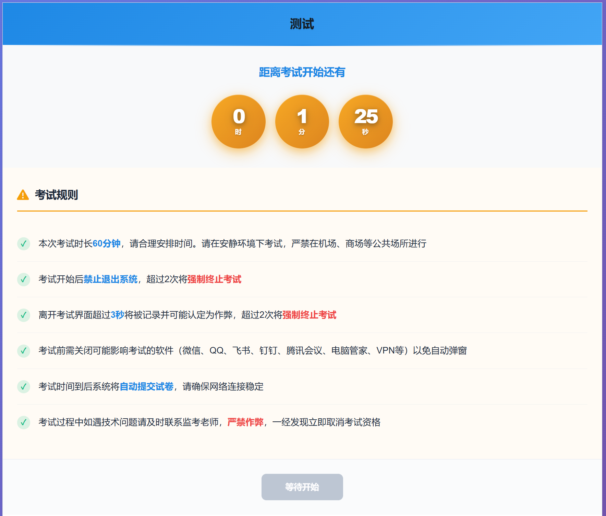
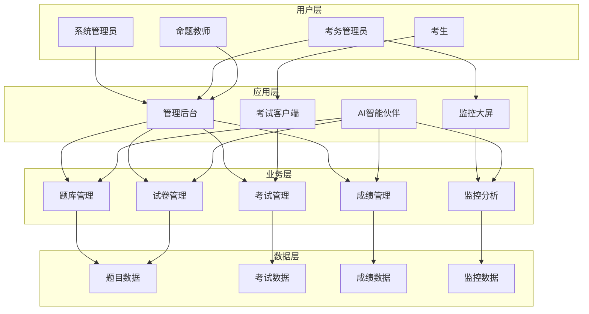
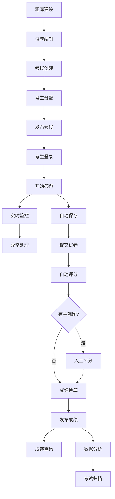
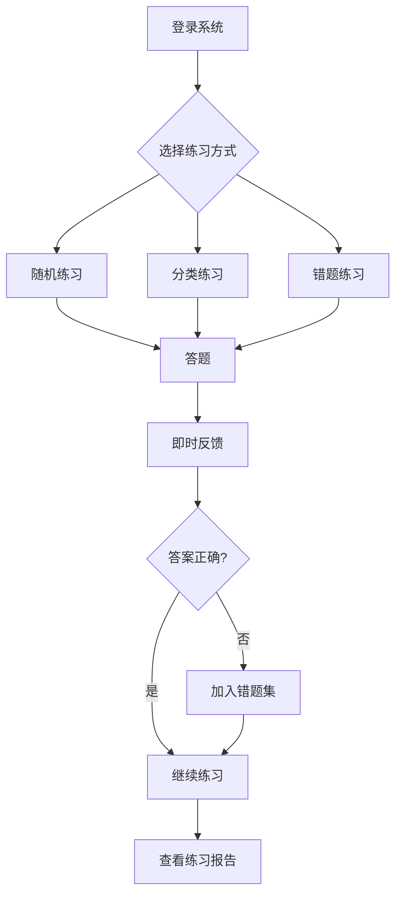

# CodeSpirit考试系统说明文档

## 1. 系统概述

考试系统是 CodeSpirit 平台的核心业务模块，提供完整的在线考试解决方案。系统支持多租户架构、具备完善的防作弊机制、实时监控功能和智能化考试管理能力。

### 1.1 核心能力

#### 考试管理能力
- **多租户架构**：完全支持多租户，数据天然隔离，适合多机构独立运营

- **灵活组卷**：支持固定试卷和随机组卷两种模式，满足不同考试场景

- **多题型支持**：单选题、多选题、判断题、简答题、论述题等多种题型

- **成绩换算**：支持非标准分值自动换算为百分制，满足国家职业标准要求

- **分级管理**：支持职业工种分类，适配职业技能鉴定场景

  

#### 智能化能力
- **AI 题目生成**：基于知识点和难度要求智能生成高质量题目

- **AI 题库导入**：支持 Word、Excel 智能解析导入

- **智能组卷**：根据题型分布、难度要求自动选题组卷

- **AI 分析**：考试数据智能分析，提供决策支持

- **智能客服**：AI 考生服务官，自动解答考生常见问题

  

#### 安全可靠性
- **多层防作弊**：前端行为监控 + 后端数据验证 + 异常检测

- **实时监控**：考试过程实时监控，异常行为及时预警

- **数据审计**：完整的考试记录和审计追踪

- **权限控制**：基于角色的细粒度权限管理

  

#### 业务增强功能
- **公开访问**：支持生成公开访问码，无需登录即可参加考试

- **考卷导出**：支持 PDF 格式考卷和答卷导出，便于存档和分发

- **成绩同步**：支持与外部系统进行成绩数据同步

- **练习模式**：支持日常练习和错题强化

  

  

### 1.2 适用场景

- **职业技能鉴定**：支持国家职业技能鉴定考试业务

- **培训考核**：企业内部培训效果评估和考核

- **资格认证**：各类职业资格认证考试

- **教育培训**：教育机构在线考试和测评

- **知识竞赛**：组织线上知识竞赛活动

  
  
  

## 2. 用户角色与权限

### 2.1 角色体系

#### 系统管理员
- **职责定位**：负责系统整体配置和运维管理
- **核心权限**：
  - 题库管理：题目分类、题目导入、题目编辑
  - 试卷管理：创建试卷、编辑试卷、发布试卷
  - 考试设置：创建考试、配置规则、发布考试
  - 考生管理：考生信息维护、分组管理
  - 数据分析：查看所有考试统计和分析报告
  - 系统配置：职业工种设置、评价类型配置

#### 考务管理员
- **职责定位**：负责具体考试的组织和执行
- **核心权限**：
  - 考试监控：实时监控考试进行情况
  - 异常处理：处理考试中的异常情况
  - 成绩管理：查看和导出考试成绩
  - 考生服务：处理考生咨询和申诉

#### 命题教师
- **职责定位**：负责题库建设和试卷编制
- **核心权限**：
  - 题目创建：添加和编辑考试题目
  - AI 辅助：使用 AI 生成题目
  - 试卷编制：创建和编辑考试试卷
  - 题目审核：审核其他教师创建的题目

#### 考生
- **职责定位**：参加考试并查看成绩
- **核心权限**：
  - 参加考试：登录并参加已发布的考试
  - 查看成绩：查看考试成绩和答题详情
  - 练习功能：使用练习模式进行日常学习
  - 错题回顾：查看错题记录并强化练习

### 2.2 AI 智能伙伴（商业开源）

系统内置四位 AI 智能伙伴，为不同角色提供智能化服务支持：

#### 考情智析官（小析）
- **服务对象**：系统管理员、考务管理员
- **核心功能**：
  - 考试成绩分析：自动生成成绩分析报告
  - 考生成绩查询：智能查询和对比分析
  - 考卷智能导出：支持按条件批量导出考卷
  - 考卷公开分享：生成公开访问码分享考试
- **使用场景**：
  - "分析XX考试的成绩分布情况"
  - "查询张三的所有考试成绩"
  - "导出本月所有考试的PDF答卷"
  - "生成XX考试的公开访问码"

#### 命题智创官（小创）
- **服务对象**：命题教师、系统管理员
- **核心功能**：
  - AI 生成题目：根据知识点智能生成题目
  - 题库智能导入：解析 Word/Excel/PDF 文件导入题目
  - 题目查询分析：自然语言查询题库
  - 智能组卷：根据要求自动选题组卷
- **使用场景**：
  - "生成5道关于数据结构的单选题"
  - "导入我的题库文件"
  - "查询难度为中等的所有题目"
  - "用电子商务类目的题目组一份100分的试卷"

#### 监考智巡官（小巡）
- **服务对象**：考务管理员
- **核心功能**：
  - 今日考试汇总：实时了解当日所有考试情况
  - 实时监测：监控进行中考试的在线人数和答题进度
  - 异常告警：及时发现切屏、长时间未答题等异常行为
- **使用场景**：
  - "今天有哪些考试？"
  - "查看正在进行的考试情况"
  - "有没有异常告警？"
  - "XX考试目前答题进度如何？"

#### 考生服务官（小助）
- **服务对象**：考生
- **核心功能**：
  - 智能客服：自动解答考试相关问题
  - 报名查询：查询考试报名状态
  - 成绩查询：查询历次考试成绩
  - 证书服务：证书下载和验证
- **使用场景**：
  - "查看我的报名记录"
  - "我的考试成绩是多少？"
  - "如何下载准考证？"
  - "考试有什么注意事项？"

## 3. 系统架构

### 3.1 业务架构

### 3.2 模块划分

#### 业务模块说明

**题库管理模块**
- 题目分类管理
- 题目信息维护
- 题目版本控制
- AI 题目生成
- 批量导入导出

**试卷管理模块**
- 固定试卷编制
- 随机试卷配置
- 试卷预览检查
- 成绩换算设置
- 试卷发布管理

**考试管理模块**
- 考试计划制定
- 参考人员管理
- 考试规则配置
- 公开访问设置
- 考试状态控制

**成绩管理模块**
- 自动评分
- 成绩查询
- 成绩换算
- 成绩导出
- 成绩同步

**监控分析模块**
- 实时监控
- 异常预警
- 数据统计
- 分析报告

## 4. 核心功能说明

### 4.1 题库管理

#### 题目分类体系
支持多级分类管理，可按专业、科目、章节等维度组织题库，便于题目检索和维护。

#### 题目信息管理
- **题目类型**：单选题、多选题、判断题、简答题、论述题
- **难度分级**：简单、中等、困难三个等级
- **知识标签**：支持给题目打标签，便于分类检索
- **分值设定**：每道题可以单独设置分值
- **答案解析**：支持添加详细的答案解析说明

#### 题目版本控制
系统自动记录题目的修改历史，确保已使用的试卷题目内容不会因后续修改而改变，保证考试数据的一致性和可追溯性。

#### AI 智能题目生成
通过命题智创官（小创），教师可以：
- 描述需求生成题目：如"生成5道关于数据结构的中等难度单选题"

- 指定知识点生成：针对特定知识点批量生成题目

- 审核优化生成结果：对 AI 生成的题目进行人工审核和优化

  

### 4.2 试卷管理

#### 固定试卷
适用于需要精确控制题目和顺序的场景：
- 手动选题组卷
- 自定义题目顺序
- 精确控制分值分布
- 试卷预览检查

#### 随机试卷
适用于防止作弊、需要大规模出卷的场景：
- **题型分布规则**：设置每种题型的数量和分值
- **难度分布规则**：设置不同难度题目的比例
- **知识点覆盖**：确保试卷涵盖指定知识点
- **自动选题**：系统根据规则从题库自动抽取题目

#### 成绩换算功能
针对非百分制试卷，支持自动换算为百分制：
- **应用场景**：满足国家职业技能鉴定对百分制成绩的要求
- **换算配置**：设置原始分值和目标分值，系统自动计算换算比例
- **双重记录**：同时保存原始成绩和换算后成绩
- **透明展示**：成绩单上清晰显示换算说明

**使用示例：**
- 120分制试卷 → 换算为100分制
- 考生得分96分 → 换算后显示80.0分
- 72分及格线 → 换算后为60分及格

#### 试卷预览与检查
试卷创建完成后，系统提供完整预览功能及智能检查：
- 题目内容预览
- 分值分布检查
- 难度分布验证
- 成绩换算说明
- 标记试卷为"已检查"

### 4.3 考试管理

#### 考试创建流程
1. **选择试卷**：选择已创建的试卷
2. **设置时间**：配置考试开始时间、结束时间和考试时长
3. **选择考生**：
   - 按学生分组选择
   - 支持多个分组参加同一考试
4. **配置规则**：
   - 允许考试次数
   - 题目乱序设置
   - 选项乱序设置
   - 最小考试时间
5. **防作弊设置**：
   - 允许切屏次数
   - 提交后是否可查看结果
   - 是否显示题目解析

### 4.4 在线考试

#### 考试登录与身份验证
- **租户隔离**：不同机构的考试完全独立
- **身份验证**：用户名密码登录或公开访问码登录
- **设备检测**：记录考生使用的设备信息
- **IP 记录**：记录考生登录和考试的 IP 地址

#### 考试界面
- **题目展示**：支持文字、图片、富文本格式
- **答题操作**：单选、多选、判断题可直接选择，简答题可输入文本
- **进度提示**：显示已答题数量和剩余时间
- **自动保存**：答案实时自动保存，防止意外丢失

#### 防作弊机制
**前端监控：**
- 禁用右键菜单
- 禁用复制粘贴
- 禁用打印功能
- 检测开发者工具
- 监测页面切换（切屏检测）
- 监测窗口失焦

**后端验证：**
- 答题时间合理性检查
- 答题顺序异常检测
- IP 地址变化检测
- 多次提交行为监控

#### 考试提交
- **提交检查**：提示未作答题目数量
- **强制提交**：可选择强制提交未完成的考试
- **自动提交**：考试时间到达自动提交
- **提交确认**：二次确认避免误操作

### 4.5 成绩管理

#### 自动评分
客观题（单选、多选、判断）提交后自动评分：
- 实时计算得分
- 自动判断正确性
- 应用成绩换算规则（如启用）
- 判定是否通过

#### 人工评分
主观题（简答、论述）需要人工评分：
- 批量评分界面
- 显示标准答案和解析
- 支持给分和评语
- 评分后自动更新总分

#### 成绩查询
**考生端：**
- 查看个人考试成绩
- 查看答题详情（如允许）
- 查看题目解析（如允许）
- 查看成绩换算说明（如适用）

**管理端：**
- 查看所有考生成绩
- 按条件筛选查询
- 成绩统计分析
- 成绩分布图表

#### 成绩导出
支持多种格式导出：
- **Excel 格式**：批量导出成绩数据
- **PDF 格式**：导出答卷详情和成绩单
- **自定义筛选**：按考试、分组、成绩段筛选导出

#### 成绩同步（商业开源）
支持与外部系统进行成绩数据同步：
- **应用场景**：将成绩同步到人社部门、教育部门系统
- **同步方式**：API 接口对接
- **数据加密**：使用国密 SM2 算法加密传输
- **同步记录**：完整记录同步历史和状态

### 4.6 练习模式

#### 练习功能
- **随机练习**：从题库随机抽取题目练习
- **分类练习**：按题目分类进行针对性练习
- **即时反馈**：答题后立即显示正确答案和解析
- **不限次数**：可以反复练习同一题目

#### 错题管理
- **自动收集**：答错的题目自动加入错题集
- **错误统计**：记录每道题的错误次数
- **针对练习**：支持专门练习错题
- **掌握度评估**：根据练习情况评估掌握程度

## 5. 实时监控系统（商业开源）

### 5.1 监考智巡官（AI辅助）

通过与监考智巡官（小巡）对话，考务管理员可以快速获取考试监控信息：

**今日考试汇总：**
- 查询："今天有哪些考试？"
- 获取当日所有计划考试列表
- 显示每场考试的状态和参考人数
- 快速定位需要关注的考试

**实时监测：**
- 查询："查看正在进行的考试"
- 实时显示在线考生数量
- 显示整体答题进度
- 各考生答题状态一览

**异常告警：**
- 查询："有没有异常告警？"
- 自动识别切屏行为
- 检测长时间未答题
- 标记可疑作弊行为

### 5.2 监控大屏

#### 整体监控视图
提供考试全局监控视角：
- **考试概况**：显示参考人数、已交卷人数、进行中人数
- **答题进度**：整体答题进度百分比和各题完成情况
- **实时动态**：最近提交、最近登录等实时信息
- **异常预警**：突出显示异常行为数量和类型

#### 考生监控列表
- 考生在线状态
- 当前答题进度
- 已用时间/剩余时间
- 切屏次数
- 异常行为标记

#### 数据可视化
- 成绩分布图
- 答题进度分布
- 题目正确率统计
- 异常行为趋势图

### 5.3 单个考生监控

详细监控单个考生的考试情况：
- **基本信息**：姓名、准考证号、登录时间
- **设备信息**：设备类型、浏览器、IP地址
- **答题详情**：各题答题状态、用时、答案
- **行为记录**：切屏记录、长时间停留等
- **实时操作**：可强制交卷、发送提醒等

### 5.4 异常行为检测

系统自动检测并记录以下异常行为：

**切屏行为：**
- 检测方式：页面失焦监测
- 记录信息：切屏时间、持续时长
- 处理策略：超过允许次数自动交卷或标记

**长时间停留：**
- 检测方式：长时间未进行答题操作
- 记录信息：停留题号、持续时间
- 处理策略：提醒或标记异常

**答题时间异常：**
- 过快完成：可能存在提前获取答案
- 时间分布异常：集中在某些题目上
- 处理策略：标记供人工复核

**设备/IP 变化：**
- 检测中途更换设备或IP
- 可能存在替考风险
- 严重违规行为

## 6. 业务流程

### 6.1 标准考试流程

完整的考试业务流程如下：

#### 详细步骤说明

**阶段一：考前准备**
1. **题库建设**（命题教师）
   - 创建题目分类
   - 添加考试题目
   - 可使用 AI 辅助生成题目
   - 批量导入历史题库

2. **试卷编制**（命题教师/管理员）
   - 选择组卷方式（固定/随机）
   - 配置题型分布和分值
   - 设置成绩换算规则（如需要）
   - 预览并检查试卷

3. **考试创建**（管理员）
   - 选择试卷
   - 设置考试时间
   - 配置考试规则
   - 设置防作弊参数

4. **考生分配**（管理员）
   - 创建考生分组
   - 导入考生信息
   - 分配考试权限
   - 生成公开访问码（如需要）

**阶段二：考试进行**
5. **发布考试**（管理员）
   - 检查考试配置
   - 发布考试通知
   - 考生可见考试

6. **考生登录**（考生）
   - 使用账号密码登录 或
   - 使用公开访问码登录
   - 身份验证通过进入候考

7. **开始答题**（考生）
   - 阅读考试须知
   - 点击开始考试
   - 答题并实时保存
   - 系统记录答题过程

8. **实时监控**（考务管理员）
   - 监控大屏查看整体情况
   - 使用监考智巡官查询状态
   - 关注异常行为预警
   - 必要时进行人工干预

**阶段三：考后处理**
9. **提交试卷**（考生）
   - 检查答题情况
   - 确认提交试卷
   - 或时间到自动提交

10. **自动评分**（系统）
    - 客观题自动批改
    - 计算初步得分
    - 应用成绩换算（如启用）

11. **人工评分**（评分教师）
    - 批改主观题（如有）
    - 给分并添加评语
    - 系统更新总分

12. **成绩发布**（管理员）
    - 审核成绩数据
    - 发布考试成绩
    - 考生可查询成绩

**阶段四：数据分析**
13. **成绩查询**（考生/管理员）
    - 考生查看个人成绩
    - 管理员查看全部成绩
    - 导出成绩报表

14. **数据分析**（管理员）
    - 使用考情智析官分析成绩
    - 查看统计报表
    - 生成分析报告

15. **考试归档**（管理员）
    - 导出考试数据
    - 归档考试记录
    - 保留审计追踪

### 6.2 练习模式流程

日常练习和自主学习流程：

## 7. 典型应用场景

### 7.1 职业技能鉴定

**场景描述：**
某职业培训机构需要组织电子商务师职业技能鉴定考试，要求成绩为百分制，并需要将成绩同步到人社部门系统。

**解决方案：**
1. **题库准备**：
   - 按职业工种创建题目分类
   - 使用命题智创官批量生成题目
   - 人工审核优化题目质量

2. **试卷编制**：
   - 创建150分制随机试卷
   - 设置题型分布：单选40题×2分、多选10题×4分、判断20题×1分、简答3题×10分
   - 启用成绩换算，自动转为100分制

3. **考试组织**：
   - 创建考试并设置考试时间
   - 导入考生名单并分组
   - 配置防作弊规则
   - 发布考试

4. **考试监控**：
   - 使用监考智巡官实时查询考试状态
   - 监控大屏展示整体进度
   - 及时处理异常情况

5. **成绩处理**：
   - 客观题自动评分
   - 简答题人工批改
   - 成绩自动换算为百分制
   - 使用国密加密同步成绩到人社系统

### 7.2 企业招聘笔试

**场景描述：**
某企业需要对应聘者进行在线笔试，要求无需注册账号、快速组织、及时出成绩。

**解决方案：**
1. **快速组卷**：
   - 选择现有题库或快速导入笔试题
   - 创建固定试卷或随机试卷
   - 预览检查无误

2. **生成公开访问**：
   - 创建考试并生成公开访问码（如：ABC123）
   - 获取考试短链接
   - 将链接和访问码发送给应聘者

3. **应聘者参考**：
   - 收到链接后打开页面
   - 输入访问码 + 姓名 + 身份证号
   - 立即开始答题

4. **实时监控**：
   - HR 使用监控大屏查看答题进度
   - 识别异常行为
   - 考试结束后立即查看成绩

5. **成绩分析**：
   - 使用考情智析官分析成绩分布
   - 筛选优秀应聘者
   - 导出成绩报表

### 7.3 培训效果评估

**场景描述：**
企业完成一轮内部培训，需要评估培训效果，允许员工多次参考取最好成绩。

**解决方案：**
1. **创建评估考试**：
   - 基于培训内容创建试卷
   - 设置考试时间窗口（如一周内）
   - 允许考试次数：3次
   - 启用题目乱序防止作弊

2. **员工自主安排**：
   - 员工在时间窗口内自行选择考试时间
   - 可多次参考，系统记录最高分
   - 答错的题目自动进入错题集

3. **日常练习**：
   - 员工使用练习模式复习
   - 针对错题强化练习
   - 准备充分后再次参考

4. **培训分析**：
   - 统计整体通过率
   - 分析薄弱知识点
   - 为下次培训提供改进方向

### 7.4 知识竞赛

**场景描述：**
组织线上知识竞赛活动，需要题目随机、即时排名、防止作弊。

**解决方案：**
1. **竞赛题库**：
   - 准备大量题目
   - 设置不同难度
   - 使用 AI 快速扩充题库

2. **随机试卷**：
   - 每位选手题目顺序不同
   - 选项顺序随机
   - 避免选手间互相抄袭

3. **实时排名**：
   - 自动评分后即时更新排名
   - 监控大屏展示Top10
   - 营造竞赛氛围

4. **防作弊措施**：
   - 严格的切屏检测
   - 检测异常快速答题
   - 可疑记录人工复核

## 8. 数据统计与分析

### 8.1 考情智析官数据分析

使用考情智析官（小析）可以快速获取各类统计分析：

**成绩分析：**
- "分析XX考试的成绩分布"
- "本月所有考试的平均分"
- "各专业考试通过率对比"

**考生分析：**
- "查询张三的所有考试成绩"
- "本班成绩前10名学员"
- "哪些学员多次考试未通过"

**题目分析：**
- "正确率最低的10道题"
- "单选题的平均正确率"
- "哪些题目需要优化"

### 8.2 统计报表

#### 考试汇总报表
- 参考人数统计
- 实际参考人数
- 缺考人数
- 平均分
- 最高分/最低分
- 通过率
- 优秀率（≥85分）

#### 成绩分布分析
- 分数段统计（0-59、60-69、70-79、80-89、90-100）
- 成绩分布曲线图
- 与历史考试对比
- 与其他组别对比

#### 题目质量分析
- 各题目正确率
- 区分度分析
- 难度系数计算
- 题目优化建议

#### 考生表现分析
- 个人历次成绩趋势
- 薄弱知识点识别
- 与平均水平对比
- 学习效果评估

### 8.3 数据导出

支持多种格式的数据导出：

**Excel 导出：**
- 成绩明细表
- 统计汇总表
- 考生答题详情
- 自定义筛选条件

**PDF 导出：**
- 考试试卷（含答案和解析）
- 学员答卷（含批注和成绩）
- 成绩单证书
- 分析报告

**API 数据同步：**
- 与人社系统对接
- 与教育系统对接
- 自定义接口对接
- 支持国密加密传输

## 9. 系统集成

### 9.1 多租户数据隔离

系统采用多租户架构，确保不同机构数据完全隔离：
- 每个租户拥有独立的数据空间
- 租户间数据互不可见
- 支持租户级别的个性化配置
- 可独立备份和恢复租户数据

### 9.2 与外部系统集成

#### 成绩同步接口
- 支持将考试成绩同步到人社、教育等外部系统
- 使用国密 SM2 算法加密传输
- 支持批量同步和单条同步
- 完整的同步日志和状态跟踪

#### 单点登录（SSO）
- 支持与企业 SSO 系统集成
- 支持 OAuth 2.0 / SAML 2.0 协议
- 用户信息自动同步
- 统一的身份认证体验

#### 数据 API 接口
- RESTful API 接口
- 标准的 JSON 数据格式
- API 密钥认证
- 完善的接口文档

### 9.3 系统对接能力

系统提供标准化接口，支持与以下系统对接：
- 人力资源管理系统（HR）
- 学习管理系统（LMS）
- 企业资源计划系统（ERP）
- 客户关系管理系统（CRM）
- 第三方题库系统

## 10. 系统运维

### 10.1 数据备份

**备份策略：**
- 数据库每日全量备份
- 增量备份每4小时一次
- 备份文件异地存储
- 定期恢复演练

**备份内容：**
- 题库数据
- 试卷数据
- 考试记录
- 成绩数据
- 系统配置

### 10.2 性能优化

**系统层面：**
- 题目和试卷数据缓存
- 数据库查询优化
- 静态资源 CDN 加速
- 负载均衡配置

**考试高峰应对：**
- 提前预热缓存
- 增加服务器资源
- 限流保护机制
- 降级应急方案

### 10.3 监控告警

**监控指标：**
- 系统可用性监控
- 响应时间监控
- 并发用户数监控
- 错误率监控
- 资源使用率监控

**告警机制：**
- 实时告警通知
- 多渠道告警（邮件/短信/企业微信）
- 告警升级机制
- 自动恢复尝试

### 10.4 安全防护

**安全措施：**
- 防 SQL 注入
- 防 XSS 攻击
- 防 CSRF 攻击
- API 访问频率限制
- 敏感数据加密存储

**权限管理：**
- 基于角色的访问控制
- 最小权限原则
- 操作审计日志
- 定期权限审查

## 11. 常见问题

### 11.1 考试相关问题

**Q1：考生登录后看不到考试怎么办？**
- 检查考试是否已发布
- 确认考生是否在参考分组中
- 检查考试时间设置是否正确
- 确认租户信息是否匹配

**Q2：考试中途断网了怎么办？**
- 系统会自动保存已答题目（前后端均会备份）
- 重新连接后继续答题
- 剩余时间会继续计时
- 建议考前测试网络稳定性

**Q3：考试时间到了系统会自动提交吗？**
- 是的，时间到达会自动提交
- 提前5分钟会提示时间不足
- 建议考生提前检查并提交

**Q4：成绩换算是怎么计算的？**
- 系统按设定的换算比例自动计算
- 同时保存原始成绩和换算后成绩
- 成绩单上会显示换算说明
- 举例：120分制96分 → 100分制80分

**Q5：公开访问码忘记了怎么办？**
- 管理员可在考试详情中查看访问码
- 可以重新生成新的访问码
- 旧访问码生成后一直有效

### 11.2 防作弊相关问题

**Q1：切屏多少次会被标记异常？**
- 根据考试设置的允许切屏次数确定
- 超过次数会被标记但不会立即强制交卷
- 管理员可在监控中查看切屏记录

**Q2：考生说正常操作被误判切屏？**
- 可能是浏览器兼容性问题
- 建议使用Chrome或Edge最新版本
- 考前可进行模拟测试
- 必要时可调整检测灵敏度

**Q3：如何防止考生用手机拍照作弊？**
- 可结合线下监考
- 启用视频监控（需第三方集成）
- 设置随机题目和选项乱序
- 通过答题时间异常检测

### 11.3 成绩管理问题

**Q1：主观题如何评分？**
- 系统不自动评主观题
- 需要教师手动批改
- 批改界面显示标准答案
- 可给分数和评语

**Q2：成绩发布后考生看不到？**
- 检查考试设置中是否允许查看结果
- 确认成绩是否已审核发布
- 查看考生权限配置

**Q3：如何批量修改成绩？**
- 不建议直接修改成绩数据
- 可重新批改主观题
- 或调整题目分值后重新计算
- 修改会记录审计日志

### 11.4 题库管理问题

**Q1：导入的题目格式不对怎么办？**
- 检查文件格式是否符合模板要求
- 使用 AI 智能导入可自动识别
- 查看导入日志了解具体错误
- 可联系技术支持获取帮助

**Q2：如何快速扩充题库？**
- 使用命题智创官 AI 生成题目
- 导入历史试题文件
- 从其他题库系统迁移
- 组织教师团队协作创建

**Q3：题目修改后会影响已有考试吗？**
- 不会，系统使用题目版本控制
- 已创建的试卷使用当时的题目版本
- 修改题目会创建新版本
- 新试卷使用最新版本

### 11.5 系统使用建议

**考前准备：**
- 提前发布考试并通知考生
- 组织模拟考试熟悉流程
- 准备应急预案
- 检查服务器资源是否充足

**考中监控：**
- 实时关注监控大屏
- 及时处理异常情况
- 记录重要事件
- 保持与考生的沟通渠道

**考后处理：**
- 及时批改主观题
- 审核成绩数据
- 分析考试情况
- 归档考试数据

## 12. 未来规划

### 12.1 功能增强

- **视频监考**：集成视频监控，支持远程监考
- **人脸识别**：考前人脸识别身份验证，防止替考

### 12.2 AI 能力提升

- **智能组卷**：根据历史数据智能推荐组卷策略
- **自适应考试**：根据答题情况动态调整题目难度
- **学习路径规划**：基于考试结果生成个性化学习路径
- **作弊模式识别**：AI 识别更复杂的作弊模式

### 12.3 数据分析增强

- **大数据分析平台**：深度挖掘考试数据价值
- **预测性分析**：预测考生表现和通过率
- **对标分析**：与行业标准对比分析
- **可视化大屏**：更丰富的数据可视化展示

## 13. 附录

### 13.1 术语表

| 术语 | 说明 |
|------|------|
| 租户 | 使用系统的独立机构或组织 |
| 题库 | 存储考试题目的数据库 |
| 固定试卷 | 题目和顺序固定的试卷 |
| 随机试卷 | 根据规则自动抽题的试卷 |
| 成绩换算 | 将非百分制成绩转换为百分制 |
| 公开访问码 | 无需登录参加考试的访问凭证 |
| 题目版本 | 题目的历史修改版本记录 |
| 切屏检测 | 检测考生离开考试页面的行为 |
| 监考智巡官 | 考试监控的 AI 智能助手 |
| 命题智创官 | 题库管理的 AI 智能助手 |
| 考情智析官 | 数据分析的 AI 智能助手 |
| 考生服务官 | 考生服务的 AI 智能助手 |

### 13.2 相关文档

- [考试系统功能列表](./exam-system-feature-list-zh-CN.md)
- [CodeSpirit 授权管理指南](../04-Identity-Auth/codespirit-authorization-guide-zh-CN.md)
- [CodeSpirit 多租户指南](../05-Multi-Tenancy/)
- [CodeSpirit 聚合器使用指南](../03-Core-Components/codespirit-aggregator-guide-zh-CN.md)

### 13.3 技术支持

如需技术支持或有任何疑问，请通过以下方式联系我们：

- **项目仓库**：https://github.com/codespirit/code-spirit
- **问题反馈**：在 GitHub 提交 Issue
- **文档贡献**：欢迎提交 Pull Request 改进文档

---

**文档版本**：v2.0  
**更新时间**：2025年12月29日 