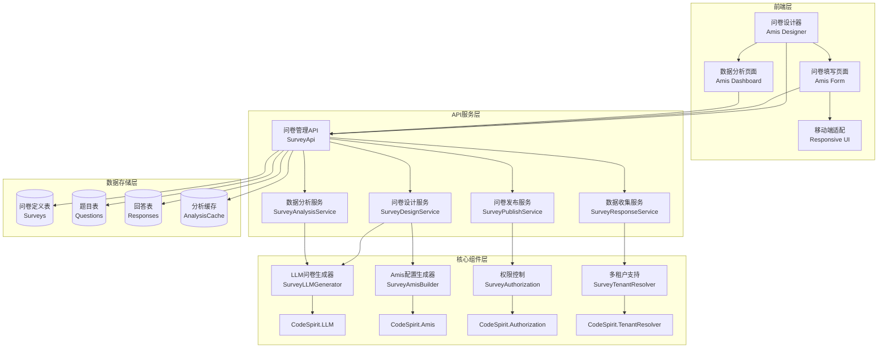
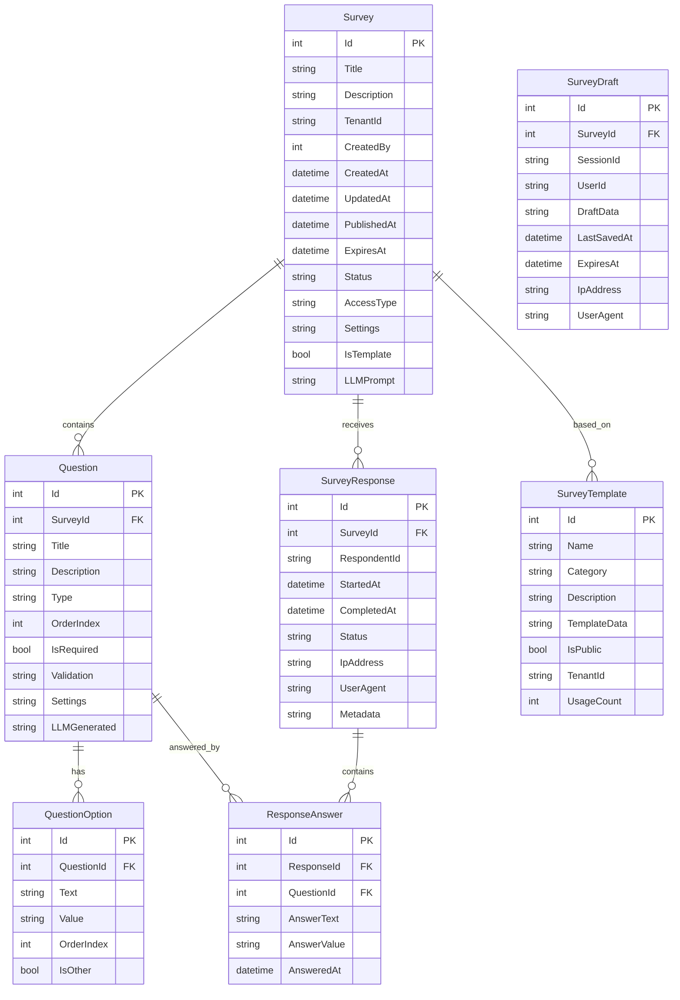

# 问卷调查模块方案设计

## 📋 概述

基于CodeSpirit框架开发的智能问卷调查模块，结合Amis前端框架和LLM大语言模型，提供问卷设计、发布、收集、分析的完整解决方案。

## 🎯 核心特性

### 1. 智能问卷生成
- **基于LLM的问卷生成**：利用大语言模型根据主题自动生成问卷题目
- **提示词长度限制**：智能压缩和优化提示词，确保在长度限制内生成高质量问卷
- **多种题型支持**：单选、多选、填空、评分、排序等多种题型
- **智能题目优化**：根据问卷目标自动优化题目表述和选项

### 2. 可视化问卷设计
- **基于Amis的拖拽式设计器**：可视化问卷设计界面
- **实时预览**：设计过程中实时预览问卷效果
- **模板库**：提供常用问卷模板快速创建

### 3. 灵活的发布方式
- **多渠道发布**：支持链接分享、二维码、嵌入网页等方式
- **权限控制**：支持公开、需登录、指定用户等访问权限
- **时间控制**：支持定时发布和截止时间设置
- **智能填写限制**：支持IP限制、用户限制、设备限制、时间段限制等多种防刷机制
- **自动暂存功能**：智能自动保存填写进度，支持断点续填，提升用户体验

### 4. 智能数据分析
- **实时统计**：实时显示回收情况和基础统计
- **智能分析**：基于LLM的数据洞察和趋势分析
- **可视化报表**：多种图表展示分析结果

### 5. 统一设置管理
- **基于CodeSpirit.Settings**：利用统一的设置管理组件
- **自动生成界面**：基于Amis字段特性自动生成设置管理界面
- **分组管理**：LLM设置、自动保存设置、限制设置等分组管理
- **历史追踪**：设置变更历史记录和审计
- **导入导出**：支持设置的批量导入导出功能
- **零配置管理**：通过DTO特性注解实现界面零配置自动生成

## 🏗️ 系统架构

### 整体架构图



### 技术栈选择

| 层级 | 技术选择 | 说明 |
|------|----------|------|
| 前端框架 | Amis | 基于JSON配置的低代码前端框架 |
| 后端框架 | .NET 9 + ASP.NET Core | 现代化的后端开发框架 |
| 数据库 | SQL Server + Entity Framework Core | 关系型数据库，支持复杂查询 |
| 缓存 | Redis | 分析结果缓存，提升性能 |
| 消息队列 | RabbitMQ | 异步处理问卷分析任务 |
| AI服务 | CodeSpirit.LLM | 统一的LLM服务抽象 |
| 容器化 | .NET Aspire | 现代化的应用编排平台 |

## 📊 数据库设计

### 核心实体关系图



### 数据表详细设计

#### 1. 问卷表 (Surveys)
```sql
CREATE TABLE Surveys (
    Id int IDENTITY(1,1) PRIMARY KEY,
    Title nvarchar(200) NOT NULL,
    Description nvarchar(max),
    TenantId nvarchar(50) NOT NULL,
    CreatedBy int NOT NULL,
    CreatedAt datetime2 NOT NULL DEFAULT GETUTCDATE(),
    UpdatedAt datetime2 NOT NULL DEFAULT GETUTCDATE(),
    PublishedAt datetime2 NULL,
    ExpiresAt datetime2 NULL,
    Status nvarchar(20) NOT NULL DEFAULT 'Draft', -- Draft, Published, Closed, Archived
    AccessType nvarchar(20) NOT NULL DEFAULT 'Public', -- Public, Private, Restricted
    Settings nvarchar(max), -- JSON配置
    IsTemplate bit NOT NULL DEFAULT 0,
    LLMPrompt nvarchar(max), -- 用于生成问卷的LLM提示词
    
    INDEX IX_Surveys_TenantId (TenantId),
    INDEX IX_Surveys_Status (Status),
    INDEX IX_Surveys_CreatedBy (CreatedBy)
);
```

#### 2. 题目表 (Questions)
```sql
CREATE TABLE Questions (
    Id int IDENTITY(1,1) PRIMARY KEY,
    SurveyId int NOT NULL,
    Title nvarchar(500) NOT NULL,
    Description nvarchar(max),
    Type nvarchar(50) NOT NULL, -- SingleChoice, MultipleChoice, Text, Number, Rating, Date, etc.
    OrderIndex int NOT NULL,
    IsRequired bit NOT NULL DEFAULT 0,
    Validation nvarchar(max), -- JSON验证规则
    Settings nvarchar(max), -- JSON配置（如评分范围、文本长度限制等）
    LLMGenerated bit NOT NULL DEFAULT 0, -- 是否由LLM生成
    
    FOREIGN KEY (SurveyId) REFERENCES Surveys(Id) ON DELETE CASCADE,
    INDEX IX_Questions_SurveyId (SurveyId),
    INDEX IX_Questions_OrderIndex (SurveyId, OrderIndex)
);
```

#### 3. 题目选项表 (QuestionOptions)
```sql
CREATE TABLE QuestionOptions (
    Id int IDENTITY(1,1) PRIMARY KEY,
    QuestionId int NOT NULL,
    Text nvarchar(500) NOT NULL,
    Value nvarchar(200),
    OrderIndex int NOT NULL,
    IsOther bit NOT NULL DEFAULT 0, -- 是否为"其他"选项
    
    FOREIGN KEY (QuestionId) REFERENCES Questions(Id) ON DELETE CASCADE,
    INDEX IX_QuestionOptions_QuestionId (QuestionId)
);
```

#### 4. 问卷草稿表 (SurveyDrafts)
```sql
CREATE TABLE SurveyDrafts (
    Id int IDENTITY(1,1) PRIMARY KEY,
    SurveyId int NOT NULL,
    SessionId nvarchar(50) NOT NULL, -- 会话ID，用于匿名用户
    UserId nvarchar(50) NULL, -- 用户ID，已登录用户
    DraftData nvarchar(max) NOT NULL, -- JSON格式的草稿数据
    LastSavedAt datetime2 NOT NULL DEFAULT GETUTCDATE(),
    ExpiresAt datetime2 NOT NULL, -- 草稿过期时间
    IpAddress nvarchar(50),
    UserAgent nvarchar(500),
    
    FOREIGN KEY (SurveyId) REFERENCES Surveys(Id) ON DELETE CASCADE,
    INDEX IX_SurveyDrafts_SurveyId_SessionId (SurveyId, SessionId),
    INDEX IX_SurveyDrafts_SurveyId_UserId (SurveyId, UserId),
    INDEX IX_SurveyDrafts_ExpiresAt (ExpiresAt)
);
```

## 🔧 核心组件设计

### 1. LLM问卷生成器 (SurveyLLMGenerator)

```csharp
/// <summary>
/// 基于LLM的问卷生成器
/// </summary>
public class SurveyLLMGenerator
{
    private readonly LLMAssistant _llmAssistant;
    private readonly ISettingsService _settingsService;
    private readonly ILogger<SurveyLLMGenerator> _logger;
    
    private const string MODULE_NAME = "Survey";
    private const int DEFAULT_MAX_PROMPT_LENGTH = 2000;
    private const int DEFAULT_MAX_TOKENS = 4000;

    /// <summary>
    /// 根据主题生成问卷
    /// </summary>
    /// <param name="request">生成请求</param>
    /// <returns>生成的问卷配置</returns>
    public async Task<GeneratedSurveyDto> GenerateSurveyAsync(GenerateSurveyRequest request)
    {
        // 获取提示词长度限制设置
        var maxPromptLength = await GetMaxPromptLengthAsync();
        var maxTokens = await GetMaxTokensAsync();
        
        // 构建并优化提示词
        var prompt = await BuildOptimizedPromptAsync(request, maxPromptLength);
        
        // 调用LLM生成问卷
        var response = await _llmAssistant.GenerateContentAsync(prompt, new LLMOptions
        {
            MaxTokens = maxTokens,
            Temperature = 0.7f
        });
        
        // 解析LLM响应为问卷结构
        return ParseSurveyResponse(response);
    }

    /// <summary>
    /// 优化现有问卷
    /// </summary>
    /// <param name="survey">现有问卷</param>
    /// <param name="optimizationGoals">优化目标</param>
    /// <returns>优化后的问卷</returns>
    public async Task<GeneratedSurveyDto> OptimizeSurveyAsync(
        SurveyDto survey, 
        SurveyOptimizationGoals optimizationGoals)
    {
        var maxPromptLength = await GetMaxPromptLengthAsync();
        var maxTokens = await GetMaxTokensAsync();
        
        // 构建优化提示词
        var prompt = await BuildOptimizationPromptAsync(survey, optimizationGoals, maxPromptLength);
        
        // 调用LLM优化问卷
        var response = await _llmAssistant.GenerateContentAsync(prompt, new LLMOptions
        {
            MaxTokens = maxTokens,
            Temperature = 0.5f
        });
        
        // 解析优化结果
        return ParseSurveyResponse(response);
    }
    
    /// <summary>
    /// 构建优化后的提示词
    /// </summary>
    private async Task<string> BuildOptimizedPromptAsync(GenerateSurveyRequest request, int maxLength)
    {
        var basePrompt = BuildSurveyPrompt(request);
        
        // 如果提示词超长，进行智能压缩
        if (basePrompt.Length > maxLength)
        {
            basePrompt = await CompressPromptAsync(basePrompt, maxLength);
        }
        
        return basePrompt;
    }
    
    /// <summary>
    /// 智能压缩提示词
    /// </summary>
    private async Task<string> CompressPromptAsync(string prompt, int maxLength)
    {
        // 保留核心信息，压缩次要内容
        var coreInfo = ExtractCoreInformation(prompt);
        var compressed = coreInfo;
        
        // 如果仍然超长，使用LLM进行智能摘要
        if (compressed.Length > maxLength)
        {
            var summaryPrompt = $"请将以下内容压缩到{maxLength}字符以内，保留核心信息：\n{compressed}";
            compressed = await _llmAssistant.GenerateContentAsync(summaryPrompt, new LLMOptions
            {
                MaxTokens = maxLength / 2,
                Temperature = 0.3f
            });
        }
        
        return compressed;
    }
    
    /// <summary>
    /// 获取最大提示词长度设置
    /// </summary>
    private async Task<int> GetMaxPromptLengthAsync()
    {
        var setting = await _settingsService.GetGlobalSettingAsync(MODULE_NAME, "MaxPromptLength");
        return int.TryParse(setting, out var value) ? value : DEFAULT_MAX_PROMPT_LENGTH;
    }
    
    /// <summary>
    /// 获取最大Token数设置
    /// </summary>
    private async Task<int> GetMaxTokensAsync()
    {
        var setting = await _settingsService.GetGlobalSettingAsync(MODULE_NAME, "MaxTokens");
        return int.TryParse(setting, out var value) ? value : DEFAULT_MAX_TOKENS;
    }
}
```

### 2. Amis配置生成器 (SurveyAmisBuilder)

```csharp
/// <summary>
/// 问卷Amis配置生成器
/// </summary>
public class SurveyAmisBuilder
{
    /// <summary>
    /// 生成问卷设计器配置
    /// </summary>
    /// <returns>Amis设计器配置</returns>
    public JObject BuildDesignerConfig()
    {
        return new JObject
        {
            ["type"] = "page",
            ["title"] = "问卷设计器",
            ["body"] = new JArray
            {
                BuildDesignerToolbar(),
                BuildDesignerCanvas(),
                BuildPropertyPanel()
            }
        };
    }

    /// <summary>
    /// 生成问卷填写页面配置
    /// </summary>
    /// <param name="survey">问卷数据</param>
    /// <returns>Amis表单配置</returns>
    public JObject BuildSurveyFormConfig(SurveyDto survey)
    {
        var formConfig = new JObject
        {
            ["type"] = "page",
            ["title"] = survey.Title,
            ["body"] = new JArray
            {
                BuildSurveyHeader(survey),
                BuildSurveyForm(survey),
                BuildSurveyFooter()
            }
        };

        return formConfig;
    }

    /// <summary>
    /// 生成数据分析页面配置
    /// </summary>
    /// <param name="surveyId">问卷ID</param>
    /// <returns>Amis分析页面配置</returns>
    public JObject BuildAnalysisConfig(int surveyId)
    {
        return new JObject
        {
            ["type"] = "page",
            ["title"] = "问卷分析",
            ["body"] = new JArray
            {
                BuildAnalysisHeader(surveyId),
                BuildAnalysisCharts(surveyId),
                BuildAnalysisTable(surveyId)
            }
        };
    }
}
```

### 3. 问卷自动暂存服务 (SurveyDraftService)

```csharp
/// <summary>
/// 问卷草稿自动暂存服务
/// </summary>
public class SurveyDraftService : ISurveyDraftService
{
    private readonly ISurveyDraftRepository _draftRepository;
    private readonly ISettingsService _settingsService;
    private readonly ILogger<SurveyDraftService> _logger;
    private readonly IMemoryCache _cache;
    
    private const string MODULE_NAME = "Survey";

    /// <summary>
    /// 自动保存草稿
    /// </summary>
    /// <param name="request">保存请求</param>
    /// <returns>保存结果</returns>
    public async Task<SurveyDraftSaveResult> AutoSaveDraftAsync(AutoSaveDraftRequest request)
    {
        try
        {
            // 获取自动保存设置
            var autoSaveSettings = await GetAutoSaveSettingsAsync();
            
            // 检查是否启用自动保存
            if (!autoSaveSettings.Enabled)
            {
                return SurveyDraftSaveResult.Disabled();
            }
            
            // 检查保存间隔
            var lastSaveTime = await GetLastSaveTimeAsync(request.SurveyId, request.SessionId, request.UserId);
            if (lastSaveTime.HasValue && 
                DateTime.UtcNow.Subtract(lastSaveTime.Value).TotalSeconds < autoSaveSettings.IntervalSeconds)
            {
                return SurveyDraftSaveResult.TooFrequent();
            }
            
            // 验证草稿数据大小
            if (request.DraftData.Length > autoSaveSettings.MaxDataSize)
            {
                return SurveyDraftSaveResult.DataTooLarge();
            }
            
            // 保存或更新草稿
            var draft = await _draftRepository.GetByIdentifierAsync(
                request.SurveyId, request.SessionId, request.UserId);
                
            if (draft == null)
            {
                // 创建新草稿
                draft = new SurveyDraft
                {
                    SurveyId = request.SurveyId,
                    SessionId = request.SessionId,
                    UserId = request.UserId,
                    DraftData = request.DraftData,
                    ExpiresAt = DateTime.UtcNow.AddDays(autoSaveSettings.RetentionDays),
                    IpAddress = request.IpAddress,
                    UserAgent = request.UserAgent
                };
                
                await _draftRepository.CreateAsync(draft);
            }
            else
            {
                // 更新现有草稿
                draft.DraftData = request.DraftData;
                draft.LastSavedAt = DateTime.UtcNow;
                draft.ExpiresAt = DateTime.UtcNow.AddDays(autoSaveSettings.RetentionDays);
                
                await _draftRepository.UpdateAsync(draft);
            }
            
            // 更新缓存中的最后保存时间
            UpdateLastSaveTimeCache(request.SurveyId, request.SessionId, request.UserId);
            
            return SurveyDraftSaveResult.Success(draft.Id);
        }
        catch (Exception ex)
        {
            _logger.LogError(ex, "自动保存问卷草稿失败: SurveyId={SurveyId}, SessionId={SessionId}", 
                request.SurveyId, request.SessionId);
            return SurveyDraftSaveResult.Error(ex.Message);
        }
    }
    
    /// <summary>
    /// 获取草稿数据
    /// </summary>
    /// <param name="surveyId">问卷ID</param>
    /// <param name="sessionId">会话ID</param>
    /// <param name="userId">用户ID</param>
    /// <returns>草稿数据</returns>
    public async Task<SurveyDraftDto?> GetDraftAsync(int surveyId, string sessionId, string? userId = null)
    {
        var draft = await _draftRepository.GetByIdentifierAsync(surveyId, sessionId, userId);
        
        if (draft == null || draft.ExpiresAt < DateTime.UtcNow)
        {
            return null;
        }
        
        return new SurveyDraftDto
        {
            Id = draft.Id,
            SurveyId = draft.SurveyId,
            DraftData = draft.DraftData,
            LastSavedAt = draft.LastSavedAt,
            ExpiresAt = draft.ExpiresAt
        };
    }
    
    /// <summary>
    /// 清理过期草稿
    /// </summary>
    /// <returns>清理的草稿数量</returns>
    public async Task<int> CleanupExpiredDraftsAsync()
    {
        var expiredDrafts = await _draftRepository.GetExpiredDraftsAsync();
        
        if (expiredDrafts.Any())
        {
            await _draftRepository.DeleteBatchAsync(expiredDrafts.Select(d => d.Id));
            _logger.LogInformation("清理了 {Count} 个过期的问卷草稿", expiredDrafts.Count);
        }
        
        return expiredDrafts.Count;
    }
    
    /// <summary>
    /// 获取自动保存设置
    /// </summary>
    private async Task<AutoSaveSettings> GetAutoSaveSettingsAsync()
    {
        var settings = await _settingsService.GetAllGlobalSettingsAsync(MODULE_NAME);
        
        return new AutoSaveSettings
        {
            Enabled = settings.GetBool("AutoSave.Enabled", true),
            IntervalSeconds = settings.GetInt("AutoSave.IntervalSeconds", 30),
            MaxDataSize = settings.GetInt("AutoSave.MaxDataSize", 1024 * 1024), // 1MB
            RetentionDays = settings.GetInt("AutoSave.RetentionDays", 7)
        };
    }
    
    /// <summary>
    /// 获取最后保存时间
    /// </summary>
    private async Task<DateTime?> GetLastSaveTimeAsync(int surveyId, string sessionId, string? userId)
    {
        var cacheKey = $"survey_draft_last_save_{surveyId}_{sessionId}_{userId}";
        
        if (_cache.TryGetValue(cacheKey, out DateTime lastSaveTime))
        {
            return lastSaveTime;
        }
        
        var draft = await _draftRepository.GetByIdentifierAsync(surveyId, sessionId, userId);
        return draft?.LastSavedAt;
    }
    
    /// <summary>
    /// 更新最后保存时间缓存
    /// </summary>
    private void UpdateLastSaveTimeCache(int surveyId, string sessionId, string? userId)
    {
        var cacheKey = $"survey_draft_last_save_{surveyId}_{sessionId}_{userId}";
        _cache.Set(cacheKey, DateTime.UtcNow, TimeSpan.FromMinutes(10));
    }
}

/// <summary>
/// 自动保存设置
/// </summary>
public class AutoSaveSettings
{
    public bool Enabled { get; set; } = true;
    public int IntervalSeconds { get; set; } = 30;
    public int MaxDataSize { get; set; } = 1024 * 1024; // 1MB
    public int RetentionDays { get; set; } = 7;
}

/// <summary>
/// 自动保存请求
/// </summary>
public class AutoSaveDraftRequest
{
    public int SurveyId { get; set; }
    public string SessionId { get; set; } = string.Empty;
    public string? UserId { get; set; }
    public string DraftData { get; set; } = string.Empty;
    public string? IpAddress { get; set; }
    public string? UserAgent { get; set; }
}

/// <summary>
/// 草稿保存结果
/// </summary>
public class SurveyDraftSaveResult
{
    public bool Success { get; set; }
    public string? Message { get; set; }
    public int? DraftId { get; set; }
    
    public static SurveyDraftSaveResult Success(int draftId) => 
        new() { Success = true, DraftId = draftId };
        
    public static SurveyDraftSaveResult Disabled() => 
        new() { Success = false, Message = "自动保存已禁用" };
        
    public static SurveyDraftSaveResult TooFrequent() => 
        new() { Success = false, Message = "保存过于频繁" };
        
    public static SurveyDraftSaveResult DataTooLarge() => 
        new() { Success = false, Message = "草稿数据过大" };
        
    public static SurveyDraftSaveResult Error(string message) => 
        new() { Success = false, Message = message };
}
```

### 4. 问卷服务层设计

```csharp
/// <summary>
/// 问卷管理服务
/// </summary>
public class SurveyService : ISurveyService
{
    private readonly ISurveyRepository _surveyRepository;
    private readonly SurveyLLMGenerator _llmGenerator;
    private readonly SurveyAmisBuilder _amisBuilder;
    private readonly ICurrentUser _currentUser;
    private readonly ITenantResolver _tenantResolver;

    /// <summary>
    /// 创建问卷
    /// </summary>
    public async Task<SurveyDto> CreateSurveyAsync(CreateSurveyRequest request)
    {
        var survey = new Survey
        {
            Title = request.Title,
            Description = request.Description,
            TenantId = await _tenantResolver.GetCurrentTenantIdAsync(),
            CreatedBy = _currentUser.Id,
            Status = SurveyStatus.Draft
        };

        // 如果使用LLM生成
        if (!string.IsNullOrEmpty(request.LLMPrompt))
        {
            var generated = await _llmGenerator.GenerateSurveyAsync(
                new GenerateSurveyRequest 
                { 
                    Topic = request.LLMPrompt,
                    QuestionCount = request.QuestionCount ?? 10,
                    SurveyType = request.SurveyType
                });
            
            survey.Questions = generated.Questions.Select(q => new Question
            {
                Title = q.Title,
                Type = q.Type,
                IsRequired = q.IsRequired,
                OrderIndex = q.OrderIndex,
                LLMGenerated = true,
                Options = q.Options?.Select(o => new QuestionOption
                {
                    Text = o.Text,
                    Value = o.Value,
                    OrderIndex = o.OrderIndex
                }).ToList()
            }).ToList();
        }

        await _surveyRepository.CreateAsync(survey);
        return survey.ToDto();
    }

    /// <summary>
    /// 发布问卷
    /// </summary>
    public async Task<bool> PublishSurveyAsync(int surveyId)
    {
        var survey = await _surveyRepository.GetByIdAsync(surveyId);
        if (survey == null) return false;

        // 验证问卷完整性
        if (!ValidateSurveyForPublish(survey))
        {
            throw new BusinessException("问卷信息不完整，无法发布");
        }

        survey.Status = SurveyStatus.Published;
        survey.PublishedAt = DateTime.UtcNow;
        
        await _surveyRepository.UpdateAsync(survey);
        return true;
    }
    
    /// <summary>
    /// 检查填写限制
    /// </summary>
    /// <param name="surveyId">问卷ID</param>
    /// <param name="request">填写请求信息</param>
    /// <returns>限制检查结果</returns>
    public async Task<SurveyAccessResult> CheckSurveyAccessAsync(int surveyId, SurveyAccessRequest request)
    {
        var survey = await _surveyRepository.GetByIdAsync(surveyId);
        if (survey == null)
        {
            return SurveyAccessResult.NotFound();
        }
        
        // 获取问卷限制设置
        var restrictions = await GetSurveyRestrictionsAsync(surveyId);
        
        // 检查问卷状态
        if (survey.Status != SurveyStatus.Published)
        {
            return SurveyAccessResult.NotPublished();
        }
        
        // 检查时间限制
        var timeCheck = CheckTimeRestrictions(survey, restrictions);
        if (!timeCheck.Success)
        {
            return timeCheck;
        }
        
        // 检查IP限制
        var ipCheck = await CheckIpRestrictionsAsync(surveyId, request.IpAddress, restrictions);
        if (!ipCheck.Success)
        {
            return ipCheck;
        }
        
        // 检查用户限制
        var userCheck = await CheckUserRestrictionsAsync(surveyId, request.UserId, request.SessionId, restrictions);
        if (!userCheck.Success)
        {
            return userCheck;
        }
        
        // 检查设备限制
        var deviceCheck = await CheckDeviceRestrictionsAsync(surveyId, request.DeviceFingerprint, restrictions);
        if (!deviceCheck.Success)
        {
            return deviceCheck;
        }
        
        // 检查总回收量限制
        var responseCountCheck = await CheckResponseCountLimitAsync(surveyId, restrictions);
        if (!responseCountCheck.Success)
        {
            return responseCountCheck;
        }
        
        return SurveyAccessResult.Success();
    }
    
    /// <summary>
    /// 检查时间限制
    /// </summary>
    private SurveyAccessResult CheckTimeRestrictions(Survey survey, SurveyRestrictions restrictions)
    {
        var now = DateTime.UtcNow;
        
        // 检查开始时间
        if (survey.PublishedAt.HasValue && now < survey.PublishedAt.Value)
        {
            return SurveyAccessResult.NotStarted(survey.PublishedAt.Value);
        }
        
        // 检查结束时间
        if (survey.ExpiresAt.HasValue && now > survey.ExpiresAt.Value)
        {
            return SurveyAccessResult.Expired(survey.ExpiresAt.Value);
        }
        
        // 检查每日时间段限制
        if (restrictions.DailyTimeRestriction != null)
        {
            var currentTime = now.TimeOfDay;
            if (currentTime < restrictions.DailyTimeRestriction.StartTime || 
                currentTime > restrictions.DailyTimeRestriction.EndTime)
            {
                return SurveyAccessResult.OutsideAllowedTime(
                    restrictions.DailyTimeRestriction.StartTime, 
                    restrictions.DailyTimeRestriction.EndTime);
            }
        }
        
        return SurveyAccessResult.Success();
    }
    
    /// <summary>
    /// 检查IP限制
    /// </summary>
    private async Task<SurveyAccessResult> CheckIpRestrictionsAsync(int surveyId, string? ipAddress, SurveyRestrictions restrictions)
    {
        if (string.IsNullOrEmpty(ipAddress) || restrictions.IpRestriction == null)
        {
            return SurveyAccessResult.Success();
        }
        
        // 检查IP白名单
        if (restrictions.IpRestriction.WhiteList?.Any() == true)
        {
            if (!restrictions.IpRestriction.WhiteList.Contains(ipAddress))
            {
                return SurveyAccessResult.IpNotAllowed();
            }
        }
        
        // 检查IP黑名单
        if (restrictions.IpRestriction.BlackList?.Contains(ipAddress) == true)
        {
            return SurveyAccessResult.IpBlocked();
        }
        
        // 检查同一IP提交次数限制
        if (restrictions.IpRestriction.MaxSubmissionsPerIp > 0)
        {
            var submissionCount = await _surveyRepository.GetSubmissionCountByIpAsync(surveyId, ipAddress);
            if (submissionCount >= restrictions.IpRestriction.MaxSubmissionsPerIp)
            {
                return SurveyAccessResult.IpSubmissionLimitExceeded(restrictions.IpRestriction.MaxSubmissionsPerIp);
            }
        }
        
        return SurveyAccessResult.Success();
    }
    
    /// <summary>
    /// 检查用户限制
    /// </summary>
    private async Task<SurveyAccessResult> CheckUserRestrictionsAsync(int surveyId, string? userId, string sessionId, SurveyRestrictions restrictions)
    {
        // 检查用户重复提交
        if (restrictions.UserRestriction?.AllowMultipleSubmissions == false)
        {
            bool hasSubmitted;
            
            if (!string.IsNullOrEmpty(userId))
            {
                // 已登录用户检查
                hasSubmitted = await _surveyRepository.HasUserSubmittedAsync(surveyId, userId);
            }
            else
            {
                // 匿名用户通过会话ID检查
                hasSubmitted = await _surveyRepository.HasSessionSubmittedAsync(surveyId, sessionId);
            }
            
            if (hasSubmitted)
            {
                return SurveyAccessResult.AlreadySubmitted();
            }
        }
        
        // 检查用户白名单
        if (!string.IsNullOrEmpty(userId) && restrictions.UserRestriction?.UserWhiteList?.Any() == true)
        {
            if (!restrictions.UserRestriction.UserWhiteList.Contains(userId))
            {
                return SurveyAccessResult.UserNotAllowed();
            }
        }
        
        return SurveyAccessResult.Success();
    }
    
    /// <summary>
    /// 获取问卷限制设置
    /// </summary>
    private async Task<SurveyRestrictions> GetSurveyRestrictionsAsync(int surveyId)
    {
        // 从设置服务获取问卷特定的限制配置
        var restrictionJson = await _settingsService.GetGlobalSettingAsync(MODULE_NAME, $"Restrictions.Survey.{surveyId}");
        
        if (!string.IsNullOrEmpty(restrictionJson))
        {
            try
            {
                return JsonSerializer.Deserialize<SurveyRestrictions>(restrictionJson) ?? new SurveyRestrictions();
            }
            catch (Exception ex)
            {
                _logger.LogWarning(ex, "解析问卷限制设置失败: SurveyId={SurveyId}", surveyId);
            }
        }
        
        // 返回默认限制设置
        return await GetDefaultRestrictionsAsync();
    }
    
    /// <summary>
    /// 获取默认限制设置
    /// </summary>
    private async Task<SurveyRestrictions> GetDefaultRestrictionsAsync()
    {
        var settings = await _settingsService.GetAllGlobalSettingsAsync(MODULE_NAME);
        
        return new SurveyRestrictions
        {
            IpRestriction = new IpRestriction
            {
                MaxSubmissionsPerIp = settings.GetInt("DefaultRestrictions.MaxSubmissionsPerIp", 1)
            },
            UserRestriction = new UserRestriction
            {
                AllowMultipleSubmissions = settings.GetBool("DefaultRestrictions.AllowMultipleSubmissions", false)
            },
            ResponseCountLimit = settings.GetInt("DefaultRestrictions.ResponseCountLimit", 0) // 0表示无限制
        };
    }
}

/// <summary>
/// 问卷限制配置
/// </summary>
public class SurveyRestrictions
{
    /// <summary>
    /// IP限制
    /// </summary>
    public IpRestriction? IpRestriction { get; set; }
    
    /// <summary>
    /// 用户限制
    /// </summary>
    public UserRestriction? UserRestriction { get; set; }
    
    /// <summary>
    /// 设备限制
    /// </summary>
    public DeviceRestriction? DeviceRestriction { get; set; }
    
    /// <summary>
    /// 每日时间限制
    /// </summary>
    public DailyTimeRestriction? DailyTimeRestriction { get; set; }
    
    /// <summary>
    /// 总回收量限制
    /// </summary>
    public int ResponseCountLimit { get; set; } = 0; // 0表示无限制
}

/// <summary>
/// IP限制
/// </summary>
public class IpRestriction
{
    /// <summary>
    /// IP白名单
    /// </summary>
    public List<string>? WhiteList { get; set; }
    
    /// <summary>
    /// IP黑名单
    /// </summary>
    public List<string>? BlackList { get; set; }
    
    /// <summary>
    /// 同一IP最大提交次数
    /// </summary>
    public int MaxSubmissionsPerIp { get; set; } = 1;
}

/// <summary>
/// 用户限制
/// </summary>
public class UserRestriction
{
    /// <summary>
    /// 是否允许多次提交
    /// </summary>
    public bool AllowMultipleSubmissions { get; set; } = false;
    
    /// <summary>
    /// 用户白名单
    /// </summary>
    public List<string>? UserWhiteList { get; set; }
}

/// <summary>
/// 设备限制
/// </summary>
public class DeviceRestriction
{
    /// <summary>
    /// 同一设备最大提交次数
    /// </summary>
    public int MaxSubmissionsPerDevice { get; set; } = 1;
}

/// <summary>
/// 每日时间限制
/// </summary>
public class DailyTimeRestriction
{
    /// <summary>
    /// 开始时间
    /// </summary>
    public TimeSpan StartTime { get; set; }
    
    /// <summary>
    /// 结束时间
    /// </summary>
    public TimeSpan EndTime { get; set; }
}

/// <summary>
/// 问卷访问请求
/// </summary>
public class SurveyAccessRequest
{
    public string? UserId { get; set; }
    public string SessionId { get; set; } = string.Empty;
    public string? IpAddress { get; set; }
    public string? DeviceFingerprint { get; set; }
    public string? UserAgent { get; set; }
}

/// <summary>
/// 问卷访问结果
/// </summary>
public class SurveyAccessResult
{
    public bool Success { get; set; }
    public string? Message { get; set; }
    public SurveyAccessErrorType ErrorType { get; set; }
    public object? ErrorData { get; set; }
    
    public static SurveyAccessResult Success() => new() { Success = true };
    public static SurveyAccessResult NotFound() => new() { Success = false, Message = "问卷不存在", ErrorType = SurveyAccessErrorType.NotFound };
    public static SurveyAccessResult NotPublished() => new() { Success = false, Message = "问卷未发布", ErrorType = SurveyAccessErrorType.NotPublished };
    public static SurveyAccessResult NotStarted(DateTime startTime) => new() { Success = false, Message = "问卷尚未开始", ErrorType = SurveyAccessErrorType.NotStarted, ErrorData = startTime };
    public static SurveyAccessResult Expired(DateTime endTime) => new() { Success = false, Message = "问卷已过期", ErrorType = SurveyAccessErrorType.Expired, ErrorData = endTime };
    public static SurveyAccessResult AlreadySubmitted() => new() { Success = false, Message = "您已经提交过此问卷", ErrorType = SurveyAccessErrorType.AlreadySubmitted };
    public static SurveyAccessResult IpNotAllowed() => new() { Success = false, Message = "您的IP地址无权访问此问卷", ErrorType = SurveyAccessErrorType.IpNotAllowed };
    public static SurveyAccessResult IpBlocked() => new() { Success = false, Message = "您的IP地址已被禁止访问", ErrorType = SurveyAccessErrorType.IpBlocked };
    public static SurveyAccessResult UserNotAllowed() => new() { Success = false, Message = "您无权访问此问卷", ErrorType = SurveyAccessErrorType.UserNotAllowed };
    public static SurveyAccessResult OutsideAllowedTime(TimeSpan startTime, TimeSpan endTime) => new() { Success = false, Message = $"问卷仅在 {startTime:hh\\:mm} - {endTime:hh\\:mm} 时间段内开放", ErrorType = SurveyAccessErrorType.OutsideAllowedTime };
    public static SurveyAccessResult IpSubmissionLimitExceeded(int limit) => new() { Success = false, Message = $"同一IP地址最多只能提交{limit}次", ErrorType = SurveyAccessErrorType.IpSubmissionLimitExceeded };
    public static SurveyAccessResult ResponseCountLimitReached(int limit) => new() { Success = false, Message = $"问卷回收量已达上限({limit}份)", ErrorType = SurveyAccessErrorType.ResponseCountLimitReached };
}

/// <summary>
/// 问卷访问错误类型
/// </summary>
public enum SurveyAccessErrorType
{
    NotFound,
    NotPublished,
    NotStarted,
    Expired,
    AlreadySubmitted,
    IpNotAllowed,
    IpBlocked,
    UserNotAllowed,
    OutsideAllowedTime,
    IpSubmissionLimitExceeded,
    DeviceSubmissionLimitExceeded,
    ResponseCountLimitReached
}
```

## 🎨 前端界面设计

### 1. 问卷设计器界面

基于Amis的可视化设计器，支持：
- **拖拽式题目添加**：从题型库拖拽题目到画布
- **属性面板编辑**：选中题目后在右侧编辑属性
- **实时预览**：设计过程中实时预览效果
- **LLM辅助生成**：输入主题一键生成问卷

### 2. 问卷填写界面

响应式设计，支持：
- **多设备适配**：PC、平板、手机自适应
- **进度显示**：显示填写进度和剩余题目
- **自动暂存**：智能自动保存填写进度，支持断点续填
- **验证提示**：实时验证和友好的错误提示
- **填写限制**：支持时间、次数、IP等多种限制条件

#### 自动暂存功能实现

基于Amis的前端自动暂存配置：

```json
{
  "type": "form",
  "title": "问卷填写",
  "autoSave": {
    "enabled": true,
    "interval": 30000,
    "api": {
      "method": "post",
      "url": "/api/survey/draft/auto-save",
      "data": {
        "surveyId": "${surveyId}",
        "sessionId": "${sessionId}",
        "userId": "${userId}",
        "draftData": "${FORM_DATA}"
      }
    },
    "loadDraftApi": {
      "method": "get",
      "url": "/api/survey/draft/${surveyId}?sessionId=${sessionId}&userId=${userId}"
    }
  },
  "onInit": [
    {
      "actionType": "ajax",
      "api": {
        "method": "get",
        "url": "/api/survey/draft/${surveyId}?sessionId=${sessionId}&userId=${userId}"
      },
      "onSuccess": [
        {
          "actionType": "setValue",
          "args": {
            "value": "${event.data.draftData}"
          }
        },
        {
          "actionType": "toast",
          "args": {
            "msg": "已恢复上次填写的内容",
            "level": "info"
          }
        }
      ]
    }
  ],
  "body": [
    {
      "type": "alert",
      "level": "info",
      "body": "系统将每30秒自动保存您的填写进度",
      "showCloseButton": false
    }
  ]
}
```

### 3. 数据分析界面

智能分析展示：
- **实时统计**：回收率、完成率等关键指标
- **图表展示**：饼图、柱状图、趋势图等
- **交叉分析**：支持多维度数据交叉分析
- **AI洞察**：基于LLM的数据洞察和建议

## ⚙️ 设置管理

基于CodeSpirit.Settings组件实现统一的问卷设置管理：

### 1. 设置项定义

```csharp
/// <summary>
/// 问卷设置初始化服务
/// </summary>
public class SurveySettingsInitializer
{
    private readonly ISettingsService _settingsService;
    private const string MODULE_NAME = "Survey";

    /// <summary>
    /// 初始化问卷模块设置
    /// </summary>
    public async Task InitializeAsync()
    {
        var settingDefinitions = GetSurveySettingDefinitions();
        
        foreach (var setting in settingDefinitions)
        {
            await _settingsService.CreateOrUpdateSettingDefinitionAsync(setting);
        }
    }
    
    /// <summary>
    /// 获取问卷设置定义
    /// </summary>
    private List<SettingItem> GetSurveySettingDefinitions()
    {
        return new List<SettingItem>
        {
            // LLM相关设置
            new SettingItem
            {
                Module = MODULE_NAME,
                Key = "MaxPromptLength",
                Name = "LLM提示词最大长度",
                Description = "生成问卷时LLM提示词的最大字符数",
                Value = "2000",
                ValueType = SettingValueType.Integer,
                Scope = SettingScope.Global,
                Group = "LLM设置",
                Order = 1
            },
            new SettingItem
            {
                Module = MODULE_NAME,
                Key = "MaxTokens",
                Name = "LLM最大Token数",
                Description = "LLM生成时的最大Token限制",
                Value = "4000",
                ValueType = SettingValueType.Integer,
                Scope = SettingScope.Global,
                Group = "LLM设置",
                Order = 2
            },
            
            // 自动保存设置
            new SettingItem
            {
                Module = MODULE_NAME,
                Key = "AutoSave.Enabled",
                Name = "启用自动保存",
                Description = "是否启用问卷填写时的自动保存功能",
                Value = "true",
                ValueType = SettingValueType.Boolean,
                Scope = SettingScope.Global,
                Group = "自动保存",
                Order = 10
            },
            new SettingItem
            {
                Module = MODULE_NAME,
                Key = "AutoSave.IntervalSeconds",
                Name = "自动保存间隔(秒)",
                Description = "自动保存的时间间隔，单位为秒",
                Value = "30",
                ValueType = SettingValueType.Integer,
                Scope = SettingScope.Global,
                Group = "自动保存",
                Order = 11
            },
            new SettingItem
            {
                Module = MODULE_NAME,
                Key = "AutoSave.MaxDataSize",
                Name = "草稿数据最大大小(字节)",
                Description = "单个草稿数据的最大大小限制",
                Value = "1048576", // 1MB
                ValueType = SettingValueType.Integer,
                Scope = SettingScope.Global,
                Group = "自动保存",
                Order = 12
            },
            new SettingItem
            {
                Module = MODULE_NAME,
                Key = "AutoSave.RetentionDays",
                Name = "草稿保留天数",
                Description = "草稿数据的保留天数，过期后自动清理",
                Value = "7",
                ValueType = SettingValueType.Integer,
                Scope = SettingScope.Global,
                Group = "自动保存",
                Order = 13
            },
            
            // 默认限制设置
            new SettingItem
            {
                Module = MODULE_NAME,
                Key = "DefaultRestrictions.MaxSubmissionsPerIp",
                Name = "同一IP最大提交次数",
                Description = "默认情况下同一IP地址最多可以提交的次数",
                Value = "1",
                ValueType = SettingValueType.Integer,
                Scope = SettingScope.Global,
                Group = "默认限制",
                Order = 20
            },
            new SettingItem
            {
                Module = MODULE_NAME,
                Key = "DefaultRestrictions.AllowMultipleSubmissions",
                Name = "允许重复提交",
                Description = "默认是否允许同一用户多次提交问卷",
                Value = "false",
                ValueType = SettingValueType.Boolean,
                Scope = SettingScope.Global,
                Group = "默认限制",
                Order = 21
            },
            new SettingItem
            {
                Module = MODULE_NAME,
                Key = "DefaultRestrictions.ResponseCountLimit",
                Name = "默认回收量限制",
                Description = "问卷的默认最大回收量，0表示无限制",
                Value = "0",
                ValueType = SettingValueType.Integer,
                Scope = SettingScope.Global,
                Group = "默认限制",
                Order = 22
            },
            
            // 分析设置
            new SettingItem
            {
                Module = MODULE_NAME,
                Key = "Analysis.CacheExpirationMinutes",
                Name = "分析缓存过期时间(分钟)",
                Description = "问卷分析结果的缓存过期时间",
                Value = "30",
                ValueType = SettingValueType.Integer,
                Scope = SettingScope.Global,
                Group = "分析设置",
                Order = 30
            },
            new SettingItem
            {
                Module = MODULE_NAME,
                Key = "Analysis.EnableLLMInsights",
                Name = "启用LLM智能洞察",
                Description = "是否启用基于LLM的数据分析洞察功能",
                Value = "true",
                ValueType = SettingValueType.Boolean,
                Scope = SettingScope.Global,
                Group = "分析设置",
                Order = 31
            }
        };
    }
}
```

### 2. 问卷设置DTO

```csharp
/// <summary>
/// 问卷系统设置DTO
/// </summary>
[DisplayName("问卷系统设置")]
public class SurveySettingsDto
{
    #region LLM设置
    
    /// <summary>
    /// LLM提示词最大长度
    /// </summary>
    [DisplayName("LLM提示词最大长度")]
    [Description("生成问卷时LLM提示词的最大字符数")]
    [Range(500, 10000, ErrorMessage = "提示词长度必须在500-10000字符之间")]
    [AmisFormField(Type = "input-number", DefaultValue = 2000, Group = "LLM设置")]
    public int MaxPromptLength { get; set; } = 2000;

    /// <summary>
    /// LLM最大Token数
    /// </summary>
    [DisplayName("LLM最大Token数")]
    [Description("LLM生成时的最大Token限制")]
    [Range(1000, 20000, ErrorMessage = "Token数必须在1000-20000之间")]
    [AmisFormField(Type = "input-number", DefaultValue = 4000, Group = "LLM设置")]
    public int MaxTokens { get; set; } = 4000;

    /// <summary>
    /// 启用LLM智能洞察
    /// </summary>
    [DisplayName("启用LLM智能洞察")]
    [Description("是否启用基于LLM的数据分析洞察功能")]
    [AmisSwitchField(DefaultValue = true, Group = "LLM设置")]
    public bool EnableLLMInsights { get; set; } = true;

    #endregion

    #region 自动保存设置

    /// <summary>
    /// 启用自动保存
    /// </summary>
    [DisplayName("启用自动保存")]
    [Description("是否启用问卷填写时的自动保存功能")]
    [AmisSwitchField(DefaultValue = true, Group = "自动保存设置")]
    public bool AutoSaveEnabled { get; set; } = true;

    /// <summary>
    /// 自动保存间隔
    /// </summary>
    [DisplayName("自动保存间隔(秒)")]
    [Description("自动保存的时间间隔，单位为秒")]
    [Range(10, 300, ErrorMessage = "保存间隔必须在10-300秒之间")]
    [AmisFormField(Type = "input-number", DefaultValue = 30, Group = "自动保存设置")]
    public int AutoSaveIntervalSeconds { get; set; } = 30;

    /// <summary>
    /// 草稿数据最大大小
    /// </summary>
    [DisplayName("草稿数据最大大小(KB)")]
    [Description("单个草稿数据的最大大小限制，单位为KB")]
    [Range(100, 10240, ErrorMessage = "数据大小必须在100KB-10MB之间")]
    [AmisFormField(Type = "input-number", DefaultValue = 1024, Group = "自动保存设置")]
    public int AutoSaveMaxDataSizeKB { get; set; } = 1024;

    /// <summary>
    /// 草稿保留天数
    /// </summary>
    [DisplayName("草稿保留天数")]
    [Description("草稿数据的保留天数，过期后自动清理")]
    [Range(1, 30, ErrorMessage = "保留天数必须在1-30天之间")]
    [AmisFormField(Type = "input-number", DefaultValue = 7, Group = "自动保存设置")]
    public int AutoSaveRetentionDays { get; set; } = 7;

    #endregion

    #region 默认限制设置

    /// <summary>
    /// 同一IP最大提交次数
    /// </summary>
    [DisplayName("同一IP最大提交次数")]
    [Description("默认情况下同一IP地址最多可以提交的次数")]
    [Range(1, 100, ErrorMessage = "提交次数必须在1-100次之间")]
    [AmisFormField(Type = "input-number", DefaultValue = 1, Group = "默认限制设置")]
    public int MaxSubmissionsPerIp { get; set; } = 1;

    /// <summary>
    /// 允许重复提交
    /// </summary>
    [DisplayName("允许重复提交")]
    [Description("默认是否允许同一用户多次提交问卷")]
    [AmisSwitchField(DefaultValue = false, Group = "默认限制设置")]
    public bool AllowMultipleSubmissions { get; set; } = false;

    /// <summary>
    /// 默认回收量限制
    /// </summary>
    [DisplayName("默认回收量限制")]
    [Description("问卷的默认最大回收量，0表示无限制")]
    [Range(0, int.MaxValue, ErrorMessage = "回收量限制不能为负数")]
    [AmisFormField(Type = "input-number", DefaultValue = 0, Group = "默认限制设置")]
    public int ResponseCountLimit { get; set; } = 0;

    #endregion

    #region 分析设置

    /// <summary>
    /// 分析缓存过期时间
    /// </summary>
    [DisplayName("分析缓存过期时间(分钟)")]
    [Description("问卷分析结果的缓存过期时间")]
    [Range(5, 1440, ErrorMessage = "缓存时间必须在5分钟-24小时之间")]
    [AmisFormField(Type = "input-number", DefaultValue = 30, Group = "分析设置")]
    public int AnalysisCacheExpirationMinutes { get; set; } = 30;

    /// <summary>
    /// 启用实时分析
    /// </summary>
    [DisplayName("启用实时分析")]
    [Description("是否启用问卷数据的实时分析功能")]
    [AmisSwitchField(DefaultValue = true, Group = "分析设置")]
    public bool EnableRealTimeAnalysis { get; set; } = true;

    #endregion

    #region 通知设置

    /// <summary>
    /// 启用邮件通知
    /// </summary>
    [DisplayName("启用邮件通知")]
    [Description("问卷完成时是否发送邮件通知")]
    [AmisSwitchField(DefaultValue = false, Group = "通知设置")]
    public bool EnableEmailNotification { get; set; } = false;

    /// <summary>
    /// 通知邮箱地址
    /// </summary>
    [DisplayName("通知邮箱地址")]
    [Description("接收问卷通知的邮箱地址，多个邮箱用分号分隔")]
    [MaxLength(500, ErrorMessage = "邮箱地址长度不能超过500个字符")]
    [AmisFormField(Type = "input-text", DefaultValue = "", Group = "通知设置")]
    public string NotificationEmails { get; set; } = "";

    /// <summary>
    /// 通知阈值
    /// </summary>
    [DisplayName("通知阈值")]
    [Description("当问卷回收量达到此数值时发送通知，0表示不设阈值")]
    [Range(0, int.MaxValue, ErrorMessage = "通知阈值不能为负数")]
    [AmisFormField(Type = "input-number", DefaultValue = 0, Group = "通知设置")]
    public int NotificationThreshold { get; set; } = 0;

    #endregion
}
```

### 3. 设置管理API

```csharp
/// <summary>
/// 问卷设置管理控制器
/// </summary>
[DisplayName("问卷设置管理")]
[Navigation(Icon = "fa-solid fa-cogs")]
public class SurveySettingsController : ApiControllerBase
{
    private readonly ISurveySettingsService _surveySettingsService;

    /// <summary>
    /// 初始化问卷设置控制器
    /// </summary>
    /// <param name="surveySettingsService">问卷设置服务</param>
    public SurveySettingsController(ISurveySettingsService surveySettingsService)
    {
        _surveySettingsService = surveySettingsService;
    }

    /// <summary>
    /// 获取问卷系统设置
    /// </summary>
    /// <returns>问卷系统设置</returns>
    [HttpGet("system-settings")]
    [DisplayName("获取问卷系统设置")]
    public async Task<ActionResult<ApiResponse<SurveySettingsDto>>> GetSurveySystemSettings()
    {
        var settings = await _surveySettingsService.GetSurveySystemSettingsAsync();
        return SuccessResponse(settings);
    }

    /// <summary>
    /// 更新问卷系统设置
    /// </summary>
    /// <param name="settings">问卷系统设置</param>
    /// <returns>操作结果</returns>
    [HttpPut("system-settings")]
    [HeaderOperation("系统设置", "form", null, null, InitApi = "/api/survey/settings/system-settings")]
    [DisplayName("更新问卷系统设置")]
    public async Task<ActionResult<ApiResponse>> UpdateSurveySystemSettings(
        [FromBody] SurveySettingsDto settings)
    {
        var result = await _surveySettingsService.UpdateSurveySystemSettingsAsync(settings);
        if (result)
        {
            return SuccessResponse("问卷系统设置已更新");
        }
        else
        {
            return BadResponse("更新问卷系统设置失败");
        }
    }

    /// <summary>
    /// 重置系统设置为默认值
    /// </summary>
    /// <returns>操作结果</returns>
    [HttpPost("reset-to-default")]
    [Operation("重置默认", "ajax", null, "确定要重置所有设置为默认值吗？此操作不可恢复")]
    [DisplayName("重置系统设置")]
    public async Task<ActionResult<ApiResponse>> ResetSystemSettingsToDefault()
    {
        var result = await _surveySettingsService.ResetSystemSettingsToDefaultAsync();
        if (result)
        {
            return SuccessResponse("系统设置已重置为默认值");
        }
        else
        {
            return BadResponse("重置系统设置失败");
        }
    }

    /// <summary>
    /// 导出问卷系统设置
    /// </summary>
    /// <returns>设置文件</returns>
    [HttpGet("export")]
    [Operation("导出设置", "download", null, "确定要导出当前系统设置吗？")]
    [DisplayName("导出系统设置")]
    public async Task<ActionResult> ExportSurveySettings()
    {
        var settingsJson = await _surveySettingsService.ExportSurveySettingsAsync();
        var bytes = Encoding.UTF8.GetBytes(settingsJson);
        
        return File(bytes, "application/json", $"survey-settings-{DateTime.Now:yyyyMMdd-HHmm}.json");
    }

    /// <summary>
    /// 导入问卷系统设置
    /// </summary>
    /// <param name="file">设置文件</param>
    /// <returns>操作结果</returns>
    [HttpPost("import")]
    [Operation("导入设置", "form", null, "导入设置将覆盖当前配置，确定要继续吗？")]
    [DisplayName("导入系统设置")]
    public async Task<ActionResult<ApiResponse>> ImportSurveySettings(IFormFile file)
    {
        if (file == null || file.Length == 0)
        {
            return BadResponse("请选择要导入的设置文件");
        }

        try
        {
            using var reader = new StreamReader(file.OpenReadStream());
            var settingsJson = await reader.ReadToEndAsync();

            var success = await _surveySettingsService.ImportSurveySettingsAsync(settingsJson);

            if (success)
            {
                return SuccessResponse("设置导入成功");
            }
            else
            {
                return BadResponse("设置导入失败");
            }
        }
        catch (Exception ex)
        {
            return BadResponse($"导入设置时发生错误：{ex.Message}");
        }
    }
}
```

### 4. 问卷设置服务接口

```csharp
/// <summary>
/// 问卷设置服务接口
/// </summary>
public interface ISurveySettingsService
{
    /// <summary>
    /// 获取问卷系统设置
    /// </summary>
    /// <returns>问卷系统设置</returns>
    Task<SurveySettingsDto> GetSurveySystemSettingsAsync();

    /// <summary>
    /// 更新问卷系统设置
    /// </summary>
    /// <param name="settings">问卷系统设置</param>
    /// <returns>操作结果</returns>
    Task<bool> UpdateSurveySystemSettingsAsync(SurveySettingsDto settings);

    /// <summary>
    /// 重置系统设置为默认值
    /// </summary>
    /// <returns>操作结果</returns>
    Task<bool> ResetSystemSettingsToDefaultAsync();

    /// <summary>
    /// 导出问卷设置
    /// </summary>
    /// <returns>设置JSON字符串</returns>
    Task<string> ExportSurveySettingsAsync();

    /// <summary>
    /// 导入问卷设置
    /// </summary>
    /// <param name="settingsJson">设置JSON字符串</param>
    /// <returns>操作结果</returns>
    Task<bool> ImportSurveySettingsAsync(string settingsJson);

    /// <summary>
    /// 初始化问卷设置
    /// </summary>
    /// <returns>操作结果</returns>
    Task<bool> InitializeSurveySettingsAsync();
}
```

### 5. 问卷设置服务实现

```csharp
/// <summary>
/// 问卷设置服务实现
/// </summary>
public class SurveySettingsService : ISurveySettingsService
{
    private readonly ISettingsService _settingsService;
    private readonly ILogger<SurveySettingsService> _logger;
    
    private const string MODULE_NAME = "Survey";
    private const string SETTINGS_KEY = "SystemSettings";

    /// <summary>
    /// 初始化问卷设置服务
    /// </summary>
    /// <param name="settingsService">设置服务</param>
    /// <param name="logger">日志服务</param>
    public SurveySettingsService(ISettingsService settingsService, ILogger<SurveySettingsService> logger)
    {
        _settingsService = settingsService;
        _logger = logger;
    }

    /// <summary>
    /// 获取问卷系统设置
    /// </summary>
    /// <returns>问卷系统设置</returns>
    public async Task<SurveySettingsDto> GetSurveySystemSettingsAsync()
    {
        try
        {
            var settings = await _settingsService.GetGlobalSettingAsync<SurveySettingsDto>(
                MODULE_NAME, SETTINGS_KEY);

            return settings ?? new SurveySettingsDto();
        }
        catch (Exception ex)
        {
            _logger.LogError(ex, "获取问卷系统设置失败");
            return new SurveySettingsDto();
        }
    }

    /// <summary>
    /// 更新问卷系统设置
    /// </summary>
    /// <param name="settings">问卷系统设置</param>
    /// <returns>操作结果</returns>
    public async Task<bool> UpdateSurveySystemSettingsAsync(SurveySettingsDto settings)
    {
        try
        {
            var success = await _settingsService.SetGlobalSettingAsync(
                MODULE_NAME, SETTINGS_KEY, settings, "更新问卷系统设置");

            if (success)
            {
                _logger.LogInformation("问卷系统设置更新成功");
            }
            else
            {
                _logger.LogWarning("问卷系统设置更新失败");
            }

            return success;
        }
        catch (Exception ex)
        {
            _logger.LogError(ex, "更新问卷系统设置时发生错误");
            return false;
        }
    }

    /// <summary>
    /// 重置系统设置为默认值
    /// </summary>
    /// <returns>操作结果</returns>
    public async Task<bool> ResetSystemSettingsToDefaultAsync()
    {
        try
        {
            var defaultSettings = new SurveySettingsDto();
            
            var success = await _settingsService.SetGlobalSettingAsync(
                MODULE_NAME, SETTINGS_KEY, defaultSettings, "重置为默认设置");

            if (success)
            {
                _logger.LogInformation("问卷系统设置已重置为默认值");
            }

            return success;
        }
        catch (Exception ex)
        {
            _logger.LogError(ex, "重置问卷系统设置时发生错误");
            return false;
        }
    }

    /// <summary>
    /// 导出问卷设置
    /// </summary>
    /// <returns>设置JSON字符串</returns>
    public async Task<string> ExportSurveySettingsAsync()
    {
        try
        {
            var settings = await GetSurveySystemSettingsAsync();
            return JsonConvert.SerializeObject(settings, Formatting.Indented);
        }
        catch (Exception ex)
        {
            _logger.LogError(ex, "导出问卷设置失败");
            return "{}";
        }
    }

    /// <summary>
    /// 导入问卷设置
    /// </summary>
    /// <param name="settingsJson">设置JSON字符串</param>
    /// <returns>操作结果</returns>
    public async Task<bool> ImportSurveySettingsAsync(string settingsJson)
    {
        try
        {
            var settings = JsonConvert.DeserializeObject<SurveySettingsDto>(settingsJson);
            if (settings == null)
            {
                _logger.LogWarning("导入的设置数据无效");
                return false;
            }

            var success = await _settingsService.SetGlobalSettingAsync(
                MODULE_NAME, SETTINGS_KEY, settings, "导入问卷设置");

            if (success)
            {
                _logger.LogInformation("问卷设置导入成功");
            }

            return success;
        }
        catch (Exception ex)
        {
            _logger.LogError(ex, "导入问卷设置时发生错误");
            return false;
        }
    }

    /// <summary>
    /// 初始化问卷设置
    /// </summary>
    /// <returns>操作结果</returns>
    public async Task<bool> InitializeSurveySettingsAsync()
    {
        try
        {
            // 检查是否已存在设置
            var existingSettings = await _settingsService.GetGlobalSettingAsync(MODULE_NAME, SETTINGS_KEY);
            
            if (string.IsNullOrEmpty(existingSettings))
            {
                // 创建默认设置
                var defaultSettings = new SurveySettingsDto();
                
                var success = await _settingsService.SetGlobalSettingAsync(
                    MODULE_NAME, SETTINGS_KEY, defaultSettings, "初始化问卷设置");

                if (success)
                {
                    _logger.LogInformation("问卷设置初始化完成");
                }

                return success;
            }

            return true;
        }
        catch (Exception ex)
        {
            _logger.LogError(ex, "初始化问卷设置时发生错误");
            return false;
        }
    }
}
```

### 6. 自动生成设置界面特性

问卷系统设置界面支持完全自动化生成，基于以下特性：

#### 6.1 Amis字段特性支持

- **`AmisFormField`**: 自定义表单字段类型和配置
- **`AmisSwitchField`**: 开关类型字段，支持默认值设置
- **`DisplayName`**: 自动生成字段标签
- **`Description`**: 自动生成字段描述和帮助信息
- **`Range`**: 自动生成数值范围验证
- **`MaxLength`**: 自动生成字符长度验证

#### 6.2 分组和布局

通过`Group`属性自动将相关设置分组为标签页：
- LLM设置
- 自动保存设置  
- 默认限制设置
- 分析设置
- 通知设置

#### 6.3 操作按钮配置

- **`HeaderOperation`**: 在列表页头部自动生成"系统设置"按钮
- **`Operation`**: 自动生成"重置默认"、"导出设置"、"导入设置"操作按钮
- **`InitApi`**: 自动配置表单初始化数据接口

#### 6.4 界面生成示例

Amis将根据DTO特性自动生成如下界面结构：

```json
{
  "type": "page",
  "title": "问卷系统设置",
  "body": [
    {
      "type": "alert",
      "level": "info", 
      "body": "系统设置修改后立即生效，请谨慎操作"
    },
    {
      "type": "tabs",
      "tabs": [
        {
          "title": "LLM设置",
          "body": [
            {
              "type": "form",
              "api": "/api/survey/settings/system-settings",
              "initApi": "/api/survey/settings/system-settings",
              "body": [
                {
                  "type": "input-number",
                  "name": "maxPromptLength",
                  "label": "LLM提示词最大长度",
                  "description": "生成问卷时LLM提示词的最大字符数",
                  "value": 2000,
                  "min": 500,
                  "max": 10000,
                  "required": true
                },
                {
                  "type": "input-number", 
                  "name": "maxTokens",
                  "label": "LLM最大Token数",
                  "description": "LLM生成时的最大Token限制",
                  "value": 4000,
                  "min": 1000,
                  "max": 20000,
                  "required": true
                },
                {
                  "type": "switch",
                  "name": "enableLLMInsights",
                  "label": "启用LLM智能洞察",
                  "description": "是否启用基于LLM的数据分析洞察功能",
                  "value": true
                }
              ]
            }
          ]
        },
        {
          "title": "自动保存设置",
          "body": [
            {
              "type": "form",
              "api": "/api/survey/settings/system-settings",
              "initApi": "/api/survey/settings/system-settings",
              "body": [
                {
                  "type": "switch",
                  "name": "autoSaveEnabled",
                  "label": "启用自动保存",
                  "description": "是否启用问卷填写时的自动保存功能",
                  "value": true
                },
                {
                  "type": "input-number",
                  "name": "autoSaveIntervalSeconds", 
                  "label": "自动保存间隔(秒)",
                  "description": "自动保存的时间间隔，单位为秒",
                  "value": 30,
                  "min": 10,
                  "max": 300,
                  "visibleOn": "${autoSaveEnabled}"
                },
                {
                  "type": "input-number",
                  "name": "autoSaveMaxDataSizeKB",
                  "label": "草稿数据最大大小(KB)",
                  "description": "单个草稿数据的最大大小限制，单位为KB",
                  "value": 1024,
                  "min": 100,
                  "max": 10240
                },
                {
                  "type": "input-number",
                  "name": "autoSaveRetentionDays",
                  "label": "草稿保留天数",
                  "description": "草稿数据的保留天数，过期后自动清理", 
                  "value": 7,
                  "min": 1,
                  "max": 30
                }
              ]
            }
          ]
        }
      ]
    },
    {
      "type": "divider"
    },
    {
      "type": "button-group",
      "buttons": [
        {
          "type": "button",
          "label": "重置默认",
          "level": "warning",
          "confirmText": "确定要重置所有设置为默认值吗？此操作不可恢复",
          "api": "/api/survey/settings/reset-to-default"
        },
        {
          "type": "button", 
          "label": "导出设置",
          "level": "info",
          "api": "/api/survey/settings/export"
        },
        {
          "type": "button",
          "label": "导入设置", 
          "level": "primary",
          "dialog": {
            "title": "导入设置",
            "body": [
              {
                "type": "form",
                "api": "/api/survey/settings/import",
                "body": [
                  {
                    "type": "input-file",
                    "name": "file",
                    "label": "选择设置文件",
                    "accept": ".json",
                    "required": true
                  }
                ]
              }
            ]
          }
        }
      ]
    }
  ]
}
```

## 🔐 权限与安全

### 1. 权限控制
- **问卷创建权限**：基于角色的创建权限控制
- **问卷访问权限**：支持公开、私有、指定用户访问
- **数据查看权限**：问卷创建者和授权用户可查看数据
- **管理权限**：租户管理员可管理租户内所有问卷

### 2. 数据安全
- **数据加密**：敏感数据加密存储
- **访问日志**：记录所有访问和操作日志
- **数据脱敏**：导出数据时自动脱敏处理
- **GDPR合规**：支持数据删除和隐私保护

### 3. 防刷机制
- **IP限制**：同一IP限制提交频率
- **设备指纹**：基于设备指纹防止重复提交
- **验证码**：可选的验证码验证
- **时间窗口**：限制提交时间窗口

## 📈 性能优化

### 1. 缓存策略
- **问卷配置缓存**：缓存已发布问卷的配置信息
- **分析结果缓存**：缓存复杂分析结果，定期更新
- **用户会话缓存**：缓存用户填写进度

### 2. 数据库优化
- **索引优化**：为常用查询字段建立索引
- **分区表**：大数据量时使用分区表
- **读写分离**：分析查询使用只读副本

### 3. 异步处理
- **后台分析**：复杂分析任务异步处理
- **批量导出**：大量数据导出异步处理
- **通知推送**：异步发送问卷通知

## 🚀 部署方案

### 1. 容器化部署
基于.NET Aspire的现代化部署：

```csharp
// AppHost配置
var builder = DistributedApplication.CreateBuilder(args);

// 添加数据库
var sqlServer = builder.AddSqlServer("sqlserver")
    .WithDataVolume()
    .AddDatabase("surveydb");

// 添加缓存
var redis = builder.AddRedis("redis")
    .WithDataVolume();

// 添加消息队列
var rabbitmq = builder.AddRabbitMQ("rabbitmq")
    .WithDataVolume();

// 添加问卷API服务
var surveyApi = builder.AddProject<Projects.CodeSpirit_SurveyApi>("surveyapi")
    .WithReference(sqlServer)
    .WithReference(redis)
    .WithReference(rabbitmq);

// 添加Web前端
builder.AddProject<Projects.CodeSpirit_Web>("web")
    .WithReference(surveyApi);

builder.Build().Run();
```

### 2. 环境配置

#### 开发环境
- 使用LocalDB作为数据库
- 内存缓存替代Redis
- 本地文件系统存储

#### 生产环境
- SQL Server集群
- Redis集群
- RabbitMQ集群
- 负载均衡和自动扩缩容

## 📋 开发计划

### 第一阶段：核心功能 (5周)
1. **数据库设计和实体模型** (1周)
   - 设计数据库表结构（包含草稿表）
   - 创建Entity Framework模型
   - 配置数据库迁移

2. **基础API开发** (2周)
   - 问卷CRUD API
   - 题目管理API
   - 响应收集API
   - 草稿自动保存API

3. **LLM集成与优化** (1周)
   - 集成CodeSpirit.LLM组件[[memory:5446551]]
   - 实现问卷生成服务
   - 实现提示词长度限制和智能压缩
   - 测试LLM生成效果

4. **设置管理集成** (1周)
   - 集成CodeSpirit.Settings组件
   - 实现问卷设置初始化
   - 开发设置管理API
   - 配置默认设置项

### 第二阶段：前端界面 (3周)
1. **Amis配置生成器** (1周)
   - 实现问卷表单配置生成
   - 实现设计器配置生成
   - 测试配置正确性

2. **问卷设计器** (1周)
   - 实现可视化设计界面
   - 集成LLM生成功能
   - 实现预览功能
   - 集成设置管理界面

3. **问卷填写页面** (1周)
   - 实现响应式填写界面
   - 实现自动暂存功能
   - 实现填写限制检查
   - 实现数据验证和保存
   - 测试多设备兼容性

### 第三阶段：分析和优化 (2周)
1. **数据分析功能** (1周)
   - 实现基础统计分析
   - 实现图表展示
   - 集成LLM分析洞察

2. **性能优化和测试** (1周)
   - 性能测试和优化
   - 安全测试
   - 用户体验测试

## 🔍 风险评估

### 技术风险
- **LLM服务稳定性**：依赖外部LLM服务，需要做好降级方案
- **Amis版本兼容性**：需要确保Amis版本稳定性
- **大数据量性能**：需要考虑大量问卷和响应的性能问题

### 业务风险
- **用户接受度**：新的问卷设计方式需要用户适应
- **数据隐私**：问卷数据涉及隐私，需要严格的安全措施
- **成本控制**：LLM调用成本需要合理控制

### 缓解措施
- **降级方案**：LLM服务不可用时提供手动设计功能
- **版本锁定**：锁定稳定的Amis版本，谨慎升级
- **性能监控**：建立完善的性能监控体系
- **用户培训**：提供详细的使用文档和培训
- **安全审计**：定期进行安全审计和渗透测试

## 📚 相关文档

- [CodeSpirit.Amis智能界面生成引擎](../02-UI-Generation/codespirit-amis-engine-zh-CN.md)
- [CodeSpirit.LLM大语言模型组件使用指南](../03-Core-Components/codespirit-llm-guide-zh-CN.md)
- [CodeSpirit.Authorization权限组件详解](../04-Identity-Auth/codespirit-authorization-guide-zh-CN.md)
- [CodeSpirit多租户组件整改计划](../05-Multi-Tenancy/codespirit-multi-tenant-refactor-plan-zh-CN.md)

---
