# **CodeSpirit・码灵：以 AI 赋能，重构业务智能边界**

## 概述

CodeSpirit 框架在AI集成方面具有独特的创新性和实用性,通过深度整合大语言模型(LLM)能力,实现了从底层组件到上层应用的全方位AI增强。本文档详细介绍 CodeSpirit 框架中AI相关的核心特性和创新点。

### 📋 内容预览

本文档将带您全面了解 CodeSpirit 框架的AI能力,主要内容包括:

**一、核心理念** 🎯
- AI-First 设计思想: 将AI能力作为框架的一等公民
- 设计原则: 零学习成本、渐进式增强、完全可控、性能优先

**二、AI核心组件详解** 🔧
- **CodeSpirit.LLM**: 统一的大语言模型集成层,支持多模型切换
- **CodeSpirit.AiFormFill**: 革命性的AI表单填充,零配置自动端点生成
- **CodeSpirit.AiImportWizard**: 智能导入向导,AI辅助数据导入
- **AI Form**: 长时间任务处理框架,支持异步生成和进度跟踪
- **CodeSpirit.LLM.Audit**: LLM审计组件,完整的AI决策追溯
- **CodeSpirit.PathfinderTools**: AI驱动的智能工具选择和推荐系统
- **CodeSpirit.PartnerApi**: AI伙伴系统,服务端智能对话平台

**三、AI应用场景实战** 🎯
- 考试系统: AI题目导入向导、AI题目生成
- 问卷系统: AI问卷生成
- 内容管理: AI文章生成
- Pathfinder: AI任务自动化评估、智能工具选择
- AI伙伴系统: 考情智析官、命题智创官、监考智巡官等场景应用

**四、AI性能优化策略** ⚡
- 智能缓存机制: 多级缓存策略
- 请求合并与批处理: 降低API调用成本
- 流式响应优化: 提升用户体验
- 向量搜索优化: 预计算索引和增量更新
- 智能工具选择优化: 四阶段渐进式筛选
- 批量处理优化: 智能分批和并发控制

**五、AI最佳实践** ✨
- 提示词工程: 结构化模板和Few-Shot Learning
- 错误处理与降级: 重试机制和降级策略
- 成本控制: 配额管理和成本优化

**六、总结**
- 核心创新点总结
- 实用价值分析
- 突破性价值说明
- 技术前瞻展望

---

## 一、核心理念 🎯

### 1.1 AI-First 设计思想

CodeSpirit 不是简单地"添加AI功能",而是从架构设计之初就将AI能力作为框架的**一等公民**:

- 🔌 **即插即用**: AI组件独立封装,可选择性使用
- 🎨 **声明式配置**: 通过特性标记即可启用AI功能
- 🔄 **自动化集成**: 零配置自动生成AI端点和UI
- 🌐 **统一抽象**: 统一的LLM接口,支持多种模型无缝切换

### 1.2 设计原则

1. **零学习成本**: 开发者无需了解AI模型细节,只需标记特性

2. **渐进式增强**: 可以从传统功能逐步升级为AI增强功能

3. **完全可控**: AI生成的内容可审核、可修改、可降级

4. **性能优先**: 智能缓存机制,避免重复调用AI模型

   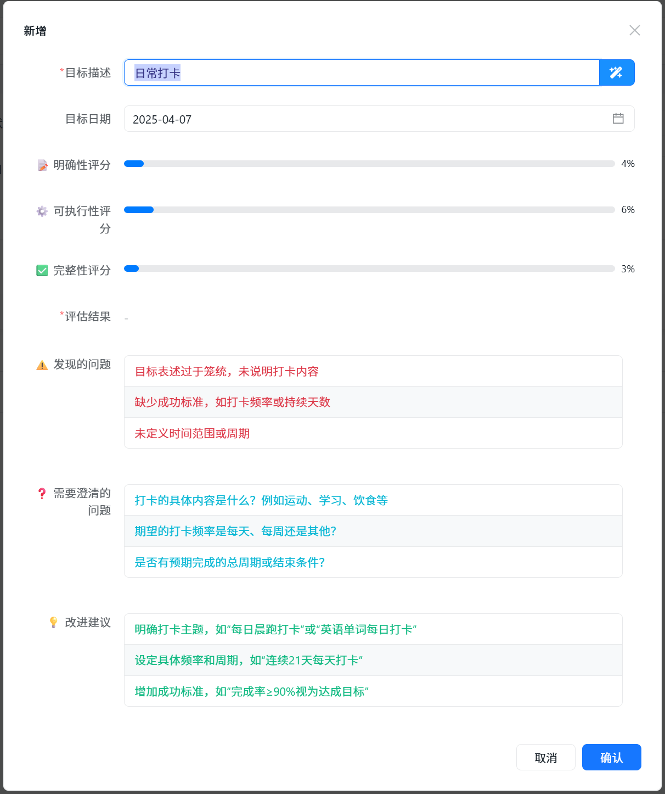

## 二、AI核心组件详解 🔧

### 2.1 CodeSpirit.LLM - 大语言模型集成层

#### 架构设计

```
┌─────────────────────────────────────────────────────────┐
│                  LLM Integration Layer                   │
├─────────────────────────────────────────────────────────┤
│                                                          │
│  ┌──────────────┐    ┌──────────────────────────────┐   │
│  │  Application │───▶│     LLMAssistant             │   │
│  │    Layer     │    │  (Unified Interface)         │   │
│  └──────────────┘    └──────────────────────────────┘   │
│                                 │                        │
│                                 ▼                        │
│                      ┌──────────────────────────────┐   │
│                      │    ILLMClientFactory         │   │
│                      │  (Factory Pattern)           │   │
│                      └──────────────────────────────┘   │
│                                 │                        │
│                 ┌───────────────┼───────────────┐        │
│                 ▼               ▼               ▼        │
│          ┌──────────┐    ┌──────────┐   ┌──────────┐    │
│          │ OpenAI   │    │ 阿里云   │   │ DeepSeek │    │
│          │ Client   │    │ Client   │   │ Client   │    │
│          └──────────┘    └──────────┘   └──────────┘    │
│                                                          │
└─────────────────────────────────────────────────────────┘
```

#### 核心特性

**统一接口设计**:
- 提供统一的LLM客户端接口,屏蔽不同AI提供商的API差异
- 支持文本生成、流式响应、结构化任务处理等核心功能

**多模型支持策略**:
1. **配置驱动** - 通过配置文件灵活切换不同的AI提供商和模型
2. **运行时切换** - 支持在运行时根据业务需要使用不同的LLM配置
3. **统一管理** - 在Aspire应用宿主中集中管理所有服务的LLM配置

**核心优势**:
- ✅ **统一抽象**: 业务代码不依赖具体的AI提供商
- ✅ **灵活切换**: 配置文件即可切换不同的LLM服务
- ✅ **性能优化**: 连接池管理、智能重试机制、超时控制
- ✅ **安全性**: API密钥安全存储、请求限流、敏感信息过滤

#### 高级功能特性 🆕

**1. 结构化任务处理**
- **模板驱动**: 支持提示词模板系统,变量替换、条件语句、循环语句
- **自动JSON解析**: 自动解析AI返回的JSON格式响应
- **智能错误处理**: 自动重试、降级策略、错误恢复
- **类型安全**: 强类型的结果映射,编译时类型检查

```csharp
// 使用模板处理结构化任务
var result = await _llmAssistant.ProcessStructuredTaskWithTemplateAsync<MyResult>(
    "my_template", 
    input,
    new StructuredTaskOptions 
    { 
        EnableRetry = true, 
        MaxRetries = 2 
    });
```

**2. 批量处理能力**
- **智能分批**: 自动将大量数据分批处理,避免超时和限流
- **并发控制**: 可配置的并发度,平衡性能和稳定性
- **容错机制**: 单批失败不影响其他批次,支持部分成功
- **进度跟踪**: 实时反馈处理进度和成功率

```csharp
// 批量处理大量数据
var batchResult = await _llmAssistant.ProcessBatchStructuredTaskAsync<MyInput, MyResult>(
    inputs,
    batch => GeneratePromptForBatch(batch),
    new BatchProcessingOptions 
    { 
        BatchSize = 10, 
        MaxRetries = 2,
        ContinueOnFailure = true
    });
```

**3. 智能JSON修复**
- **自动修复**: 自动处理AI返回的损坏JSON(截断、括号不匹配等)
- **格式清理**: 移除Markdown代码块标记,提取纯JSON内容
- **容错解析**: 从部分损坏的JSON中提取有效数据
- **修复标记**: 记录修复状态,便于质量监控

**4. 提示词模板系统**
- **变量替换**: 支持`{{variable}}`语法进行变量替换
- **条件语句**: 支持`{{#if condition}}...{{/if}}`条件渲染
- **循环语句**: 支持`{{#each items}}...{{/each}}`循环渲染
- **模板管理**: 统一的模板注册和管理机制

**5. 降级策略**
- **多级降级**: 支持多个降级策略的链式调用
- **自动切换**: 失败时自动切换到备用方案
- **降级记录**: 记录降级事件,便于分析和优化

### 2.2 CodeSpirit.AiFormFill - 革命性的AI表单填充 ⭐

#### 创新点分析

**传统AI表单填充方案的痛点**:
- ❌ 需要手动编写API端点和前端调用逻辑
- ❌ 需要手动处理提示词构建和AI响应解析
- ❌ 前后端需要大量协调工作

**CodeSpirit.AiFormFill的解决方案**:

- ✅ **零配置自动端点生成** - 业界首创!
- ✅ **自动UI增强** - 前端自动显示AI按钮
- ✅ **智能提示词构建** - 自动分析DTO结构
  - 支持子对象结构自动构建
  - 时间、日期字段自动限定  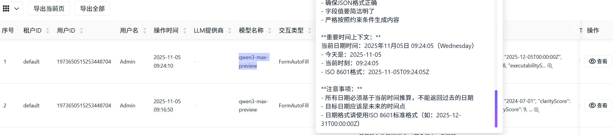

- ✅ **自动响应解析** - 类型安全的数据绑定
- ✅ **完全自动化** - 开发者只需一个特性标记

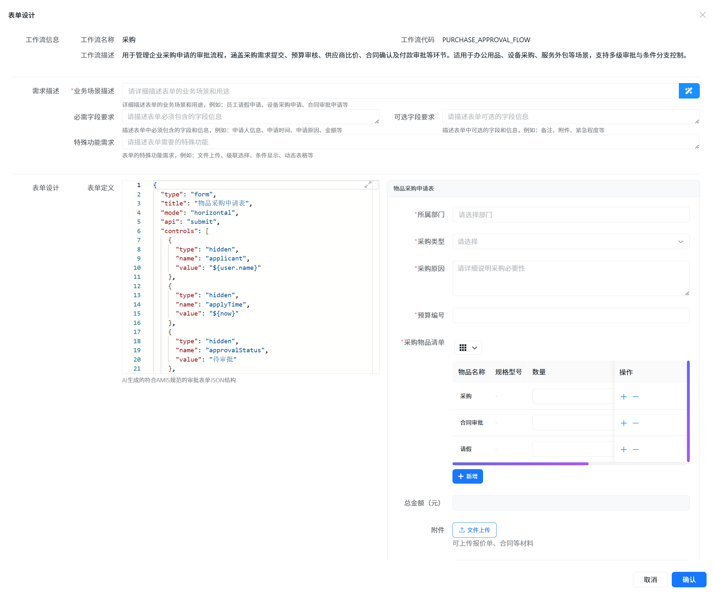

#### 核心工作原理

**1. 自动端点扫描与注册**
- 启动时扫描所有标记了 `[AiFormFill]` 特性的DTO
- 智能推断API路由 (如: `CreateQuestionDto` → `/api/exam/questions/ai-fill`)
- 自动注册端点映射,无需手动编写控制器

**2. 中间件拦截与处理**
- 拦截所有 `/ai-fill` 结尾的POST请求
- 根据路由查找对应的DTO类型
- 调用AI填充服务并返回结果

**3. 智能提示词构建**
- 自动分析DTO结构和验证规则
- 提取字段描述和约束条件
- 构建结构化的提示词模板
- 支持自定义提示词模板

**4. 自动响应解析**
- 智能提取JSON内容(支持Markdown代码块)
- 类型安全的字段映射
- 自动类型转换(枚举、日期、基础类型)
- 支持增量更新现有数据

**5. 智能缓存机制**
- 基于触发值的自动缓存
- 可配置缓存过期时间
- 提升响应速度,降低AI调用成本

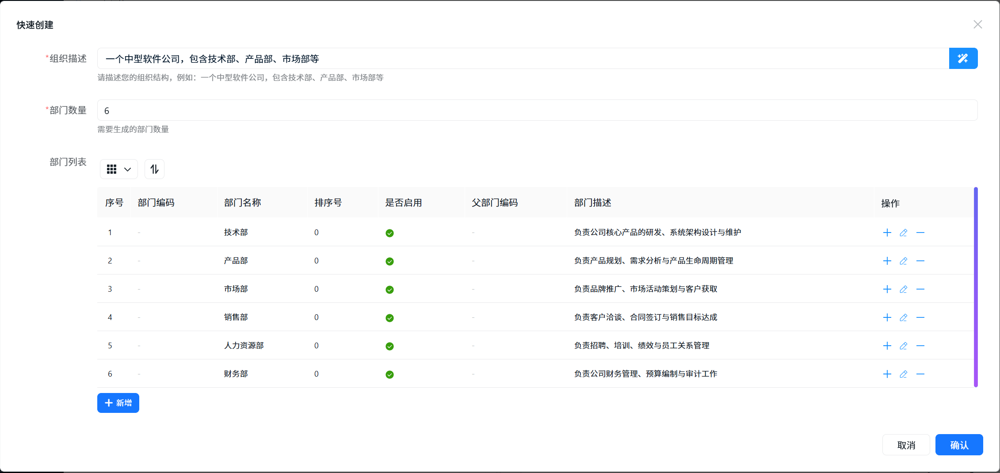

#### 应用场景实例

**场景1: 考试题目智能生成**
- 用户在"主题"字段输入关键词(如"数据库索引")
- 点击AI填充按钮,系统自动生成题目内容、选项、正确答案等
- 用户可预览、修改后提交

**场景2: 问卷智能生成**
- 支持自定义提示词模板
- 根据问卷描述自动生成标题、介绍、问题列表
- 支持使用独立的LLM配置

**场景3: 内容智能填充**
- 支持简历、文章、商品描述等多种场景
- 可配置忽略字段(如Id、时间戳)
- 支持复杂类型的智能解析

### 2.3 CodeSpirit.AiImportWizard - 革命性的AI导入向导 ⭐

#### 创新点分析

**传统题目导入方案的痛点**:
- ❌ 需要严格按照固定格式准备题目文本
- ❌ 格式错误导致导入失败,无法预览和修正
- ❌ 导入过程不透明,失败后难以定位问题

**CodeSpirit.AiImportWizard的解决方案**:
- ✅ **智能文本解析** - 自动识别多种题目格式
- ✅ **AI智能审核** - 自动检测和修正题目错误
- ✅ **可视化预览** - 导入前可预览和编辑所有题目
- ✅ **分步式向导** - 清晰的4步导入流程
- ✅ **批量智能处理** - 支持大批量题目的智能处理

#### 核心架构

**四步式导入向导流程**

```
Step 1: 文本解析 & AI审核 → 
Step 2: 预览 & 编辑 → 
Step 3: 保存编辑 → 
Step 4: 确认导入
```

**核心特性**:

1. **智能文本解析**
   - 支持Word文档格式的题目文本
   - 自动识别题目类型、选项、答案、解析等
   - 将解析结果缓存供后续步骤使用
   
   

2. **批量AI审核**
   - 自动分批处理(每批最多10道题目)
   - 容错机制:单批失败不影响其他批次
   - 智能延迟,避免频繁请求
   - 实时统计审核进度和结果
   
   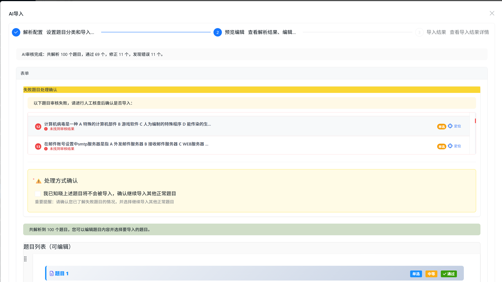
   
   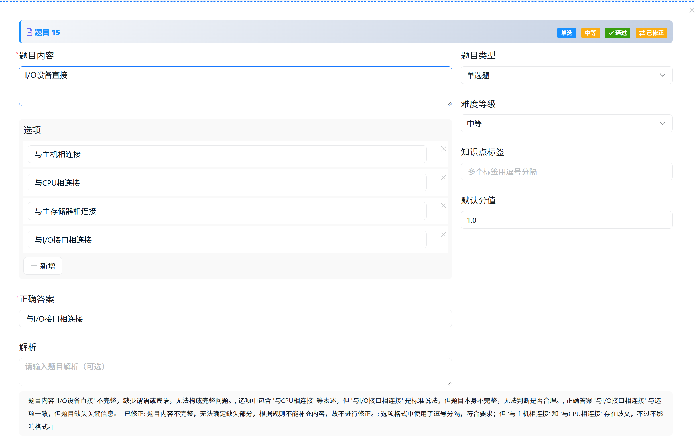
   
   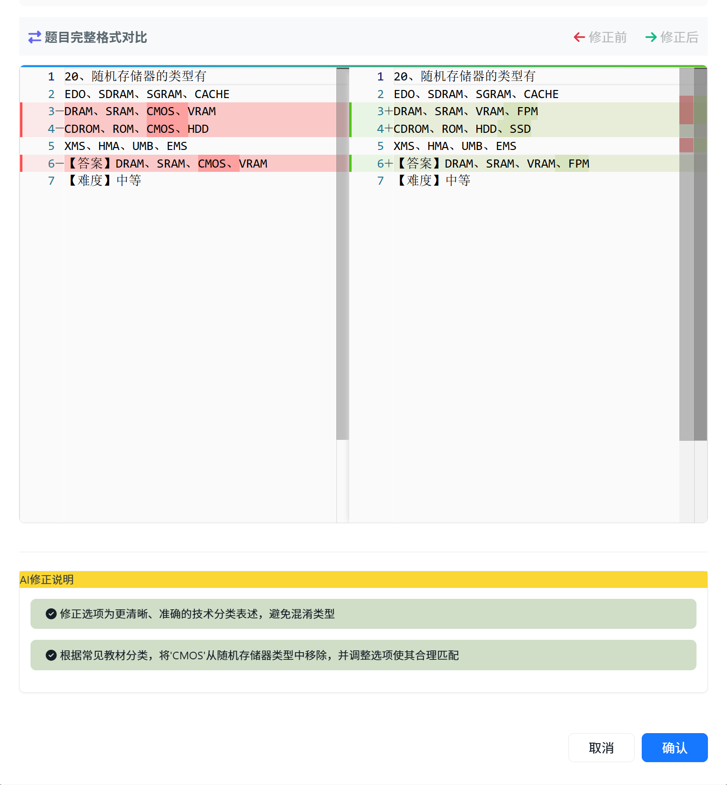

3. **智能审核标准**
   - 内容规范检查(移除序号、选项标记等)
   - 选项格式检查(移除ABCD标记)
   - 答案匹配验证
   - 错别字和标点符号检查
   - 解析合理性验证

4. **智能JSON修复**
   - 自动处理AI响应截断问题
   - 格式清理和括号平衡
   - 从损坏的JSON中提取有效部分
   - 降级处理保证系统稳定性

5. **可视化界面**
   - 分类选择器和代码编辑器
   - 审核统计卡片和题目列表
   - Diff对比查看器
   - 导入结果统计报告
   
   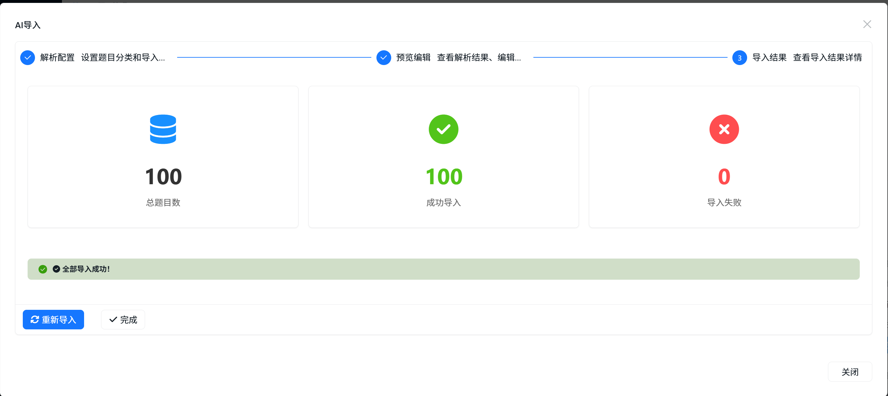

#### 应用价值

**支持多种题目格式**:
- 单选题、多选题、判断题、简答题等
- 自动识别题目类型和格式

**智能错误检测与修正**:
- 自动检测并修正格式错误
- 智能修正错别字和标点符号
- 验证答案与选项的匹配性

### 2.4 AI Form - 长时间任务处理框架

#### 应用场景
- 📝 **AI文档生成**: 需要几分钟的长文档生成
- 📊 **AI数据分析**: 复杂的数据处理和分析
- 🎨 **AI内容创作**: 批量内容生成
- 🔄 **AI批量处理**: 大规模数据的AI处理

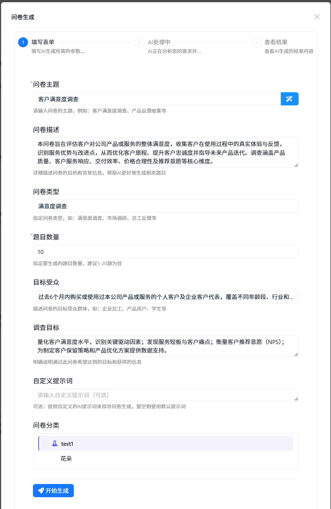

#### 核心特性

**1. 任务状态管理**
- 支持待开始、进行中、已完成、失败、已取消等状态
- 实时进度跟踪(0-100%)
- 详细的任务日志记录
- 结果详情页URL

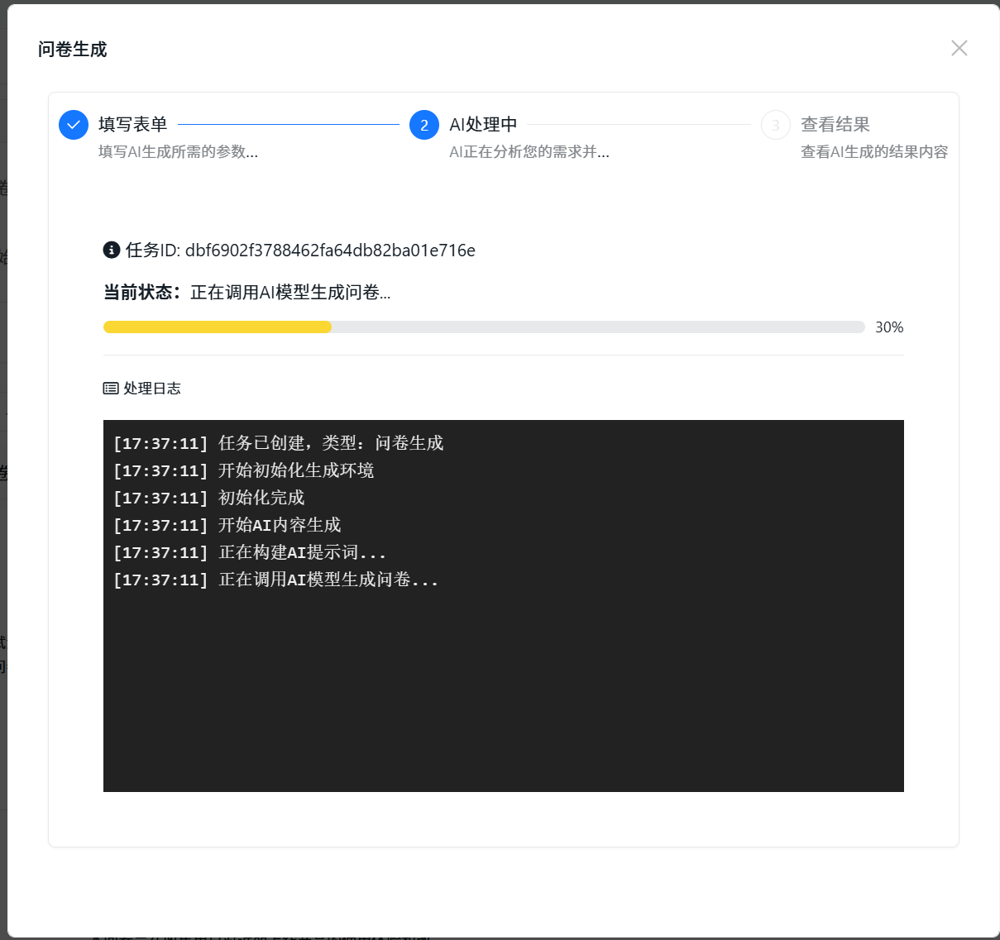

**2. 基础AI生成服务**
- 统一的异步生成任务接口
- 自动任务状态管理
- 进度回调支持
- 异常处理和降级

**3. 前端自动轮询**
- 提交任务后自动切换到进度页
- 每2秒自动查询任务状态
- 步骤进度可视化展示
- 任务完成后自动停止轮询

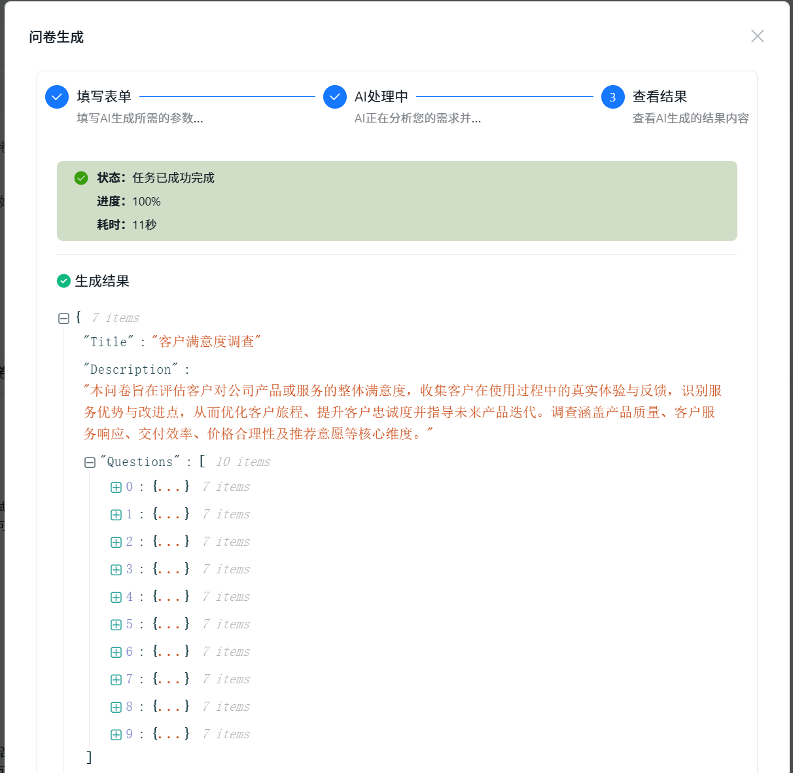

#### 核心优势
- ✅ **用户体验优秀**: 分步式向导,实时反馈
- ✅ **技术实现先进**: 分布式缓存,异步处理
- ✅ **容错能力强**: 多重错误检测,智能降级

### 2.5 CodeSpirit.LLM.Audit - LLM审计组件 ⭐

#### 设计背景

随着AI功能的广泛应用,需要对LLM的提示词、输出结果、处理过程进行全面审计,以实现:
- 🔍 **合规性追溯**: 记录AI决策过程,满足合规要求
- 📊 **质量监控**: 监控LLM输出质量和准确性
- 💰 **成本分析**: 统计Token使用和API调用成本
- ⚡ **性能优化**: 分析LLM响应时间和成功率
- 🛡️ **安全防护**: 检测异常调用和敏感信息泄露

#### 核心架构

```
┌─────────────────────────────────────────────────────────┐
│              LLM业务服务 → LLMAssistant                   │
│                      ↓ (自动记录)                         │
│              LLM审计服务 (ILLMAuditService)                │
│                      ↓                                   │
│              RabbitMQ (异步消息队列)                       │
│                      ↓                                   │
│              LLM审计消费者 (批量处理)                       │
│                      ↓                                   │
│        Elasticsearch / GreptimeDB (存储)                 │
└─────────────────────────────────────────────────────────┘
```

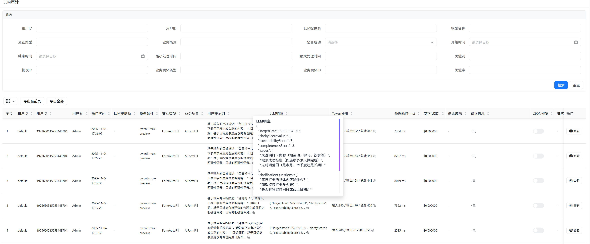

#### 核心功能

**1. 完整的审计数据模型**
- 基础信息: 租户、用户、时间戳
- LLM信息: 提供商、模型名称、交互类型、业务场景
- 内容记录: 系统提示词、用户提示词、LLM响应、处理后数据
- 性能指标: Token使用量、处理时间、成本(USD)
- 状态跟踪: 成功状态、错误信息、重试次数、JSON修复标记
- 业务关联: 批次ID、父审计ID、业务实体ID/类型、数据量

**2. 智能数据处理**
- 敏感数据自动脱敏(密码、密钥、个人信息等)
- 内容自动截断(提示词10000字符,响应50000字符)
- 自动成本计算(基于Token使用量和模型定价)
- 多租户数据隔离

**3. 异步高性能处理**
- RabbitMQ异步消息队列
- 批量写入存储(100条/批次或10秒间隔)
- 独立的消费者后台服务
- 审计记录延迟 < 100ms

**4. 多存储后端支持**
- **Elasticsearch**: 文档型存储,强大的全文搜索
- **GreptimeDB**: 时序数据库,高性能时序查询
- 统一配置管理,自动适配

**5. 丰富的查询和统计**
- 灵活的条件查询(按时间、模型、场景、用户等)
- 使用统计(总交互数、成功率、Token使用量等)
- 成本统计(按模型、场景、时间段)
- 质量统计(平均质量评分、JSON修复率)
- 使用趋势分析(按小时/天聚合)

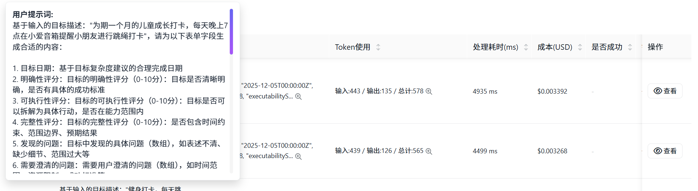

#### 集成方式

**装饰器模式自动审计**:
- 通过 `AuditableLLMAssistant` 包装 `LLMAssistant`
- 自动捕获所有LLM调用
- 无需修改业务代码
- 低侵入性设计

**业务上下文传递**:
- 支持设置业务场景、交互类型
- 支持批次关联和父子关联
- 支持业务实体关联
- 灵活的元数据扩展

#### 应用价值

**1. 合规性保障**
- 完整记录AI决策过程
- 支持审计追溯和问题定位
- 满足监管合规要求

**2. 成本控制**
- 实时监控Token使用量
- 精确计算API调用成本
- 支持按租户、场景、模型的成本分析

**3. 质量优化**
- 监控LLM输出质量
- 统计JSON修复率
- 分析常见错误模式

**4. 性能监控**
- 追踪LLM响应时间
- 分析成功率和失败原因
- 优化提示词和参数配置

### 2.6 CodeSpirit.PathfinderTools - AI驱动的智能工具系统 ⭐

#### 设计背景

在任务自动化场景中,如何从大量可用工具中选择最合适的工具是一个关键挑战。CodeSpirit.PathfinderTools 提供了基于AI的智能工具选择和推荐系统,通过多阶段筛选机制,实现高效、准确的工具匹配。

#### 核心架构

```
┌─────────────────────────────────────────────────────────┐
│              任务描述 (Task Description)                 │
│                      ↓                                   │
│          ┌──────────────────────────────┐                │
│          │   SmartToolSelector          │                │
│          │   (四阶段选择流程)            │                │
│          └──────────────────────────────┘                │
│                      ↓                                   │
│    ┌─────────────────────────────────────┐               │
│    │  阶段1: 关键词快速过滤               │               │
│    │  (几千 → 几百)                      │               │
│    └─────────────────────────────────────┘               │
│                      ↓                                   │
│    ┌─────────────────────────────────────┐               │
│    │  阶段2: 向量搜索语义匹配             │               │
│    │  (几百 → 30-50个)                   │               │
│    └─────────────────────────────────────┘               │
│                      ↓                                   │
│    ┌─────────────────────────────────────┐               │
│    │  阶段3: LLM分类选择                  │               │
│    │  (几十 → 更少)                      │               │
│    └─────────────────────────────────────┘               │
│                      ↓                                   │
│    ┌─────────────────────────────────────┐               │
│    │  阶段4: LLM精选工具                  │               │
│    │  (最终数量)                         │               │
│    └─────────────────────────────────────┘               │
│                      ↓                                   │
│              推荐工具列表 (Top-K)                         │
└─────────────────────────────────────────────────────────┘
```

#### 四阶段选择流程

**阶段1: 关键词快速过滤**
- 基于任务标题和描述提取关键词
- 匹配工具的名称、描述、标签、关键词
- 按使用频率排序,保留Top 100
- **性能**: 毫秒级响应,大幅减少候选工具数量

**阶段2: 向量搜索语义匹配**
- 使用向量索引服务进行语义相似度搜索
- 支持工具描述的向量化表示
- 相似度阈值过滤(默认0.2)
- **优势**: 理解语义,而非简单关键词匹配

**阶段3: LLM分类选择**
- 使用LLM分析任务特点
- 从工具分类中选择最相关的1-3个分类
- 按分类过滤候选工具
- **智能**: AI理解任务意图,选择合适分类

**阶段4: LLM精选工具**
- LLM分析每个候选工具与任务的匹配度
- 选择最适合的Top-K个工具
- 返回最终推荐列表
- **精准**: AI综合评估,选择最优工具

#### 核心功能

**1. 智能工具选择器 (SmartToolSelector)**
- 四阶段渐进式筛选,平衡性能和准确性
- 支持向量搜索和LLM双重智能匹配
- 容错机制:任一阶段失败不影响整体流程
- 详细日志记录,便于调试和优化

**2. 工具推荐服务 (ToolRecommendationService)**
- 当现有工具无法满足需求时,AI推荐新工具
- 分析任务特点,生成工具设计建议
- 提供参数建议和实现指导
- 支持相似工具推荐

**3. LLM工具调用 (LLMCallerTool)**
- 将LLM能力封装为标准工具
- 支持系统提示词和用户提示词
- 可配置温度、最大Token等参数
- 自动审计记录,便于追踪和分析

**4. 向量索引服务 (ToolVectorIndexingService)**
- 工具描述的向量化表示
- 高效的语义相似度搜索
- 支持增量更新和批量索引
- 可选的增强功能,不影响核心流程

#### 应用场景

**场景1: 任务自动化工具选择**
- 用户创建任务时,系统自动分析任务描述
- 智能选择最合适的自动化工具
- 支持Python脚本、Web爬虫、API调用等多种工具类型

**场景2: 工具推荐**
- 当现有工具无法完成任务时
- AI分析任务需求,推荐新工具设计
- 提供工具名称、描述、参数建议

**场景3: 批量任务处理**
- 为批量任务智能选择工具
- 支持工具组合和编排
- 优化执行顺序和资源使用

#### 技术优势

- ✅ **性能优化**: 四阶段渐进式筛选,避免全量LLM调用
- ✅ **智能匹配**: 结合关键词、向量搜索、LLM分析
- ✅ **容错设计**: 各阶段独立,单点失败不影响整体
- ✅ **可扩展性**: 支持自定义工具和选择策略
- ✅ **审计支持**: 集成LLM审计,记录选择过程

### 2.7 CodeSpirit.PartnerApi - AI伙伴系统 ⭐

#### 设计背景

CodeSpirit AI伙伴系统是一个运行在**服务端**的基于大语言模型(LLM)的智能对话交互平台,旨在为业务系统提供专业化、场景化的AI助手服务。系统参考了 `PathfinderAgent` 中 `ExamAnalyst` 的成功实现模式,提取共性,构建服务端通用AI伙伴框架。

#### 核心架构

```
┌─────────────────────────────────────────────────────────┐
│       AI伙伴平台 (CodeSpirit.PartnerApi)                  │
│           完整的AI对话平台（UI + 服务层）                  │
│  ┌────────────────────────────────────────────────────┐  │
│  │           前端UI层 (Blazor Server)                  │  │
│  │  ┌──────────────┐  ┌──────────────┐  ┌──────────┐ │  │
│  │  │ 伙伴选择页面 │  │ 通用对话页面 │  │ AMIS渲染 │ │  │
│  │  └──────────────┘  └──────────────┘  └──────────┘ │  │
│  └────────────────────────────────────────────────────┘  │
│  ┌────────────────────────────────────────────────────┐  │
│  │              核心服务层                             │  │
│  │  ┌────────────┐  ┌────────────┐  ┌─────────────┐ │  │
│  │  │伙伴管理服务│  │对话管理服务│  │消息推送服务 │ │  │
│  │  └────────────┘  └────────────┘  └─────────────┘ │  │
│  │  ┌────────────┐  ┌────────────┐  ┌─────────────┐ │  │
│  │  │提示词管理 │  │参数注入服务│  │ 事件触发器  │ │  │
│  │  └────────────┘  └────────────┘  └─────────────┘ │  │
│  └────────────────────────────────────────────────────┘  │
└───────────────────────────┬───────────────────────────────┘
                            │ HTTP API + SDK
                ┌───────────┼───────────┐
                │           │           │
    ┌───────────▼───┐ ┌─────▼──────┐ ┌─▼──────────┐
    │  ExamApi      │ │ SurveyApi  │ │ ApprovalApi│
    │  【考试系统】  │ │ 【问卷系统】│ │ 【审批系统】│
    │               │ │            │ │            │
    │  集成SDK:     │ │ 集成SDK:   │ │ 集成SDK:   │
    │  PartnerSdk  │ │ PartnerSdk │ │ PartnerSdk │
    │  ┌─────────┐ │ │ ┌────────┐ │ │ ┌────────┐ │
    │  │AI伙伴实现│ │ │ │AI伙伴..│ │ │ │AI伙伴..│ │
    │  │ExamAnalyst││ │ │Survey..│ │ │ │Approval│ │
    │  └─────────┘ │ │ └────────┘ │ │ └────────┘ │
    └───────────────┘ └────────────┘ └────────────┘
```

#### 核心特性

**1. 服务端AI对话平台**
- **Blazor Server UI**: 完整的对话界面,支持多种消息类型
- **SignalR实时推送**: WebSocket实时消息推送(< 50ms延迟)
- **AMIS渲染引擎**: 支持表格、图表、表单、仪表盘等复杂组件
- **多租户支持**: 完整的租户隔离和权限控制

**2. 统一的AI伙伴抽象**
- **伙伴注册机制**: 业务系统通过SDK注册AI伙伴
- **场景化处理**: 支持多种业务场景的智能处理
- **提示词管理**: 统一的提示词模板和参数注入
- **对话管理**: 完整的对话历史记录和上下文管理

**3. 业务系统集成**
- **PartnerSdk**: 轻量级SDK,简化集成流程
- **业务内聚**: AI伙伴实现在各自的业务系统中
- **独立演进**: 各业务系统独立部署和升级
- **标准化接口**: 统一的API和消息协议

**4. 核心AI伙伴角色**

**机考平台业务角色**:
- `exam-analyst` (考情智析官): 考试成绩分析、考生成绩分析、考卷导出及共享
- `question-creator` (命题智创官): 题目生成、题库AI导入、题目查询及分析、组卷
- `exam-supervisor` (监考智巡官): 今日考试情况分析、考试情况实时监测
- `student-service` (考生服务官): 智能客服、报名查询、成绩查询

**扩展角色**:
- `data-organizer` (数据整理专家): 从非结构化数据提取信息,整理成结构化信息
- `insight-analyst` (数据洞察分析师): 通用数据查询分析、洞察发现

#### 应用场景

**场景1: 考情智析官 (ExamAnalyst)**
- 用户询问"今天有哪些考试?"
- AI分析考试数据,生成结构化报告
- 支持图表、表格等多种可视化展示
- 支持导出和分享功能

**场景2: 命题智创官 (QuestionCreator)**
- 用户描述题目需求
- AI生成题目内容、选项、答案
- 支持批量生成和题目导入
- 智能审核和优化建议

**场景3: 监考智巡官 (ExamSupervisor)**
- 实时监测考试情况
- 异常情况自动预警
- 生成监考报告和统计
- 支持多维度数据分析

#### 技术优势

- ✅ **服务化架构**: 运行在服务端,支持多租户和权限控制
- ✅ **统一平台**: 开箱即用的完整对话平台(UI + API)
- ✅ **业务内聚**: AI伙伴实现在业务系统中,高内聚低耦合
- ✅ **实时交互**: SignalR实时推送,流畅的用户体验
- ✅ **可扩展性**: 插件化场景处理,灵活扩展新功能
- ✅ **标准化**: 统一的对话管理、消息协议和数据交互规范

## 三、AI应用场景实战 🎯

### 3.1 考试系统 - AI题目导入向导

**核心特性**:
- 一键启动导入向导
- 智能文本解析和AI审核
- 可视化预览和编辑
- 详细的统计报告

### 3.2 考试系统 - AI题目生成

**功能特点**:
- 根据主题、难度、题型自动生成试题
- 支持批量生成(1-50道)
- 实时进度反馈
- 生成结果可预览和编辑

### 3.3 问卷系统 - AI问卷生成

**生成流程**:
1. 生成问卷框架(标题、介绍、大纲)
2. 逐个生成问题(单选、多选、文本等)
3. 优化和完善问卷内容
4. 保存并返回结果

### 3.4 内容管理系统 - AI文章生成

**自动生成内容**:
- 文章摘要(100-200字)
- 文章正文(800-1500字,Markdown格式)
- 3-5个标签
- SEO关键词
- 封面图描述

### 3.5 Pathfinder - AI任务自动化评估 ⭐

**核心功能**:
- **智能评估机制**: 使用LLM分析任务描述、标题、优先级等信息,评估任务的可自动化性(0-100信心分数)
- **工具类型推荐**: 根据任务特点推荐最合适的自动化工具(PythonScript、WebScraper、ApiCaller等)
- **调度策略建议**: 建议手动触发或定时执行(Cron表达式)
- **自动化配置生成**: 为高信心分数(≥70)的任务自动生成配置建议,包括参数填充和Python代码生成

**技术实现**:
- **后台异步处理**: 评估过程在后台异步执行,不影响任务创建速度
- **队列机制**: 使用后台任务队列管理评估任务,支持批量处理
- **LLM审计集成**: 所有LLM调用自动记录审计,便于追踪和分析
- **智能JSON解析**: 自动提取和解析LLM返回的JSON格式结果

**应用价值**:
- 降低用户自动化配置门槛,无需深入了解工具细节
- AI驱动的智能推荐,提高自动化配置的准确性
- 无缝集成现有流程,后台评估不影响用户体验
- 完善的审计追踪,支持成本分析和质量优化

### 3.6 Pathfinder - AI智能工具选择

**核心功能**:
- **四阶段渐进式筛选**: 关键词过滤 → 向量搜索 → LLM分类 → LLM精选
- **智能工具匹配**: 结合关键词、向量搜索、LLM分析,实现精准匹配
- **工具推荐服务**: 当现有工具无法满足需求时,AI推荐新工具设计

**应用场景**:
- 用户创建任务时,系统自动分析任务描述
- 智能选择最合适的自动化工具
- 支持Python脚本、Web爬虫、API调用等多种工具类型
- 为批量任务智能选择工具组合

### 3.7 AI伙伴系统应用场景

**场景1: 考情智析官 (ExamAnalyst)**
- 用户询问"今天有哪些考试?"
- AI分析考试数据,生成结构化报告
- 支持图表、表格等多种可视化展示
- 支持导出和分享功能

**场景2: 命题智创官 (QuestionCreator)**
- 用户描述题目需求
- AI生成题目内容、选项、答案
- 支持批量生成和题目导入
- 智能审核和优化建议

**场景3: 监考智巡官 (ExamSupervisor)**
- 实时监测考试情况
- 异常情况自动预警
- 生成监考报告和统计
- 支持多维度数据分析

## 四、AI性能优化策略 ⚡

### 4.1 智能缓存机制

**多级缓存策略**:
- **L1缓存**: 内存缓存(5分钟),快速响应
- **L2缓存**: 分布式缓存Redis(1小时),跨实例共享
- **自动降级**: L1失效查L2,L2失效才调用AI
- **智能更新**: 自动维护缓存一致性

### 4.2 请求合并与批处理

**批处理策略**:
- 将多个小请求合并为一个大请求
- 队列满(5个)或超时(2秒)时触发处理
- 自动解析和分发响应
- 降低API调用频率和成本

### 4.3 流式响应优化

**流式处理优势**:
- 边生成边返回,提升用户体验
- 支持取消令牌,可中断长时间任务
- 缓冲区管理,优化内存使用
- 实时进度反馈

### 4.4 向量搜索优化

**向量索引策略**:
- **预计算索引**: 工具描述预先向量化,避免实时计算
- **增量更新**: 新增工具时增量更新索引,无需全量重建
- **相似度阈值**: 设置合理的相似度阈值(默认0.2),过滤低质量匹配
- **Top-K限制**: 限制返回结果数量,避免过度计算

**性能优化**:
- **批量向量化**: 批量处理工具描述,提高索引构建效率
- **缓存机制**: 缓存常用查询的向量表示和搜索结果
- **异步处理**: 向量搜索异步执行,不阻塞主流程

### 4.5 智能工具选择优化

**四阶段渐进式筛选**:
- **阶段1快速过滤**: 关键词匹配毫秒级响应,大幅减少候选数量
- **阶段2向量搜索**: 仅在候选数量>50时启用,避免不必要的计算
- **阶段3分类选择**: 使用LLM选择分类,而非逐个工具分析
- **阶段4精准选择**: 仅在候选数量>目标数量时启用LLM精选

**性能优化策略**:
- **容错设计**: 各阶段独立,单点失败不影响整体流程
- **降级机制**: 向量搜索失败时回退到关键词匹配
- **并发控制**: 限制并发LLM调用数量,避免过载
- **结果缓存**: 缓存相似任务的工具选择结果

### 4.6 批量处理优化

**批量策略**:
- **智能分批**: 根据数据量和模型限制自动分批
- **并发控制**: 可配置的并发度,平衡性能和稳定性
- **容错机制**: 单批失败不影响其他批次,支持部分成功
- **进度跟踪**: 实时反馈处理进度和成功率

**性能优化**:
- **批次大小优化**: 根据模型限制和网络延迟动态调整批次大小
- **请求合并**: 将多个小请求合并为一个大请求,降低API调用频率
- **重试策略**: 智能重试机制,指数退避延迟
- **结果聚合**: 批量处理结果高效聚合,减少内存占用

## 五、AI最佳实践 ✨

### 5.1 提示词工程

**结构化提示词模板**:
- 角色定义: 明确AI的角色和专业背景
- 任务描述: 清晰说明要完成的任务
- 输入信息: 提供必要的上下文信息
- 输出要求: 明确期望的输出格式和内容
- 约束条件: 限定生成内容的范围和规则
- 示例格式: 提供输出样例(Few-Shot Learning)

**Few-Shot Learning策略**:
- 提供2-3个高质量示例
- 示例应涵盖不同场景
- 突出关键格式和要求
- 提升AI输出的准确性和一致性

### 5.2 错误处理与降级

**重试机制**:
- 自动重试(最多3次)
- 指数退避延迟(1s, 2s, 4s)
- 记录失败原因和重试次数

**降级策略**:
- AI失败时使用预设内容
- 提示用户手动输入
- 记录降级事件用于优化

### 5.3 成本控制

**配额管理**:
- 按用户/租户设置每日Token配额
- 实时监控使用量
- 超出配额时拒绝请求

**成本优化**:
- 使用缓存减少重复调用
- 选择性使用高成本模型
- 定期分析和优化提示词长度

## 六、总结

CodeSpirit 框架在AI集成方面的创新主要体现在:

### 🌟 核心创新

1. **零配置自动化**
   - 业界首创的AI端点自动生成机制
   - 特性驱动,开发者只需一个标记
   - 自动UI增强和响应解析

2. **深度集成**
   - AI能力渗透到框架的每个层面
   - 统一的LLM抽象,支持多提供商
   - 装饰器模式的低侵入集成

3. **完整的LLM审计**
   - 记录AI决策全过程,满足合规要求
   - 实时成本监控和质量分析
   - 支持Elasticsearch和GreptimeDB双存储
   - 装饰器模式自动审计,零侵入

4. **智能导入向导**
   - 革命性的AI辅助数据导入解决方案
   - 四步式向导,可视化预览
   - 批量AI审核和智能JSON修复

5. **AI驱动的工具系统**
   - 四阶段渐进式工具选择流程
   - 结合关键词、向量搜索、LLM分析
   - 智能工具推荐和配置生成
   - 支持任务自动化评估

6. **AI伙伴系统**
   - 服务端智能对话平台
   - 场景化AI助手,专业化服务
   - 统一的对话管理和消息推送
   - 业务系统集成,高内聚低耦合

7. **高级LLM能力**
   - 结构化任务处理和批量处理
   - 智能JSON修复和提示词模板系统
   - 降级策略和错误恢复机制
   - 多层次的性能优化

8. **性能优化**
   - 多级缓存(内存+分布式)
   - 请求合并与批处理
   - 流式响应和异步处理
   - 向量搜索和智能工具选择优化

### 🎯 实用价值

1. **效率提升**: AI辅助开发,效率提升10倍+
2. **降低门槛**: 无需AI专业知识,开箱即用
3. **成本可控**: 智能缓存和配额管理,精确成本追踪
4. **质量保证**: 完善的错误处理和降级机制
5. **合规保障**: 完整的LLM审计追溯,满足监管要求
6. **数据处理智能化**: AI导入向导让数据导入变得简单可靠

### 🚀 突破性价值

**AI Form Fill**:
- 彻底解决传统表单填充的繁琐流程
- 智能提示词构建和类型安全解析
- 支持缓存和独立LLM配置

**AI Import Wizard**:
- 解决传统数据导入的格式限制问题
- AI自动审核和修正,大幅减少人工干预
- 智能JSON修复,容错能力强

**LLM Audit**:
- 首个提供完整LLM审计的企业级框架
- 实时成本监控和质量分析
- 支持合规追溯和性能优化

**PathfinderTools**:
- AI驱动的智能工具选择和推荐系统
- 四阶段渐进式筛选,平衡性能和准确性
- 支持任务自动化评估和配置生成

**AI伙伴系统**:
- 服务端智能对话平台,开箱即用
- 场景化AI助手,专业化服务
- 统一的对话管理和实时消息推送

### 🔮 技术前瞻

CodeSpirit 的AI能力还在不断演进,未来将实现:
- 更强大的自然语言编程能力
- 更智能的代码生成和审查
- 更完善的AI运维支持

---

**让AI真正成为开发者的智能助手,而不是负担!**

**CodeSpirit - AI赋能,智慧编码!** 🤖✨

