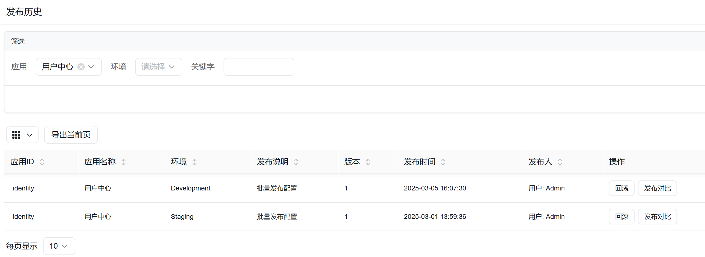

## CodeSpirit.Aggregator聚合器使用指南

聚合器是CodeSpirit框架中的一个强大功能，旨在解决API响应数据中ID字段需要转换为实际名称显示的问题。通过简洁的语法，它能满足字段替换和补充需求，无需修改后端业务逻辑即可实现数据聚合。

## 一、聚合器工作原理

聚合器作为中间件，在HTTP响应返回客户端前对JSON数据进行处理，根据预设规则自动替换或补充字段值。它支持三种基本模式：静态替换、动态替换和动态补充。

## 二、聚合器语法设计

**HTTP 头部定义：**

```plaintext
X-Aggregate-Keys: <字段规则列表>
```
- **字段规则格式**：`字段路径[=数据源][#模板]`
  - **字段路径**：支持嵌套结构（如 `items.createdBy`）
  - **数据源**（可选）：`/path/{value}.响应字段`，默认为替换模式
  - **模板**（可选）：使用 `{value}`（原值）和 `{field}`（数据源字段）占位符

#### 语法规则
1. **静态替换**  
   直接使用模板修改字段值，无需请求外部数据源：
   ```plaintext
   createdBy#User-{value}
   ```
   - **效果**：`10001` → `User-10001`

2. **动态替换**  
   通过数据源获取字段值，替换原值：
   ```plaintext
   updatedBy=/user/{value}.name
   ```
   - 请求 `/user/10002` 获取 `name` 字段值，如 `User-10002`
   - **效果**：`10002` → `User-10002`

3. **动态补充**  
   将数据源字段追加到原值后（默认分隔符为空格）：
   ```plaintext
   items.createdBy=/user/{value}.fullName#{value} ({field})
   ```
   - 若原值为 `10003`，数据源返回 `fullName: "User-10003"`
   - **效果**：`10003` → `10003 (User-10003)`

#### 示例解析

**原始数据：**
```json
{
  "id": 123,
  "title": "测试文档",
  "createdBy": "10001",
  "updatedBy": "10002",
  "items": [{"itemId": 1, "createdBy": "10003"}]
}
```

**HTTP 头部配置：**
```plaintext
X-Aggregate-Keys: createdBy#User-{value}, updatedBy=/user/{value}.name, items.createdBy=/user/{value}.fullName#{value} ({field})
```

**处理流程：**
1. **静态替换 `createdBy`**  
   直接应用模板：`User-{value}` → `User-10001`

2. **动态替换 `updatedBy`**  
   请求 `/user/10002` 返回 `{"name": "User-10002"}` → 替换为 `User-10002`

3. **动态补充 `items.createdBy`**  
   请求 `/user/10003` 返回 `{"fullName": "User-10003"}` → 应用模板 `{value} ({field})` → `10003 (User-10003)`

**最终结果：**
```json
{
  "id": 123,
  "title": "测试文档",
  "createdBy": "User-10001",
  "updatedBy": "User-10002",
  "items": [{"itemId": 1, "createdBy": "10003 (User-10003)"}]
}
```

## 三、数据处理流程

1. 解析聚合规则：中间件从HTTP响应头中获取 X-Aggregate-Keys 值
2. JSON解析：使用 Newtonsoft.Json 将响应体解析为JSON对象
3. 规则应用：对每个匹配的字段路径应用相应规则
4. 嵌套处理：自动识别和处理嵌套对象和数组
5. 重新序列化：将处理后的JSON对象转换回字符串

## 四、语法说明表

| 规则类型 | 示例语法                       | 说明                               |
| -------- | ------------------------------ | ---------------------------------- |
| 静态替换 | `字段#模板`                    | 直接使用模板替换原值               |
| 动态替换 | `字段=/path/{value}.响应字段`  | 请求数据源，提取字段值替换原值     |
| 动态补充 | `字段=/path/{value}.字段#模板` | 将数据源字段按模板格式拼接到原值后 |

## 五、使用示例

```csharp
public class UserModel
{
    public string Id { get; set; }
    
    [AggregateField(dataSource: "/api/users/{value}.name", template: "用户: {field}")]
    public string Name { get; set; }
    
    [AggregateField(template: "https://example.com/avatar/{value}")]
    public string AvatarUrl { get; set; }
}
```

呈现效果：



## 六、聚合器高级用法

- 复杂路径处理
  - 支持多级嵌套：data.items.user.createdBy
  - 支持数组遍历：自动对数组中的每个对象应用规则
- Base64编码
  - 当头部值包含非ASCII字符时，系统自动进行Base64编码
  - 聚合器能自动识别和解码Base64编码的头部值
- 空值处理
  - 如果数据源返回空值，系统默认保留原始值
  - 可在模板中通过 {field} 引用数据源返回值，即使为空也能正确处理
- 错误处理机制
  - 数据源请求失败时保留原始值
  - 详细日志记录聚合处理过程，便于调试

## 七、未来规划

- 支持跨字段处理

  ```csharp
  /// <summary>
  /// 配置发布历史DTO
  /// </summary>
  public class ConfigPublishHistoryDto
  {
      /// <summary>
      /// 应用ID
      /// </summary>
      [DisplayName("应用ID")]
      public string AppId { get; set; }
  
      ...
      
      /// <summary>
      /// 发布时间
      /// </summary>
      [DisplayName("发布时间")]
      [DisplayFormat(DataFormatString = "{0:yyyy-MM-dd HH:mm:ss}")]
      public DateTime CreatedAt { get; set; }
  
      /// <summary>
      /// 发布人（通过CreatedBy属性获取发布人信息）
      /// TODO: 应提供聚合器独立的内部接口
      /// </summary>
      [DisplayName("发布人用户Id")]
      public string CreatedBy { get; set; }
      
      [DisplayName("发布人")]
      [AggregateField(dataSource: "http://identity/api/identity/users/{CreatedBy}.data.name", template: "用户: {field}")]
      public string CreatedName { get; set; }
  }
  ```

  

- 支持聚合模型

```
/// <summary>
/// 配置发布历史DTO
/// </summary>
public class ConfigPublishHistoryDto
{
    /// <summary>
    /// 应用ID
    /// </summary>
    [DisplayName("应用ID")]
    public string AppId { get; set; }

    ...
    
    /// <summary>
    /// 发布时间
    /// </summary>
    [DisplayName("发布时间")]
    [DisplayFormat(DataFormatString = "{0:yyyy-MM-dd HH:mm:ss}")]
    public DateTime CreatedAt { get; set; }

    /// <summary>
    /// 发布人（通过CreatedBy属性获取发布人信息）
    /// TODO: 应提供聚合器独立的内部接口
    /// </summary>
    [DisplayName("发布人用户Id")]
    public string CreatedBy { get; set; }
    
    [DisplayName("发布人信息")]
    [AggregateField(dataSource: "http://identity/api/identity/users/{CreatedBy}.data")]
    public UserDto CreatedName { get; set; }
}
```

