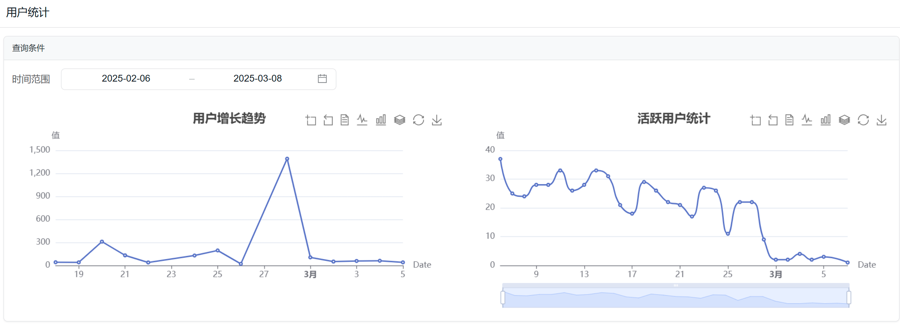

# CodeSpirit.Charts 智能图表组件使用文档

## 1. 简介

CodeSpirit.Charts 是一个简单易用的智能图表组件，基于特性驱动、声明式配置，让您的应用轻松拥有美观、智能的数据可视化功能。

## 2. 主要功能

- 支持多种图表类型（折线图、柱状图、饼图、散点图等）
- 通过特性（Attribute）轻松为API方法添加图表功能
- 自动数据分析和图表推荐
- 丰富的图表配置选项
- 支持实时数据更新和自动刷新
- 多种数据源支持（API、静态数据等）

## 3. 项目结构

```csharp
CodeSpirit.Charts/             # 智能图表组件
├── Attributes/                # 特性定义
│   ├── ChartAttribute.cs      # 基础图表特性
│   ├── ChartTypeAttribute.cs  # 图表类型特性
│   ├── ChartDataAttribute.cs  # 数据源特性
│   └── ...
├── Analysis/                  # 数据分析引擎
│   ├── DataAnalyzer.cs        # 数据分析器
│   ├── ChartRecommender.cs    # 图表推荐器
│   └── ...
├── Models/                    # 数据模型
│   ├── ChartConfig.cs         # 图表配置
│   ├── ChartDataSource.cs     # 图表数据源
│   └── ...
├── Services/                  # 服务实现
│   ├── IChartService.cs       # 图表服务接口
│   ├── ChartService.cs        # 图表服务实现
│   └── ...
├── Helpers/                   # 辅助类
│   ├── ChartHelper.cs         # 图表帮助类
│   └── ...
├── Extensions/                # 扩展方法
│   ├── ChartExtensions.cs     # 图表扩展方法
│   └── ...
├── CodeSpirit.Charts.csproj   # 项目文件
└── ChartConfigBuilder.cs      # 图表配置构建器
```

## 4. 快速上手

### 4.1 安装和配置

在项目中添加对CodeSpirit.Charts的引用：

```csharp
<ItemGroup>
    <ProjectReference Include="..\..\Components\CodeSpirit.Charts\CodeSpirit.Charts.csproj" />
</ItemGroup>
```

在Startup.cs或Program.cs中注册服务：

```csharp
// Program.cs
var builder = WebApplication.CreateBuilder(args);
// 添加图表服务
builder.Services.AddChartsService();
```

### 4.2 使用特性标记控制器方法

最简单的使用方式是通过特性标记控制器方法：

```csharp
/// <summary>
/// 获取用户增长趋势图的配置
/// </summary>
/// <param name="dateRange">日期范围</param>
/// <returns>图表配置</returns>
[HttpGet("usergrowth")]
[Display(Name = "用户增长趋势")]
[Chart("用户增长趋势", "展示用户随时间的增长趋势")]
[ChartType(ChartType.Line)]
[ChartData(dimensionField: "Date", metricFields: new[] { "UserCount" })]
public async Task<IActionResult> GetUserGrowthStatisticsAsync([FromQuery] DateTime[] dateRange)
{
    DateTimeOffset startDate = dateRange?.Length > 0 ? dateRange[0] : DateTimeOffset.Now.AddMonths(-1);
    DateTimeOffset endDate = dateRange?.Length > 1 ? dateRange[1] : DateTimeOffset.Now.AddDays(1);

    // 获取数据
    var dailyGrowth = await _userService.GetUserGrowthAsync(startDate, endDate);
    return this.AutoChartResult(dailyGrowth);
}
```



### 4.3 前端自动呈现

请遵循“Statistics”命名约定，CodeSpirit会自动渲染图表页面。

## 5. 高级使用

### 5.1 通过ChartConfigBuilder构建图表

可以使用`ChartConfigBuilder`类以编程方式构建图表：

```csharp
[HttpGet("custom-chart")]
public async Task<ActionResult> GetCustomChart()
{
    var data = await _dataService.GetData();
    
    var chartBuilder = new ChartConfigBuilder(
        _serviceProvider, 
        _memoryCache, 
        _httpContextAccessor,
        _recommender,
        _echartGenerator);
    
    var chartConfig = await chartBuilder
        .SetTitle("自定义图表")
        .SetSubtitle("数据分析")
        .BuildChartConfigForDataAsync(data, ChartType.Bar);
    
    return Ok(new { data, chartConfig });
}
```

### 5.2 图表自动推荐

组件支持自动分析数据并推荐合适的图表类型：

```csharp
[HttpGet("recommend-charts")]
public async Task<ActionResult> GetRecommendedCharts()
{
    var data = await _dataService.GetData();
    
    var chartBuilder = new ChartConfigBuilder(
        _serviceProvider, 
        _memoryCache, 
        _httpContextAccessor,
        _recommender,
        _echartGenerator);
    
    // 获取最多3种推荐的图表配置
    var recommendedCharts = await chartBuilder.GetRecommendedChartConfigsAsync(data, 3);
    
    return Ok(new { data, recommendedCharts });
}
```

### 5.3 使用图表特性配置选项

`ChartAttribute`提供了多种配置选项：

```csharp
[HttpGet("sales-trend")]
[Chart(
    Title = "销售趋势分析", 
    Description = "按月份显示销售趋势",
    AutoRefresh = true,
    RefreshInterval = 300,
    ShowToolbox = true,
    Theme = "dark",
    Height = 500,
    EnableExport = true
)]
public async Task<ActionResult> GetSalesTrend()
{
    var data = await _salesService.GetTrendData();
    return Ok(data);
}
```

### 5.4 数据映射特性

使用`ChartDataAttribute`标记模型属性，指定数据映射：

```csharp
public class SalesViewModel
{
    [ChartData(FieldType = ChartFieldType.Category, AxisType = "x")]
    public string Month { get; set; }
    
    [ChartData(FieldType = ChartFieldType.Value, SeriesName = "销售额")]
    public decimal Sales { get; set; }
    
    [ChartData(FieldType = ChartFieldType.Value, SeriesName = "利润")]
    public decimal Profit { get; set; }
}
```

## 6. 支持的图表类型

- 折线图 (Line)
- 柱状图 (Bar)
- 饼图 (Pie)
- 散点图 (Scatter)
- 雷达图 (Radar)
- 仪表盘 (Gauge)
- 热力图 (Heatmap)
- 树图 (Tree)
- 漏斗图 (Funnel)
- 地图 (Map)
- 桑基图 (Sankey)
- 关系图 (Graph)

## 7. 配置选项

### 7.1 图表基本配置

`ChartConfig`类提供了丰富的图表配置选项：

- 标题和副标题
- 图表类型和子类型
- 坐标轴配置
- 图例配置
- 系列配置
- 工具箱配置
- 交互配置
- 主题配置

### 7.2 坐标轴配置

```csharp
var config = new ChartConfig
{
    XAxis = new AxisConfig
    {
        Name = "月份",
        Type = "category",
        Data = new List<string> { "1月", "2月", "3月", "4月", "5月", "6月" }
    },
    YAxis = new AxisConfig
    {
        Name = "销售额",
        Type = "value"
    }
};
```

### 7.3 系列配置

```csharp
var config = new ChartConfig
{
    Series = new List<SeriesConfig>
    {
        new SeriesConfig
        {
            Name = "销售额",
            Type = "line",
            Data = new List<object> { 120, 132, 101, 134, 90, 230 },
            Label = new Dictionary<string, object>
            {
                { "show", true },
                { "position", "top" }
            }
        },
        new SeriesConfig
        {
            Name = "利润",
            Type = "line",
            Data = new List<object> { 220, 182, 191, 234, 290, 330 }
        }
    }
};
```

## 8、未来规划

1. **多图表联动**：支持图表之间的数据联动和交互
2. **AI驱动的数据洞察**：自动生成数据洞察和解释
3. **更多图表类型**：支持更多专业图表类型和定制化选项
4. **更好的移动适配**：优化移动端展示效果
5. **仪表盘及大屏支持**
