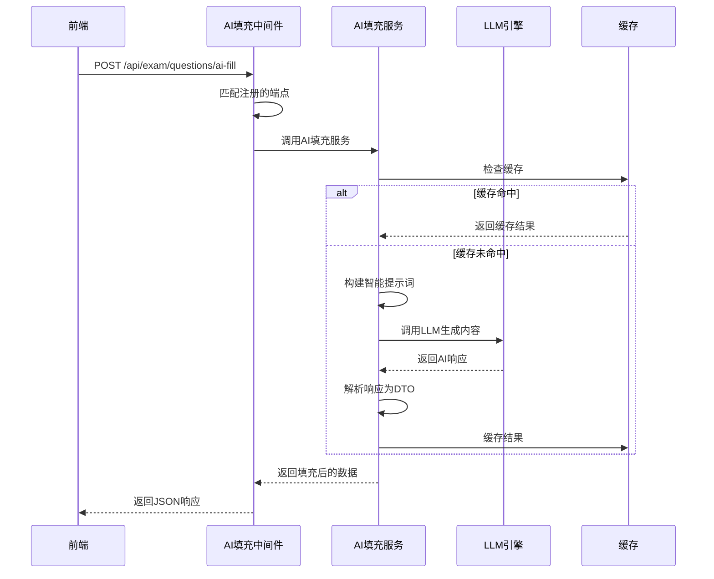
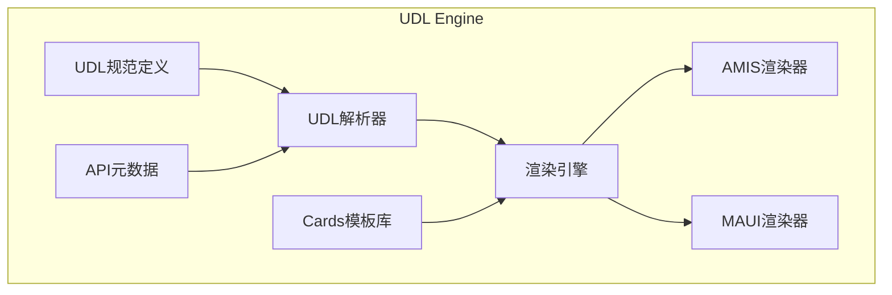
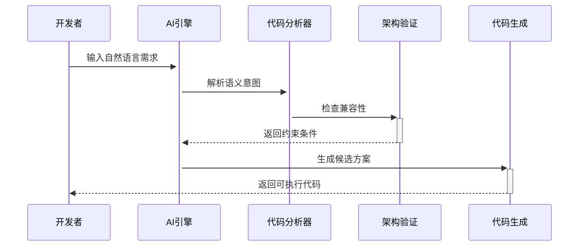

# CodeSpirit 框架核心亮点

## 概述

CodeSpirit（码灵）是一款基于 .NET 9 构建的革命性全栈低代码开发框架,通过**智能代码生成引擎与AI深度协同**,实现后端驱动式全栈开发范式。框架采用 Clean Architecture 分层设计,提供从界面生成、业务逻辑编排到系统运维的全生命周期支持。

## 核心价值主张

- 🚀 **全栈智能生成**: 通过后端模型驱动前端界面生成,消除80%重复编码工作
- 🎯 **深度可控架构**: 生成代码完全开放可控,支持从快速原型到复杂系统的平滑演进
- 🏢 **企业级工程能力**: 内置权限体系、审计追踪、分布式架构支持,开箱即用
- 🤖 **AI协同编程**: 需求描述 → 原型生成 → 代码验证 → 部署监控
- ☁️ **云原生底座**: Kubernetes原生支持,一键部署到多云环境

## 一、AI增强特性 🤖

### 1.1 CodeSpirit.LLM - 大语言模型集成组件

**统一的大语言模型集成解决方案**

#### 核心特性
- ✅ **多模型支持**: 统一接口支持 OpenAI、阿里云通义千问、DeepSeek 等多种LLM API
- ✅ **零配置使用**: 默认使用配置文件,无需编写设置提供者
- ✅ **流式响应**: 支持流式响应处理,提升用户体验
- ✅ **代理支持**: 内置HTTP代理配置支持
- ✅ **统一配置管理**: 在 Aspire 主机中统一配置所有服务的LLM参数
- ✅ **灵活切换**: 支持全局LLM和独立LLM配置,满足不同场景需求

#### 技术架构
- **统一接口设计**: `ILLMClient` 提供同步和流式响应接口
- **工厂模式**: `ILLMClientFactory` 创建不同提供商的客户端
- **配置驱动**: 支持全局和独立LLM配置

#### 应用场景
- 🎯 **智能题目生成**: 考试系统中基于主题、难度自动生成试题
- 📝 **表单智能填充**: 根据关键字自动填充表单其他字段
- 💬 **智能客服**: 集成AI助手提供智能问答
- 📊 **数据分析**: AI驱动的数据洞察和报告生成

### 1.2 CodeSpirit.AiFormFill - AI表单智能填充组件 ⭐

**革命性的零配置AI表单填充解决方案**

#### 创新亮点
- 🚀 **零配置端点生成**: 基于DTO自动生成AI填充的API端点,**无需手动编写控制器代码**
- 🎯 **自动化程度极高**: 
  - 自动端点扫描和注册
  - 智能路由推断
  - 自动提示词构建
  - 自动验证规则读取
  - 自动UI增强
- 🔄 **双模式支持**: 支持全局AI填充模式和字段触发模式
- 🎨 **特性驱动**: 通过简单的 `[AiFormFill]` 特性标记即可启用
- 📦 **独立组件**: 可作为NuGet包独立发布,仅依赖 Core 和 LLM

#### 零配置自动端点生成

```csharp
// 1. 在DTO上添加特性即可,无需编写任何控制器代码!
[AiFormFill(
    TriggerField = "Topic",
    MaxTokens = 1000,
    EnableCache = true
)]
public class CreateQuestionDto
{
    [DisplayName("主题")]
    public string Topic { get; set; }
    
    [DisplayName("题目内容")]
    [Required]
    public string Content { get; set; }
    
    [DisplayName("选项A")]
    public string OptionA { get; set; }
    
    // 系统自动完成:
    // ✅ 生成 POST /api/exam/questions/ai-fill 端点
    // ✅ 路由自动推断
    // ✅ 中间件拦截处理
    // ✅ 前端UI自动增强(在Topic字段显示AI填充按钮)
}
```

#### 智能提示词构建

系统自动分析DTO结构,生成结构化提示词:
- 自动提取字段名称、显示名、数据类型
- 自动读取验证规则(必填、长度、枚举等)
- 智能构建结构化JSON格式提示词

#### 中间件自动处理流程



#### 核心优势

1. **开发效率提升10倍+**
   - 传统方式: 编写控制器 → 实现服务 → 前端调用 → 集成UI
   - AI表单填充: 一个特性标记即可完成所有工作

2. **智能化程度极高**
   - 自动字段分析和验证规则提取
   - 智能提示词生成
   - 自动响应解析和类型转换
   - 自动缓存管理

3. **用户体验优秀**
   - 前端自动显示AI填充按钮和图标
   - 一键触发智能填充
   - 支持增量填充(保留已填写内容)

### 1.3 AI表单(AiForm) - 长时间任务处理

**专为AI驱动的长时间处理任务设计的多步骤用户界面**

#### 核心特性
- 📊 **自动化UI生成**: 基于 `OperationAttribute` 自动生成完整的AI表单界面
- 🔄 **实时轮询**: 自动轮询AI任务状态,实时更新进度和日志
- ⏱️ **超时控制**: 支持自定义轮询间隔和最大轮询时间
- 🚀 **异步处理**: 避免长时间AI响应导致的请求超时
- 📝 **完整反馈**: 多步骤界面展示(表单面板、步骤进度、日志面板、结果展示)

#### 使用示例

```csharp
[HttpPost("ai/generate-async")]
[HeaderOperation("AI智能生成问卷", "aiForm", 
    Icon = "fa-solid fa-magic",
    StatusApi = "/survey/api/survey/Surveys/ai/task-status",
    PollingInterval = 2000,
    MaxPollingTime = 300000,
    FormTitle = "问卷生成配置",
    StepsTitle = "AI生成进度",
    LogTitle = "生成日志",
    ResultTitle = "生成结果")]
[DisplayName("AI智能生成问卷")]
public async Task<ActionResult<ApiResponse<string>>> GenerateSurveyAsync(
    [FromBody] GenerateSurveyRequest request)
{
    var taskId = await _surveyAiGeneratorService.GenerateAsync(request);
    return SuccessResponse(taskId);
}
```

#### 界面效果
1. **表单面板**: 显示输入表单和"开始生成"按钮
2. **步骤面板**: 显示4步进度条(初始化 → AI处理 → 结果处理 → 完成)
3. **日志面板**: 实时显示任务执行日志
4. **结果面板**: 显示任务状态、进度、耗时和最终结果

### 1.4 AI题目生成服务

**考试系统中的智能题目生成解决方案**

#### 功能特性
- 🎯 **智能生成**: 根据主题、题型、难度、数量等参数智能生成试题
- 📊 **实时反馈**: 通过回调函数实时报告生成进度
- 🔄 **批量处理**: 支持批量生成多道题目
- 🎨 **灵活配置**: 支持自定义提示词模板

#### 实现方式

- 构建智能提示词,指定题型、难度、数量等参数
- 调用LLM生成接口批量生成题目
- 解析响应并转换为题目DTO
- 支持实时进度回调和通知

## 二、智能界面生成引擎 🎨

### 2.1 AMIS智能界面生成引擎

**基于反射的零前端代码CRUD界面生成**

#### 核心优势
- 🚀 **零前端代码**: 后端定义DTO即可自动生成完整的前端界面
- 🎯 **特性驱动**: 通过C#特性配置所有UI行为
- 📊 **功能完整**: CRUD、筛选、排序、分页、导入导出全支持
- 🔧 **高度可定制**: 支持20+字段类型,50+列特性

#### 自动生成内容
1. **列表页面**
   - 自动表格列配置
   - 智能筛选表单
   - 批量操作按钮
   - 导入导出功能

2. **表单页面**
   - 自动字段类型推断
   - 验证规则自动生成
   - 字段分组和布局
   - 关联数据加载

3. **操作按钮**
   - 增删改查按钮
   - 自定义操作按钮
   - 权限控制
   - 确认对话框

#### 使用示例

```csharp
// 后端DTO定义
public class UserDto
{
    [IgnoreColumn]
    public long Id { get; set; }

    [Display(Name = "用户名")]
    [Required(ErrorMessage = "用户名不能为空")]
    public string Username { get; set; }

    [Display(Name = "邮箱")]
    [DataType(DataType.EmailAddress)]
    public string Email { get; set; }

    [Display(Name = "头像")]
    [AvatarColumn]
    public string Avatar { get; set; }

    [Display(Name = "状态")]
    public UserStatus Status { get; set; }

    [Display(Name = "创建时间")]
    [DateColumn]
    public DateTime CreatedAt { get; set; }
}

// 前端自动生成完整的用户管理界面!
```

### 2.2 CodeSpirit.Charts - 智能图表组件

**特性驱动的智能数据可视化解决方案**

#### 核心特性
- 📊 **自动图表推荐**: 基于数据特征智能推荐合适的图表类型
- 🎯 **特性驱动配置**: 通过特性轻松为API方法添加图表功能
- 🎨 **多图表支持**: 折线图、柱状图、饼图、散点图、仪表盘、雷达图等
- 🔧 **智能数据处理**: 自动数据验证、转换和错误处理
- 🌈 **空数据友好**: 优雅处理空数据和异常情况

#### 使用示例

```csharp
/// <summary>
/// 获取用户增长趋势图
/// </summary>
[HttpGet("usergrowth")]
[Display(Name = "用户增长趋势")]
[Chart("用户增长趋势", "展示用户随时间的增长趋势")]
[ChartType(ChartType.Line)]
[ChartData(dimensionField: "Date", metricFields: new[] { "UserCount" })]
public async Task<IActionResult> GetUserGrowthStatisticsAsync(
    [FromQuery] DateTime[] dateRange)
{
    var dailyGrowth = await _userService.GetUserGrowthAsync(startDate, endDate);
    return this.AutoChartResult(dailyGrowth);  // 自动生成图表配置!
}
```

#### 智能推荐机制

系统会自动分析数据特征并推荐最合适的图表类型:
- 分析数据维度(时间序列、分类、数值等)
- 计算数据分布特征
- 基于规则引擎评分推荐
- 返回排序的推荐结果和理由

### 2.3 UDL (UI描述语言) 引擎 🆕

**统一的跨平台UI描述语言**

#### 核心理念
> **一次定义,处处使用** - 实现真正的跨平台UI一致性开发

#### 核心特性
- 📝 **统一描述规范**: 标准化的UI描述格式
- 🎨 **多平台渲染**: 自动适配Web(AMIS)、移动端(MAUI)、大屏等
- 🃏 **Cards组件库**: 预定义卡片模板库,快速构建界面
- 🤖 **智能元数据生成**: 基于API Controller自动生成UI配置

#### UDL Cards 预定义模板

1. **考生信息卡片** (student-profile-card)
   - 展示基本信息
   - 支持头像、字段图标
   - 响应式布局

2. **统计卡片** (stat-card)
   - 数据统计展示
   - 进度条、百分比
   - 状态标识

3. **操作卡片** (action-card)
   - 交互操作面板
   - 多层级操作
   - 权限控制

4. **答题卡** (answer-card)
   - 考试场景专用
   - 答题状态可视化
   - 实时更新

#### 架构设计



#### 应用场景
- 📺 **监考大屏**: 实时统计、状态监控、异常预警
- 💻 **考试客户端**: 学生信息展示、答题进度跟踪
- 🖥️ **管理后台**: 数据面板、操作界面自动生成

### 2.4 增强批量导入系统

**企业级批量数据导入解决方案**

#### 核心特性
- 📋 **智能Excel模板生成**: 基于DTO自动生成带验证规则的Excel模板
- ✅ **数据验证与错误追踪**: DataAnnotations验证 + 自定义业务验证
- 🔄 **分布式缓存支持**: Redis/SQL Server Cache,支持大规模并发导入
- 📊 **失败记录管理**: 详细记录失败原因,支持失败数据导出和修正
- 🎨 **前端自动集成**: 通过特性自动生成完整导入界面

#### 技术架构

- **导入模板服务**: 基于DTO自动生成带验证规则的Excel模板
- **批量导入助手**: 处理导入逻辑、数据验证和错误追踪
- **前端特性驱动**: 通过特性自动生成完整导入界面
- **分布式缓存支持**: 导入结果跨实例共享

#### 核心优势
1. **组合模式解决多重继承**: 灵活扩展,任何服务都可获得增强导入功能
2. **分布式友好**: 支持多实例部署,导入结果跨实例共享
3. **高度可定制**: 自定义验证器架构,灵活的导入处理逻辑
4. **性能优化**: 流式处理,避免内存溢出

## 三、企业级后端架构 🏢

### 3.1 Clean Architecture + DDD

**清晰的架构分层设计**

#### 架构层次
- **表示层**: API Controllers, Web Frontend
- **应用层**: Application Services, DTOs, Event Handlers
- **领域层**: Core, Entities, Domain Services
- **基础设施层**: Shared, ServiceDefaults, Data Access
- **横切关注点**: Authorization, Audit, Navigation, Charts等

#### 核心设计原则
1. **依赖倒置原则 (DIP)**: 领域层定义接口,基础设施层实现
2. **单一职责原则 (SRP)**: 每个组件职责明确
3. **开闭原则 (OCP)**: 通过接口和抽象支持扩展

### 3.2 权限系统 (RBAC + ABAC)

**混合权限模型提供细粒度控制**

#### 核心特性
- 🔐 **RBAC**: 基于角色的访问控制
- 🎯 **ABAC**: 基于属性的访问控制
- 🌳 **权限树管理**: 动态权限节点加载
- 🔒 **细粒度控制**: 支持数据范围、部门等属性权限

#### 使用示例

通过特性标记即可实现权限控制:
- `[Authorize]` - 需要身份认证
- `[RequirePermission("User.Create")]` - 需要特定权限
- 支持角色、部门、数据范围等多维度权限控制

### 3.3 多租户支持

**完善的多租户数据隔离和资源管理**

#### 核心特性
- 🏢 **数据隔离**: 基于TenantId的自动数据过滤
- ⚙️ **配置隔离**: 租户特定的配置管理
- 🔧 **资源隔离**: 租户级别的资源限制
- 🌐 **租户解析**: 支持域名、子域名和路径解析

#### 实现机制

- **自动租户过滤器**: EF Core全局查询过滤器自动应用租户ID过滤
- **租户解析器**: 支持多种租户识别策略(域名、路径、Header等)
- **租户上下文**: 请求生命周期内自动维护租户上下文

### 3.4 审计追踪系统

**全链路操作追踪和数据变更记录**

#### 核心特性
- 📝 **全链路追踪**: 记录操作人、时间、IP地址及数据变更详情
- 🔍 **实体基类**: `AuditableEntityBase<TKey>` 自动记录创建/修改信息
- 📊 **可视化分析**: 审计日志统计和分析
- 🔐 **安全合规**: 满足企业安全合规要求

### 3.5 CodeSpirit.Aggregator - 数据聚合器

**高级数据聚合和字段替换能力**

#### 核心特性
- 🔗 **字段动态替换**: 通过数据源动态替换字段值
- 📊 **数据源关联**: 支持HTTP API数据源
- 🎨 **模板化展示**: 灵活的模板语法

#### 语法规则

- **静态替换**: `fieldName#prefix-{value}` - 添加前缀或后缀
- **动态替换**: `fieldName=/api/{value}.propertyPath` - 从API获取数据替换
- **动态补充**: `fieldName=/api/{value}.name#{value} ({field})` - 保留原值并补充信息

#### 使用方式

通过 `[AggregateField]` 特性标记字段,指定数据源和模板,系统自动处理数据聚合和字段替换

### 3.6 多数据库支持 🗄️

**灵活的多数据库架构设计**

#### 核心特性
- 🔄 **双数据库支持**: 同时支持 MySQL 和 SQL Server
- 🎯 **配置驱动切换**: 通过配置文件一键切换数据库类型
- 📦 **独立迁移管理**: 为每种数据库维护独立的迁移文件
- 🚀 **自动迁移应用**: 应用启动时自动检测并应用待处理迁移
- 🏗️ **统一业务逻辑**: 业务代码与数据库类型解耦

#### 架构设计

**DbContext三层架构**

```
BaseDbContext (基础上下文，包含业务逻辑和实体配置)
├── MySqlDbContext (MySQL特定配置和优化)
└── SqlServerDbContext (SQL Server特定配置和优化)
```

**示例：考试系统**
```
ExamDbContext (业务逻辑)
├── MySqlExamDbContext (MySQL特定)
│   └── Migrations/MySql/ (MySQL迁移文件)
└── SqlServerExamDbContext (SQL Server特定)
    └── Migrations/SqlServer/ (SQL Server迁移文件)
```

#### 数据库切换机制

**1. 配置文件切换**

在 `appsettings.json` 或环境变量中配置:

```json
{
  "DatabaseType": "MySql",  // 或 "SqlServer"
  "ConnectionStrings": {
    "exam-api": "Server=localhost;Port=3306;Database=exam-api;..."
  }
}
```

**2. Aspire统一管理**

在 `CodeSpirit.AppHost` 中统一配置数据库资源:

```csharp
// 从配置读取数据库类型
var databaseType = builder.Configuration["DatabaseType"] ?? "MySql";

if (databaseType.Equals("MySql", StringComparison.OrdinalIgnoreCase))
{
    // 配置MySQL容器
    var mysql = builder.AddMySql("mysql", password: mysqlPassword, port: 3306)
                       .WithPhpMyAdmin()
                       .WithLifetime(ContainerLifetime.Persistent)
                       .WithDataVolume();
    
    // 创建各个数据库
    var examDb = mysql.AddDatabase("exam-api");
    var identityDb = mysql.AddDatabase("identity-api");
}
else if (databaseType.Equals("SqlServer", StringComparison.OrdinalIgnoreCase))
{
    // 配置SQL Server容器
    var sqlServer = builder.AddSqlServer("sqlserver", password: sqlServerPassword)
                           .WithLifetime(ContainerLifetime.Persistent)
                           .WithDataVolume();
    
    // 创建各个数据库
    var examDb = sqlServer.AddDatabase("exam-api");
    var identityDb = sqlServer.AddDatabase("identity-api");
}
```

**3. 运行时自动选择**

应用启动时自动检测并配置对应的DbContext:

```csharp
public class ExamApiConfiguration : BaseApiConfiguration
{
    protected override void ConfigureDatabase(
        IServiceCollection services, 
        IConfiguration configuration)
    {
        var databaseType = configuration["DatabaseType"] ?? "MySql";
        var connectionString = configuration.GetConnectionString("exam-api");
        
        if (databaseType.Equals("MySql", StringComparison.OrdinalIgnoreCase))
        {
            // 注册MySQL DbContext
            services.AddDbContext<MySqlExamDbContext>(options =>
                options.UseMySql(connectionString, ServerVersion.AutoDetect(connectionString)));
            
            services.AddDbContext<ExamDbContext>(options =>
                options.UseMySql(connectionString, ServerVersion.AutoDetect(connectionString)));
        }
        else if (databaseType.Equals("SqlServer", StringComparison.OrdinalIgnoreCase))
        {
            // 注册SQL Server DbContext
            services.AddDbContext<SqlServerExamDbContext>(options =>
                options.UseSqlServer(connectionString));
            
            services.AddDbContext<ExamDbContext>(options =>
                options.UseSqlServer(connectionString));
        }
    }
}
```

#### 迁移管理工具

**统一的迁移管理脚本**

```powershell
# 为MySQL添加迁移
.\Scripts\manage-multi-database-migrations.ps1 `
    -ApiProject ExamApi `
    -DatabaseType MySql `
    -Action Add `
    -MigrationName "AddQuestionBank"

# 为SQL Server添加迁移
.\Scripts\manage-multi-database-migrations.ps1 `
    -ApiProject ExamApi `
    -DatabaseType SqlServer `
    -Action Add `
    -MigrationName "AddQuestionBank"

# 查看迁移历史
.\Scripts\manage-multi-database-migrations.ps1 `
    -ApiProject ExamApi `
    -DatabaseType MySql `
    -Action List

# 应用迁移
.\Scripts\manage-multi-database-migrations.ps1 `
    -ApiProject ExamApi `
    -DatabaseType MySql `
    -Action Update
```

#### 数据库特定优化

**MySQL优化配置**
```csharp
public class MySqlExamDbContext : ExamDbContext
{
    protected override void OnModelCreating(ModelBuilder modelBuilder)
    {
        base.OnModelCreating(modelBuilder);
        
        // MySQL特定优化
        foreach (var entity in modelBuilder.Model.GetEntityTypes())
        {
            // 字符串长度优化（MySQL索引长度限制）
            foreach (var property in entity.GetProperties())
            {
                if (property.ClrType == typeof(string) && property.GetMaxLength() == null)
                {
                    property.SetMaxLength(255);  // MySQL索引默认长度
                }
            }
            
            // 时间戳默认值
            modelBuilder.Entity(entity.ClrType)
                .Property<DateTime>("CreatedAt")
                .HasDefaultValueSql("CURRENT_TIMESTAMP");
        }
    }
}
```

**SQL Server优化配置**
```csharp
public class SqlServerExamDbContext : ExamDbContext
{
    protected override void OnModelCreating(ModelBuilder modelBuilder)
    {
        base.OnModelCreating(modelBuilder);
        
        // SQL Server特定优化
        foreach (var entity in modelBuilder.Model.GetEntityTypes())
        {
            // 支持更大的字符串长度
            foreach (var property in entity.GetProperties())
            {
                if (property.ClrType == typeof(string) && property.GetMaxLength() == null)
                {
                    property.SetMaxLength(4000);  // SQL Server nvarchar(max)
                }
            }
            
            // 时间戳默认值
            modelBuilder.Entity(entity.ClrType)
                .Property<DateTime>("CreatedAt")
                .HasDefaultValueSql("GETUTCDATE()");
        }
    }
}
```

#### 自动迁移机制

**应用启动时的自动处理流程**

```csharp
public override async Task InitializeDatabaseAsync(WebApplication app)
{
    using var scope = app.Services.CreateScope();
    var services = scope.ServiceProvider;
    var configuration = services.GetRequiredService<IConfiguration>();
    var logger = services.GetRequiredService<ILogger<ExamApiConfiguration>>();
    
    try
    {
        // 1. 应用数据库迁移（自动检测数据库类型）
        await DatabaseMigrationHelper.ApplyDatabaseMigrationsAsync<
            MySqlExamDbContext, 
            SqlServerExamDbContext>(
                services, 
                configuration, 
                logger, 
                "ExamApi");
        
        // 2. 初始化种子数据
        var context = services.GetRequiredService<ExamDbContext>();
        await context.InitializeDatabaseAsync();
        
        logger.LogInformation("数据库初始化完成");
    }
    catch (Exception ex)
    {
        logger.LogError(ex, "数据库初始化失败: {Message}", ex.Message);
        throw;
    }
}
```

#### 支持的项目

**API服务项目**
- ✅ IdentityApi - 身份认证系统
- ✅ ExamApi - 考试系统
- ✅ ConfigCenter - 配置中心
- ✅ FileStorageApi - 文件存储系统
- ✅ SurveyApi - 问卷系统
- ✅ MessagingApi - 消息系统
- ✅ ApprovalApi - 审批系统

**组件项目**
- ✅ Settings - 设置管理组件
- ✅ Messaging - 消息组件

#### 核心优势

1. **开发灵活性**
   - 开发环境可使用MySQL容器，快速启动
   - 生产环境可使用SQL Server，企业级支持

2. **部署适应性**
   - 云环境: 使用MySQL降低成本
   - 企业环境: 使用SQL Server符合IT标准

3. **数据迁移便利**
   - 独立的迁移文件，互不干扰
   - 自动化迁移工具，简化操作
   - 统一的迁移历史管理

4. **性能优化**
   - 针对不同数据库的特定优化
   - 合理的字段类型和长度配置
   - 索引策略针对性设计

5. **维护简便**
   - 业务逻辑与数据库解耦
   - 统一的开发体验
   - 清晰的代码组织结构

#### 最佳实践

1. **开发阶段**
   - 同时为MySQL和SQL Server创建迁移
   - 使用描述性的迁移名称
   - 频繁创建小的增量迁移

2. **测试阶段**
   - 在两种数据库上都进行测试
   - 验证数据类型兼容性
   - 测试性能差异

3. **部署阶段**
   - 备份生产数据库
   - 先部署迁移，再部署代码
   - 准备回滚方案

4. **监控维护**
   - 监控迁移执行日志
   - 定期清理过时迁移
   - 性能调优和索引优化

### 3.7 统一启动框架 🚀

**极简化的API项目创建和标准化配置**

#### 核心特性
- 🎯 **极简启动代码**: Program.cs仅需2-3行代码即可完成配置
- 📦 **自动服务注册**: 基于Scrutor自动扫描和注册服务
- 🔧 **标准化配置**: 所有API项目使用统一的启动模式
- 🔌 **中间件插入点**: 提供3个精确的扩展位置
- 🏗️ **配置分离**: 将复杂配置抽象为配置类
- 🔄 **自动数据库迁移**: 启动时自动应用数据库迁移

#### 架构设计

**配置接口层次**

```csharp
IApiServiceConfiguration (配置接口)
    ↓
BaseApiConfiguration (基础抽象类)
    ↓
ExamApiConfiguration / IdentityApiConfiguration / ... (具体API配置)
```

**中间件插入点机制**

```
请求流程:
    ↓
[PreAuthenticationMiddleware]  ← 插入点1: 认证前中间件(如租户解析)
    ↓
Authentication & Authorization
    ↓
[PreControllerMiddleware]      ← 插入点2: 控制器前中间件(如审计日志)
    ↓
Controller Mapping
    ↓
[PostControllerMiddleware]     ← 插入点3: 自定义中间件
    ↓
响应返回
```

#### 使用示例

**1. 极简的Program.cs**

```csharp
// 整个API的启动代码仅需几行!
using CodeSpirit.ExamApi.Configuration;
using CodeSpirit.Shared.Startup;

var builder = WebApplication.CreateBuilder(args);

// 添加CodeSpirit API服务 - 一行完成所有基础配置
builder.AddCodeSpiritApi<ExamApiConfiguration>();

var app = builder.Build();

// 应用CodeSpirit API配置 - 一行完成所有中间件配置
await app.UseCodeSpiritApiAsync<ExamApiConfiguration>();

app.Run();
```

**2. API配置类**

创建配置类继承 `BaseApiConfiguration`,重写关键方法:
- `ServiceName`: 指定服务名称
- `ConfigureServices`: 配置数据库和业务服务
- `ConfigurePreAuthenticationMiddleware`: 添加认证前中间件(如多租户)
- `ConfigurePreControllerMiddleware`: 添加控制器前中间件(如审计)
- `InitializeDatabaseAsync`: 自动应用迁移和初始化种子数据

#### 自动化内容

**统一启动框架自动完成的配置**

1. **服务注册**
   - ✅ Aspire服务默认配置
   - ✅ Scrutor自动依赖注入
   - ✅ 系统服务(缓存、日志、审计等)
   - ✅ 通用API服务(CORS、Swagger、身份验证等)

2. **中间件配置**
   - ✅ 异常处理中间件
   - ✅ CORS跨域中间件
   - ✅ 身份验证和授权
   - ✅ Swagger文档
   - ✅ 健康检查

3. **数据库管理**
   - ✅ 自动检测数据库类型
   - ✅ 自动应用迁移
   - ✅ 自动初始化种子数据

#### 核心优势

1. **开发效率提升**
   - 新建API项目只需创建配置类
   - 无需关心通用配置细节
   - 标准化降低学习成本

2. **代码一致性**
   - 所有API使用相同模式
   - 易于维护和理解
   - 团队协作更高效

3. **灵活扩展性**
   - 3个精确的中间件插入点
   - 可按需重写任何配置方法
   - 不破坏统一性的前提下自定义

4. **自动化管理**
   - 自动服务注册
   - 自动数据库迁移
   - 自动健康检查

### 3.8 自动依赖注入 (Scrutor) 🔍

**零配置的批量服务注册**

#### 核心特性
- 🔍 **自动扫描**: 程序集自动扫描标记接口
- 🏷️ **标记接口**: 通过接口标记服务生命周期
- 📦 **批量注册**: 一次性注册所有服务
- 🎯 **约定优于配置**: 遵循命名约定自动匹配

#### 标记接口

```csharp
// 定义在 CodeSpirit.Core 中
public interface IScopedDependency { }      // Scoped生命周期
public interface ITransientDependency { }   // Transient生命周期
public interface ISingletonDependency { }   // Singleton生命周期
```

#### 使用示例

**使用方式**

1. **服务实现**: 实现业务接口和标记接口(`IScopedDependency`/`ITransientDependency`/`ISingletonDependency`)
2. **自动扫描**: 统一启动框架自动扫描指定程序集
3. **批量注册**: Scrutor批量注册所有标记的服务
4. **零配置**: 无需手动添加 `services.AddScoped<IService, Service>()`

#### 核心优势

1. **零配置注册**
   - 无需手动添加`services.AddScoped<IService, Service>()`
   - 自动发现和注册所有标记服务

2. **清晰的生命周期管理**
   - 通过接口标记一目了然
   - 减少配置错误

3. **提升开发效率**
   - 新建服务自动注册
   - 减少样板代码

4. **约定优于配置**
   - 遵循标准约定
   - 降低学习成本

### 3.9 事件驱动架构 📡

**基于RabbitMQ的分布式事件系统**

#### 核心特性
- 🏢 **租户感知事件**: 多租户场景自动隔离
- 🔄 **异步解耦**: 提升系统响应性能
- 📊 **事件溯源**: 完整的事件历史追踪
- 🔗 **跨服务通信**: 服务间松耦合集成
- 💪 **可靠传递**: 基于RabbitMQ的消息保证

#### 架构设计

**事件总线层次**

```
应用层
    ↓
ITenantAwareEventBus (租户感知事件总线)
    ↓
IEventBus (基础事件总线)
    ↓
RabbitMQEventBus (RabbitMQ实现)
    ↓
RabbitMQ Message Broker
```

#### 使用示例

**使用方式**

1. **定义事件**: 创建事件类,继承 `TenantAwareEventBase`(租户感知)或普通类
2. **发布事件**: 通过 `IEventBus` 或 `ITenantAwareEventBus` 发布事件
3. **事件处理器**: 实现 `IEventHandler<TEvent>` 接口处理事件
4. **注册处理器**: 在服务配置中注册事件处理器

#### 租户感知事件机制

**租户感知机制**

- **自动租户ID注入**: 发布事件时自动从当前上下文获取租户ID
- **自动租户上下文设置**: 处理事件时自动设置租户上下文,确保数据隔离

#### 应用场景

1. **跨服务通信**: 用户服务发布事件,订单、权限、通知服务订阅处理
2. **异步解耦**: 主流程快速返回,耗时操作异步处理
3. **事件溯源**: 记录所有领域事件,支持重建系统状态和审计追溯
4. **多租户场景**: 租户数据自动隔离,支持租户级事件统计

#### 核心优势

1. **系统解耦**
   - 服务间松耦合
   - 易于扩展和维护
   - 单一职责原则

2. **性能提升**
   - 异步处理耗时操作
   - 主流程快速响应
   - 负载均衡

3. **可靠性**
   - 基于RabbitMQ消息保证
   - 自动重试机制
   - 失败隔离

4. **多租户友好**
   - 自动租户隔离
   - 租户上下文自动传递
   - 避免跨租户数据泄露

### 3.10 CodeSpirit.Caching - 统一缓存组件 💾

**企业级多级缓存解决方案**

#### 核心特性
- 🔄 **多级缓存**: L1内存缓存 + L2分布式缓存(Redis)
- 🛡️ **缓存穿透防护**: 分布式锁防止缓存击穿
- 🔥 **缓存预热**: 支持应用启动时批量预热热点数据
- ⏰ **灵活过期策略**: 绝对过期、相对过期、滑动过期
- 🏷️ **缓存标签**: 支持按标签批量清除关联缓存
- 🔒 **分布式锁**: 基于Redis的高性能分布式锁实现

#### 多级缓存架构

```
请求 → L1缓存(内存) → L2缓存(Redis) → 数据源
         ↓ 命中返回    ↓ 命中回写L1     ↓ 写入L2和L1
```

#### 使用方式

```csharp
// 1. 注册服务
services.AddCodeSpiritCaching(configuration.GetSection("Caching"), "ServiceName");

// 2. 使用缓存
public class ExampleService
{
    private readonly ICacheService _cacheService;
    
    public async Task<UserDto> GetUserAsync(long userId)
    {
        return await _cacheService.GetOrSetAsync(
            $"user:{userId}",
            async () => await _userRepository.GetByIdAsync(userId),
            new CacheOptions 
            { 
                AbsoluteExpirationRelativeToNow = TimeSpan.FromMinutes(30),
                Level = CacheLevel.L1AndL2  // 两级缓存
            });
    }
}
```

#### 核心优势

1. **极致性能**: L1毫秒级访问,L2分布式共享
2. **穿透防护**: 分布式锁防止缓存雪崩
3. **标签管理**: 便于批量清除关联缓存
4. **监控友好**: 内置缓存命中率统计

### 3.11 CodeSpirit.ScheduledTasks - 定时任务组件 ⏰

**分布式定时任务调度解决方案**

#### 核心特性
- 📅 **Cron定时任务**: 支持标准Cron表达式,秒级精度
- ⏱️ **延迟任务**: 支持一次性定时任务
- 🔒 **分布式执行**: 基于分布式锁,多实例环境不重复执行
- ⏰ **超时控制**: 支持任务执行超时自动终止
- 💾 **缓存存储**: 基于Redis缓存,无需数据库
- 📝 **配置文件定义**: 支持通过appsettings.json预定义任务
- 🎨 **Web管理界面**: 基于AMIS的完整管理界面
- 📊 **执行历史**: 完整的任务执行记录和日志

#### 架构设计

```
┌─────────────────┐
│   Web UI(AMIS)  │
└─────────────────┘
        ↓
┌─────────────────────────────┐
│  TaskService/QueryService   │
│  TaskExecutor/Scheduler     │
└─────────────────────────────┘
        ↓
┌─────────────────────────────┐
│  Cache + Lock Provider      │
└─────────────────────────────┘
        ↓
    Redis (缓存+锁)
```

#### 使用方式

```csharp
// 1. 注册服务
builder.Services.AddCodeSpiritScheduledTasks(builder.Configuration, "ServiceName");

// 2. 配置文件定义任务
{
  "ScheduledTasks": {
    "Enabled": true,
    "DefaultTimeout": "00:30:00",
    "Tasks": [
      {
        "Id": "daily-cleanup",
        "Name": "每日清理任务",
        "Type": "Cron",
        "CronExpression": "0 2 * * *",
        "HandlerType": "YourApp.Tasks.DailyCleanupTaskHandler"
      }
    ]
  }
}

// 3. 创建任务处理器
public class DailyCleanupTaskHandler : ITaskHandler
{
    public async Task ExecuteAsync(TaskExecutionContext context, 
        CancellationToken cancellationToken)
    {
        // 实现任务逻辑
        await DoCleanupAsync(cancellationToken);
    }
}
```

#### 核心优势

1. **分布式优先**: 天然支持多实例部署,自动协调
2. **高可用性**: 基于Redis,无单点故障
3. **简单易用**: 配置文件定义 + Web界面管理
4. **可观测性**: 完整的执行历史和日志追踪

#### 典型应用场景

- 📋 **数据清理**: 定期清理过期数据、临时文件
- 🔄 **数据同步**: 定时从外部系统同步数据
- 📊 **报表生成**: 定时生成日报、周报、月报
- 🔍 **健康检查**: 定期检查系统健康状态
- 💾 **缓存预热**: 定时预热常用数据缓存
- 📧 **消息提醒**: 定时发送通知、提醒消息

### 3.12 分布式组件库 🔧

**丰富的分布式场景支持**

#### 核心组件

**1. 分布式锁 🔒**

基于Redis的分布式锁实现,确保跨实例的资源互斥。

**核心特性**
- 🔐 **跨实例互斥**: 多个服务实例间资源保护
- ⏰ **自动过期**: 防止死锁
- 🔄 **自动续期**: 长时间操作支持
- 🎯 **简单易用**: 一行代码实现锁定

**使用方式**

- 使用 `using` 语句获取分布式锁,自动释放
- 支持 `TryAcquire` 尝试获取锁,避免阻塞
- 常见场景: 防止重复提交、订单处理、定时任务执行等

**2. 文件存储服务 📁**

统一的文件管理接口,支持引用计数和生命周期管理。

**核心特性**
- 📦 **统一接口**: 本地/云存储无缝切换
- 🔢 **引用计数**: 自动管理文件生命周期
- 🖼️ **图片处理**: 自动缩略图和优化
- 🗑️ **自动清理**: 无引用文件自动删除
- ☁️ **多存储支持**: 本地存储、OSS、S3等

**使用方式**

- 上传文件时自动生成文件ID和临时引用
- 创建实体时发布确认引用事件,引用计数+1
- 删除实体时发布取消引用事件,引用计数-1
- 引用计数为0时,文件自动删除

**文件引用生命周期**

```
上传文件 → 临时文件(引用计数=0)
    ↓
确认引用 → 正式文件(引用计数=1)
    ↓
多次引用 → 引用计数累加
    ↓
取消引用 → 引用计数递减
    ↓
计数为0 → 自动删除(可配置延迟)
```

**3. 图片处理服务 🖼️**

自动图片优化和缩略图生成。

**核心特性**
- 🔍 **自动缩略图**: 多尺寸缩略图生成
- 📐 **尺寸限制**: 自动压缩大图
- 🎨 **格式转换**: WebP等现代格式支持
- 💾 **智能压缩**: 保持质量前提下减小体积

**使用方式**

上传时自动处理,支持配置:
- 自动生成多尺寸缩略图
- 限制最大宽高并自动压缩
- 设置压缩质量和格式转换
- 返回原图和各尺寸缩略图URL

**4. 时间处理机制 ⏰**

统一的UTC时间处理,避免时区问题。

**核心特性**
- 🌍 **UTC优先**: 所有存储时间统一UTC
- 🔄 **自动转换**: 前端显示自动本地化
- ⏰ **时区支持**: 多时区场景支持
- 📊 **统计友好**: 时间统计准确可靠

**使用方式**

- 实体基类自动使用UTC时间存储
- API返回标准UTC时间格式
- 前端自动转换为本地时区显示
- 避免跨时区数据统计错误

**5. PDF生成服务 📄**

模板化的PDF文档生成。

**核心特性**
- 📋 **模板支持**: HTML模板转PDF
- 🎨 **样式丰富**: CSS样式支持
- 📊 **图表支持**: 自动渲染图表
- 🔤 **中文友好**: 完美支持中文

#### 核心优势

1. **开箱即用**
   - 所有组件预配置
   - 统一的使用方式
   - 完善的文档

2. **分布式友好**
   - 支持多实例部署
   - 数据一致性保证
   - 高可用架构

3. **性能优化**
   - 智能缓存
   - 异步处理
   - 资源池化

4. **企业级质量**
   - 错误处理完善
   - 日志记录详细
   - 监控友好

## 四、云原生底座 ☁️

### 4.1 .NET Aspire 分布式应用架构

**统一的服务编排和管理**

#### 核心特性
- 🚀 **服务发现**: 自动服务注册和发现
- ⚖️ **负载均衡**: 多实例部署和自动负载均衡
- 💓 **健康检查**: 自动监控服务健康状态
- 📊 **遥测和指标**: 内置OpenTelemetry支持

#### Aspire应用宿主配置

```csharp
var builder = DistributedApplication.CreateBuilder(args);

// 基础设施服务
var redis = builder.AddRedis("redis");
var rabbitmq = builder.AddRabbitMQ("rabbitmq");
var sqlserver = builder.AddSqlServer("sqlserver");
var elasticsearch = builder.AddElasticsearch("elasticsearch");

// API服务
var identityApi = builder.AddProject<Projects.CodeSpirit_IdentityApi>("identity-api")
    .WithReference(identityDb)
    .WithReference(redis)
    .WithReference(rabbitmq);

var examApi = builder.AddProject<Projects.CodeSpirit_ExamApi>("exam-api")
    .WithReference(examDb)
    .WithReference(redis)
    .WithReference(identityApi);

builder.Build().Run();
```

### 4.2 容器化部署

**Docker + Kubernetes 原生支持**

#### 核心特性
- 🐳 **容器化**: 所有服务Docker化
- ☸️ **Kubernetes**: K8s编排支持
- 🔄 **自动伸缩**: 基于负载的自动扩缩容
- 🌐 **服务网格**: 支持Istio等服务网格技术

### 4.3 配置中心

**统一的配置管理解决方案**

#### 核心特性
- ⚙️ **多环境配置**: 开发、测试、生产环境配置隔离
- 📝 **配置实体**: ConfigItem实体管理
- 🔄 **动态更新**: SignalR实时推送配置变更
- 📜 **版本控制**: 配置版本管理和回滚

## 五、全栈生成引擎 🔧

### 5.1 代码生成能力

#### 当前支持
- 📝 **前端界面生成**: 基于DTO自动生成CRUD界面
- 📊 **图表配置生成**: 基于数据自动生成图表配置
- 🔗 **API端点生成**: AI表单填充端点自动生成

#### 未来规划 (VNext)

**AI辅助设计**
- 💬 **自然语言描述** → 自动生成页面原型
- 🖼️ **截图页面** → 自动推导DTO结构
- 🎤 **语音指令** → 实时修改表格、表单配置

**概念场景**:
> "灵儿,给用户表加个生日字段,要日历组件,在列表页显示为年龄"

AI助手即刻完成:
- ✅ 修改DTO模型
- ✅ 重新生成前端
- ✅ 编写数据库迁移脚本



## 六、开箱即用功能模块 📦

### 6.1 用户中心
- 🔐 多因子认证
- 🏢 组织架构管理 (VNext)
- 🔒 细粒度权限控制

### 6.2 审计中心
- 📝 操作日志追溯
- 🔍 数据变更追踪
- 📊 安全合规报告

### 6.3 配置中心
- ⚙️ 多环境配置管理
- 📜 版本控制
- 🔄 动态更新

### 6.4 缓存管理
- 💾 多级缓存支持
- 🔍 缓存监控和统计
- 🏷️ 标签化缓存管理

### 6.5 定时任务
- ⏰ Cron定时任务调度
- 📊 任务执行历史
- 🎨 Web可视化管理

### 6.6 考试系统
- 📝 智能题目生成
- 📊 考试统计分析
- 🎯 答题卡系统
- 📱 监考大屏

### 6.7 问卷系统
- 📋 问卷设计
- 📊 数据收集
- 📈 统计分析

## 七、技术栈对比

### 7.1 低代码框架对比

| 维度       | CodeSpirit      | 传统低代码平台   |
| :--------- | :-------------- | :--------------- |
| 架构开放性 | ✅ 全代码开放      | ❌ 黑箱生成         |
| 性能表现   | ✅ 原生代码级性能  | ⚠️ 解释执行性能损耗 |
| 定制能力   | ✅ 底层架构可定制  | ❌ 有限扩展         |
| AI集成     | ✅ 深度集成LLM    | ⚠️ 有限AI能力      |
| 技术栈     | ✅ 最新.NET生态    | ⚠️ 私有技术栈       |
| 部署模式   | ✅ 混合云/本地部署 | ❌ SaaS绑定         |

### 7.2 开发效率对比

| 传统模式          | CodeSpirit模式      | 效率提升 |
| :---------------- | :------------------ | :------- |
| 前后端联调3小时   | 自动生成联调完成    | **8x**   |
| 表单校验开发0.5天 | 声明式配置5分钟     | **12x**  |
| 权限系统集成2天   | 开箱即用 + 策略扩展 | **∞**    |
| AI功能开发1周     | 特性标记即可        | **20x**  |

## 八、核心技术创新点总结

### 🚀 革命性创新
1. **零配置AI端点生成**: 业界首创,基于DTO自动生成AI填充API端点
2. **特性驱动全栈开发**: 后端一个特性标记,前后端全部自动生成
3. **UDL统一UI描述**: 一次定义,多平台渲染
4. **智能图表推荐**: 基于数据特征自动推荐最佳可视化方案

### 🎯 深度集成AI
1. **LLM统一接口**: 支持多种大语言模型,无缝切换
2. **智能表单填充**: 自动化程度极高的表单AI填充
3. **AI长任务处理**: 完善的AI任务管理和进度跟踪
4. **智能题目生成**: 考试系统智能题目生成

### 🏢 企业级架构
1. **Clean Architecture**: 清晰的架构分层
2. **统一启动框架**: Program.cs仅需2行代码,标准化配置模式
3. **自动依赖注入**: Scrutor零配置批量服务注册
4. **事件驱动架构**: RabbitMQ事件总线,租户感知机制
5. **RBAC + ABAC**: 混合权限模型
6. **多租户支持**: 完善的数据隔离和资源管理
7. **多数据库支持**: MySQL和SQL Server灵活切换,独立迁移管理
8. **统一缓存组件**: 多级缓存(L1+L2)、穿透防护、标签管理
9. **定时任务组件**: 分布式Cron调度、Web管理界面、超时控制
10. **分布式组件库**: 分布式锁、文件存储、图片处理、PDF生成等
11. **分布式友好**: 云原生底座,分布式架构支持

### 📈 开发效率提升
1. **零前端代码**: 80%的界面代码自动生成
2. **特性驱动**: 声明式配置,开发效率提升10倍+
3. **统一配置**: 所有API项目使用相同的启动模式
4. **自动化注册**: 服务自动扫描和注册,无需手动配置
5. **中间件插入点**: 3个精确的扩展位置,灵活可控
6. **代码开放**: 生成的代码完全可控可扩展
7. **平滑演进**: 从快速原型到复杂系统的平滑过渡

## 九、适用场景

### ✅ 最适合的场景
- 🏢 **企业管理系统**: ERP、CRM、OA等
- 📊 **数据管理平台**: 数据录入、统计分析、报表生成
- 🎓 **教育培训系统**: 在线考试、问卷调查、学员管理
- 🏥 **行业信息系统**: 需要快速交付的垂直行业系统

### ⚠️ 不太适合的场景
- 🎮 游戏开发
- 📱 纯移动端App(但支持通过UDL渲染)
- 🎨 高度定制化的前端界面

## 十、快速开始

### 环境要求
- .NET 9 SDK
- Docker Desktop
- Visual Studio 2022 或 JetBrains Rider

### 启动步骤
1. 克隆代码仓库
2. 安装并启动 Docker Desktop
3. 将 `CodeSpirit.AppHost` 设为启动项目
4. F5 启动项目
5. 打开浏览器访问 Aspire Dashboard

### 在线体验
- 🌐 体验地址: https://codespirit-app.xin-lai.com/
- 📱 关注"麦扣聊技术"公众号获取体验账号

## 十一、总结

CodeSpirit 是一款**革命性的全栈低代码开发框架**,通过以下创新实现了开发效率的质的飞跃:

### 🌟 核心价值
1. **AI深度集成**: 从表单填充到任务处理,AI无处不在
2. **零配置自动化**: 特性标记即可完成前后端全部工作
3. **企业级架构**: 不妥协的架构质量和技术深度
4. **开放可控**: 生成代码完全开放,支持任意扩展

### 🎯 适用人群
- **全栈开发者**: 大幅提升开发效率,专注业务逻辑
- **后端开发者**: 无需编写前端代码,自动生成界面
- **架构师**: 清晰的架构设计,易于扩展和维护
- **企业团队**: 快速交付,降低开发成本

### 🚀 未来展望
- 💬 更强大的AI辅助设计能力
- 🎨 更多的UI描述语言渲染器
- 📱 移动端原生支持增强
- 🌐 更多的开箱即用功能模块

---

**让全栈开发回归工程本质,让复杂系统开发回归优雅!**

**CodeSpirit - 智能编码,灵动创新!** 🎉

