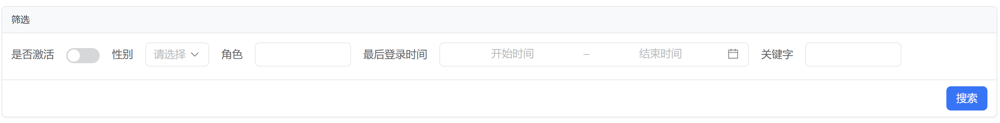
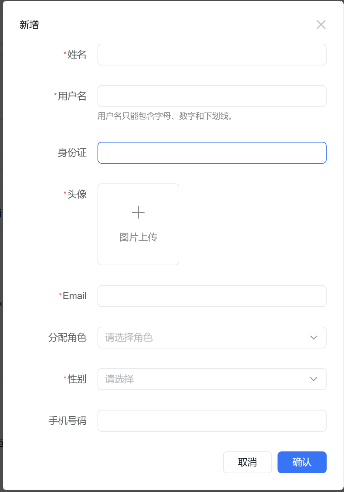
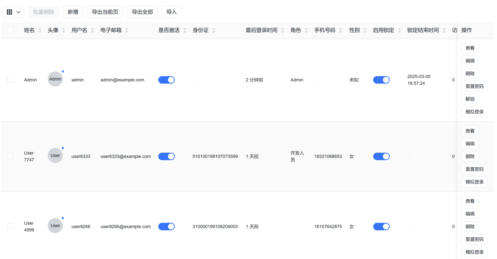
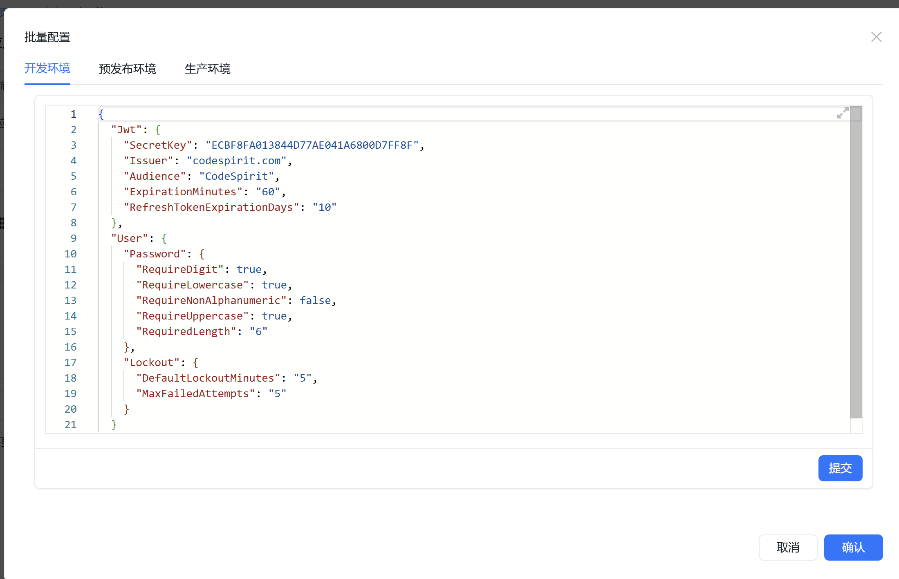
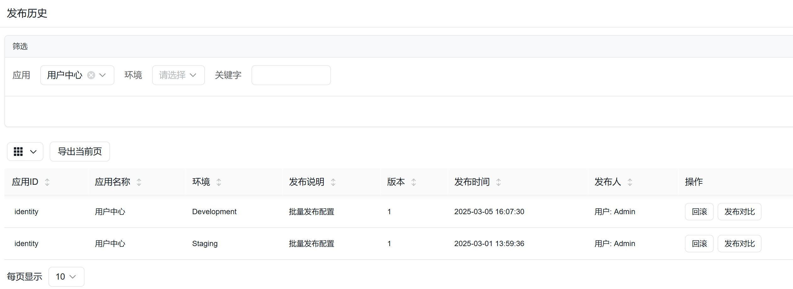

# CodeSpirit（码灵）开发指南（初稿）

## 一、概述

最近整的有点大，几乎将工作之外的时间均投入到本项目的开发之中，完全废寝忘食。因此也喜提腰酸脖子痛，看来得加强锻炼了。

回到主题，本文档以用户管理模块为例，向大家展示如何使用CodeSpirit框架快速构建企业级应用的核心功能。用户管理是几乎所有系统的基础模块，包含用户的增删改查、角色分配、状态管理等核心功能。

## 二、项目结构

总体项目结构如下：

```csharp
Src/
├── ApiServices/
│   ├── CodeSpirit.IdentityApi/           # 身份认证API
│   ├── CodeSpirit.OrderApi/              # 订单服务API
│   └── CodeSpirit.ConfigCenter/          # 配置中心
│       └── CodeSpirit.ConfigCenter.Client/ # 配置中心客户端
├── Components/
│   ├── CodeSpirit.Aggregator/            # 聚合器组件
│   ├── CodeSpirit.Amis/                  # UI生成引擎
│   ├── CodeSpirit.Authorization/         # 权限组件
│   └── CodeSpirit.Navigation/            # 导航组件
├── CodeSpirit.AppHost/                   # Aspire应用宿主
├── CodeSpirit.Core/                      # 核心定义
├── CodeSpirit.ServiceDefaults/           # 服务默认配置
├── CodeSpirit.Shared/                    # 共享库
├── CodeSpirit.Web/                       # Web相关组件
└── Tests/
    ├── Components/
    │   ├── CodeSpirit.Aggregator.Tests/
    │   ├── CodeSpirit.Authorization.Tests/
    │   └── CodeSpirit.Components.TestsBase/
    ├── ApiServices/
    │   └── CodeSpirit.IdentityApi.Tests/
    └── CodeSpirit.Tests/                 # 通用测试
```

项目结构后续进一步介绍，我们继续。

CodeSpirit采用分层架构，根据迭代不断调整结构，以用户管理模块为例，主要包含以下结构：

```
Src/
├── CodeSpirit.IdentityApi/           # 用户管理API项目
│   ├── Controllers/                  # 控制器层
│   │   ├── UsersController.cs        # 用户管理控制器
│   │   └── ...
│   ├── Services/                     # 服务层
│   │   ├── IUserService.cs           # 用户服务接口
│   │   ├── UserService.cs            # 用户服务实现
│   │   └── ...
│   ├── Dtos/                         # 数据传输对象
│   │   ├── User/
│   │   │   ├── CreateUserDto.cs      # 创建用户DTO
│   │   │   ├── UserDto.cs            # 用户信息DTO
│   │   │   ├── UpdateUserDto.cs      # 更新用户DTO
│   │   │   └── ...
│   │   └── ...
│   ├── Data/                         # 数据访问层
│   │   ├── Models/                   # 数据模型
│   │   │   ├── ApplicationUser.cs    # 用户实体
│   │   │   └── ...
│   │   └── ...
│   └── ...
└── ...
```

## 三、开发步骤

### 1. 创建数据模型

首先，我们需要定义用户实体类：

```csharp
// ApplicationUser.cs
public class ApplicationUser : IdentityUser<long>
{
    [Required]
    [MaxLength(20)]
    [PersonalData]
    public string Name { get; set; }

    [MaxLength(18)]
    [PersonalData]
    public string IdNo { get; set; }

    [PersonalData]
    public string AvatarUrl { get; set; }

    [PersonalData]
    public Gender Gender { get; set; }

    public bool IsActive { get; set; } = true;

    public DateTimeOffset? LastLoginTime { get; set; }
}

public enum Gender
{
    [Description("未知")]
    Unknown = 0,
    
    [Description("男")]
    Male = 1,
    
    [Description("女")]
    Female = 2
}
```

### 2. 定义DTO

在CodeSpirit框架中，DTO不仅用于数据传输，还承担了UI生成的职责。通过特性标注，系统能够自动生成对应的表单和表格。

#### 查询DTO：
```csharp
// UserQueryDto.cs
public class UserQueryDto : PagedRequest
{
    [DisplayName("姓名")]
    public string Name { get; set; }

    [DisplayName("用户名")]
    public string UserName { get; set; }

    [DisplayName("电子邮箱")]
    public string Email { get; set; }

    [DisplayName("手机号码")]
    public string PhoneNumber { get; set; }

    [DisplayName("是否激活")]
    public bool? IsActive { get; set; }

    [DisplayName("创建时间范围")]
    public DateTimeOffset[] CreatedRange { get; set; }
}
```



#### 创建用户DTO：

```csharp
// CreateUserDto.cs
public class CreateUserDto
{
    [Required]
    [MaxLength(20)]
    [DisplayName("姓名")]
    public string Name { get; set; }

    [Required]
    [DisplayName("用户名")]
    [MaxLength(256)]
    [RegularExpression(@"^[a-zA-Z0-9_]+$", ErrorMessage = "用户名只能包含字母、数字和下划线。")]
    [Description("用户名只能包含字母、数字和下划线。")]
    public string UserName { get; set; }

    [MaxLength(18)]
    [DisplayName("身份证")]
    [RegularExpression(@"^\d{15}|\d{18}$", ErrorMessage = "身份证号码格式不正确。")]
    public string IdNo { get; set; }

    [MaxLength(255)]
    [DataType(DataType.ImageUrl)]
    [AmisInputImageField(
        Label = "头像",
        Receiver = "${API_HOST}/api/identity/upload/avatar",
        Accept = "image/png,image/jpeg",
        MaxSize = 1048576, // 1MB
        Multiple = false,
        Required = true,
        Placeholder = "请上传您的头像"
    )]
    public string AvatarUrl { get; set; }

    [Required]
    [DataType(DataType.EmailAddress)]
    public string Email { get; set; }

    [DisplayName("分配角色")]
    [AmisSelectField(
        Source = "${API_HOST}/api/identity/Roles",
        ValueField = "name",
        LabelField = "name",
        Multiple = true,
        JoinValues = false,
        ExtractValue = true,
        Searchable = true,
        Clearable = true,
        Placeholder = "请选择角色"
    )]
    public List<string> Roles { get; set; }

    [DisplayName("性别")]
    public Gender Gender { get; set; }

    [DisplayName("手机号码")]
    [DataType(DataType.PhoneNumber)]
    public string PhoneNumber { get; set; }
}
```



#### 用户信息DTO（创建列的依据）：

```csharp
// UserDto.cs
public class UserDto
{
    public long Id { get; set; }

    [DisplayName("姓名")]
    [TplColumn(template: "${name}")]
    [Badge(VisibleOn = "accessFailedCount > 0", Level = "warning", Mode = "text", Text = "${accessFailedCount}")]
    public string Name { get; set; }

    [DisplayName("头像")]
    [AvatarColumn(Text = "${name}")]
    [Badge(Animation = true, VisibleOn = "isActive", Level = "info")]
    public string AvatarUrl { get; set; }

    [Required]
    [StringLength(50, MinimumLength = 3)]
    [DisplayName("用户名")]
    public string UserName { get; set; }

    [Required]
    [EmailAddress]
    [DisplayName("电子邮箱")]
    public string Email { get; set; }

    [DisplayName("是否激活")]
    public bool IsActive { get; set; }

    [DisplayName("身份证")]
    public string IdNo { get; set; }

    [DisplayName("最后登录时间")]
    [DateColumn(FromNow = true)]
    public DateTimeOffset? LastLoginTime { get; set; }

    [DisplayName("角色")]
    public List<string> Roles { get; set; }

    [DisplayName("手机号码")]
    public string PhoneNumber { get; set; }

    [DisplayName("性别")]
    public Gender Gender { get; set; }

    [DisplayName("启用锁定")]
    public bool LockoutEnabled { get; set; }

    [DisplayName("锁定结束时间")]
    public DateTimeOffset? LockoutEnd { get; set; }

    [DisplayName("访问失败次数")]
    public int AccessFailedCount { get; set; }
}
```



### 3. 定义服务接口

设计服务接口，定义业务逻辑操作：

```csharp
// IUserService.cs
public interface IUserService : IBaseCRUDIService<ApplicationUser, UserDto, long, CreateUserDto, UpdateUserDto, UserBatchImportItemDto>, IScopedDependency
{
    /// <summary>
    /// 获取用户列表（分页）
    /// </summary>
    Task<PageList<UserDto>> GetUsersAsync(UserQueryDto queryDto);

    /// <summary>
    /// 分配角色
    /// </summary>
    Task AssignRolesAsync(long id, List<string> roles);

    /// <summary>
    /// 移除角色
    /// </summary>
    Task RemoveRolesAsync(long id, List<string> roles);

    /// <summary>
    /// 更新用户信息
    /// </summary>
    Task UpdateUserAsync(long id, UpdateUserDto updateUserDto);

    /// <summary>
    /// 设置用户激活状态
    /// </summary>
    Task SetActiveStatusAsync(long id, bool isActive);

    /// <summary>
    /// 重置随机密码
    /// </summary>
    Task<string> ResetRandomPasswordAsync(long id);

    /// <summary>
    /// 解锁用户
    /// </summary>
    Task UnlockUserAsync(long id);

    // 其他方法...
}
```

### 4. 实现控制器

控制器负责处理HTTP请求并调用相应的服务方法：

```csharp
// UsersController.cs
[DisplayName("用户管理")]
[Navigation(Icon = "fa-solid fa-users")]
public class UsersController : ApiControllerBase
{
    private readonly IUserService _userService;
    private readonly IAuthService _authService;

    public UsersController(
        IUserService userService,
        IAuthService authService)
    {
        _userService = userService;
        _authService = authService;
    }

    // GET: api/Users
    [HttpGet]
    public async Task<ActionResult<ApiResponse<PageList<UserDto>>>> GetUsers([FromQuery] UserQueryDto queryDto)
    {
        PageList<UserDto> users = await _userService.GetUsersAsync(queryDto);
        return SuccessResponse(users);
    }

    // GET: api/Users/{id}
    [HttpGet("{id}")]
    public async Task<ActionResult<ApiResponse<UserDto>>> Detail(long id)
    {
        UserDto userDto = await _userService.GetAsync(id);
        return SuccessResponse(userDto);
    }

    // POST: api/Users
    [HttpPost]
    public async Task<ActionResult<ApiResponse<UserDto>>> CreateUser(CreateUserDto createUserDto)
    {
        var userDto = await _userService.CreateAsync(createUserDto);
        return SuccessResponseWithCreate<UserDto>(nameof(Detail), userDto);
    }

    // PUT: api/Users/{id}
    [HttpPut("{id}")]
    public async Task<ActionResult<ApiResponse>> UpdateUser(long id, UpdateUserDto updateUserDto)
    {
        await _userService.UpdateUserAsync(id, updateUserDto);
        return SuccessResponse();
    }

    // DELETE: api/Users/{id}
    [HttpDelete("{id}")]
    public async Task<ActionResult<ApiResponse>> DeleteUser(long id)
    {
        await _userService.DeleteAsync(id);
        return SuccessResponse();
    }

    // 自定义操作：重置密码
    [HttpPost("{id}/resetRandomPassword")]
    [Operation("重置密码", "ajax", null, "确定要重置密码吗？", "isActive == true")]
    public async Task<ActionResult<ApiResponse>> ResetRandomPassword(long id)
    {
        string newPassword = await _userService.ResetRandomPasswordAsync(id);
        return SuccessResponse(newPassword);
    }

    // 自定义操作：解锁用户
    [HttpPut("{id}/unlock")]
    [Operation("解锁", "ajax", null, "确定要解除用户锁定吗？", "lockoutEnd != null")]
    public async Task<ActionResult<ApiResponse>> UnlockUser(long id)
    {
        await _userService.UnlockUserAsync(id);
        return SuccessResponse("用户已成功解锁。");
    }
}
```

## 四、关键特性说明

### 1. 控制器特性

- `[DisplayName("用户管理")]`：设置模块的显示名称
- `[Navigation(Icon = "fa-solid fa-users")]`：配置导航菜单图标

### 2. 操作特性

- `[Operation("重置密码", "ajax", null, "确定要重置密码吗？", "isActive == true")]`
  - 参数1："重置密码" - 操作按钮显示文本
  - 参数2："ajax" - 操作类型，会自动匹配当前`action`
  - 参数3：null - 按钮模式
  - 参数4："确定要重置密码吗？" - 操作确认提示
  - 参数5："isActive == true" - 按钮显示条件

### 3. 表单字段特性

- `[AmisInputImageField]`：图片上传控件
- `[AmisSelectField]`：下拉选择控件
- `[DisplayName]`：设置字段显示名
- `[Description]`：字段描述信息
- `[Required]`：必填字段验证

### 4. 表格列特性

- `[TplColumn]`：模板列
- `[AvatarColumn]`：头像列
- `[DateColumn]`：日期列
- `[Badge]`：徽章标记

## 五、界面自动生成

CodeSpirit框架会根据控制器和DTO的定义自动生成完整的用户管理界面，包括：

1. **导航菜单**：根据控制器的`Navigation`特性生成
2. **查询表单**：根据`UserQueryDto`的字段定义生成
3. **数据表格**：根据`UserDto`的字段定义和特性生成
4. **操作按钮**：根据控制器方法和`Operation`特性生成
5. **添加/编辑表单**：根据`CreateUserDto`和`UpdateUserDto`生成

#### 自动生成效果

用户管理模块自动生成的界面包括：

1. 用户列表页
   - 查询条件区域
   - 功能按钮区域（新增、导入、导出等）
   - 用户数据表格（支持分页、排序）【自动判断是否启用分页】
   - 行操作按钮（查看、编辑、删除、重置密码等）

2. 用户添加/编辑页
   - 表单字段（根据DTO定义）
   - 验证规则（根据特性定义）
   - 提交/取消按钮
   
   #### 个性化表单
   
   CodeSpirit亦可以支持个性化表单，如：
   
   

## 六、开发流程示例

以下是使用CodeSpirit框架开发用户管理模块的典型流程：

### 1. 定义数据模型

创建`ApplicationUser.cs`文件，定义用户实体类。

### 2. 创建DTO

创建`UserDto.cs`、`CreateUserDto.cs`、`UpdateUserDto.cs`、`UserQueryDto.cs`等文件，定义数据传输对象。

### 3. 定义服务接口

创建`IUserService.cs`文件，定义服务接口。

### 4. 实现服务

创建`UserService.cs`文件，实现`IUserService`接口。

### 5. 创建控制器

创建`UsersController.cs`文件，实现API接口。

### 6. 启动应用

运行应用后，CodeSpirit框架会自动生成用户管理界面。

## 七、批量操作与高级功能

### 1. 批量导入

```csharp
[HttpPost("batch/import")]
public async Task<ActionResult<ApiResponse>> BatchImport([FromBody] BatchImportDtoBase<UserBatchImportItemDto> importDto)
{
    var (successCount, failedIds) = await _userService.BatchImportAsync(importDto.ImportData);
    return SuccessResponse($"成功批量导入了 {successCount} 个用户！");
}
```

### 2. 批量删除

```csharp
[HttpPost("batch/delete")]
[Operation("批量删除", "ajax", null, "确定要批量删除?", isBulkOperation: true)]
public async Task<ActionResult<ApiResponse>> BatchDelete([FromBody] BatchDeleteDto<long> request)
{
    var (successCount, failedIds) = await _userService.BatchDeleteAsync(request.Ids);
    return SuccessResponse($"成功删除 {successCount} 个用户！");
}
```

### 3. 数据导出

```csharp
[HttpGet("Export")]
public async Task<ActionResult<ApiResponse<PageList<UserDto>>>> Export([FromQuery] UserQueryDto queryDto)
{
    // 设置导出时的分页参数
    queryDto.PerPage = 10000; // 最大导出数量限制
    queryDto.Page = 1;

    // 获取用户数据
    PageList<UserDto> users = await _userService.GetUsersAsync(queryDto);
    return SuccessResponse(users);
}
```

**VNext：服务端队列生成Excel。**

## 八、小结

通过本文档，您已经了解了CodeSpirit框架中用户管理模块的完整开发流程。框架的核心优势在于：

1. **开发效率高**：通过DTO和特性驱动的方式，减少了大量重复代码
2. **前后端一体化**：后端定义即可自动生成前端界面
3. **标准化实现**：遵循RESTful API规范，代码结构清晰
4. **扩展性强**：可以通过自定义特性和服务实现扩展功能

通过CodeSpirit框架，您可以将更多精力放在业务逻辑实现上，而不是繁琐的UI开发工作，大幅提升开发效率。 

## 九、进阶概览

1. **服务发现**

   CodeSpirit框架在**本地**运行时使用.NET Aspire内建的服务发现机制，支持自动注册和发现微服务组件，在云端推荐使用**k8s**，基于Service：

   ```csharp
   // 在Program.cs中配置服务发现
   builder.AddServiceDefaults(appName);  // 使用应用名称初始化服务默认值
   
   // 配置HttpClient使用服务发现
   builder.Services.ConfigureHttpClientDefaults(http =>
   {
       http.AddStandardResilienceHandler();  // 添加弹性处理
       http.AddServiceDiscovery();  // 添加服务发现
   });
   ```

   服务发现功能允许服务之间通过名称而非硬编码URL相互调用，在部署环境变更时无需修改代码。比如在其他服务可以以以下方式进行请求：
   `GET http://identity/api/identity/users/1`

   **特别说明：暂时弃用Dapr，一方面边车带来了不必要的复杂性和性能消耗，另一方面本地开发体验实在是不太友好。**

2. **聚合器**

​	CodeSpirit框架提供了强大的聚合器功能，用于处理关联数据的自动替换和补充。聚合器通过HTTP头部指令工作，而非常规的API聚合器模式：

```text
X-Aggregate-Keys: createdBy#User-{value}, updatedBy=/user/{value}.name, items.createdBy=/user/{value}.fullName#{value} ({field})
```

支持静态、动态替换，使用起来非常简单，比如：

```csharp
    /// <summary>
    /// 发布人（通过CreatedBy属性获取发布人信息）
    /// TODO: 应提供聚合器独立的内部接口
    /// </summary>
    [DisplayName("发布人")]
    [AggregateField(dataSource: "http://identity/api/identity/users/{value}.data.name", template: "用户: {field}")]
    public string CreatedBy { get; set; }
```



3. **配置中心（内置）**

CodeSpirit框架提供了轻量级配置中心，支持动态更新、多环境配置和实时通知：

- 支持实时推送配置变更（通过SignalR）

- 基于应用/环境的多层级配置

- 本地缓存机制保证网络问题时的高可用性

- 版本管理与回滚支持

4. **权限系统**

   CodeSpirit框架内置RBAC+ABAC混合权限模型，提供细粒度的权限控制，并：

   - 自动生成基于控制器/操作的权限树

   - 支持基于角色的访问控制

   - 权限继承逻辑：module → module_controller → module_controller_action

   - 运行时权限验证
   - VNext：字段级别的权限控制

5. **导航服务**

   导航服务自动生成应用的导航结构，支持基于特性的导航定义和权限过滤：

   ```csharp
   // 在控制器上配置导航
   [DisplayName("用户管理")]
   [Navigation(Icon = "fa-solid fa-users", Order = 10)]
   public class UsersController : ApiControllerBase
   {
       // ...
   }
   ```

   同时支持配置文件配置。

   导航服务特点：

   - 支持通过特性和配置文件两种方式定义导航

   - 自动根据用户权限过滤导航项

   - 支持自定义图标和排序

   - 支持多级嵌套导航
   - 即将支持顶部导航

6. **雪花Id**

   内置雪花ID算法生成全局唯一的分布式ID，适用于分布式系统中的主键生成：

   ```csharp
   // 在服务中使用
   public class UserService : IUserService
   {
       private readonly IIdGenerator _idGenerator;
       
       public UserService(IIdGenerator idGenerator)
       {
           _idGenerator = idGenerator;
       }
       
       public async Task<UserDto> CreateAsync(CreateUserDto createDto)
       {
           var user = _mapper.Map<ApplicationUser>(createDto);
           user.Id = _idGenerator.NewId();  // 使用雪花ID作为主键
           // ...保存用户
       }
   }
   ```

   无需设置workId，适用于k8s，自动从Pod IP获取workid。

7. **表单生成**

   CodeSpirit框架基于Amis前端框架，提供强大的表单自动生成能力，支持通过特性定义复杂的表单控件。

   表单生成支持的控件类型：

   - 文本输入（单行/多行）

   - 数字输入

   - 下拉选择（单选/多选）

   - 日期选择器

   - 开关（Switch）

   - 图片上传

   - 级联选择器

   - 树形选择器

   - 等多种高级控件

   表单生成支持完整的验证规则，包括：

   - 必填验证

   - 长度验证

   - 范围验证

   - 正则表达式验证

   - 自定义错误消息

8. **审计日志（待重构）**

   准备弃用Audit.NET自行编写。

9. **高级表单控件（VNext）**

   - 标签
   - 富文本编辑器
   - 签名
   - 位置
   - 城市选择器
   - 颜色选择器
   - ...

10. **集成大模型（VNext）**

    如：

    ```csharp
    // 配置LLM服务
    services.AddLLMService(options =>
    {
        options.ApiKey = Configuration["LLM:ApiKey"];
        options.BaseUrl = Configuration["LLM:BaseUrl"];
        options.DefaultModel = "gpt-4";
    });
    ```

11. **多租户支持（VNext）**

    支持软隔离以及数据隔离，比如：

    ```csharp
    // 配置租户数据隔离
    services.AddDbContext<ApplicationDbContext>((serviceProvider, options) =>
    {
        var tenantInfo = serviceProvider.GetRequiredService<ITenantInfo>();
        
        // 根据租户使用不同的连接字符串
        if (tenantInfo.Id != null)
        {
            string connectionString = GetConnectionStringForTenant(tenantInfo.Id);
            options.UseSqlServer(connectionString);
        }
        else
        {
            // 默认连接字符串
            options.UseSqlServer(Configuration.GetConnectionString("DefaultConnection"));
        }
    });
    ```

    

12. **请求代理**

13. **智能图表（VNext）**

14. **移动端表单（VNext）**

15. ...

