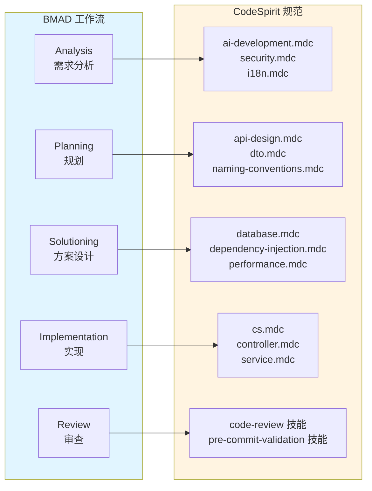
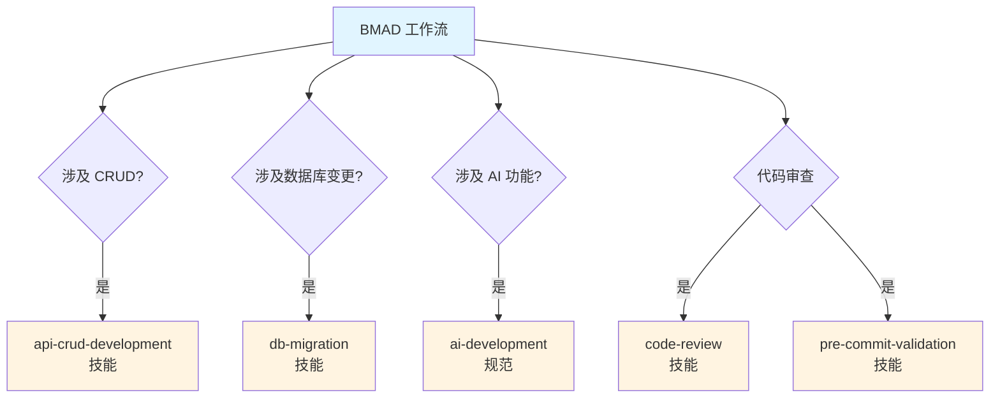

# BMAD 开发工作流使用教程

> **BMAD (Breakthrough Method of Agile AI-Driven Development)** 是一个结构化的 AI 驱动软件开发方法，提供从需求到实现的完整工作流。

本教程将帮助你快速掌握 BMAD 在 CodeSpirit 项目中的使用，从快速入门到高级应用，涵盖所有核心概念、工作流、实战案例和最佳实践。

## 📚 目录

- [快速入门](#快速入门)
- [核心概念](#核心概念)
- [工作流详解](#工作流详解)
- [命令参考](#命令参考)
- [实战案例](#实战案例)
- [CodeSpirit 集成](#codespirit-集成)
- [最佳实践](#最佳实践)
- [故障排除](#故障排除)

---

## 快速入门

### 5 分钟上手 BMAD

BMAD 提供了两种主要工作流：**Quick Flow**（快速流程）和 **Full Flow**（完整流程）。

#### 验证安装

首先，确认 BMAD 已正确安装：

```bash
# 在 Cursor IDE 的 AI 聊天窗口中输入
/bmad-help
```

如果看到帮助信息，说明 BMAD 已正确安装。

#### 第一个 Bug 修复（Quick Flow）

让我们用一个简单的例子开始：

```bash
# 1. 创建技术规范
/quick-spec 修复用户登录时租户ID丢失的问题

# 2. 实现变更（BMAD 会自动应用 CodeSpirit 规范）
/quick-dev

# 3. 代码审查
/code-review
```

**预期结果**：
- BMAD 会生成技术规范文档
- 自动实现代码变更，遵循所有 CodeSpirit 规范
- 执行多层级代码审查

#### 第一个功能开发（Full Flow）

对于新功能开发，使用完整流程：

```bash
# 1. 创建产品简报
/product-brief 在 ExamApi 中添加题目标签管理功能，支持标签的增删改查

# 2. 创建 PRD
/create-prd

# 3. 架构设计
/create-architecture

# 4. 拆分为 Story
/create-epics-and-stories

# 5. 实现 Story（替换 {story-id} 为实际的 Story ID）
/dev-story {story-id}

# 6. 代码审查
/code-review
```

**预期结果**：
- 生成完整的产品需求文档（PRD）
- 创建架构设计文档
- 拆分为可执行的 Story
- 自动实现代码，调用相关技能（如 `api-crud-development`）
- 执行代码审查

### 工作流选择指南

| 场景 | 推荐工作流 | 原因 |
|------|-----------|------|
| Bug 修复 | Quick Flow | 问题明确，解决方案直接 |
| 小型功能 | Quick Flow | 变更范围小，影响有限 |
| 新功能开发 | Full Flow | 需要完整的需求分析和设计 |
| 架构调整 | Full Flow | 影响面广，需要详细规划 |
| 数据库变更 | Quick Flow | 变更明确，流程标准化 |
| AI 功能集成 | Full Flow | 涉及多个组件，需要架构设计 |

---

## 核心概念

### 什么是 BMAD？

BMAD (Breakthrough Method of Agile AI-Driven Development) 是一个结构化的 AI 驱动软件开发方法，提供：

- **标准化工作流**: 从需求到实现的完整流程
- **自动化规范应用**: 自动遵循项目开发规范
- **知识沉淀**: 所有文档和设计都成为项目知识库
- **质量保证**: 多层级的代码审查和验证

### BMAD 的核心价值

1. **减少上下文切换**: 在 AI 辅助开发的同时，无需手动查阅规范文档
2. **提高代码质量**: 自动应用规范，多层级的审查确保代码质量
3. **知识沉淀**: PRD、架构设计、Story 文档都成为项目知识库
4. **团队协作**: 标准化的工作流和文档格式提升团队协作效率

### 工作流类型对比

```mermaid
graph TB
    subgraph QuickFlow[Quick Flow 快速流程]
        Q1[quick-spec<br/>技术规范]
        Q2[quick-dev<br/>实现变更]
        Q3[code-review<br/>代码审查]
        Q1 --> Q2 --> Q3
    end
    
    subgraph FullFlow[Full Flow 完整流程]
        F1[product-brief<br/>产品简报]
        F2[create-prd<br/>PRD文档]
        F3[create-architecture<br/>架构设计]
        F4[create-epics-and-stories<br/>拆分Story]
        F5[sprint-planning<br/>Sprint规划]
        F6[dev-story<br/>实现Story]
        F7[code-review<br/>代码审查]
        F8[retrospective<br/>复盘]
        F1 --> F2 --> F3 --> F4 --> F5 --> F6 --> F7 --> F8
    end
    
    style QuickFlow fill:#e1f5ff
    style FullFlow fill:#fff4e1
```



**Quick Flow** 适用于：
- 小型任务（代码行数 < 200）
- Bug 修复
- 简单变更

**Full Flow** 适用于：
- 新功能开发
- 复杂变更
- 架构调整
- 需要多团队协作的功能

---

## 工作流详解

### Quick Flow（快速流程）

Quick Flow 是一个三步骤的快速开发流程，适用于小型任务和 Bug 修复。

#### 1. `/quick-spec` - 创建技术规范

**功能**: 生成技术规范文档，包含问题描述、技术方案、实现步骤和测试计划。

**使用方法**:
```bash
/quick-spec {问题描述}
```

**示例**:
```bash
/quick-spec 修复用户登录时租户ID丢失的问题
```

**输出内容**:
- 问题描述和分析
- 技术方案设计
- 实现步骤清单
- 测试计划
- CodeSpirit 规范考量（多租户、多数据库等）

**使用技巧**:
- 描述要具体：包含问题场景、预期行为、实际行为
- 提供上下文：如果涉及特定模块，说明模块名称
- 明确约束：如果有技术约束或业务规则，一并说明

#### 2. `/quick-dev` - 实现变更

**功能**: 基于技术规范自动实现代码变更。

**使用方法**:
```bash
/quick-dev
```

**自动化流程**:
1. 读取技术规范文档
2. 分析变更需求
3. 自动应用 CodeSpirit 规范：
   - 命名约定（实体、DTO、服务、控制器）
   - XML 文档注释
   - 依赖注入配置
   - 多语言资源
   - 数据库迁移（如涉及）
4. 生成或修改代码文件
5. 创建必要的配置文件

**注意事项**:
- BMAD 会自动遵循所有 CodeSpirit 规范
- 如果涉及数据库变更，会自动调用 `db-migration` 技能
- 如果涉及 CRUD 功能，会自动调用 `api-crud-development` 技能

#### 3. `/code-review` - 代码审查

**功能**: 执行多层级代码审查。

**使用方法**:
```bash
/code-review
```

**审查内容**:
1. **BMAD 标准审查**
   - 代码质量检查
   - 测试覆盖率
   - 文档完整性

2. **CodeSpirit 特定审查**
   - 安全审查（权限控制、数据保护）
   - 数据库审查（多数据库支持、迁移正确性）
   - 异步编程审查（async/await 使用）
   - 多语言审查（资源文件使用）
   - DTO 审查（验证特性、映射配置）
   - 控制器审查（RESTful 标准、响应格式）

3. **提交前验证**
   - 静态代码分析
   - 运行时错误检查
   - 功能验证

**通过标准**:
- 所有审查项通过
- 代码符合 CodeSpirit 规范
- 无严重安全问题
- 测试通过

### Full Flow（完整流程）

Full Flow 是一个八步骤的完整开发流程，适用于新功能开发和复杂变更。

#### 1. `/product-brief` - 产品需求简报

**功能**: 创建产品需求简报，包含功能概述、用户故事、成功标准和技术约束。

**使用方法**:
```bash
/product-brief {功能描述}
```

**示例**:
```bash
/product-brief 在 ExamApi 中添加题目标签管理功能，支持标签的增删改查，题目可以关联多个标签
```

**输出内容**:
- 功能概述
- 用户故事
- 成功标准
- 技术约束
- CodeSpirit 特定考量（多租户、多数据库、AI 功能等）

**编写技巧**:
- **明确功能范围**: 清晰描述要实现的功能
- **提供业务背景**: 说明为什么需要这个功能
- **列出关键需求**: 核心功能点、性能要求、安全要求
- **说明技术约束**: 如果有特殊技术要求，提前说明

#### 2. `/create-prd` - 创建 PRD

**功能**: 基于产品简报创建详细的产品需求文档。

**使用方法**:
```bash
/create-prd
```

**PRD 包含内容**:
- 产品概述
- 功能需求
- 非功能需求
- 用户界面设计（如适用）
- API 设计（如适用）
- **CodeSpirit 特定部分**:
  - 多租户支持需求
  - 多数据库支持需求
  - AI 功能需求（LLM 集成、AI 表单填充、AI 长任务）
  - 国际化需求
  - 权限设计

**PRD 模板扩展**:
BMAD 的 PRD 模板已扩展，自动包含 CodeSpirit 特定部分：

```markdown
## CodeSpirit 特定需求

### 多租户支持
- [ ] 是否需要租户隔离？
- [ ] 实体是否实现 IMultiTenant？

### 数据库支持
- [ ] 需要支持 MySQL
- [ ] 需要支持 SQL Server
- [ ] 是否需要数据库特定的配置？

### AI 功能
- [ ] 是否需要 LLM 集成？
- [ ] 是否需要 AI 表单填充？
- [ ] 是否需要 AI 长任务处理？

### 国际化
- [ ] 需要支持的语言：中文、英文
- [ ] 需要添加的资源键列表

### 权限设计
- [ ] 需要的权限点列表
- [ ] 权限控制级别（控制器/操作）
```

#### 3. `/create-architecture` - 架构设计

**功能**: 创建架构设计文档，包含数据库设计、API 设计、服务层设计和依赖注入策略。

**使用方法**:
```bash
/create-architecture
```

**架构文档包含**:
- **数据库设计**
  - 数据库选型（MySQL vs SQL Server）
  - DbContext 设计（数据库特定的 DbContext）
  - 实体配置策略
  - 迁移策略

- **依赖注入设计**
  - 服务生命周期选择（IScopedDependency、ITransientDependency、ISingletonDependency）
  - 自动注册策略

- **缓存策略**
  - L1 缓存（内存）使用场景
  - L2 缓存（Redis）使用场景

- **API 设计**
  - RESTful 标准
  - 统一响应格式（ApiResponse<T>）
  - 路由规范

- **审计追踪**
  - GreptimeDB 配置
  - 审计特性使用

**CodeSpirit 特定设计**:
- 数据库特定的 DbContext 设计（`SqlServer{Service}DbContext` / `MySql{Service}DbContext`）
- 多数据库迁移策略
- 自动注册接口选择
- L1/L2 缓存决策

#### 4. `/create-epics-and-stories` - 拆分 Story

**功能**: 将功能拆分为 Epic 和 Story。

**使用方法**:
```bash
/create-epics-and-stories
```

**Story 包含内容**:
- Story 描述和验收标准
- **实体定义**: Entity 类设计
- **DTO 设计**: CreateDto, UpdateDto, QueryDto, ResultDto
- **服务接口**: IService 接口定义
- **控制器端点**: RESTful API 端点规范
- **数据库迁移**: 是否需要创建迁移
- **多语言资源**: 需要添加的资源键
- **测试要求**: 单元测试和集成测试清单

**Story 模板扩展**:
每个 Story 都包含详细的实现清单：

```markdown
## 实现清单

### 实体（Entity）
- [ ] 创建 `{EntityName}.cs`
- [ ] 实现 `IFullAuditable`（审计字段）
- [ ] 实现 `IMultiTenant`（多租户）
- [ ] 实现 `IIsActive`（激活状态）

### DTO 类
- [ ] 创建 `{EntityName}Dto.cs`（展示 DTO）
- [ ] 创建 `Create{EntityName}Dto.cs`
- [ ] 创建 `Update{EntityName}Dto.cs`
- [ ] 创建 `{EntityName}QueryDto.cs`（继承 QueryDtoBase）

### 服务层
- [ ] 创建 `I{EntityName}Service` 接口（继承 IScopedDependency）
- [ ] 创建 `{EntityName}Service` 实现

### 控制器
- [ ] 创建 `{EntityName}sController`（复数形式）
- [ ] 继承 `ApiControllerBase`
- [ ] 路由：`/{service}/api/[controller]`

### 数据库迁移
- [ ] 创建 SQL Server 迁移
- [ ] 创建 MySQL 迁移
```

#### 5. `/sprint-planning` - Sprint 规划

**功能**: 规划 Sprint 任务和优先级。

**使用方法**:
```bash
/sprint-planning
```

**规划内容**:
- Story 优先级排序
- 任务依赖关系
- 工作量估算
- Sprint 目标设定

#### 6. `/dev-story` - 实现 Story

**功能**: 实现 Story 中的所有任务。

**使用方法**:
```bash
/dev-story {story-id}
```

**自动化流程**:
1. 读取 Story 文档
2. 分析实现清单
3. **自动应用 CodeSpirit CRUD 开发流程**（如涉及）:
   - 调用 `api-crud-development` 技能
   - 创建实体、DTO、服务、控制器
   - 配置数据库迁移
   - 添加 XML 注释
   - 配置多语言资源

4. **自动应用数据库迁移流程**（如涉及）:
   - 调用 `db-migration` 技能
   - 同时为 MySQL 和 SQL Server 创建迁移

5. **应用所有代码规范**:
   - 命名约定
   - XML 文档注释
   - 依赖注入配置
   - 多语言支持

**技能协同**:
- 如果涉及 CRUD，自动调用 `api-crud-development` 技能
- 如果涉及数据库变更，自动调用 `db-migration` 技能
- 如果涉及 AI 功能，自动应用 AI 开发规范

#### 7. `/code-review` - 代码审查

**功能**: 执行多层级代码审查。

**使用方法**:
```bash
/code-review
```

**审查流程**:
1. **BMAD 标准审查**
   - 执行 BMAD `/code-review` 工作流
   - 检查代码质量、测试覆盖率等

2. **CodeSpirit 特定审查**
   - 执行 `code-review` 技能
   - 检查是否符合所有项目规范
   - 检查安全、数据库、异步编程、多语言等

3. **提交前验证**
   - 执行 `pre-commit-validation` 技能
   - 静态代码审查
   - 运行时错误检查
   - 功能验证

#### 8. `/retrospective` - 复盘

**功能**: 回顾 Sprint 完成情况，总结经验教训。

**使用方法**:
```bash
/retrospective
```

**复盘内容**:
- Sprint 目标达成情况
- 完成的工作项
- 遇到的问题和解决方案
- 改进建议
- 知识沉淀

---

## 命令参考

### 核心工作流命令

#### `/quick-spec` - 快速技术规范

创建技术规范文档，适用于小型任务和 Bug 修复。

**语法**:
```bash
/quick-spec {问题描述}
```

**参数**:
- `问题描述`: 要解决的问题或要实现的功能

**输出**: 技术规范文档（Markdown 格式）

**示例**:
```bash
/quick-spec 修复用户登录时租户ID丢失的问题
/quick-spec 为 User 表添加手机号字段
```

---

#### `/quick-dev` - 快速开发

基于技术规范实现代码变更。

**语法**:
```bash
/quick-dev
```

**前置条件**: 必须先执行 `/quick-spec`

**输出**: 代码变更和配置文件

---

#### `/product-brief` - 产品简报

创建产品需求简报。

**语法**:
```bash
/product-brief {功能描述}
```

**参数**:
- `功能描述`: 要开发的功能描述

**输出**: 产品需求简报文档

**示例**:
```bash
/product-brief 在 ExamApi 中添加题目标签管理功能
/product-brief 在 SurveyApi 中添加 AI 问卷生成功能
```

---

#### `/create-prd` - 创建 PRD

基于产品简报创建详细的产品需求文档。

**语法**:
```bash
/create-prd
```

**前置条件**: 必须先执行 `/product-brief`

**输出**: PRD 文档（包含 CodeSpirit 特定部分）

---

#### `/create-architecture` - 架构设计

创建架构设计文档。

**语法**:
```bash
/create-architecture
```

**前置条件**: 必须先执行 `/create-prd`

**输出**: 架构设计文档（包含数据库设计、API 设计、依赖注入策略等）

---

#### `/create-epics-and-stories` - 拆分 Story

将功能拆分为 Epic 和 Story。

**语法**:
```bash
/create-epics-and-stories
```

**前置条件**: 必须先执行 `/create-architecture`

**输出**: Epic 和 Story 文档列表

---

#### `/sprint-planning` - Sprint 规划

规划 Sprint 任务和优先级。

**语法**:
```bash
/sprint-planning
```

**前置条件**: 必须先执行 `/create-epics-and-stories`

**输出**: Sprint 规划文档

---

#### `/dev-story` - 实现 Story

实现 Story 中的所有任务。

**语法**:
```bash
/dev-story {story-id}
```

**参数**:
- `story-id`: Story 的唯一标识符

**前置条件**: 必须先执行 `/create-epics-and-stories`

**输出**: 代码实现、配置文件、数据库迁移等

**示例**:
```bash
/dev-story story-001
/dev-story epic-001-story-001
```

---

#### `/code-review` - 代码审查

执行多层级代码审查。

**语法**:
```bash
/code-review
```

**输出**: 代码审查报告

---

#### `/retrospective` - 复盘

回顾 Sprint 完成情况。

**语法**:
```bash
/retrospective
```

**输出**: 复盘报告

---

### 辅助命令

#### `/bmad-help` - 获取帮助

获取 BMAD 使用帮助和上下文相关的指导。

**语法**:
```bash
/bmad-help
```

**输出**: 帮助信息和下一步建议

---

#### `/check-implementation-readiness` - 检查实施准备

检查是否准备好开始实施。

**语法**:
```bash
/check-implementation-readiness
```

**输出**: 准备情况检查报告

---

#### `/correct-course` - 纠正方向

如果发现偏离了正确方向，使用此命令纠正。

**语法**:
```bash
/correct-course
```

**输出**: 纠正建议和下一步行动

---

#### `/domain-research` - 领域研究

进行领域研究，了解业务领域知识。

**语法**:
```bash
/domain-research {研究主题}
```

**参数**:
- `研究主题`: 要研究的领域主题

**输出**: 领域研究报告

---

#### `/technical-research` - 技术研究

进行技术研究，了解技术方案。

**语法**:
```bash
/technical-research {研究主题}
```

**参数**:
- `研究主题`: 要研究的技术主题

**输出**: 技术研究报告

---

### 代理命令

BMAD 提供了多个专业代理，每个代理专注于特定的角色和任务。

#### `/agent-analyst` - 分析师代理

产品分析师代理，负责需求分析和 PRD 编写。

**语法**:
```bash
/agent-analyst {任务描述}
```

---

#### `/agent-architect` - 架构师代理

架构师代理，负责架构设计和技术方案。

**语法**:
```bash
/agent-architect {任务描述}
```

---

#### `/agent-dev` - 开发代理

开发代理，负责代码实现。

**语法**:
```bash
/agent-dev {任务描述}
```

---

#### `/agent-pm` - 产品经理代理

产品经理代理，负责产品规划和 Sprint 管理。

**语法**:
```bash
/agent-pm {任务描述}
```

---

#### `/agent-qa` - QA 代理

QA 代理，负责测试和质量保证。

**语法**:
```bash
/agent-qa {任务描述}
```

---

## 实战案例

### 案例 1: 新增商品分类管理（CRUD 功能）

**场景**: 在 MallApi 中添加商品分类的增删改查功能，支持分类的层级结构。

**使用工作流**: Full Flow

**步骤演示**:

#### 1. 创建产品简报

```bash
/product-brief 在 MallApi 中添加商品分类管理功能，支持分类的增删改查，分类支持多级层级结构，商品可以关联分类
```

**BMAD 自动考虑**:
- 多租户支持（分类需要租户隔离）
- 多数据库支持（MySQL 和 SQL Server）
- 权限设计（分类管理权限）
- 国际化需求（中文/英文）

#### 2. 创建 PRD

```bash
/create-prd
```

**PRD 包含**:
- 功能需求：分类 CRUD、层级结构、商品关联
- CodeSpirit 特定需求：多租户、多数据库、权限、国际化

#### 3. 架构设计

```bash
/create-architecture
```

**架构设计包含**:
- 数据库设计：Category 实体、自关联关系
- DbContext 设计：`SqlServerMallDbContext` 和 `MySqlMallDbContext`
- API 设计：RESTful 端点设计
- 依赖注入：`ICategoryService : IScopedDependency`

#### 4. 拆分 Story

```bash
/create-epics-and-stories
```

**生成的 Story**:
- Epic 1: 分类管理基础功能
  - Story 1.1: 创建 Category 实体和数据库迁移
  - Story 1.2: 实现分类 CRUD API
  - Story 1.3: 实现分类层级结构
  - Story 1.4: 实现商品关联分类

#### 5. 实现 Story

```bash
/dev-story story-1-1
```

**BMAD 自动执行**:
1. 调用 `api-crud-development` 技能
2. 创建 `Category.cs` 实体（实现 `IMultiTenant`、`IFullAuditable`）
3. 创建 DTO 类（`CategoryDto`、`CreateCategoryDto`、`UpdateCategoryDto`、`CategoryQueryDto`）
4. 创建 `ICategoryService` 和 `CategoryService`
5. 创建 `CategoriesController`
6. 配置 AutoMapper 映射
7. 调用 `db-migration` 技能创建迁移（MySQL 和 SQL Server）
8. 添加多语言资源
9. 添加 XML 文档注释

**生成的代码特点**:
- ✅ 符合所有 CodeSpirit 规范
- ✅ 自动配置依赖注入
- ✅ 支持多租户
- ✅ 支持多数据库
- ✅ 包含完整的多语言支持

#### 6. 代码审查

```bash
/code-review
```

**审查结果**:
- BMAD 标准审查：通过
- CodeSpirit 特定审查：通过
- 提交前验证：通过

---

### 案例 2: 修复租户ID丢失 Bug（Bug 修复）

**场景**: 用户登录时，租户ID没有正确保存到用户会话中。

**使用工作流**: Quick Flow

**步骤演示**:

#### 1. 创建技术规范

```bash
/quick-spec 修复用户登录时租户ID丢失的问题，登录成功后应该将租户ID保存到用户会话中，但当前没有保存
```

**BMAD 生成技术规范**:
- 问题描述：登录流程中租户ID丢失
- 技术方案：在登录成功后保存租户ID到会话
- 实现步骤：
  1. 检查登录服务代码
  2. 在登录成功后添加租户ID保存逻辑
  3. 验证会话中租户ID是否正确保存
- 测试计划：单元测试和集成测试

#### 2. 实现变更

```bash
/quick-dev
```

**BMAD 自动执行**:
1. 分析技术规范
2. 定位登录服务代码
3. 修改登录逻辑，添加租户ID保存
4. 确保符合 CodeSpirit 规范（异步编程、XML 注释等）

#### 3. 代码审查

```bash
/code-review
```

**审查重点**:
- 多租户逻辑正确性
- 会话管理安全性
- 异步编程规范

---

### 案例 3: 集成 AI 问卷生成（AI 功能）

**场景**: 在 SurveyApi 中添加 AI 问卷生成功能，用户输入主题后，AI 自动生成问卷。

**使用工作流**: Full Flow

**步骤演示**:

#### 1. 创建产品简报

```bash
/product-brief 在 SurveyApi 中添加 AI 问卷生成功能，用户输入问卷主题和描述，AI 自动生成问卷题目和选项
```

#### 2. 创建 PRD

```bash
/create-prd
```

**PRD 自动包含 AI 功能需求**:
- LLM 集成需求
- AI 表单填充需求（`[AiFormFill]` 特性）
- 提示词设计要求

#### 3. 架构设计

```bash
/create-architecture
```

**架构设计包含**:
- LLM 客户端集成（`ILLMClientFactory`）
- AI 表单填充设计
- 提示词模板设计
- 错误处理和重试机制

#### 4. 实现 Story

```bash
/dev-story story-ai-001
```

**BMAD 自动应用 AI 开发规范**:
- 使用 `ILLMClientFactory` 创建 LLM 客户端
- 配置提示词，指定 JSON 输出格式
- 实现 AI 表单填充特性
- 添加错误处理和用户反馈

---

### 案例 4: 添加手机号字段（数据库变更）

**场景**: 为 User 表添加手机号字段，支持手机号验证。

**使用工作流**: Quick Flow

**步骤演示**:

#### 1. 创建技术规范

```bash
/quick-spec 为 User 表添加手机号字段，字段名为 PhoneNumber，类型为字符串，最大长度20，支持手机号格式验证
```

#### 2. 实现变更

```bash
/quick-dev
```

**BMAD 自动执行**:
1. 调用 `db-migration` 技能
2. 修改 `User.cs` 实体，添加 `PhoneNumber` 属性
3. 创建 SQL Server 迁移：`dotnet ef migrations add AddUserPhoneNumber --context SqlServerIdentityDbContext --output-dir Data/Migrations/SqlServer`
4. 创建 MySQL 迁移：`dotnet ef migrations add AddUserPhoneNumber --context MySqlIdentityDbContext --output-dir Data/Migrations/MySql`
5. 更新 DTO，添加手机号字段和验证特性
6. 添加多语言资源

**关键点**:
- ✅ 同时为 MySQL 和 SQL Server 创建迁移
- ✅ 使用数据库特定的 DbContext
- ✅ 添加验证特性（`[Phone]` 或 `[RegularExpression]`）
- ✅ 支持多语言验证消息

---

### 案例 5: 性能优化（架构改进）

**场景**: 用户列表查询性能较慢，需要优化。

**使用工作流**: Quick Flow

**步骤演示**:

#### 1. 创建技术规范

```bash
/quick-spec 优化用户列表查询性能，当前查询包含大量关联数据导致性能问题，需要优化查询策略，考虑使用缓存
```

#### 2. 实现变更

```bash
/quick-dev
```

**BMAD 自动应用性能优化规范**:
- 使用 `AsNoTracking()` 进行只读查询
- 使用 `AsSplitQuery()` 避免 N+1 问题
- 实现 L1 缓存（内存缓存）或 L2 缓存（Redis）
- 添加查询索引
- 优化 Include 策略

---

## CodeSpirit 集成

### 自动规范应用机制

BMAD 工作流已配置为自动遵循 CodeSpirit 的所有开发规范。BMAD 在每个阶段都会自动加载对应的 CodeSpirit 规范文档。



### 阶段-规范映射

| BMAD 阶段 | BMAD 命令 | CodeSpirit 规范 | 关键要求 |
|----------|----------|----------------|---------|
| **Analysis** | `/product-brief`, `/create-prd` | `ai-development.mdc`, `security.mdc`, `i18n.mdc` | AI 功能需求、权限设计、多语言需求 |
| **Planning** | `/create-epics-and-stories` | `api-design.mdc`, `dto.mdc`, `naming-conventions.mdc` | RESTful 标准、DTO 设计、命名约定 |
| **Solutioning** | `/create-architecture` | `database.mdc`, `dependency-injection.mdc`, `performance.mdc` | DbContext 设计、依赖注入策略、缓存策略 |
| **Implementation** | `/dev-story`, `/quick-dev` | `cs.mdc`, `controller.mdc`, `service.mdc`, `dto.mdc` | XML 注释、控制器规范、服务类规范 |
| **Review** | `/code-review` | `code-review` 技能, `pre-commit-validation` 技能 | CodeSpirit 审查清单、提交前验证 |

### 技能协同

BMAD 会自动调用相关 CodeSpirit 技能：



**技能调用规则**:
- **CRUD 功能**: 自动调用 `api-crud-development` 技能
- **数据库变更**: 自动调用 `db-migration` 技能
- **AI 功能**: 自动应用 `ai-development.mdc` 规范
- **代码审查**: 自动调用 `code-review` 和 `pre-commit-validation` 技能

### 验证清单

如何确认规范已正确应用：

#### 代码实现检查清单

- [ ] **命名约定**: 实体（单数）、DTO（Create/Update/Query/Result）、服务（Service）、控制器（复数）
- [ ] **XML 注释**: 所有公共成员都有 `<summary>`, `<param>`, `<returns>`, `<exception>`
- [ ] **时间格式**: 使用 UTC 时间（`DateTime.UtcNow`）
- [ ] **序列化**: 使用 `Newtonsoft.Json`
- [ ] **依赖注入**: 接口继承标记接口（`IScopedDependency` 等）
- [ ] **数据库**: 使用数据库特定的 DbContext，迁移分目录
- [ ] **多租户**: 实体实现 `IMultiTenant`
- [ ] **多语言**: DTO 属性有 `[Display]` 特性，验证特性使用资源文件
- [ ] **异步编程**: 所有 I/O 操作使用 `async/await`，禁止 `Task.Result`
- [ ] **API 设计**: RESTful 标准，统一响应格式 `ApiResponse<T>`

#### 文档检查清单

- [ ] **PRD**: 包含 CodeSpirit 特定部分（多租户、多数据库、AI 功能等）
- [ ] **架构设计**: 包含数据库特定的 DbContext 设计、依赖注入策略
- [ ] **Story**: 包含完整的实现清单（实体、DTO、服务、控制器、迁移等）

---

## 最佳实践

### 1. 选择合适的工作流

**Quick Flow 适用场景**:
- 代码变更 < 200 行
- Bug 修复
- 简单功能添加
- 数据库字段变更
- 性能优化

**Full Flow 适用场景**:
- 新功能开发
- 复杂业务逻辑
- 架构调整
- 多模块协作
- AI 功能集成

**选择标准**:
- 如果需求明确、变更范围小 → Quick Flow
- 如果需要需求分析、架构设计 → Full Flow
- 如果不确定 → 先用 Quick Flow，如果发现需要更多规划，再切换到 Full Flow

### 2. 编写有效的产品简报

**好的产品简报特点**:
- ✅ **明确功能范围**: "在 ExamApi 中添加题目标签管理功能"
- ✅ **提供业务背景**: "为了支持题目的分类和检索"
- ✅ **列出关键需求**: "支持标签的增删改查，题目可以关联多个标签"
- ✅ **说明技术约束**: "需要支持多租户，使用 MySQL 和 SQL Server"

**不好的产品简报示例**:
- ❌ "添加标签功能"（太模糊）
- ❌ "优化系统"（范围不明确）
- ❌ "修复 Bug"（没有具体描述）

### 3. Story 拆分技巧

**好的 Story 特点**:
- ✅ **单一职责**: 每个 Story 只做一件事
- ✅ **可测试**: 有明确的验收标准
- ✅ **可估算**: 工作量可以估算
- ✅ **独立性**: 可以独立开发和测试

**Story 拆分原则**:
1. **按功能模块拆分**: 先按功能模块拆分 Epic，再按功能点拆分 Story
2. **按依赖关系拆分**: 先实现基础功能，再实现依赖功能
3. **按优先级拆分**: 高优先级功能先实现

**示例**:
```
Epic: 商品分类管理
├── Story 1: 创建 Category 实体和数据库迁移（基础）
├── Story 2: 实现分类 CRUD API（核心功能）
├── Story 3: 实现分类层级结构（增强功能）
└── Story 4: 实现商品关联分类（关联功能）
```

### 4. 团队协作

**推广 BMAD 的步骤**:
1. **培训**: 组织团队培训，介绍 BMAD 基础概念
2. **试点**: 选择一个小项目试点
3. **收集反馈**: 收集团队使用反馈
4. **优化流程**: 根据反馈优化工作流
5. **全面推广**: 在团队中全面推广

**团队协作最佳实践**:
- **统一工作流**: 团队使用统一的工作流和命令
- **文档共享**: BMAD 生成的文档共享给团队
- **代码审查**: 使用 BMAD 的代码审查功能
- **知识沉淀**: 利用 BMAD 生成的文档建立知识库

### 5. 知识沉淀

**BMAD 生成的文档**:
- PRD 文档：产品需求文档
- 架构设计文档：技术方案文档
- Story 文档：实现清单文档
- 技术规范文档：Quick Flow 的技术规范

**如何利用文档**:
- **项目知识库**: 将所有文档保存到项目仓库
- **团队学习**: 新成员可以通过文档快速了解项目
- **需求追溯**: 通过文档追溯需求变更历史
- **技术决策**: 通过架构文档了解技术决策原因

### 6. 持续改进

**使用复盘改进流程**:
- **定期复盘**: 每个 Sprint 结束后进行复盘
- **识别问题**: 识别工作流中的问题
- **制定改进**: 制定改进措施
- **跟踪效果**: 跟踪改进措施的效果

**改进方向**:
- 优化工作流步骤
- 改进文档模板
- 增强规范自动应用
- 提升代码质量

---

## 故障排除

### BMAD 命令不识别

**症状**: 输入 BMAD 命令后，AI 无法识别命令。

**诊断步骤**:
1. **检查安装**: 确认 BMAD 已正确安装
   ```bash
   # 检查目录是否存在
   ls .cursor/commands/bmad-*
   ls .claude/commands/bmad-*
   ```

2. **检查配置文件**: 确认 `.bmadconfig.json` 存在且配置正确
   ```bash
   cat .bmadconfig.json
   ```

3. **检查项目上下文**: 确认 `project-context.md` 存在
   ```bash
   cat project-context.md
   ```

**解决方案**:
- 如果命令文件不存在，重新安装 BMAD：
  ```bash
  npx bmad-method install --modules bmm --tools cursor --yes
  ```
- 如果配置文件缺失，检查 `.bmadconfig.json` 和 `project-context.md`

### 规范未自动应用

**症状**: BMAD 生成的代码不符合 CodeSpirit 规范。

**诊断步骤**:
1. **检查项目上下文**: 确认 `project-context.md` 包含所有规范引用
2. **检查配置文件**: 确认 `.bmadconfig.json` 中的 `standards.location` 正确
3. **检查规范文件**: 确认 `.cursor/rules/` 目录下的规范文件存在

**解决方案**:
- 更新 `project-context.md`，确保包含所有规范引用
- 检查 `.bmadconfig.json` 配置：
  ```json
  {
    "standards": {
      "location": ".cursor/rules/",
      "required_reviews": ["security", "multi-database", "multi-tenancy", "i18n"]
    }
  }
  ```

### 技能未自动调用

**症状**: BMAD 没有自动调用相关技能（如 `api-crud-development`、`db-migration`）。

**诊断步骤**:
1. **检查技能文件**: 确认技能文件存在
   ```bash
   ls .cursor/skills/api-crud-development/SKILL.md
   ls .cursor/skills/db-migration/SKILL.md
   ```

2. **检查 BMAD 集成技能**: 确认 BMAD 集成技能配置正确
   ```bash
   cat .cursor/skills/bmad-integration/SKILL.md
   ```

**解决方案**:
- 如果技能文件缺失，检查项目结构
- 如果 BMAD 集成技能配置不正确，更新 `.cursor/skills/bmad-integration/SKILL.md`

### 生成的代码不符合规范

**症状**: BMAD 生成的代码缺少 XML 注释、命名不正确等。

**解决方案**:
1. **手动审查**: 使用 `/code-review` 命令审查代码
2. **手动修正**: 根据审查结果手动修正代码
3. **反馈改进**: 如果问题持续，检查规范文档是否完整

### 数据库迁移失败

**症状**: 数据库迁移命令执行失败。

**常见问题**:
1. **使用了错误的 DbContext**: 必须使用数据库特定的 DbContext
2. **迁移目录错误**: 迁移文件必须放在正确的目录
3. **迁移冲突**: 多个开发者同时创建迁移导致冲突

**解决方案**:
- **使用正确的 DbContext**:
  ```bash
  # SQL Server 迁移
  dotnet ef migrations add AddCategory --context SqlServerMallDbContext --output-dir Data/Migrations/SqlServer
  
  # MySQL 迁移
  dotnet ef migrations add AddCategory --context MySqlMallDbContext --output-dir Data/Migrations/MySql
  ```
- **检查迁移目录**: 确认迁移文件在正确的目录
- **解决冲突**: 合并迁移文件或删除冲突的迁移

### 性能问题

**症状**: BMAD 运行缓慢，响应时间长。

**可能原因**:
1. **项目规模大**: 大型项目分析时间较长
2. **网络问题**: 如果使用在线 LLM，网络延迟影响性能
3. **资源限制**: 系统资源不足

**优化建议**:
- **分批处理**: 将大功能拆分为多个小 Story
- **使用本地模型**: 如果可能，使用本地 LLM 模型
- **优化项目结构**: 保持项目结构清晰，减少不必要的文件

### 其他常见问题

#### Q: BMAD 生成的代码需要手动修改吗？

A: BMAD 生成的代码是起点，通常需要根据实际需求进行微调。BMAD 确保代码符合规范，但业务逻辑可能需要人工调整。

#### Q: 可以跳过某些步骤吗？

A: 不建议跳过步骤。每个步骤都有其目的，跳过步骤可能导致：
- 需求不明确
- 架构设计不完整
- 代码质量下降

#### Q: BMAD 支持哪些编程语言？

A: BMAD 主要支持 .NET/C# 项目。对于 CodeSpirit 项目，BMAD 已配置为专门支持 .NET 10 + Aspire 13.0。

#### Q: 如何更新 BMAD？

A: 使用以下命令更新 BMAD：
```bash
npx bmad-method install --modules bmm --tools cursor --yes
```

---

## 相关资源

### 文档

- [BMAD 工作流指南](bmad-workflow-guide.md) - 详细的工作流使用指南
- [BMAD 团队培训指南](bmad-team-guide.md) - 团队培训材料
- [BMAD 集成总结](bmad-integration-summary.md) - 集成完成总结
- [项目上下文文档](../project-context.md) - 项目上下文和规范引用

### 技能文件

- [BMAD 集成技能](.cursor/skills/bmad-integration/SKILL.md) - BMAD 与 CodeSpirit 集成
- [CodeSpirit 规范映射](.cursor/skills/bmad-integration/codespirit-standards-mapping.md) - 详细的规范映射

### CodeSpirit 规范

所有规范文档位于 `.cursor/rules/` 目录：
- `cs.mdc` - C# 通用规范
- `naming-conventions.mdc` - 命名约定
- `dto.mdc` - DTO 规范
- `controller.mdc` - 控制器规范
- `service.mdc` - 服务类规范
- `api-design.mdc` - API 设计
- `database.mdc` - 数据库迁移
- `i18n.mdc` - 多语言
- `ai-development.mdc` - AI 开发
- 更多规范文档...

### 获取帮助

任何时候，输入 `/bmad-help` 可获取上下文相关的指导。

---

## 总结

BMAD 开发工作流为 CodeSpirit 项目提供了结构化的 AI 驱动开发方法，通过自动应用规范、技能协同和知识沉淀，显著提升了开发效率和代码质量。

**关键要点**:
- ✅ 选择合适的工作流（Quick Flow vs Full Flow）
- ✅ 编写有效的产品简报
- ✅ 充分利用规范自动应用
- ✅ 利用技能协同提升效率
- ✅ 通过文档沉淀建立知识库
- ✅ 持续改进工作流

**下一步**:
1. 尝试使用 Quick Flow 修复一个简单的 Bug
2. 使用 Full Flow 开发一个新功能
3. 探索 BMAD 的其他命令和功能
4. 与团队分享使用经验

祝你在使用 BMAD 开发工作流时获得愉快的体验！
