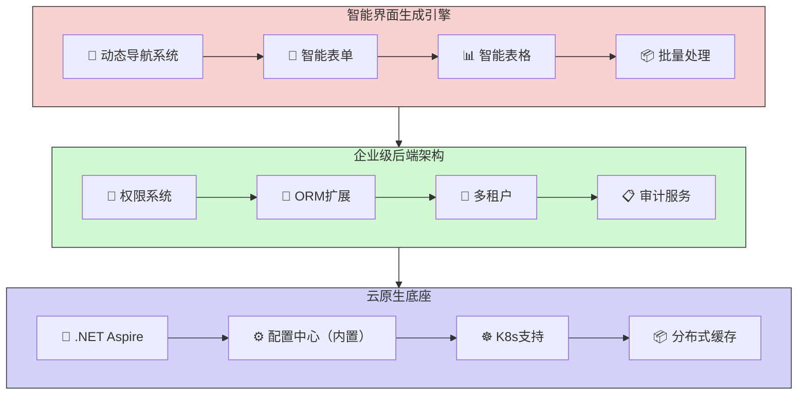

## 总体技术体系说明

## 1. 架构概览

CodeSpirit（码灵）是一款基于.NET 9构建的全栈低代码开发框架，通过智能代码生成引擎与AI深度协同，实现后端驱动式全栈开发范式。框架采用Clean Architecture分层设计，提供从界面生成、业务逻辑编排到系统运维的全生命周期支持。

### 1.1 架构图



## 2. 核心技术栈

| 类别         | 技术选型                                    |
| :----------- | :------------------------------------------ |
| **框架**     | .NET 9                                      |
| **语言**     | C# 12（支持Primary Constructor等新特性）    |
| **后端架构** | Clean Architecture + DDD                    |
| **ORM**      | Entity Framework Core（含软删除、审计追踪） |
| **前端生成** | AMIS（动态表单/表格生成）                   |
| **微服务**   | .NET Aspire（服务发现、健康检查）           |
| **容器编排** | Kubernetes（支持自动扩缩容）                |
| **身份认证** | JWT + OAuth2.0（RBAC/ABAC混合模型）         |
| **数据访问** | Repository Pattern + CQRS（部分模块）       |

## 3. 主要技术组件

#### 动态导航系统

- **权限同步**：基于RBAC模型自动生成菜单树，支持`PageAttribute`注解配置可见性
- **多级导航**：支持无限级嵌套菜单，自动处理路由懒加载

#### CRUD生成

- **自动化表单**：根据`QueryDto`生成查询条件（支持20+字段类型，如日期范围、下拉选择）
- **验证集成**：基于数据注解自动生成前端校验规则（如`[Required]`→必填提示）
- **批量处理**：Excel导入/导出模板自动生成，支持数据校验与异步任务

#### 权限系统（RBAC+ABAC）

- **权限树管理**：通过`IPermissionService`动态加载权限节点
- **细粒度控制**：支持基于属性（如用户部门、数据范围）的动态权限判定

#### 审计日志

- **全链路追踪**：记录操作人、时间、IP地址及数据变更详情
- **实体基类**：`AuditableEntityBase<TKey>`自动记录创建/修改信息

#### 实体框架扩展

- **全局过滤器**：自动注入多租户隔离（`TenantId`）和软删除（`IsDeleted`）
- **雪花ID生成**：分布式环境下唯一主键支持

#### 服务自动注册

通过标记接口实现依赖注入自动化：

- `IScopedDependency`：如数据库上下文（DbContext）
- `ITransientDependency`：如工具类服务
- `ISingletonDependency`：如配置中心客户端

#### 配置中心

- **多环境配置管理**
- **配置项实体: ConfigItem**

- **应用管理: App**
- **配置发布管理**

- **版本控制与回滚**

#### 通用CRUD服务

提供泛型CRUD服务基类，简化数据操作:

```csharp
public abstract class BaseCRUDService<TEntity, TDto, TKey, TCreateDto, TUpdateDto> : 

  IBaseCRUDService<TEntity, TDto, TKey, TCreateDto, TUpdateDto> 

  where TEntity : class

  where TDto : class

  where TKey : IEquatable<TKey>

  where TCreateDto : class

  where TUpdateDto : class

{

  // 省略实现...

}
```

#### 聚合器

**提供高级数据聚合能力:**

**字段动态替换**

**数据源关联**

**模板化展示**

**语法规则：**

- **静态替换**  
  直接使用模板修改字段值，无需请求外部数据源：

  ```plaintext
  createdBy#User-{value}
  ```

  - **效果**：`10001` → `User-10001`

- **动态替换**  
  通过数据源获取字段值，替换原值：

  ```plaintext
  updatedBy=/user/{value}.name
  ```

  - 请求 `/user/10002` 获取 `name` 字段值，如 `User-10002`
  - **效果**：`10002` → `User-10002`

- **动态补充**  
  将数据源字段追加到原值后（默认分隔符为空格）：

  ```plaintext
  items.createdBy=/user/{value}.fullName#{value} ({field})
  ```

  - 若原值为 `10003`，数据源返回 `fullName: "User-10003"`
  - **效果**：`10003` → `10003 (User-10003)`

- **开箱易用：**

  ```csharp
  /// <summary>
  /// 配置发布历史DTO
  /// </summary>
  public class ConfigPublishHistoryDto
  {
      /// <summary>
      /// 应用ID
      /// </summary>
      [DisplayName("应用ID")]
      public string AppId { get; set; }
  
      ...
      
      /// <summary>
      /// 发布时间
      /// </summary>
      [DisplayName("发布时间")]
      [DisplayFormat(DataFormatString = "{0:yyyy-MM-dd HH:mm:ss}")]
      public DateTime CreatedAt { get; set; }
  
      /// <summary>
      /// 发布人（通过CreatedBy属性获取发布人信息）
      /// TODO: 应提供聚合器独立的内部接口
      /// </summary>
      [DisplayName("发布人")]
      [AggregateField(dataSource: "http://identity/api/identity/users/{value}.data.name", template: "用户: {field}")]
      public string CreatedBy { get; set; }
  }
  ```

  

### 4. 项目结构

CodeSpirit框架采用以下项目结构：

```c#
Src/
├── ApiServices/
│   ├── CodeSpirit.IdentityApi/           # 身份认证API
│   ├── CodeSpirit.OrderApi/              # 订单服务API
│   └── CodeSpirit.ConfigCenter/          # 配置中心
│       └── CodeSpirit.ConfigCenter.Client/ # 配置中心客户端
├── Components/
│   ├── CodeSpirit.Aggregator/            # 聚合器组件
│   ├── CodeSpirit.Amis/                  # UI生成引擎
│   ├── CodeSpirit.Authorization/         # 权限组件
│   └── CodeSpirit.Navigation/            # 导航组件
├── CodeSpirit.AppHost/                   # Aspire应用宿主
├── CodeSpirit.Core/                      # 核心定义
├── CodeSpirit.ServiceDefaults/           # 服务默认配置
├── CodeSpirit.Shared/                    # 共享库
├── CodeSpirit.Web/                       # Web相关组件
└── Tests/
    ├── Components/
    │   ├── CodeSpirit.Aggregator.Tests/
    │   ├── CodeSpirit.Authorization.Tests/
    │   └── CodeSpirit.Components.TestsBase/
    ├── ApiServices/
    │   └── CodeSpirit.IdentityApi.Tests/
    └── CodeSpirit.Tests/                 # 通用测试
```
