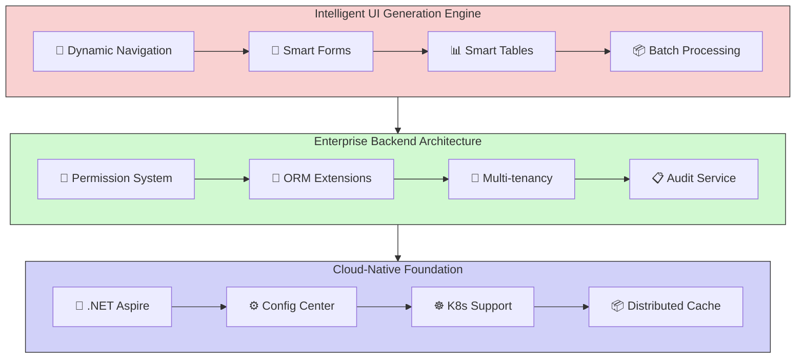
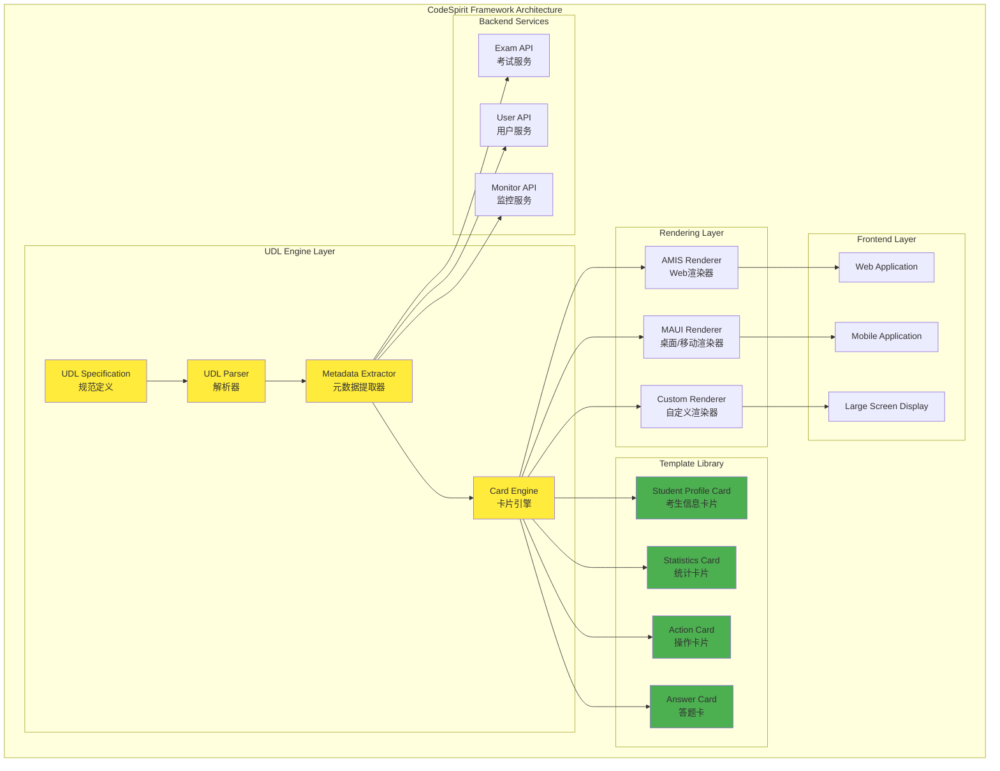
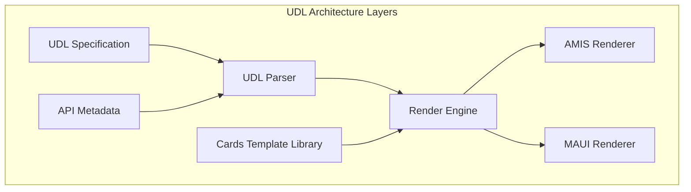
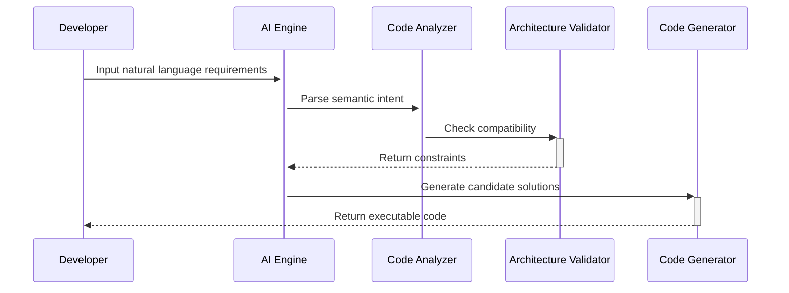

# CodeSpirit Low-Code Framework | [简体中文](README.zh-CN.md)

## Framework Overview

CodeSpirit is a revolutionary full-stack low-code development framework that achieves **backend-driven full-stack development paradigm** through intelligent code generation engine and deep AI collaboration. Built on .NET 9 technology stack, it provides enterprise-level technical depth and cloud-native scalability, supporting the entire lifecycle from UI generation and business logic orchestration to system operations.

**Return Full-Stack Development to Engineering Essence**

- **Backend-Driven Development Paradigm · Enterprise-Grade Open Architecture · AI-Enhanced Engineering Loop**

*Please follow our WeChat Official Account below for the latest demo account and password.*

***CodeSpirit, bringing elegant simplicity to complex system development!***

### Core Value Propositions

- **Full-Stack Intelligent Generation**: Eliminate 80% repetitive coding through backend model-driven frontend UI generation
- **Deeply Controllable Architecture**: Generated code is fully open and controllable, supporting smooth evolution from rapid prototyping to complex systems
- **Enterprise-Grade Engineering Capabilities**: Built-in permission system, audit tracking, distributed architecture support, out-of-the-box
- **AI-Collaborative Programming**: Requirement Description → Prototype Generation → Code Verification → Deployment Monitoring
- **Cloud-Native Foundation**: Native Kubernetes support, one-click deployment to multi-cloud environments

## Technical Architecture Overview

### Architecture Diagram

### UDL Integration Architecture

UDL serves as the core UI description language of the CodeSpirit framework, providing unified interface description and rendering capabilities:

### Core Technology Stack

| Category | Technology Selection |
| :--- | :--- |
| **Framework** | .NET 9 |
| **Language** | C# 12 (Supporting Primary Constructor and other new features) |
| **Backend Architecture** | Clean Architecture + DDD |
| **ORM** | Entity Framework Core (with soft delete, audit tracking) |
| **Frontend Generation** | AMIS (Dynamic form/table generation) |
| **UI Description Language** | UDL (Unified UI Description Language + Cards Library) |
| **Microservices** | .NET Aspire (Service discovery, health checks) |
| **Container Orchestration** | Kubernetes (Supporting auto-scaling) |
| **Identity Authentication** | JWT + OAuth2.0 (RBAC/ABAC hybrid model) |
| **Data Access** | Repository Pattern + CQRS (partial modules) |

## Functional Architecture Overview

### I. Intelligent UI Generation Engine

#### 1. Dynamic Navigation System

- Intelligent Permission Adaptation: Automatic synchronization with RBAC permission model for dynamic menu rendering
- Multi-level Navigation Support: Global navigation(*vNext*)/local navigation hybrid architecture

#### 2. Zero-Code CRUD Generation

| Module | Capabilities |
| :--- | :--- |
| Smart Forms | 20+ field type automatic mapping, including complex scenarios like image upload and Excel import |
| Smart Tables | Nested data presentation, column configuration hot reload, real-time quick editing |
| Batch Processing | Excel template import/export, multi-format data validation, visual data correction |
| Extended Operation System | Custom operation buttons, multi-step approval flows, permission-based context-sensitive operations |

*Note: Zero-code here refers to zero frontend code.*

#### 3. Intelligent Chart Analysis Module

- Dynamic Chart Engine: Automatically matches optimal visualization solutions based on data characteristics
- SQL2API: Generate API interfaces from SQL
- SQL2Chart: Generate charts based on SQL
- Intelligent Time Dimension: Support automatic year-over-year/month-over-month calculations, intelligent time granularity adaptation
- Multi-data Source Aggregation: SQL/NoSQL hybrid data source joint analysis

#### 4. Zero-Code H5 Generation (*VNext*)

- Smart Forms
- Smart Charts

#### 5. UDL (UI Description Language) Engine 🆕

UDL (UI Description Language) is a unified UI description language in the CodeSpirit framework, achieving "define once, use everywhere" cross-platform UI consistency development.

**Core Features**:
- **Unified Description Specification**: Standardized UI description format supporting Web, mobile, large screen and other multi-modal outputs
- **Intelligent Metadata Generation**: Automatically generate UI configuration based on API Controllers with zero frontend coding
- **UDL Cards Components**: Predefined card template library for rapid construction of information display, statistical analysis, and interactive interfaces
- **Multi-platform Rendering**: Unified configuration, automatically adapting to different rendering engines like AMIS, MAUI

**UDL Cards Predefined Templates**:
- Student Profile Card (student-profile-card): Display basic information with avatar and field icons support
- Statistics Card (stat-card): Data statistics display with progress bars, percentages, and status indicators
- Action Card (action-card): Interactive operation panels with multi-level operations and permission control
- Answer Card (answer-card): Exam scenario specific, answer status visualization

**Technical Architecture**:

**Application Scenarios**:
- Exam Monitoring Dashboard: Real-time statistics, status monitoring, anomaly alerts
- Exam Client: Student information display, answer progress tracking
- Management Backend: Data panels, operation interface auto-generation

### II. Enterprise-Grade Backend Architecture

#### 1. Core Framework Features

- **Cloud-Native Foundation**: Native k8s support, deep integration with .NET Aspire, native support for Dapr distributed architecture
- **Security System**: Four-layer defense system (Authentication/Authorization/Audit/Encryption)
- **High-Performance Guarantee**: Distributed caching, automatic second-level caching, intelligent query optimization

#### 2. Key Functional Components

- **Permission System**: RBAC+ABAC hybrid model, fine-grained permission control
- **ORM Extensions**: Soft delete, audit tracking, multi-tenancy support
- **Multi-tenancy**: Data isolation, configuration isolation
- **Data Filters**: Global filters, automatic injection
- **Audit Service**: Full-chain operation tracking, data change recording
- **Health Checks**: Service status monitoring, automatic failover
- **Event Bus**: Distributed event processing, message queue integration
- **Distributed Lock**: Redis distributed lock, duplicate submission prevention
- **Configuration Center**: Multi-environment configuration management, dynamic configuration updates
- **Aggregator**: Data aggregation, dynamic field replacement
- **PDF Generation**: Template-based PDF document generation
- **Time Processing**: Unified time processing mechanism, timezone support

### III. Out-of-the-Box Functional Modules

| Module Name | Core Features | Technical Characteristics |
| :--- | :--- | :--- |
| User Center | Multi-factor authentication, Organization management(*VNext*), Fine-grained permission control | RBAC+ABAC hybrid model |
| Audit Center | Operation log tracing, Data change tracking, Security compliance reporting | Elasticsearch storage |
| Configuration Center | Multi-environment configuration management, Version control, Dynamic updates | Built-in implementation |
| Order Center | Order management, Status flow, Payment integration | Event-driven architecture |

### IV. Full-Stack Generation Engine

- **Code Feedback**: Automatically generate backend repository and controller code based on frontend operations

- **AI-Assisted Design**:

  - Natural language requirement description → Automatic page prototype generation
  - Screenshot page → Automatic DTO structure inference
  - Voice commands → Real-time modification of table and form configurations

  Imagine this scenario:

  ***"Spirit, add a birthday field to the user table, use a calendar component, and display it as age in the list page"***

  AI assistant completes instantly:

  ✅ Modify DTO model

  ✅ Regenerate frontend

  ✅ Write database migration script

Concept Diagram:

## Roadmap

### Q2 2025

- Intelligent UI Generation Engine
- UDL Cards Basic Implementation
- CodeSpirit Beta Release
- H5 Generation Engine

### Q3 2025

- UDL Metadata Auto-Generation
- UDL Multi-Platform Rendering Support
- Visual Analysis Module
- Deep Integration of LLM Code Generation Capabilities

### Q4 2025

- UDL Ecosystem Completion (Visual Editor, Template Marketplace)
- Full-Stack Generation Engine
- Multi-Cloud Deployment Support
- Java Support

## Framework Advantages Comparison

### Low-Code Framework Comparison

| Dimension | CodeSpirit | Traditional Low-Code Platforms |
| :--- | :--- | :--- |
| Architecture Openness | Fully Open Code | Black Box Generation |
| Performance | Native Code-Level Performance | Interpretation Execution Performance Loss |
| Customization Capability | Customizable Base Architecture | Limited Extensions |
| Technology Stack | Latest .NET Ecosystem | Proprietary Tech Stack |
| Deployment Mode | Hybrid Cloud/On-Premises | SaaS Bound |

### Typical Development Scenario Comparison

| Traditional Mode | CodeSpirit Mode | Efficiency Improvement |
| :--- | :--- | :--- |
| Frontend-Backend Integration 3 hours | Auto-generation Complete | 8x |
| Form Validation Development 0.5 day | Declarative Configuration 5 minutes | 12x |
| Permission System Integration 2 days | Out-of-box + Policy Extension | ∞ |

## Try Now

https://codespirit-app.xin-lai.com/

Please follow "麦扣聊技术" WeChat Official Account for the latest demo account and password.

## Quick Start

1. Install and start Docker Desktop

2. Set CodeSpirit.AppHost as the startup project

3. Start (Docker images like redis, seq, rabbitmq will be pulled during startup. If unable to pull, please use acceleration methods)

   **Note: Currently based on .NET Aspire to simplify orchestration, service discovery, environment variables, and container settings configuration for distributed application development, making it easier to manage during the development phase.**

## Development Documentation

- Github: [xin-lai/CodeSpirit](https://github.com/xin-lai/CodeSpirit) **(Regular updates)**
- Gitee: [magicodes/CodeSpirit](https://gitee.com/magicodes/code-spirit) **(Priority updates)**

### 📘 Core Documentation

1. [📖 Development Guide (Draft)](#) - Complete development guide and best practices (*File not found*)
2. [🏗️ Overall Technical System Description](./Docs/01-Core-Docs/总体技术体系说明.md) - Technical architecture and design philosophy
3. [🏛️ Backend Architecture](./Docs/01-Core-Docs/后端架构.md) - Backend architecture design description
4. [🏗️ Project Architecture Design](./Docs/01-Core-Docs/项目整体架构设计.md) - Overall project architecture design and principles
5. [🔧 Development Environment Setup Guide](./Docs/01-Core-Docs/开发环境搭建指南.md) - Complete development environment configuration guide
6. [💎 CodeSpirit.Core Framework](./Docs/01-Core-Docs/CodeSpirit.Core核心框架.md) - Core framework components and architecture
7. [⚠️ Unified Exception Handling Guide](./Docs/01-Core-Docs/CodeSpirit统一异常处理指南.md) - Enterprise-level exception handling mechanisms and AMIS API compatibility

### 🎨 UI Generation Engine

8. [🎯 AMIS UI Generation Engine](./Docs/02-UI-Generation/CodeSpirit.Amis智能界面生成引擎.md) - Intelligent UI generation core component
9. [📊 AMIS Column Auto-Inference](./Docs/02-UI-Generation/AMIS列自动推断功能说明.md) - Intelligent table column generation detailed explanation
10. [📝 Form Default Values](./Docs/02-UI-Generation/CodeSpirit.Amis表单默认值使用指南.md) - Form default value configuration guide
11. [📈 Smart Chart Component](./Docs/02-UI-Generation/CodeSpirit.Charts智能图表使用指南.md) - Data visualization solution
12. [⏰ Date Time Column Optimization](./Docs/02-UI-Generation/日期时间列优化功能总结.md) - Intelligent time field processing
13. [🃏 UDL Cards Usage Guide](./Docs/02-UI-Generation/CodeSpirit.UDL-Cards卡片使用指南.md) - Unified card system usage guide and best practices
14. [🛠️ UDL Cards SDK Guide](./Docs/02-UI-Generation/CodeSpirit.UdlCards.SDK使用指南.md) - C# SDK detailed usage guide and API reference
15. [🎨 UDL UI Description Language Design](./Docs/02-UI-Generation/UDL-UI描述语言设计方案.md) - Unified UI description language architecture design
16. [🎯 UDL Cards Detailed Implementation](./Docs/02-UI-Generation/UDL-Cards详细实现方案.md) - Card component library implementation guide
17. [🎮 UDL Cards Simple Implementation](./Docs/02-UI-Generation/UDL-Cards简易实现方案.md) - Quick implementation guide for UDL Cards

### 🔧 Core Components

18. [🧭 Navigation Component](./Docs/03-Core-Components/CodeSpirit.Navigation导航组件使用指南.md) - Smart navigation system with multi-platform, permission filtering and context awareness
19. [🔗 Aggregator Usage Guide](./Docs/03-Core-Components/CodeSpirit.Aggregator聚合器使用指南.md) - Data aggregation and field replacement
20. [⚙️ Settings Management Component](./Docs/03-Core-Components/CodeSpirit.Settings设置管理组件使用指南.md) - Configuration management solution
21. [🔒 Distributed Lock Usage Guide](./Docs/03-Core-Components/CodeSpirit分布式锁使用指南.md) - Distributed lock implementation and usage
22. [📄 PDF Generation Component](./Docs/03-Core-Components/CodeSpirit.PdfGeneration使用指南.md) - PDF document generation service
23. [🕒 Time Processing Mechanism](./Docs/03-Core-Components/CodeSpirit时间处理机制.md) - Unified time processing solution
24. [🌐 Client IP Service](./Docs/03-Core-Components/ClientIpService使用指南.md) - Client IP acquisition and processing
25. [📋 Audit Component Integration Guide](./Docs/03-Core-Components/CodeSpirit.Audit审计组件集成使用指南.md) - Complete audit system integration and usage
26. [🚀 Unified Startup Framework Usage Guide](./Docs/03-Core-Components/CodeSpirit统一启动框架使用指南.md) - Unified API project startup framework, simplifying project creation and configuration
27. [🏗️ Unified Startup Framework Core Architecture](./Docs/03-Core-Components/CodeSpirit统一启动框架核心架构.md) - Architecture design and implementation principles of the unified startup framework
28. [📦 API Configuration Class Development Guide](./Docs/03-Core-Components/CodeSpirit.API配置类开发指南.md) - Development standards and best practices for API configuration classes
29. [🔌 Middleware Injection Point Usage Guide](./Docs/03-Core-Components/CodeSpirit中间件插入点使用指南.md) - Usage methods and extension mechanisms for middleware injection points
30. [🔄 Unified Startup Framework Migration Guide](./Docs/03-Core-Components/CodeSpirit统一启动框架迁移指南.md) - Detailed guide for migrating existing projects to the unified startup framework
31. [📝 Scrutor Dependency Injection Integration Guide](./Docs/03-Core-Components/Scrutor依赖注入集成指南.md) - Integration and usage methods of Scrutor library in the framework
32. [🖼️ Image Processing Service Integration Guide](./Docs/03-Core-Components/CodeSpirit.ImageProcessingService图片处理服务集成指南.md) - Integration and usage of image processing services
33. [📎 Entity File Reference Event Handler Usage Guide](./Docs/03-Core-Components/CodeSpirit.EntityFileReferenceHandler实体文件引用事件处理器使用指南.md) - Automatic management of entity file references
34. [🏷️ Resource Management Component Usage Guide](./Docs/03-Core-Components/ResourceTagHelper资源管理组件使用指南.md) - Usage methods of resource tag helpers

### 🔐 Identity & Authorization

35. [🔑 IdentityApi Identity Service](./Docs/04-Identity-Auth/CodeSpirit.IdentityApi身份认证服务.md) - Complete identity authentication service architecture
36. [👮 Authorization Component](./Docs/04-Identity-Auth/CodeSpirit.Authorization权限组件详解.md) - Comprehensive permission system with RBAC+ABAC hybrid model
37. [🎫 TokenManager Frontend Authentication Manager](./Docs/04-Identity-Auth/CodeSpirit.TokenManager前端认证管理器使用指南.md) - Frontend authentication management and token handling
38. [⚙️ ISettableCurrentUser Interface Guide](./Docs/04-Identity-Auth/ISettableCurrentUser可设置用户接口使用指南.md) - Settable current user interface for dynamic user context scenarios

### 🏢 Multi-Tenancy Architecture

39. [🏗️ Multi-Tenant Component Refactoring Plan](./Docs/05-Multi-Tenancy/CodeSpirit多租户组件整改计划.md) - Multi-tenancy architecture improvement and implementation plan
40. [🎯 TenantResolver Usage Guide](./Docs/05-Multi-Tenancy/CodeSpirit.TenantResolver租户解析器使用指南.md) - Tenant resolution and context management
41. [🔍 DataFilter Usage Guide](./Docs/05-Multi-Tenancy/CodeSpirit.DataFilter数据筛选器使用指南.md) - Data filtering and tenant isolation mechanisms
42. [🗄️ Multi-Tenant Database Context Architecture](./Docs/05-Multi-Tenancy/CodeSpirit 多租户数据库上下文架构.md) - Database architecture design for multi-tenancy
43. [🖥️ Multi-Tenant Login Page Usage Guide](./Docs/05-Multi-Tenancy/多租户登录页面使用指南.md) - Multi-tenant login interface implementation
44. [🎯 Tenant-Aware Event System Design](./Docs/05-Multi-Tenancy/CodeSpirit 租户感知事件系统设计.md) - Comprehensive tenant-aware event bus architecture and implementation

### 🚀 Infrastructure & DevOps

45. [🐰 RabbitMQ Integration Guide](./Docs/06-Infrastructure/RabbitMQ-Aspire-Integration.md) - Message queue integration solution
46. [🔧 RabbitMQ Troubleshooting](./Docs/06-Infrastructure/RabbitMQ故障排除指南.md) - Common problem solutions
47. [🔍 Elasticsearch Migration Summary](./Docs/06-Infrastructure/Elasticsearch-Aspire-Migration-Summary.md) - Search engine integration guide
48. [🌐 CORS Policy Configuration Guide](./Docs/06-Infrastructure/CodeSpirit跨域策略配置指南.md) - CORS cross-origin resource sharing configuration and security policies
49. [📁 File Storage Service Implementation](./Docs/06-Infrastructure/CodeSpirit文件存储服务方案实现.md) - File storage service architecture design and implementation

### 🌐 API & Communication

50. [🔗 Universal API Jump Mechanism Usage Guide](./Docs/07-API-Communication/CodeSpirit通用API跳转机制使用指南.md) - Universal API routing and communication mechanisms

### 📊 Project Management

51. [📋 Technical Debt Management](./Docs/08-Project-Management/技术债管理文档.md) - Technical debt tracking and management standards

### 📝 Exam System

52. [📚 Exam System Overview](./Docs/09-Exam-System/README.md) - Complete exam system documentation navigation and quick reference
53. [🏗️ Exam System Technical Architecture](./Docs/09-Exam-System/考试系统完整说明文档.md) - Comprehensive technical architecture, API design and security mechanisms
54. [📋 Exam System Business Functions](./Docs/09-Exam-System/考试系统业务功能清单.md) - Complete business function list with 200+ features across 12 modules

### 💬 Technical Community

[💬 Join Technical Community (Not yet open, please follow WeChat Official Account)](https://codespirit-chat.xin-lai.com/)

