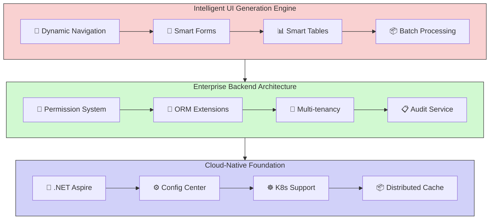
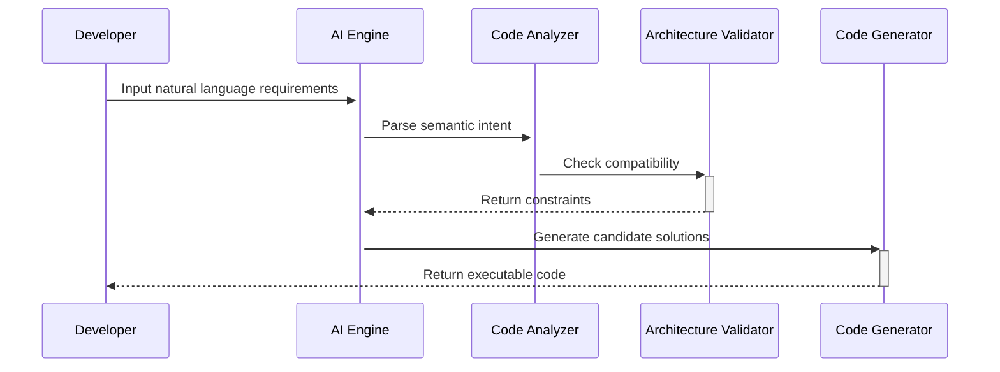

# CodeSpirit Low-Code Framework | [简体中文](README.zh-CN.md)

## Framework Overview

CodeSpirit is a revolutionary full-stack low-code development framework that achieves **backend-driven full-stack development paradigm** through intelligent code generation engine and deep AI collaboration. Built on .NET 9 technology stack, it provides enterprise-level technical depth and cloud-native scalability, supporting the entire lifecycle from UI generation and business logic orchestration to system operations.

**Return Full-Stack Development to Engineering Essence**

- **Backend-Driven Development Paradigm · Enterprise-Grade Open Architecture · AI-Enhanced Engineering Loop**

*Please follow our WeChat Official Account below for the latest demo account and password.*

***CodeSpirit, bringing elegant simplicity to complex system development!***

### Core Value Propositions

- **Full-Stack Intelligent Generation**: Eliminate 80% repetitive coding through backend model-driven frontend UI generation
- **Deeply Controllable Architecture**: Generated code is fully open and controllable, supporting smooth evolution from rapid prototyping to complex systems
- **Enterprise-Grade Engineering Capabilities**: Built-in permission system, audit tracking, distributed architecture support, out-of-the-box
- **AI-Collaborative Programming**: Requirement Description → Prototype Generation → Code Verification → Deployment Monitoring
- **Cloud-Native Foundation**: Native Kubernetes support, one-click deployment to multi-cloud environments

## Technical Architecture Overview

### Architecture Diagram

### Core Technology Stack

| Category | Technology Selection |
| :--- | :--- |
| **Framework** | .NET 9 |
| **Language** | C# 12 (Supporting Primary Constructor and other new features) |
| **Backend Architecture** | Clean Architecture + DDD |
| **ORM** | Entity Framework Core (with soft delete, audit tracking) |
| **Frontend Generation** | AMIS (Dynamic form/table generation) |
| **Microservices** | .NET Aspire (Service discovery, health checks) |
| **Container Orchestration** | Kubernetes (Supporting auto-scaling) |
| **Identity Authentication** | JWT + OAuth2.0 (RBAC/ABAC hybrid model) |
| **Data Access** | Repository Pattern + CQRS (partial modules) |

## Functional Architecture Overview

### I. Intelligent UI Generation Engine

#### 1. Dynamic Navigation System

- Intelligent Permission Adaptation: Automatic synchronization with RBAC permission model for dynamic menu rendering
- Multi-level Navigation Support: Global navigation(*vNext*)/local navigation hybrid architecture

#### 2. Zero-Code CRUD Generation

| Module | Capabilities |
| :--- | :--- |
| Smart Forms | 20+ field type automatic mapping, including complex scenarios like image upload and Excel import |
| Smart Tables | Nested data presentation, column configuration hot reload, real-time quick editing |
| Batch Processing | Excel template import/export, multi-format data validation, visual data correction |
| Extended Operation System | Custom operation buttons, multi-step approval flows, permission-based context-sensitive operations |

*Note: Zero-code here refers to zero frontend code.*

#### 3. Intelligent Chart Analysis Module

- Dynamic Chart Engine: Automatically matches optimal visualization solutions based on data characteristics
- SQL2API: Generate API interfaces from SQL
- SQL2Chart: Generate charts based on SQL
- Intelligent Time Dimension: Support automatic year-over-year/month-over-month calculations, intelligent time granularity adaptation
- Multi-data Source Aggregation: SQL/NoSQL hybrid data source joint analysis

#### 4. Zero-Code H5 Generation (*VNext*)

- Smart Forms
- Smart Charts

### II. Enterprise-Grade Backend Architecture

#### 1. Core Framework Features

- **Cloud-Native Foundation**: Native k8s support, deep integration with .NET Aspire, native support for Dapr distributed architecture
- **Security System**: Four-layer defense system (Authentication/Authorization/Audit/Encryption)
- **High-Performance Guarantee**: Distributed caching, automatic second-level caching, intelligent query optimization

#### 2. Key Functional Components

- **Permission System**: RBAC+ABAC hybrid model, fine-grained permission control
- **ORM Extensions**: Soft delete, audit tracking, multi-tenancy support
- **Multi-tenancy**: Data isolation, configuration isolation
- **Data Filters**: Global filters, automatic injection
- **Audit Service**: Full-chain operation tracking, data change recording
- **Health Checks**: Service status monitoring, automatic failover
- **Event Bus**: Distributed event processing, message queue integration
- **Distributed Lock**: Redis distributed lock, duplicate submission prevention
- **Configuration Center**: Multi-environment configuration management, dynamic configuration updates
- **Aggregator**: Data aggregation, dynamic field replacement
- **PDF Generation**: Template-based PDF document generation
- **Time Processing**: Unified time processing mechanism, timezone support

### III. Out-of-the-Box Functional Modules

| Module Name | Core Features | Technical Characteristics |
| :--- | :--- | :--- |
| User Center | Multi-factor authentication, Organization management(*VNext*), Fine-grained permission control | RBAC+ABAC hybrid model |
| Audit Center | Operation log tracing, Data change tracking, Security compliance reporting | Elasticsearch storage |
| Configuration Center | Multi-environment configuration management, Version control, Dynamic updates | Built-in implementation |
| Order Center | Order management, Status flow, Payment integration | Event-driven architecture |

### IV. Full-Stack Generation Engine

- **Code Feedback**: Automatically generate backend repository and controller code based on frontend operations

- **AI-Assisted Design**:

  - Natural language requirement description → Automatic page prototype generation
  - Screenshot page → Automatic DTO structure inference
  - Voice commands → Real-time modification of table and form configurations

  Imagine this scenario:

  ***"Spirit, add a birthday field to the user table, use a calendar component, and display it as age in the list page"***

  AI assistant completes instantly:

  ✅ Modify DTO model

  ✅ Regenerate frontend

  ✅ Write database migration script

Concept Diagram:

## Roadmap

### Q2 2025

- Intelligent UI Generation Engine
- CodeSpirit Beta Release
- H5 Generation Engine

### Q3 2025

- Visual Analysis Module
- Deep Integration of LLM Code Generation Capabilities

### Q4 2025

- Full-Stack Generation Engine
- Multi-Cloud Deployment Support
- Java Support

## Framework Advantages Comparison

### Low-Code Framework Comparison

| Dimension | CodeSpirit | Traditional Low-Code Platforms |
| :--- | :--- | :--- |
| Architecture Openness | Fully Open Code | Black Box Generation |
| Performance | Native Code-Level Performance | Interpretation Execution Performance Loss |
| Customization Capability | Customizable Base Architecture | Limited Extensions |
| Technology Stack | Latest .NET Ecosystem | Proprietary Tech Stack |
| Deployment Mode | Hybrid Cloud/On-Premises | SaaS Bound |

### Typical Development Scenario Comparison

| Traditional Mode | CodeSpirit Mode | Efficiency Improvement |
| :--- | :--- | :--- |
| Frontend-Backend Integration 3 hours | Auto-generation Complete | 8x |
| Form Validation Development 0.5 day | Declarative Configuration 5 minutes | 12x |
| Permission System Integration 2 days | Out-of-box + Policy Extension | ∞ |

## Try Now

https://codespirit-app.xin-lai.com/

Please follow "麦扣聊技术" WeChat Official Account for the latest demo account and password.

## Quick Start

1. Install and start Docker Desktop

2. Set CodeSpirit.AppHost as the startup project

3. Start (Docker images like redis, seq, rabbitmq will be pulled during startup. If unable to pull, please use acceleration methods)

   **Note: Currently based on .NET Aspire to simplify orchestration, service discovery, environment variables, and container settings configuration for distributed application development, making it easier to manage during the development phase.**

## Development Documentation

- Github: [xin-lai/CodeSpirit](https://github.com/xin-lai/CodeSpirit) **(Regular updates)**
- Gitee: [magicodes/CodeSpirit](https://gitee.com/magicodes/code-spirit) **(Priority updates)**

### 📘 Core Documentation

1. [📖 Development Guide (Draft)](./Docs/CodeSpirit（码灵）开发指南（初稿）.md) - Complete development guide and best practices
2. [🏗️ Overall Technical System Description](./Docs/总体技术体系说明.md) - Technical architecture and design philosophy
3. [🏛️ Backend Architecture](./Docs/后端架构.md) - Backend architecture design description

### 🎨 UI Generation Engine

4. [🎯 AMIS UI Generation Engine](./Docs/CodeSpirit.Amis.md) - Intelligent UI generation core component
5. [📊 AMIS Column Auto-Inference](./Docs/AMIS列自动推断功能说明.md) - Intelligent table column generation detailed explanation
6. [📝 Form Default Values](./Docs/CodeSpirit.Amis表单默认值使用指南.md) - Form default value configuration guide
7. [📈 Smart Chart Component](./Docs/CodeSpirit.Charts智能图表使用指南.md) - Data visualization solution
8. [⏰ Date Time Column Optimization](./Docs/日期时间列优化功能总结.md) - Intelligent time field processing

### 🔧 Core Components

9. [🔗 Aggregator Usage Guide](./Docs/CodeSpirit.Aggregator聚合器使用指南.md) - Data aggregation and field replacement
10. [⚙️ Settings Management Component](./Docs/CodeSpirit.Settings设置管理组件使用指南.md) - Configuration management solution
11. [🔒 Distributed Lock Usage Guide](./Docs/CodeSpirit分布式锁使用指南.md) - Distributed lock implementation and usage
12. [📄 PDF Generation Component](./Docs/CodeSpirit.PdfGeneration使用指南.md) - PDF document generation service
13. [🕒 Time Processing Mechanism](./Docs/CodeSpirit时间处理机制.md) - Unified time processing solution
14. [🌐 Client IP Service](./Docs/ClientIpService使用指南.md) - Client IP acquisition and processing
15. [📋 Audit Component Integration Guide](./Docs/CodeSpirit.Audit审计组件集成使用指南.md) - Complete audit system integration and usage

### 🚀 Infrastructure

16. [🐰 RabbitMQ Integration Guide](./Docs/RabbitMQ-Aspire-Integration.md) - Message queue integration solution
17. [🔧 RabbitMQ Troubleshooting](./Docs/RabbitMQ故障排除指南.md) - Common problem solutions
18. [🔍 Elasticsearch Migration Summary](./Docs/Elasticsearch-Aspire-Migration-Summary.md) - Search engine integration guide

### 💬 Technical Community

[💬 Join Technical Community (Not yet open, please follow WeChat Official Account)](https://codespirit-chat.xin-lai.com/)

