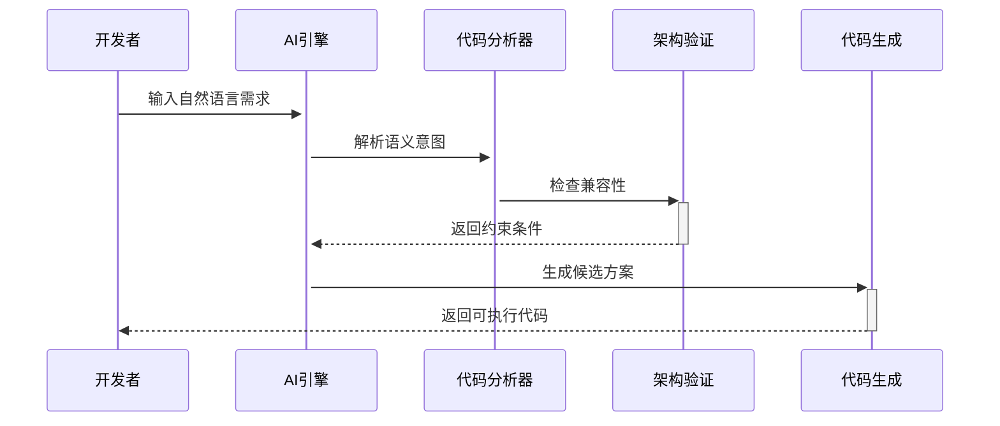

# CodeSpirit（码灵）低代码框架 | [English](README.md)

## 框架概览

CodeSpirit（码灵）是一款革命性的全栈低代码开发框架，通过智能代码生成引擎与AI深度协同，实现**后端驱动式全栈开发范式**。基于.NET 9技术栈构建，将具备企业级技术深度与云原生扩展能力，提供从界面生成、业务逻辑编排到系统运维的全生命周期支持。

**让全栈开发回归工程本质**

- **后端驱动式开发范式 · 企业级开放架构 · AI增强工程闭环**

[](https://codespirit-app.xin-lai.com/)
	*请关注下方公众号获取最新的体验账号及密码。*

***CodeSpirit，让复杂系统开发回归优雅本质！***

### 核心价值主张

- **全栈智能生成**：通过后端模型驱动前端界面生成，消除80%重复编码工作

- **深度可控架构**：生成代码完全开放可控，支持从快速原型到复杂系统的平滑演进

- **企业级工程能力**：内置权限体系、审计追踪、分布式架构支持，开箱即用

- **AI协同编程**：需求描述` → `原型生成` → `代码验证` → `部署监控

- **云原生底座**：Kubernetes原生支持，一键部署到多云环境

  ```mermaid
  graph TD
    A[开发效能] --> A1[全栈智能生成]
    A --> A2[AI实时协作]
    B[架构控制] --> B1[开放代码架构]
    B --> B2[平滑演进能力]
    C[企业级保障] --> C1[安全合规]
    C --> C2[性能扩展]
    D[生态融合] --> D1[云原生支持]
    D --> D2[多技术栈扩展]
  ```

  

## 功能架构全景

### 一、智能界面生成引擎

#### 1. 动态导航系统

- 智能权限适配：自动同步RBAC权限模型，实现动态菜单渲染
- 多级导航支持：支持全局导航(*vNext*)/局部导航混合架构

#### 2. 零代码CRUD生成

| 功能模块     | 实现能力                                                   |
| :----------- | :--------------------------------------------------------- |
| 智能表单     | 支持20+字段类型自动映射，包含图片上传、Excel导入等复杂场景 |
| 智能表格     | 嵌套数据呈现、列配置热加载、实时快速编辑                   |
| 批量处理     | Excel模板导入/导出、多格式数据校验、可视化数据修正         |
| 扩展操作体系 | 自定义操作按钮、多步骤审批流、基于权限的上下文敏感操作     |

*注意：这里的零代码指的是零前端代码。*

#### 3. 可视化分析模块（*VNext*）

- 动态图表引擎：根据数据特征自动匹配最佳可视化方案
- SQL2API：根据SQL生成API接口
- SQL2Chart：基于SQL生成图表
- 智能时间维度：支持同比/环比自动计算，时间颗粒度智能适配
- 多数据源聚合：SQL/NoSQL混合数据源联合分析

#### 4. 零代码H5生成（*VNext*）

- 智能表单
- 智能图表

### 二、企业级后端架构

#### 1. 核心框架特性

- **云原生底座**：k8s原生支持，深度集成.NET Aspire，原生支持Dapr分布式架构
- **安全体系**：四层防御体系（认证/授权/审计/加密）
- **高性能保障**：分布式缓存、二级自动缓存、智能查询优化

#### 2. 关键功能组件

- **权限系统**
- **ORM扩展**
- **多租户**
- **数据筛选器**
- **审计服务**
- **健康检查**
- **事件总线**
- ...

### 三、开箱即用功能模块

| 模块名称 | 核心功能                                            | 技术特性          |
| :------- | :-------------------------------------------------- | :---------------- |
| 用户中心 | 多因子认证、组织架构管理（*VNext*）、细粒度权限控制 | RBAC+ABAC混合模型 |
| 审计中心 | 操作日志追溯、数据变更追踪、安全合规报告            |                   |
| 订单中心 |                                                     |                   |
| ...      | ...                                                 | ...               |

### 四、全栈生成引擎

- **代码反哺**：根据前端操作自动生成后端仓储、控制器代码

- **AI辅助设计**：

  - 用自然语言描述需求→自动生成页面原型
  - 截图页面→自动推导DTO结构
  - 语音指令→实时修改表格、表单配置

  想象这样的场景：

  ***"灵儿，给用户表加个生日字段，要日历组件，在列表页显示为年龄"***

  AI助手即刻完成：

  ✅ 修改DTO模型

  ✅ 重新生成前端

  ✅ 编写数据库迁移脚本

概念图：




## 路线图规划

### Q1 2025

- 智能界面生成引擎
- 码灵Beta版发布
- H5生成引擎

### Q2 2025

- 可视化分析模块
- 深度集成LLM代码生成能力

### Q3 2025

- 全栈生成引擎
- 多云部署支持
- Java支持

### Q4 2025

- DSL支持
- 智能运维机器人
- 低代码应用市场

## 框架优势对比

### 低代码框架对比

| 维度       | CodeSpirit      | 传统低代码平台   |
| :--------- | :-------------- | :--------------- |
| 架构开放性 | 全代码开放      | 黑箱生成         |
| 性能表现   | 原生代码级性能  | 解释执行性能损耗 |
| 定制能力   | 底层架构可定制  | 有限扩展         |
| 技术栈     | 最新.NET生态    | 私有技术栈       |
| 部署模式   | 混合云/本地部署 | SaaS绑定         |

### 典型开发场景对比

| 传统模式          | CodeSpirit模式      | 效率提升 |
| :---------------- | :------------------ | :------- |
| 前后端联调3小时   | 自动生成联调完成    | 8x       |
| 表单校验开发0.5天 | 声明式配置5分钟     | 12x      |
| 权限系统集成2天   | 开箱即用 + 策略扩展 | ∞        |

## 立即体验

https://codespirit-app.xin-lai.com/

请关注“麦扣聊技术”公众号获取最新的体验账号及密码。

## 开发文档

- Github：[xin-lai/CodeSpirit](https://github.com/xin-lai/CodeSpirit)
- Gitee：[magicodes/CodeSpirit](https://gitee.com/magicodes/code-spirit)

[📘 完整开发文档](https://codespirit-docs.xin-lai.com/) | [💬 加入技术社区](https://codespirit-chat.xin-lai.com/)

1. [界面生成引擎](./Docs/CodeSpirit.Amis.md)
2. [后端架构说明](./Docs/后端架构.md)
3. CRUD开发（TODO）


