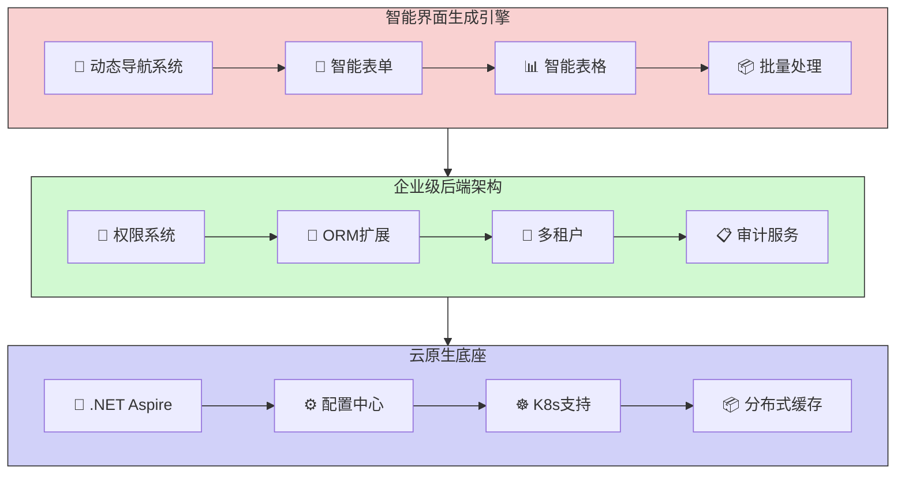
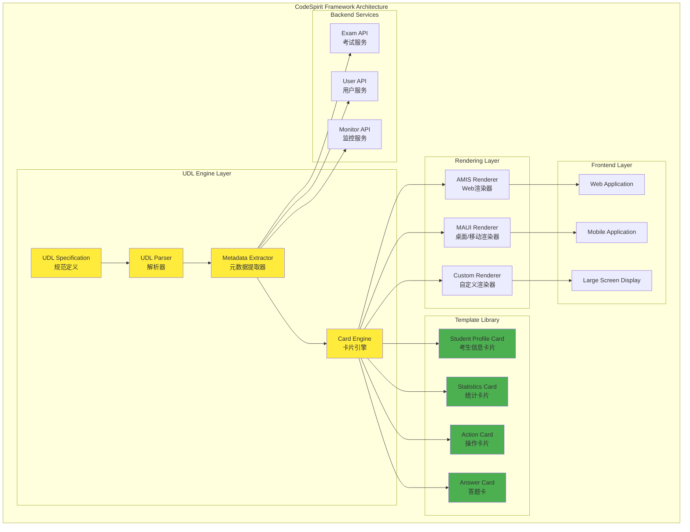
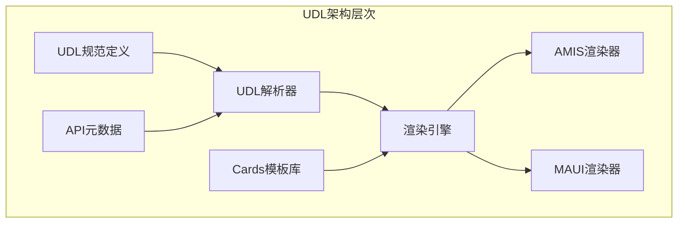
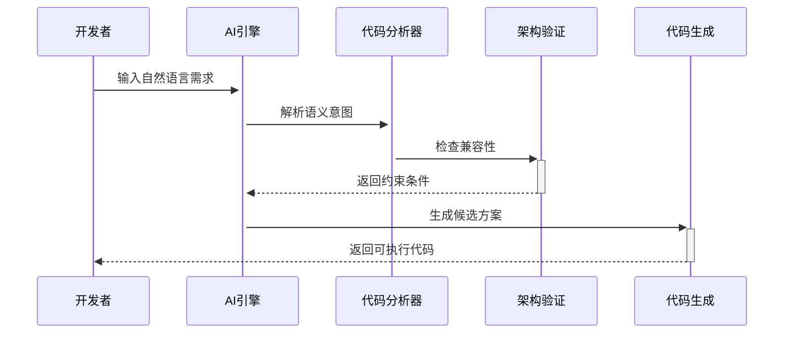

# CodeSpirit（码灵）AI框架 | [English](README.md)

## 框架概览

CodeSpirit（码灵）是一款革命性的全栈低代码+AI开发框架，通过**智能代码生成引擎与AI深度协同**，实现**后端驱动式全栈开发范式**。基于.NET 9技术栈构建，具备企业级技术深度与云原生扩展能力，提供从界面生成、业务逻辑编排到系统运维的全生命周期支持。

**让全栈开发回归工程本质**

- **后端驱动式开发范式 · 企业级开放架构 · AI增强工程闭环**

[](https://codespirit-app.xin-lai.com/)
*请关注下方公众号获取最新的体验账号及密码。*

***CodeSpirit，让复杂系统开发回归优雅本质！***

*码灵源自我一本未出世的科幻小说，如有兴趣，可开源更新。*

### 🌟 核心创新亮点

#### 革命性AI集成 🤖
- **零配置AI端点生成**: 业界首创！仅需一个特性标记，自动生成AI填充API端点，无需编写任何控制器代码
- **智能表单填充**: 自动分析DTO结构生成提示词，自动解析AI响应并填充表单，开发效率提升10倍+
- **AI长任务处理**: 完善的AI任务管理和进度跟踪，支持多步骤界面展示和实时轮询
- **统一LLM接口**: 支持OpenAI、阿里云通义千问、DeepSeek等多种大语言模型无缝切换

#### 极致开发体验 🚀
- **统一启动框架**: Program.cs仅需2行代码即可完成API项目配置，标准化程度极高
- **自动依赖注入**: 基于Scrutor的零配置批量服务注册，通过接口标记自动识别生命周期
- **多数据库支持**: MySQL和SQL Server灵活切换，独立迁移管理，业务代码完全解耦
- **智能图表推荐**: 基于数据特征自动推荐最佳可视化方案，零前端代码生成图表

#### 企业级架构 🏢
- **事件驱动架构**: 基于RabbitMQ的分布式事件系统，支持租户感知和跨服务通信
- **RBAC+ABAC混合权限**: 细粒度权限控制，支持权限继承和数据范围限制
- **完善的多租户**: 数据隔离、配置隔离、租户感知事件系统
- **分布式组件库**: 分布式锁、文件存储、图片处理、PDF生成等开箱即用

### 核心价值主张

- **全栈智能生成**：通过后端模型驱动前端界面生成，消除80%重复编码工作

- **深度可控架构**：生成代码完全开放可控，支持从快速原型到复杂系统的平滑演进

- **企业级工程能力**：内置权限体系、审计追踪、分布式架构支持，开箱即用

- **AI协同编程**：需求描述` → `原型生成` → `代码验证` → `部署监控

- **云原生底座**：Kubernetes原生支持，一键部署到多云环境

  ```mermaid
  graph TD
    A[开发效能] --> A1[全栈智能生成]
    A --> A2[AI实时协作]
    B[架构控制] --> B1[开放代码架构]
    B --> B2[平滑演进能力]
    C[企业级保障] --> C1[安全合规]
    C --> C2[性能扩展]
    D[生态融合] --> D1[云原生支持]
    D --> D2[多技术栈扩展]
  ```

## 技术架构全景

### 架构图


```mermaid
flowchart TD
    classDef uiLayer fill:#f9d1d1,stroke:#333,stroke-width:1px
    classDef backendLayer fill:#d1f9d1,stroke:#333,stroke-width:1px
    classDef cloudLayer fill:#d1d1f9,stroke:#333,stroke-width:1px
    
    subgraph UI["智能界面生成引擎"]
        direction LR
        A1["🧭 动态导航系统"] --> A2["📝 智能表单"]
        A2 --> A3["📊 智能表格"]
        A3 --> A4["📦 批量处理"]
    end
    
    subgraph Backend["企业级后端架构"]
        direction LR
        B1["🔐 权限系统"] --> B2["💾 ORM扩展"]
        B2 --> B3["🏢 多租户"]
        B3 --> B4["📋 审计服务"]
    end
    
    subgraph Cloud["云原生底座"]
        direction LR
        C1["🚀 .NET Aspire"] --> C2["⚙️ 配置中心"]
        C2 --> C3["☸️ K8s支持"]
        C3 --> C4["📦 分布式缓存"]
    end
    
    UI --> Backend
    Backend --> Cloud
    
    class UI uiLayer
    class Backend backendLayer
    class Cloud cloudLayer
```

### UDL集成架构

UDL作为CodeSpirit框架的核心UI描述语言，提供了统一的界面描述和渲染能力：


```mermaid
graph TB
    subgraph "CodeSpirit Framework Architecture"
        subgraph "Frontend Layer"
            WebApp["Web Application"]
            MobileApp["Mobile Application"]
            LargeScreen["Large Screen Display"]
        end
        
        subgraph "UDL Engine Layer"
            UDLSpec["UDL Specification<br/>规范定义"]
            UDLParser["UDL Parser<br/>解析器"]
            MetadataExtractor["Metadata Extractor<br/>元数据提取器"]
            CardEngine["Card Engine<br/>卡片引擎"]
        end
        
        subgraph "Rendering Layer"
            AmisRenderer["AMIS Renderer<br/>Web渲染器"]
            MauiRenderer["MAUI Renderer<br/>桌面/移动渲染器"]
            CustomRenderer["Custom Renderer<br/>自定义渲染器"]
        end
        
        subgraph "Template Library"
            StudentCard["Student Profile Card<br/>考生信息卡片"]
            StatCard["Statistics Card<br/>统计卡片"]
            ActionCard["Action Card<br/>操作卡片"]
            AnswerCard["Answer Card<br/>答题卡"]
        end
        
        subgraph "Backend Services"
            ExamAPI["Exam API<br/>考试服务"]
            UserAPI["User API<br/>用户服务"]
            MonitorAPI["Monitor API<br/>监控服务"]
        end
    end
    
    %% UDL Engine Flow
    UDLParser --> MetadataExtractor
    MetadataExtractor --> CardEngine
    UDLSpec --> UDLParser
    
    %% UDL to Renderers
    CardEngine --> AmisRenderer
    CardEngine --> MauiRenderer
    CardEngine --> CustomRenderer
    
    %% Template Library
    CardEngine --> StudentCard
    CardEngine --> StatCard
    CardEngine --> ActionCard
    CardEngine --> AnswerCard
    
    %% Renderers to Frontend
    AmisRenderer --> WebApp
    MauiRenderer --> MobileApp
    CustomRenderer --> LargeScreen
    
    %% Backend Integration
    MetadataExtractor --> ExamAPI
    MetadataExtractor --> UserAPI
    MetadataExtractor --> MonitorAPI
    
    style UDLSpec fill:#ffeb3b
    style UDLParser fill:#ffeb3b
    style MetadataExtractor fill:#ffeb3b
    style CardEngine fill:#ffeb3b
    style StudentCard fill:#4caf50
    style StatCard fill:#4caf50
    style ActionCard fill:#4caf50
    style AnswerCard fill:#4caf50
```

### 核心技术栈

| 类别         | 技术选型                                    |
| :----------- | :------------------------------------------ |
| **框架**     | .NET 9                                      |
| **语言**     | C# 12（支持Primary Constructor等新特性）    |
| **后端架构** | Clean Architecture + DDD                    |
| **ORM**      | Entity Framework Core（含软删除、审计追踪） |
| **前端生成** | AMIS（动态表单/表格生成）                   |
| **UI描述语言** | UDL（统一UI描述语言 + Cards组件库）       |
| **微服务**   | .NET Aspire（服务发现、健康检查）           |
| **容器编排** | Kubernetes（支持自动扩缩容）                |
| **身份认证** | JWT + OAuth2.0（RBAC/ABAC混合模型）         |
| **数据访问** | Repository Pattern + CQRS（部分模块）       |

## 项目结构

### 核心架构

```
Src/
├── ApiServices/                          # API服务层
│   ├── CodeSpirit.AiCardsApi/           # AI卡片API服务
│   ├── CodeSpirit.ConfigCenter/         # 配置中心API
│   ├── CodeSpirit.ExamApi/              # 考试系统API
│   ├── CodeSpirit.FileStorageApi/       # 文件存储API
│   ├── CodeSpirit.IdentityApi/          # 身份认证API
│   ├── CodeSpirit.MessagingApi/         # 消息服务API
│   └── CodeSpirit.SurveyApi/            # 问卷调查API
├── Components/                           # 独立组件库
│   ├── CodeSpirit.Aggregator/           # 数据聚合器组件
│   ├── CodeSpirit.AiFormFill/           # AI表单智能填充组件
│   ├── CodeSpirit.Amis/                 # AMIS界面生成引擎
│   ├── CodeSpirit.Audit/                # 审计追踪组件
│   ├── CodeSpirit.Authorization/        # 权限管理组件
│   ├── CodeSpirit.Charts/               # 智能图表组件
│   ├── CodeSpirit.ConfigCenter.Client/ # 配置中心客户端
│   ├── CodeSpirit.LLM/                  # 大语言模型集成组件
│   ├── CodeSpirit.Messaging/            # 消息队列组件
│   ├── CodeSpirit.MultiTenant/          # 多租户组件
│   ├── CodeSpirit.Navigation/           # 导航组件
│   ├── CodeSpirit.PdfGeneration/        # PDF生成组件
│   ├── CodeSpirit.Settings/             # 设置管理组件
│   ├── CodeSpirit.Shared/               # 组件共享库
│   └── CodeSpirit.UdlCards/             # UDL卡片组件
├── CodeSpirit.AppHost/                   # Aspire应用宿主（启动项目）
├── CodeSpirit.Core/                      # 核心框架定义
├── CodeSpirit.ServiceDefaults/           # 服务默认配置
├── CodeSpirit.Shared/                    # 全局共享库
├── CodeSpirit.Web/                       # Web前端项目
└── Tests/                                # 测试项目集合
    ├── ApiServices/                      # API服务测试
    ├── Components/                       # 组件测试
    └── CodeSpirit.*.Tests/               # 各模块单元测试
```

## 功能架构全景

### 一、AI增强特性 🤖

#### 1. CodeSpirit.LLM - 大语言模型集成组件

**统一的大语言模型集成解决方案**

**核心特性**:
- ✅ **多模型支持**: 统一接口支持 OpenAI、阿里云通义千问、DeepSeek 等多种LLM API
- ✅ **零配置使用**: 默认使用配置文件，无需编写设置提供者
- ✅ **流式响应**: 支持流式响应处理，提升用户体验
- ✅ **代理支持**: 内置HTTP代理配置支持
- ✅ **统一配置管理**: 在 Aspire 主机中统一配置所有服务的LLM参数
- ✅ **灵活切换**: 支持全局LLM和独立LLM配置，满足不同场景需求

**应用场景**:
- 🎯 **智能题目生成**: 考试系统中基于主题、难度自动生成试题
- 📝 **表单智能填充**: 根据关键字自动填充表单其他字段
- 💬 **智能客服**: 集成AI助手提供智能问答
- 📊 **数据分析**: AI驱动的数据洞察和报告生成

#### 2. CodeSpirit.AiFormFill - AI表单智能填充组件 ⭐

**革命性的零配置AI表单填充解决方案 - 业界首创！**

**创新亮点**:
- 🚀 **零配置端点生成**: 基于DTO自动生成AI填充的API端点，**无需手动编写控制器代码**
- 🎯 **自动化程度极高**: 
  - 自动端点扫描和注册
  - 智能路由推断
  - 自动提示词构建
  - 自动验证规则读取
  - 自动UI增强
- 🔄 **双模式支持**: 支持全局AI填充模式和字段触发模式
- 🎨 **特性驱动**: 通过简单的 `[AiFormFill]` 特性标记即可启用
- 📦 **独立组件**: 可作为NuGet包独立发布，仅依赖 Core 和 LLM

**使用示例**:
```csharp
// 仅需在DTO上添加特性，无需编写任何控制器代码！
[AiFormFill(
    TriggerField = "Topic",
    MaxTokens = 1000,
    EnableCache = true
)]
public class CreateQuestionDto
{
    [DisplayName("主题")]
    public string Topic { get; set; }
    
    [DisplayName("题目内容")]
    [Required]
    public string Content { get; set; }
    
    [DisplayName("选项A")]
    public string OptionA { get; set; }
    
    // 系统自动完成:
    // ✅ 生成 POST /api/exam/questions/ai-fill 端点
    // ✅ 路由自动推断
    // ✅ 中间件拦截处理
    // ✅ 前端UI自动增强(在Topic字段显示AI填充按钮)
}
```

**核心优势**:
1. **开发效率提升10倍+**
   - 传统方式: 编写控制器 → 实现服务 → 前端调用 → 集成UI
   - AI表单填充: 一个特性标记即可完成所有工作

2. **智能化程度极高**
   - 自动字段分析和验证规则提取
   - 智能提示词生成
   - 自动响应解析和类型转换
   - 自动缓存管理

3. **用户体验优秀**
   - 前端自动显示AI填充按钮和图标
   - 一键触发智能填充
   - 支持增量填充(保留已填写内容)

#### 3. AI Form - 长时间任务处理框架

**专为AI驱动的长时间处理任务设计的多步骤用户界面**

**核心特性**:
- 📊 **自动化UI生成**: 基于 `OperationAttribute` 自动生成完整的AI表单界面
- 🔄 **实时轮询**: 自动轮询AI任务状态，实时更新进度和日志
- ⏱️ **超时控制**: 支持自定义轮询间隔和最大轮询时间
- 🚀 **异步处理**: 避免长时间AI响应导致的请求超时
- 📝 **完整反馈**: 多步骤界面展示(表单面板、步骤进度、日志面板、结果展示)

**应用场景**:
- 📝 **AI文档生成**: 需要几分钟的长文档生成
- 📊 **AI数据分析**: 复杂的数据处理和分析
- 🎨 **AI内容创作**: 批量内容生成
- 🔄 **AI批量处理**: 大规模数据的AI处理

#### 4. AI题目生成服务

**考试系统中的智能题目生成解决方案**

**功能特性**:
- 🎯 **智能生成**: 根据主题、题型、难度、数量等参数智能生成试题
- 📊 **实时反馈**: 通过回调函数实时报告生成进度
- 🔄 **批量处理**: 支持批量生成多道题目
- 🎨 **灵活配置**: 支持自定义提示词模板

### 二、智能界面生成引擎

#### 1. 动态导航系统

- 智能权限适配：自动同步RBAC权限模型，实现动态菜单渲染
- 多级导航支持：支持全局导航(*vNext*)/局部导航混合架构

#### 2. 零代码CRUD生成

| 功能模块     | 实现能力                                                   |
| :----------- | :--------------------------------------------------------- |
| 智能表单     | 支持20+字段类型自动映射，包含图片上传、Excel导入等复杂场景 |
| 智能表格     | 嵌套数据呈现、列配置热加载、实时快速编辑                   |
| 批量处理     | Excel模板导入/导出、多格式数据校验、可视化数据修正         |
| 扩展操作体系 | 自定义操作按钮、多步骤审批流、基于权限的上下文敏感操作     |

*注意：这里的零代码指的是零前端代码。*

#### 3. 智能图表分析模块

- 动态图表引擎：根据数据特征自动匹配最佳可视化方案
- SQL2API：根据SQL生成API接口
- SQL2Chart：基于SQL生成图表
- 智能时间维度：支持同比/环比自动计算，时间颗粒度智能适配
- 多数据源聚合：SQL/NoSQL混合数据源联合分析

#### 4. 零代码H5生成（*VNext*）

- 智能表单
- 智能图表

#### 5. UDL（UI描述语言）引擎 🆕

UDL（UI Description Language）是CodeSpirit框架中的统一UI描述语言，实现"一次定义，处处使用"的跨平台UI一致性开发。

**核心特性**：
- **统一描述规范**：标准化的UI描述格式，支持Web、移动端、大屏等多模态输出
- **智能元数据生成**：基于API Controller自动生成UI配置，零前端编码
- **UDL Cards组件**：预定义卡片模板库，快速构建信息展示、统计分析、操作交互界面
- **多平台渲染**：统一配置，自动适配AMIS、MAUI等不同渲染引擎

**UDL Cards预定义模板**：
- 考生信息卡片（student-profile-card）：展示基本信息，支持头像、字段图标
- 统计卡片（stat-card）：数据统计展示，支持进度条、百分比、状态标识
- 操作卡片（action-card）：交互操作面板，支持多层级操作和权限控制
- 答题卡（answer-card）：考试场景专用，答题状态可视化

**技术架构**：

```mermaid
graph TB
    subgraph "UDL架构层次"
        UDLSpec["UDL规范定义"] --> UDLParser["UDL解析器"]
        UDLParser --> RenderEngine["渲染引擎"]
        RenderEngine --> AmisRenderer["AMIS渲染器"]
        RenderEngine --> MauiRenderer["MAUI渲染器"]
        ApiMetadata["API元数据"] --> UDLParser
        CardTemplates["Cards模板库"] --> RenderEngine
    end
```

**应用场景**：
- 监考大屏：实时统计、状态监控、异常预警
- 考试客户端：学生信息展示、答题进度跟踪
- 管理后台：数据面板、操作界面自动生成

### 三、企业级后端架构

#### 1. 统一启动框架 🚀

**极简化的API项目创建和标准化配置**

**核心特性**:
- 🎯 **极简启动代码**: Program.cs仅需2-3行代码即可完成配置
- 📦 **自动服务注册**: 基于Scrutor自动扫描和注册服务
- 🔧 **标准化配置**: 所有API项目使用统一的启动模式
- 🔌 **中间件插入点**: 提供3个精确的扩展位置
- 🏗️ **配置分离**: 将复杂配置抽象为配置类
- 🔄 **自动数据库迁移**: 启动时自动应用数据库迁移

**使用示例**:
```csharp
// 整个API的启动代码仅需几行!
var builder = WebApplication.CreateBuilder(args);

// 添加CodeSpirit API服务 - 一行完成所有基础配置
builder.AddCodeSpiritApi<ExamApiConfiguration>();

var app = builder.Build();

// 应用CodeSpirit API配置 - 一行完成所有中间件配置
await app.UseCodeSpiritApiAsync<ExamApiConfiguration>();

app.Run();
```

**核心优势**:
1. **开发效率提升**: 新建API项目只需创建配置类
2. **代码一致性**: 所有API使用相同模式
3. **灵活扩展性**: 3个精确的中间件插入点
4. **自动化管理**: 自动服务注册、自动数据库迁移、自动健康检查

#### 2. 自动依赖注入 (Scrutor) 🔍

**零配置的批量服务注册**

**核心特性**:
- 🔍 **自动扫描**: 程序集自动扫描标记接口
- 🏷️ **标记接口**: 通过接口标记服务生命周期
- 📦 **批量注册**: 一次性注册所有服务
- 🎯 **约定优于配置**: 遵循命名约定自动匹配

**使用示例**:
```csharp
// 只需实现标记接口，无需手动注册!
public class StudentService : 
    BaseCRUDService<Student, StudentDto>,
    IStudentService,
    IScopedDependency  // 标记为Scoped生命周期
{
    // 自动注册为Scoped服务
}

// 单例服务示例
public class CacheManager : ICacheManager, ISingletonDependency
{
    // 自动注册为单例
}
```

**核心优势**:
1. **零配置注册**: 无需手动添加`services.AddScoped<IService, Service>()`
2. **清晰的生命周期管理**: 通过接口标记一目了然
3. **约定优于配置**: 遵循标准约定，降低学习成本

#### 3. 多数据库支持 🗄️

**灵活的多数据库架构设计**

**核心特性**:
- 🔄 **双数据库支持**: 同时支持 MySQL 和 SQL Server
- 🎯 **配置驱动切换**: 通过配置文件一键切换数据库类型
- 📦 **独立迁移管理**: 为每种数据库维护独立的迁移文件
- 🚀 **自动迁移应用**: 应用启动时自动检测并应用待处理迁移
- 🏗️ **统一业务逻辑**: 业务代码与数据库类型解耦

**架构设计**:
```
BaseDbContext (基础上下文，包含业务逻辑和实体配置)
├── MySqlDbContext (MySQL特定配置和优化)
└── SqlServerDbContext (SQL Server特定配置和优化)
```

**核心优势**:
1. **开发灵活性**: 开发环境可使用MySQL容器，生产环境可使用SQL Server
2. **部署适应性**: 云环境使用MySQL降低成本，企业环境使用SQL Server符合IT标准
3. **数据迁移便利**: 独立的迁移文件，互不干扰，自动化迁移工具
4. **性能优化**: 针对不同数据库的特定优化

#### 4. 事件驱动架构 📡

**基于RabbitMQ的分布式事件系统**

**核心特性**:
- 🏢 **租户感知事件**: 多租户场景自动隔离
- 🔄 **异步解耦**: 提升系统响应性能
- 📊 **事件溯源**: 完整的事件历史追踪
- 🔗 **跨服务通信**: 服务间松耦合集成
- 💪 **可靠传递**: 基于RabbitMQ的消息保证

**应用场景**:
- 🔗 **跨服务通信**: 用户服务发布事件，订单服务、权限服务、通知服务订阅并处理
- 🔄 **异步解耦**: 主流程快速返回，耗时操作异步处理
- 📊 **事件溯源**: 记录所有领域事件，重建系统状态
- 🏢 **多租户场景**: 租户数据自动隔离，跨租户事件过滤

#### 5. 核心框架特性

- **云原生底座**：k8s原生支持，深度集成.NET Aspire，原生支持Dapr分布式架构
- **安全体系**：四层防御体系（认证/授权/审计/加密）
- **高性能保障**：分布式缓存、二级自动缓存、智能查询优化

#### 6. 关键功能组件

- **权限系统**：RBAC+ABAC混合模型，细粒度权限控制，支持权限继承
- **ORM扩展**：软删除、审计追踪、多租户支持
- **多租户**：数据隔离、配置隔离、租户感知事件系统
- **数据筛选器**：全局过滤器、自动注入
- **审计服务**：全链路操作追踪、数据变更记录
- **健康检查**：服务状态监控、自动故障转移
- **分布式锁**：Redis分布式锁、防重复提交、自动过期和续期
- **配置中心**：多环境配置管理、动态配置更新、版本控制
- **聚合器**：数据聚合、字段动态替换
- **PDF生成**：模板化PDF文档生成
- **时间处理**：统一UTC时间处理、时区支持
- **图片处理**：自动缩略图生成、格式转换、智能压缩
- **文件存储**：引用计数、生命周期管理、自动清理

### 三、开箱即用功能模块

| 模块名称 | 核心功能                                            | 技术特性          |
| :------- | :-------------------------------------------------- | :---------------- |
| 用户中心 | 多因子认证、组织架构管理（*VNext*）、细粒度权限控制 | RBAC+ABAC混合模型 |
| 审计中心 | 操作日志追溯、数据变更追踪、安全合规报告            | Elasticsearch存储 |
| 配置中心 | 多环境配置管理、版本控制、动态更新                  | 内置实现          |
| 订单中心 | 订单管理、状态流转、支付集成                        | 事件驱动架构      |

### 四、全栈生成引擎

- **代码反哺**：根据前端操作自动生成后端仓储、控制器代码

- **AI辅助设计**：

  - 用自然语言描述需求→自动生成页面原型
  - 截图页面→自动推导DTO结构
  - 语音指令→实时修改表格、表单配置

  想象这样的场景：

  ***"灵儿，给用户表加个生日字段，要日历组件，在列表页显示为年龄"***

  AI助手即刻完成：

  ✅ 修改DTO模型

  ✅ 重新生成前端

  ✅ 编写数据库迁移脚本

概念图：


```mermaid
sequenceDiagram
  开发者->>+AI引擎: 输入自然语言需求
  AI引擎->>+代码分析器: 解析语义意图
  代码分析器->>+架构验证: 检查兼容性
  架构验证-->>-AI引擎: 返回约束条件
  AI引擎->>+代码生成: 生成候选方案
  代码生成-->>-开发者: 返回可执行代码
```

## 框架优势对比

### 低代码框架对比

| 维度       | CodeSpirit      | 传统低代码平台   |
| :--------- | :-------------- | :--------------- |
| 架构开放性 | 全代码开放      | 黑箱生成         |
| 性能表现   | 原生代码级性能  | 解释执行性能损耗 |
| 定制能力   | 底层架构可定制  | 有限扩展         |
| 技术栈     | 最新.NET生态    | 私有技术栈       |
| 部署模式   | 混合云/本地部署 | SaaS绑定         |

### 典型开发场景对比

| 传统模式          | CodeSpirit模式      | 效率提升 |
| :---------------- | :------------------ | :------- |
| 前后端联调3小时   | 自动生成联调完成    | 8x       |
| 表单校验开发0.5天 | 声明式配置5分钟     | 12x      |
| 权限系统集成2天   | 开箱即用 + 策略扩展 | ∞        |

## 立即体验

https://codespirit-app.xin-lai.com/

请关注"麦扣聊技术"公众号获取最新的体验账号及密码。

## 快速开始

1. 安装并启动 Docker Desktop

2. 将CodeSpirit.AppHost设为启动项目

3. 启动（启动时会拉取redis、seq、rabbitmq等镜像，如无法拉取，请采取方式进行加速）

   **注意：当前基于.NET Aspire简化了分布式应用开发时的编排，服务发现、环境变量、容器设置的配置，以便更轻松地在开发阶段进行管理。**

## 开发文档

- Github：[xin-lai/CodeSpirit](https://github.com/xin-lai/CodeSpirit)**（定期推送）**
- Gitee：[magicodes/CodeSpirit](https://gitee.com/magicodes/code-spirit)  **（优先推送）**

### 📘 核心文档

1. [🤖 CodeSpirit AI特色功能详解](./Docs/CodeSpirit-AI特色功能详解.md) - 详细介绍框架中AI相关的核心特性和创新点 ⭐
2. [💎 CodeSpirit框架核心亮点](./Docs/CodeSpirit框架核心亮点.md) - 框架整体技术架构、核心组件和最佳实践 ⭐
3. [🏗️ 总体技术体系说明](./Docs/01-Core-Docs/总体技术体系说明.md) - 技术架构和设计理念
4. [🏛️ 后端架构](./Docs/01-Core-Docs/后端架构.md) - 后端架构设计说明
5. [🏗️ 项目整体架构设计](./Docs/01-Core-Docs/项目整体架构设计.md) - 整体项目架构设计和原则
6. [🔧 开发环境搭建指南](./Docs/01-Core-Docs/开发环境搭建指南.md) - 完整的开发环境配置指南
7. [💎 CodeSpirit.Core核心框架](./Docs/01-Core-Docs/CodeSpirit.Core核心框架.md) - 核心框架组件和架构
8. [⚠️ 统一异常处理指南](./Docs/01-Core-Docs/CodeSpirit统一异常处理指南.md) - 企业级异常处理机制和Amis API兼容性

### 🎨 界面生成引擎

9. [🎯 AMIS界面生成引擎](./Docs/02-UI-Generation/CodeSpirit.Amis智能界面生成引擎.md) - 智能界面生成核心组件
10. [📊 AMIS列自动推断功能](./Docs/02-UI-Generation/AMIS列自动推断功能说明.md) - 智能表格列生成详解
11. [📝 表单默认值设置](./Docs/02-UI-Generation/CodeSpirit.Amis表单默认值使用指南.md) - 表单默认值配置指南
12. [📋 表单项组使用指南](./Docs/02-UI-Generation/CodeSpirit.Amis表单项组使用指南.md) - 表单字段分组和组织，包含可视化示例和最佳实践
13. [📈 智能图表组件](./Docs/02-UI-Generation/CodeSpirit.Charts智能图表使用指南.md) - 数据可视化解决方案
14. [⏰ 日期时间列优化](./Docs/02-UI-Generation/日期时间列优化功能总结.md) - 时间字段智能处理
15. [🃏 UDL Cards卡片使用指南](./Docs/02-UI-Generation/CodeSpirit.UDL-Cards卡片使用指南.md) - 统一卡片系统使用说明和最佳实践
16. [🛠️ UDL Cards SDK使用指南](./Docs/02-UI-Generation/CodeSpirit.UdlCards.SDK使用指南.md) - C# SDK详细使用指南和API参考
17. [🎨 UDL UI描述语言设计方案](./Docs/02-UI-Generation/UDL-UI描述语言设计方案.md) - 统一UI描述语言架构设计
18. [🎯 UDL Cards详细实现方案](./Docs/02-UI-Generation/UDL-Cards详细实现方案.md) - 卡片组件库实现指南
19. [🎮 UDL Cards简易实现方案](./Docs/02-UI-Generation/UDL-Cards简易实现方案.md) - UDL Cards快速实现指南
20. [🔗 AMIS侧边栏联动功能使用指南](./Docs/02-UI-Generation/CodeSpirit.Amis侧边栏联动功能使用指南.md) - 侧边栏联动功能，支持动态过滤和导航

### 🔧 核心组件

21. [🤖 AI表单智能填充组件使用指南](./Docs/03-Core-Components/CodeSpirit.AI表单智能填充组件使用指南.md) - 独立AI表单填充组件，支持全局和字段触发模式，零代码自动端点生成，NuGet就绪架构
22. [🧭 Navigation导航组件](./Docs/03-Core-Components/CodeSpirit.Navigation导航组件使用指南.md) - 智能导航系统，支持多平台、权限过滤和上下文感知
23. [🔗 聚合器使用指南](./Docs/03-Core-Components/CodeSpirit.Aggregator聚合器使用指南.md) - 数据聚合和字段替换
24. [⚙️ 设置管理组件](./Docs/03-Core-Components/CodeSpirit.Settings设置管理组件使用指南.md) - 配置管理解决方案
25. [🔒 分布式锁使用指南](./Docs/03-Core-Components/CodeSpirit分布式锁使用指南.md) - 分布式锁实现和使用
26. [📄 PDF生成组件](./Docs/03-Core-Components/CodeSpirit.PdfGeneration使用指南.md) - PDF文档生成服务
27. [🕒 时间处理机制](./Docs/03-Core-Components/CodeSpirit时间处理机制.md) - 统一时间处理方案
28. [🌐 客户端IP服务](./Docs/03-Core-Components/ClientIpService使用指南.md) - 客户端IP获取和处理
29. [📋 审计组件集成使用指南](./Docs/03-Core-Components/CodeSpirit.Audit审计组件集成使用指南.md) - 完整的审计系统集成和使用
30. [🚀 统一启动框架使用指南](./Docs/03-Core-Components/CodeSpirit统一启动框架使用指南.md) - 统一API项目启动框架，简化项目创建和配置
31. [🏗️ 统一启动框架核心架构](./Docs/03-Core-Components/CodeSpirit统一启动框架核心架构.md) - 统一启动框架的架构设计和实现原理
32. [📦 API配置类开发指南](./Docs/03-Core-Components/CodeSpirit.API配置类开发指南.md) - API配置类的开发规范和最佳实践
33. [🔌 中间件插入点使用指南](./Docs/03-Core-Components/CodeSpirit中间件插入点使用指南.md) - 中间件插入点的使用方法和扩展机制
34. [🔄 统一启动框架迁移指南](./Docs/03-Core-Components/CodeSpirit统一启动框架迁移指南.md) - 现有项目迁移到统一启动框架的详细指南
35. [📝 Scrutor依赖注入集成指南](./Docs/03-Core-Components/Scrutor依赖注入集成指南.md) - Scrutor库在框架中的集成和使用方法
36. [🖼️ 图片处理服务集成指南](./Docs/03-Core-Components/CodeSpirit.ImageProcessingService图片处理服务集成指南.md) - 图片处理服务的集成和使用
37. [📎 实体文件引用事件处理器使用指南](./Docs/03-Core-Components/CodeSpirit.EntityFileReferenceHandler实体文件引用事件处理器使用指南.md) - 实体文件引用的自动管理
38. [🏷️ 资源管理组件使用指南](./Docs/03-Core-Components/ResourceTagHelper资源管理组件使用指南.md) - 资源标签助手的使用方法

### 🔐 身份认证与权限

39. [🔑 身份认证服务](./Docs/04-Identity-Auth/CodeSpirit.IdentityApi身份认证服务.md) - 完整的身份认证服务架构
40. [👮 权限组件详解](./Docs/04-Identity-Auth/CodeSpirit.Authorization权限组件详解.md) - 基于RBAC+ABAC混合模型的综合权限系统
41. [🎫 前端认证管理器](./Docs/04-Identity-Auth/CodeSpirit.TokenManager前端认证管理器使用指南.md) - 前端认证管理和令牌处理
42. [⚙️ 可设置用户接口指南](./Docs/04-Identity-Auth/ISettableCurrentUser可设置用户接口使用指南.md) - 可设置当前用户接口，支持动态用户上下文场景

### 🏢 多租户架构

43. [🏗️ 多租户组件整改计划](./Docs/05-Multi-Tenancy/CodeSpirit多租户组件整改计划.md) - 多租户架构改进和实施计划
44. [🎯 租户解析器使用指南](./Docs/05-Multi-Tenancy/CodeSpirit.TenantResolver租户解析器使用指南.md) - 租户解析和上下文管理
45. [🔍 数据筛选器使用指南](./Docs/05-Multi-Tenancy/CodeSpirit.DataFilter数据筛选器使用指南.md) - 数据过滤和租户隔离机制
46. [🗄️ 多租户数据库上下文架构](./Docs/05-Multi-Tenancy/CodeSpirit 多租户数据库上下文架构.md) - 多租户数据库架构设计
47. [🖥️ 多租户登录页面使用指南](./Docs/05-Multi-Tenancy/多租户登录页面使用指南.md) - 多租户登录界面实现
48. [🎯 租户感知事件系统设计](./Docs/05-Multi-Tenancy/CodeSpirit 租户感知事件系统设计.md) - 全面的租户感知事件总线架构和实现方案

### 🚀 基础设施与运维

49. [🐰 RabbitMQ集成指南](./Docs/06-Infrastructure/RabbitMQ-Aspire-Integration.md) - 消息队列集成方案
50. [🔧 RabbitMQ故障排除](./Docs/06-Infrastructure/RabbitMQ故障排除指南.md) - 常见问题解决方案
51. [🔍 Elasticsearch迁移总结](./Docs/06-Infrastructure/Elasticsearch-Aspire-Migration-Summary.md) - 搜索引擎集成指南
52. [🌐 跨域策略配置指南](./Docs/06-Infrastructure/CodeSpirit跨域策略配置指南.md) - CORS跨域资源共享配置和安全策略
53. [📁 文件存储服务方案实现](./Docs/06-Infrastructure/CodeSpirit文件存储服务方案实现.md) - 文件存储服务架构设计和实现方案

### 🌐 API与通信

54. [🔗 通用API跳转机制使用指南](./Docs/07-API-Communication/CodeSpirit通用API跳转机制使用指南.md) - 通用API路由和通信机制

### 📊 项目管理

55. [📋 技术债管理文档](./Docs/08-Project-Management/技术债管理文档.md) - 技术债跟踪和管理规范

### 📝 考试系统

56. [📚 考试系统概览](./Docs/09-Exam-System/README.md) - 完整的考试系统文档导航和快速参考
57. [🏗️ 考试系统技术架构](./Docs/09-Exam-System/考试系统完整说明文档.md) - 全面的技术架构、API设计和安全机制
58. [📋 考试系统业务功能](./Docs/09-Exam-System/考试系统业务功能清单.md) - 完整业务功能清单，涵盖12大模块200+功能特性

### 🚀 赞助与技术支持

#### 开源项目支持

CodeSpirit 是一个完全开源的项目，我们致力于为开发者社区提供高质量的低代码开发框架。如果这个项目对您有帮助，请考虑给我们一个 ⭐ Star，或者通过以下方式支持项目的持续发展：

#### 💰 赞助方式

**个人赞助**
- 支持项目持续更新和维护
- 推动新功能开发和性能优化
- 帮助建设更好的开发者社区

**赞助回馈**
- 💬 **赞助50元**：获得一次一对一沟通指导机会，解答技术问题，提供架构建议
- 🎯 **赞助1000元**：获得免费商业授权，可用于商业项目开发和部署


**感谢每一位支持者和贡献者！您的支持是我们持续前进的动力！** 🙏

### 💬 技术社区

