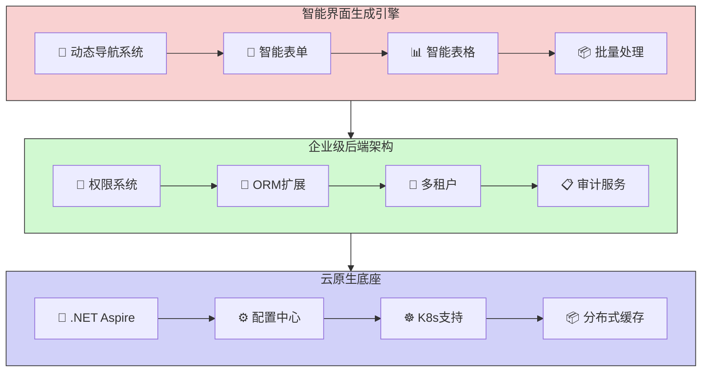
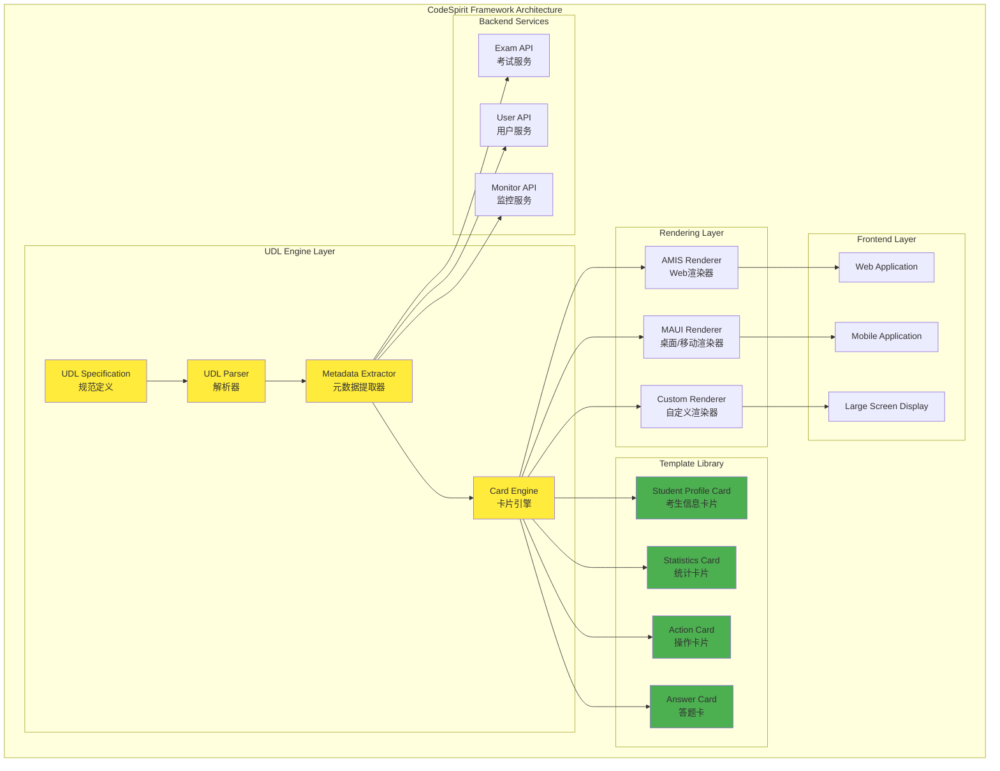
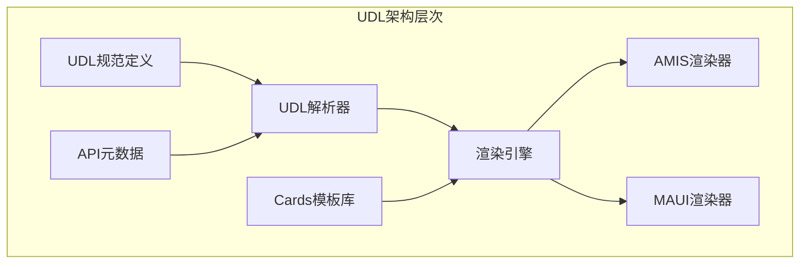
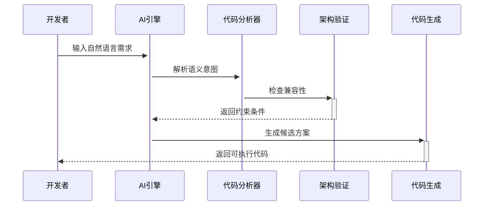

# CodeSpirit（码灵）低代码框架 | [English](README.md)

## 框架概览

CodeSpirit（码灵）是一款革命性的全栈低代码开发框架，通过智能代码生成引擎与AI深度协同，实现**后端驱动式全栈开发范式**。基于.NET 9技术栈构建，将具备企业级技术深度与云原生扩展能力，提供从界面生成、业务逻辑编排到系统运维的全生命周期支持。

**让全栈开发回归工程本质**

- **后端驱动式开发范式 · 企业级开放架构 · AI增强工程闭环**

[](https://codespirit-app.xin-lai.com/)
	*请关注下方公众号获取最新的体验账号及密码。*

***CodeSpirit，让复杂系统开发回归优雅本质！***

*码灵源自我一本未出世的科幻小说，如有兴趣，可开源更新。*

### 核心价值主张

- **全栈智能生成**：通过后端模型驱动前端界面生成，消除80%重复编码工作

- **深度可控架构**：生成代码完全开放可控，支持从快速原型到复杂系统的平滑演进

- **企业级工程能力**：内置权限体系、审计追踪、分布式架构支持，开箱即用

- **AI协同编程**：需求描述` → `原型生成` → `代码验证` → `部署监控

- **云原生底座**：Kubernetes原生支持，一键部署到多云环境

  ```mermaid
  graph TD
    A[开发效能] --> A1[全栈智能生成]
    A --> A2[AI实时协作]
    B[架构控制] --> B1[开放代码架构]
    B --> B2[平滑演进能力]
    C[企业级保障] --> C1[安全合规]
    C --> C2[性能扩展]
    D[生态融合] --> D1[云原生支持]
    D --> D2[多技术栈扩展]
  ```

## 技术架构全景

### 架构图


```mermaid
flowchart TD
    classDef uiLayer fill:#f9d1d1,stroke:#333,stroke-width:1px
    classDef backendLayer fill:#d1f9d1,stroke:#333,stroke-width:1px
    classDef cloudLayer fill:#d1d1f9,stroke:#333,stroke-width:1px
    
    subgraph UI["智能界面生成引擎"]
        direction LR
        A1["🧭 动态导航系统"] --> A2["📝 智能表单"]
        A2 --> A3["📊 智能表格"]
        A3 --> A4["📦 批量处理"]
    end
    
    subgraph Backend["企业级后端架构"]
        direction LR
        B1["🔐 权限系统"] --> B2["💾 ORM扩展"]
        B2 --> B3["🏢 多租户"]
        B3 --> B4["📋 审计服务"]
    end
    
    subgraph Cloud["云原生底座"]
        direction LR
        C1["🚀 .NET Aspire"] --> C2["⚙️ 配置中心"]
        C2 --> C3["☸️ K8s支持"]
        C3 --> C4["📦 分布式缓存"]
    end
    
    UI --> Backend
    Backend --> Cloud
    
    class UI uiLayer
    class Backend backendLayer
    class Cloud cloudLayer
```

### UDL集成架构

UDL作为CodeSpirit框架的核心UI描述语言，提供了统一的界面描述和渲染能力：


```mermaid
graph TB
    subgraph "CodeSpirit Framework Architecture"
        subgraph "Frontend Layer"
            WebApp["Web Application"]
            MobileApp["Mobile Application"]
            LargeScreen["Large Screen Display"]
        end
        
        subgraph "UDL Engine Layer"
            UDLSpec["UDL Specification<br/>规范定义"]
            UDLParser["UDL Parser<br/>解析器"]
            MetadataExtractor["Metadata Extractor<br/>元数据提取器"]
            CardEngine["Card Engine<br/>卡片引擎"]
        end
        
        subgraph "Rendering Layer"
            AmisRenderer["AMIS Renderer<br/>Web渲染器"]
            MauiRenderer["MAUI Renderer<br/>桌面/移动渲染器"]
            CustomRenderer["Custom Renderer<br/>自定义渲染器"]
        end
        
        subgraph "Template Library"
            StudentCard["Student Profile Card<br/>考生信息卡片"]
            StatCard["Statistics Card<br/>统计卡片"]
            ActionCard["Action Card<br/>操作卡片"]
            AnswerCard["Answer Card<br/>答题卡"]
        end
        
        subgraph "Backend Services"
            ExamAPI["Exam API<br/>考试服务"]
            UserAPI["User API<br/>用户服务"]
            MonitorAPI["Monitor API<br/>监控服务"]
        end
    end
    
    %% UDL Engine Flow
    UDLParser --> MetadataExtractor
    MetadataExtractor --> CardEngine
    UDLSpec --> UDLParser
    
    %% UDL to Renderers
    CardEngine --> AmisRenderer
    CardEngine --> MauiRenderer
    CardEngine --> CustomRenderer
    
    %% Template Library
    CardEngine --> StudentCard
    CardEngine --> StatCard
    CardEngine --> ActionCard
    CardEngine --> AnswerCard
    
    %% Renderers to Frontend
    AmisRenderer --> WebApp
    MauiRenderer --> MobileApp
    CustomRenderer --> LargeScreen
    
    %% Backend Integration
    MetadataExtractor --> ExamAPI
    MetadataExtractor --> UserAPI
    MetadataExtractor --> MonitorAPI
    
    style UDLSpec fill:#ffeb3b
    style UDLParser fill:#ffeb3b
    style MetadataExtractor fill:#ffeb3b
    style CardEngine fill:#ffeb3b
    style StudentCard fill:#4caf50
    style StatCard fill:#4caf50
    style ActionCard fill:#4caf50
    style AnswerCard fill:#4caf50
```

### 核心技术栈

| 类别         | 技术选型                                    |
| :----------- | :------------------------------------------ |
| **框架**     | .NET 9                                      |
| **语言**     | C# 12（支持Primary Constructor等新特性）    |
| **后端架构** | Clean Architecture + DDD                    |
| **ORM**      | Entity Framework Core（含软删除、审计追踪） |
| **前端生成** | AMIS（动态表单/表格生成）                   |
| **UI描述语言** | UDL（统一UI描述语言 + Cards组件库）       |
| **微服务**   | .NET Aspire（服务发现、健康检查）           |
| **容器编排** | Kubernetes（支持自动扩缩容）                |
| **身份认证** | JWT + OAuth2.0（RBAC/ABAC混合模型）         |
| **数据访问** | Repository Pattern + CQRS（部分模块）       |

## 功能架构全景

### 一、智能界面生成引擎

#### 1. 动态导航系统

- 智能权限适配：自动同步RBAC权限模型，实现动态菜单渲染
- 多级导航支持：支持全局导航(*vNext*)/局部导航混合架构

#### 2. 零代码CRUD生成

| 功能模块     | 实现能力                                                   |
| :----------- | :--------------------------------------------------------- |
| 智能表单     | 支持20+字段类型自动映射，包含图片上传、Excel导入等复杂场景 |
| 智能表格     | 嵌套数据呈现、列配置热加载、实时快速编辑                   |
| 批量处理     | Excel模板导入/导出、多格式数据校验、可视化数据修正         |
| 扩展操作体系 | 自定义操作按钮、多步骤审批流、基于权限的上下文敏感操作     |

*注意：这里的零代码指的是零前端代码。*

#### 3. 智能图表分析模块

- 动态图表引擎：根据数据特征自动匹配最佳可视化方案
- SQL2API：根据SQL生成API接口
- SQL2Chart：基于SQL生成图表
- 智能时间维度：支持同比/环比自动计算，时间颗粒度智能适配
- 多数据源聚合：SQL/NoSQL混合数据源联合分析

#### 4. 零代码H5生成（*VNext*）

- 智能表单
- 智能图表

#### 5. UDL（UI描述语言）引擎 🆕

UDL（UI Description Language）是CodeSpirit框架中的统一UI描述语言，实现"一次定义，处处使用"的跨平台UI一致性开发。

**核心特性**：
- **统一描述规范**：标准化的UI描述格式，支持Web、移动端、大屏等多模态输出
- **智能元数据生成**：基于API Controller自动生成UI配置，零前端编码
- **UDL Cards组件**：预定义卡片模板库，快速构建信息展示、统计分析、操作交互界面
- **多平台渲染**：统一配置，自动适配AMIS、MAUI等不同渲染引擎

**UDL Cards预定义模板**：
- 考生信息卡片（student-profile-card）：展示基本信息，支持头像、字段图标
- 统计卡片（stat-card）：数据统计展示，支持进度条、百分比、状态标识
- 操作卡片（action-card）：交互操作面板，支持多层级操作和权限控制
- 答题卡（answer-card）：考试场景专用，答题状态可视化

**技术架构**：

```mermaid
graph TB
    subgraph "UDL架构层次"
        UDLSpec["UDL规范定义"] --> UDLParser["UDL解析器"]
        UDLParser --> RenderEngine["渲染引擎"]
        RenderEngine --> AmisRenderer["AMIS渲染器"]
        RenderEngine --> MauiRenderer["MAUI渲染器"]
        ApiMetadata["API元数据"] --> UDLParser
        CardTemplates["Cards模板库"] --> RenderEngine
    end
```

**应用场景**：
- 监考大屏：实时统计、状态监控、异常预警
- 考试客户端：学生信息展示、答题进度跟踪
- 管理后台：数据面板、操作界面自动生成

### 二、企业级后端架构

#### 1. 核心框架特性

- **云原生底座**：k8s原生支持，深度集成.NET Aspire，原生支持Dapr分布式架构
- **安全体系**：四层防御体系（认证/授权/审计/加密）
- **高性能保障**：分布式缓存、二级自动缓存、智能查询优化

#### 2. 关键功能组件

- **权限系统**：RBAC+ABAC混合模型，细粒度权限控制
- **ORM扩展**：软删除、审计追踪、多租户支持
- **多租户**：数据隔离、配置隔离
- **数据筛选器**：全局过滤器、自动注入
- **审计服务**：全链路操作追踪、数据变更记录
- **健康检查**：服务状态监控、自动故障转移
- **事件总线**：分布式事件处理、消息队列集成
- **分布式锁**：Redis分布式锁、防重复提交
- **配置中心**：多环境配置管理、动态配置更新
- **聚合器**：数据聚合、字段动态替换
- **PDF生成**：模板化PDF文档生成
- **时间处理**：统一时间处理机制、时区支持

### 三、开箱即用功能模块

| 模块名称 | 核心功能                                            | 技术特性          |
| :------- | :-------------------------------------------------- | :---------------- |
| 用户中心 | 多因子认证、组织架构管理（*VNext*）、细粒度权限控制 | RBAC+ABAC混合模型 |
| 审计中心 | 操作日志追溯、数据变更追踪、安全合规报告            | Elasticsearch存储 |
| 配置中心 | 多环境配置管理、版本控制、动态更新                  | 内置实现          |
| 订单中心 | 订单管理、状态流转、支付集成                        | 事件驱动架构      |

### 四、全栈生成引擎

- **代码反哺**：根据前端操作自动生成后端仓储、控制器代码

- **AI辅助设计**：

  - 用自然语言描述需求→自动生成页面原型
  - 截图页面→自动推导DTO结构
  - 语音指令→实时修改表格、表单配置

  想象这样的场景：

  ***"灵儿，给用户表加个生日字段，要日历组件，在列表页显示为年龄"***

  AI助手即刻完成：

  ✅ 修改DTO模型

  ✅ 重新生成前端

  ✅ 编写数据库迁移脚本

概念图：


```mermaid
sequenceDiagram
  开发者->>+AI引擎: 输入自然语言需求
  AI引擎->>+代码分析器: 解析语义意图
  代码分析器->>+架构验证: 检查兼容性
  架构验证-->>-AI引擎: 返回约束条件
  AI引擎->>+代码生成: 生成候选方案
  代码生成-->>-开发者: 返回可执行代码
```

## 路线图规划

### Q2 2025

- 智能界面生成引擎
- UDL Cards 基础实现
- 码灵Beta版发布
- H5生成引擎

### Q3 2025

- UDL 元数据自动生成
- UDL 多平台渲染支持
- 可视化分析模块
- 深度集成LLM代码生成能力

### Q4 2025

- UDL 生态完善（可视化编辑器、模板市场）
- 全栈生成引擎
- 多云部署支持
- Java支持

## 框架优势对比

### 低代码框架对比

| 维度       | CodeSpirit      | 传统低代码平台   |
| :--------- | :-------------- | :--------------- |
| 架构开放性 | 全代码开放      | 黑箱生成         |
| 性能表现   | 原生代码级性能  | 解释执行性能损耗 |
| 定制能力   | 底层架构可定制  | 有限扩展         |
| 技术栈     | 最新.NET生态    | 私有技术栈       |
| 部署模式   | 混合云/本地部署 | SaaS绑定         |

### 典型开发场景对比

| 传统模式          | CodeSpirit模式      | 效率提升 |
| :---------------- | :------------------ | :------- |
| 前后端联调3小时   | 自动生成联调完成    | 8x       |
| 表单校验开发0.5天 | 声明式配置5分钟     | 12x      |
| 权限系统集成2天   | 开箱即用 + 策略扩展 | ∞        |

## 立即体验

https://codespirit-app.xin-lai.com/

请关注"麦扣聊技术"公众号获取最新的体验账号及密码。

## 快速开始

1. 安装并启动 Docker Desktop

2. 将CodeSpirit.AppHost设为启动项目

3. 启动（启动时会拉取redis、seq、rabbitmq等镜像，如无法拉取，请采取方式进行加速）

   **注意：当前基于.NET Aspire简化了分布式应用开发时的编排，服务发现、环境变量、容器设置的配置，以便更轻松地在开发阶段进行管理。**

## 开发文档

- Github：[xin-lai/CodeSpirit](https://github.com/xin-lai/CodeSpirit)**（定期推送）**
- Gitee：[magicodes/CodeSpirit](https://gitee.com/magicodes/code-spirit)  **（优先推送）**

### 📘 核心文档

1. [📖 开发指南（初稿）](#) - 完整的开发指南和最佳实践 (*文件未找到*)
2. [🏗️ 总体技术体系说明](./Docs/01-Core-Docs/总体技术体系说明.md) - 技术架构和设计理念
3. [🏛️ 后端架构](./Docs/01-Core-Docs/后端架构.md) - 后端架构设计说明
4. [🏗️ 项目整体架构设计](./Docs/01-Core-Docs/项目整体架构设计.md) - 整体项目架构设计和原则
5. [🔧 开发环境搭建指南](./Docs/01-Core-Docs/开发环境搭建指南.md) - 完整的开发环境配置指南
6. [💎 CodeSpirit.Core核心框架](./Docs/01-Core-Docs/CodeSpirit.Core核心框架.md) - 核心框架组件和架构
7. [⚠️ 统一异常处理指南](./Docs/01-Core-Docs/CodeSpirit统一异常处理指南.md) - 企业级异常处理机制和Amis API兼容性

### 🎨 界面生成引擎

8. [🎯 AMIS界面生成引擎](./Docs/02-UI-Generation/CodeSpirit.Amis智能界面生成引擎.md) - 智能界面生成核心组件
9. [📊 AMIS列自动推断功能](./Docs/02-UI-Generation/AMIS列自动推断功能说明.md) - 智能表格列生成详解
10. [📝 表单默认值设置](./Docs/02-UI-Generation/CodeSpirit.Amis表单默认值使用指南.md) - 表单默认值配置指南
11. [📈 智能图表组件](./Docs/02-UI-Generation/CodeSpirit.Charts智能图表使用指南.md) - 数据可视化解决方案
12. [⏰ 日期时间列优化](./Docs/02-UI-Generation/日期时间列优化功能总结.md) - 时间字段智能处理
13. [🃏 UDL Cards卡片使用指南](./Docs/02-UI-Generation/CodeSpirit.UDL-Cards卡片使用指南.md) - 统一卡片系统使用说明和最佳实践
14. [🎨 UDL UI描述语言设计方案](./Docs/02-UI-Generation/UDL-UI描述语言设计方案.md) - 统一UI描述语言架构设计
15. [🎯 UDL Cards详细实现方案](./Docs/02-UI-Generation/UDL-Cards详细实现方案.md) - 卡片组件库实现指南
16. [🎮 UDL Cards简易实现方案](./Docs/02-UI-Generation/UDL-Cards简易实现方案.md) - UDL Cards快速实现指南

### 🔧 核心组件

16. [🧭 Navigation导航组件](./Docs/03-Core-Components/CodeSpirit.Navigation导航组件使用指南.md) - 智能导航系统，支持多平台、权限过滤和上下文感知
17. [🔗 聚合器使用指南](./Docs/03-Core-Components/CodeSpirit.Aggregator聚合器使用指南.md) - 数据聚合和字段替换
18. [⚙️ 设置管理组件](./Docs/03-Core-Components/CodeSpirit.Settings设置管理组件使用指南.md) - 配置管理解决方案
19. [🔒 分布式锁使用指南](./Docs/03-Core-Components/CodeSpirit分布式锁使用指南.md) - 分布式锁实现和使用
20. [📄 PDF生成组件](./Docs/03-Core-Components/CodeSpirit.PdfGeneration使用指南.md) - PDF文档生成服务
21. [🕒 时间处理机制](./Docs/03-Core-Components/CodeSpirit时间处理机制.md) - 统一时间处理方案
22. [🌐 客户端IP服务](./Docs/03-Core-Components/ClientIpService使用指南.md) - 客户端IP获取和处理
23. [📋 审计组件集成使用指南](./Docs/03-Core-Components/CodeSpirit.Audit审计组件集成使用指南.md) - 完整的审计系统集成和使用

### 📝 考试系统

24. [📚 考试系统概览](./Docs/09-Exam-System/README.md) - 完整的考试系统文档导航和快速参考
25. [🏗️ 考试系统技术架构](./Docs/09-Exam-System/考试系统完整说明文档.md) - 全面的技术架构、API设计和安全机制
26. [📋 考试系统业务功能](./Docs/09-Exam-System/考试系统业务功能清单.md) - 完整业务功能清单，涵盖12大模块200+功能特性

### 🔐 身份认证与权限

27. [🔑 身份认证服务](./Docs/04-Identity-Auth/CodeSpirit.IdentityApi身份认证服务.md) - 完整的身份认证服务架构
28. [👮 权限组件详解](./Docs/04-Identity-Auth/CodeSpirit.Authorization权限组件详解.md) - 基于RBAC+ABAC混合模型的综合权限系统
29. [🎫 前端认证管理器](./Docs/04-Identity-Auth/CodeSpirit.TokenManager前端认证管理器使用指南.md) - 前端认证管理和令牌处理

### 🏢 多租户架构

30. [🏗️ 多租户组件整改计划](./Docs/05-Multi-Tenancy/CodeSpirit多租户组件整改计划.md) - 多租户架构改进和实施计划
31. [🎯 租户解析器使用指南](./Docs/05-Multi-Tenancy/CodeSpirit.TenantResolver租户解析器使用指南.md) - 租户解析和上下文管理
32. [🔍 数据筛选器使用指南](./Docs/05-Multi-Tenancy/CodeSpirit.DataFilter数据筛选器使用指南.md) - 数据过滤和租户隔离机制
33. [🗄️ 多租户数据库上下文架构](./Docs/05-Multi-Tenancy/CodeSpirit 多租户数据库上下文架构.md) - 多租户数据库架构设计
34. [✅ ExamApi多租户集成完成报告](./Docs/05-Multi-Tenancy/ExamApi多租户集成完成报告.md) - 考试系统多租户集成完成报告
35. [🖥️ 多租户登录页面使用指南](./Docs/05-Multi-Tenancy/多租户登录页面使用指南.md) - 多租户登录界面实现

### 🚀 基础设施与运维

36. [🐰 RabbitMQ集成指南](./Docs/06-Infrastructure/RabbitMQ-Aspire-Integration.md) - 消息队列集成方案
37. [🔧 RabbitMQ故障排除](./Docs/06-Infrastructure/RabbitMQ故障排除指南.md) - 常见问题解决方案
38. [🔍 Elasticsearch迁移总结](./Docs/06-Infrastructure/Elasticsearch-Aspire-Migration-Summary.md) - 搜索引擎集成指南
39. [🌐 跨域策略配置指南](./Docs/06-Infrastructure/CodeSpirit跨域策略配置指南.md) - CORS跨域资源共享配置和安全策略

### 🌐 API与通信

40. [🔗 通用API跳转机制使用指南](./Docs/07-API-Communication/CodeSpirit通用API跳转机制使用指南.md) - 通用API路由和通信机制

### 📊 项目管理

41. [📋 技术债管理文档](./Docs/08-Project-Management/技术债管理文档.md) - 技术债跟踪和管理规范

### 💬 技术社区

[💬 加入技术社区（暂未开放，请关注公众号）](https://codespirit-chat.xin-lai.com/)


