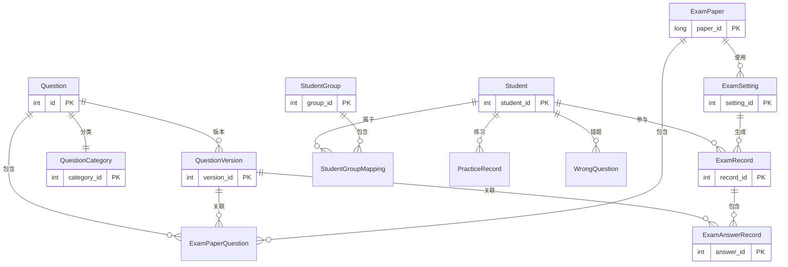

# 考试系统实体设计文档

## 1. 实体关系图



## 2. 核心实体说明

### 2.1 题目管理

#### Question（题目）
- 核心字段：
  - `Id`: 主键
  - `Content`: 题目内容
  - `Type`: 题目类型（单选、多选等）
  - `Difficulty`: 难度级别
  - `Options`: 选项列表
  - `CorrectAnswer`: 正确答案
  - `CategoryId`: 分类ID
  - `Version`: 当前版本号
  - `UsageCount`: 使用次数
  - `CorrectRate`: 正确率

#### QuestionVersion（题目版本）
- 设计目的：
  - 保存题目的历史版本
  - 确保试卷和答题记录引用正确的题目版本
  - 支持题目的版本追踪和回滚
- 核心字段：
  - `QuestionId`: 关联的题目ID
  - `Version`: 版本号
  - `Content`: 题目内容
  - `Options`: 选项列表
  - `CorrectAnswer`: 正确答案
  - `ChangeReason`: 修改原因

#### QuestionCategory（题目分类）
- 核心字段：
  - `Id`: 主键
  - `Name`: 分类名称
  - `Description`: 分类描述
  - `ParentId`: 父分类ID（可选）

### 2.2 试卷管理

#### ExamPaper（试卷）
- 核心字段：
  - `Id`: 主键
  - `Name`: 试卷名称
  - `Type`: 试卷类型
  - `TotalScore`: 总分
  - `PassScore`: 及格分数
  - `Duration`: 考试时长
  - `DifficultyLevel`: 难度系数
  - `Version`: 版本号
  - `UsageCount`: 使用次数
  - `AverageScore`: 平均分
  - `PassRate`: 通过率

#### ExamPaperQuestion（试卷题目）
- 设计目的：
  - 维护试卷和题目的多对多关系
  - 保存题目在试卷中的具体配置
  - 关联具体的题目版本
- 核心字段：
  - `ExamPaperId`: 试卷ID
  - `QuestionId`: 题目ID
  - `QuestionVersionId`: 题目版本ID
  - `OrderNumber`: 题目序号
  - `Score`: 分值
  - `IsRequired`: 是否必答

### 2.3 考生管理

#### Student（考生）
- 核心字段：
  - `Id`: 主键
  - `UserId`: 用户ID（关联身份系统）
  - `Name`: 姓名
  - `StudentNumber`: 学号/工号

#### StudentGroup（考生分组）
- 核心字段：
  - `Id`: 主键
  - `Name`: 分组名称
  - `Description`: 分组描述

#### StudentGroupMapping（考生分组映射）
- 设计目的：
  - 实现考生和分组的多对多关系
  - 支持考生同时属于多个分组
- 核心字段：
  - `StudentId`: 考生ID
  - `StudentGroupId`: 分组ID

### 2.4 考试管理

#### ExamSetting（考试设置）
- 核心字段：
  - `Id`: 主键
  - `ExamPaperId`: 试卷ID
  - `StartTime`: 开始时间
  - `EndTime`: 结束时间
  - `AllowedTimes`: 允许考试次数
  - `AntiCheatingRules`: 反作弊规则

#### ExamRecord（考试记录）
- 核心字段：
  - `Id`: 主键
  - `ExamSettingId`: 考试设置ID
  - `StudentId`: 考生ID
  - `StartTime`: 开始时间
  - `SubmitTime`: 提交时间
  - `Status`: 状态
  - `Score`: 得分
  - `IsPassed`: 是否通过
  - `CheatingSuspicionLevel`: 作弊嫌疑等级
  - `IpAddress`: IP地址
  - `DeviceInfo`: 设备信息

#### ExamAnswerRecord（答题记录）
- 设计目的：
  - 记录考生的具体答题情况
  - 关联到具体的题目版本
  - 支持答题过程追踪
- 核心字段：
  - `ExamRecordId`: 考试记录ID
  - `QuestionId`: 题目ID
  - `QuestionVersionId`: 题目版本ID
  - `OrderNumber`: 题目序号
  - `Answer`: 考生答案
  - `IsCorrect`: 是否正确
  - `Score`: 得分
  - `StartTime`: 开始答题时间
  - `SubmitTime`: 提交答题时间
  - `Duration`: 答题用时

### 2.5 练习与错题管理

#### PracticeRecord（练习记录）
- 核心字段：
  - `Id`: 主键
  - `StudentId`: 考生ID
  - `QuestionId`: 题目ID
  - `Answer`: 答案
  - `IsCorrect`: 是否正确
  - `PracticeTime`: 练习时间

#### WrongQuestion（错题记录）
- 核心字段：
  - `Id`: 主键
  - `StudentId`: 考生ID
  - `QuestionId`: 题目ID
  - `LastWrongTime`: 最近错误时间
  - `WrongCount`: 错误次数
  - `MasteryLevel`: 掌握程度

## 3. 设计考虑

### 3.1 版本控制
- 题目版本管理：
  - 每次修改题目时创建新版本
  - 试卷和答题记录关联具体版本
  - 支持版本历史追踪和回滚

### 3.2 数据完整性
- 外键约束：
  - 使用 `Restrict` 删除行为保护核心数据
  - 使用 `Cascade` 删除行为处理从属数据
- 唯一性约束：
  - 题目版本号在题目范围内唯一
  - 题目序号在试卷/考试记录中唯一

### 3.3 审计功能
- 所有实体继承 `AuditableEntityBase`：
  - 记录创建时间和创建人
  - 记录修改时间和修改人
  - 支持软删除

### 3.4 性能优化
- 索引设计：
  - 为常用查询字段创建索引
  - 为唯一约束字段创建唯一索引
- 字段长度限制：
  - 为所有字符串字段设置合理的长度限制
  - 使用 JSON 格式存储复杂数据

### 3.5 安全性
- 数据隔离：
  - 考生只能访问自己的数据
  - 分组管理控制数据访问范围
- 反作弊措施：
  - 记录考试环境信息
  - 支持作弊行为检测和记录

### 3.6 扩展性
- 支持多种题型：
  - 通过题目类型枚举支持不同题型
  - 使用 JSON 存储特定题型的额外数据
- 灵活的分组机制：
  - 支持考生多分组
  - 支持分组层级关系

## 4. 数据库索引

### 4.1 主要索引
```sql
-- Question 索引
CREATE INDEX IX_Questions_CategoryId ON Questions(CategoryId);
CREATE INDEX IX_Questions_Type_Difficulty ON Questions(Type, Difficulty);

-- QuestionVersion 索引
CREATE UNIQUE INDEX IX_QuestionVersions_QuestionId_Version ON QuestionVersions(QuestionId, Version);

-- ExamPaperQuestion 索引
CREATE UNIQUE INDEX IX_ExamPaperQuestions_ExamPaperId_OrderNumber ON ExamPaperQuestions(ExamPaperId, OrderNumber);
CREATE INDEX IX_ExamPaperQuestions_QuestionVersionId ON ExamPaperQuestions(QuestionVersionId);

-- ExamAnswerRecord 索引
CREATE UNIQUE INDEX IX_ExamAnswerRecords_ExamRecordId_OrderNumber ON ExamAnswerRecords(ExamRecordId, OrderNumber);
CREATE INDEX IX_ExamAnswerRecords_QuestionVersionId ON ExamAnswerRecords(QuestionVersionId);

-- Student 索引
CREATE UNIQUE INDEX IX_Students_StudentNumber ON Students(StudentNumber);
CREATE INDEX IX_Students_Name ON Students(Name);
```

## 5. 注意事项

1. 题目版本管理：
   - 修改题目时必须创建新版本
   - 确保历史试卷和答题记录关联正确的版本

2. 考试记录完整性：
   - 保存完整的考试环境信息
   - 记录详细的答题过程数据

3. 数据安全：
   - 实施严格的访问控制
   - 定期备份重要数据

4. 性能优化：
   - 合理使用索引
   - 避免过度使用级联删除

5. 扩展性：
   - 预留功能扩展空间
   - 使用灵活的数据结构 